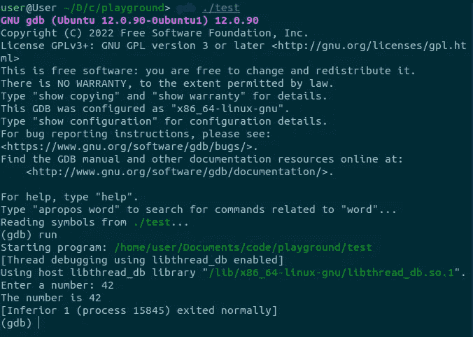

# 使用 gdb 调试

> 原文：<https://blog.devgenius.io/debugging-using-gdb-5e2a4db976e9?source=collection_archive---------11----------------------->


约书亚·雷德科普在 [Unsplash](https://unsplash.com?utm_source=medium&utm_medium=referral) 上的照片

# 介绍

调试是发现和修复计算机程序中错误的过程。错误通常被称为软件开发中的错误。调试在开发过程中是必不可少的，因为通常不可能测试一个大型程序中的所有代码。程序员可能会在编写代码时对其进行测试，但仍有可能遗漏错误。

当发现错误时，可以使用调试器来找到错误的位置，以便可以修复它。调试器也用于检查程序的状态，以便程序员可以理解为什么它不能按预期工作。

有许多不同类型的调试器，但大多数可以分为两类:符号型和动态型。符号调试器使用运行时不可用的程序信息，如源代码或符号表。另一方面，动态调试器使用运行时可用的信息，比如变量值。

这两种调试器各有优缺点。符号调试器通常更容易使用，因为它们可以提供关于程序的更多信息。但是，它们只能用在已经用调试信息编译的程序上。动态调试器可以用在没有用调试信息编译的程序上，但是它们通常更难使用。不同的编程语言有许多不同的调试器。

# 调试器的类型

在 **C 编程语言**中，有一个被广泛使用的调试器叫做 ***gdb*** 。

***gdb*** 是一个命令行调试器，可以用来发现 **C 程序中的错误。**可用于检查变量值，设置断点，使程序在特定点停止运行，单步执行代码，使其一次执行一行。

***gdb*** 可以用来调试与调试器运行在同一台计算机上的程序，也可以调试运行在不同计算机上的程序。当调试运行在不同计算机上的程序时，可以使用 ***gdb*** 通过网络连接到程序。

***gdb*** 不是唯一可用于 **C 程序**的调试器，但它是最受欢迎的调试器之一。其他调试器包括 ***lldb*** ，它是 **LLVM 编译器**的调试器，以及 **ddd** ，它是一个图形调试器。

# 运行 gdb

要使用 ***gdb*** ，第一步是用`-g`标志编译程序，以便调试信息包含在可执行文件中。接下来就是运行 ***gdb*** 中的程序。

***gdb*** 可以从命令行运行，方法是键入 ***gdb*** 后跟可执行文件的名称。例如，如果文件 test.c 包含以下代码:

```
#include <stdio.h>int main(void){ 
    int i; printf(“Enter a number: “); scanf(“%d”, &i); printf(“The number is %d “, i); return 0;}
```

程序可以用`-g`标志编译，如下所示:

```
 gcc -g test.c -o test
```

然后 ***gdb*** 可以用来运行程序如下:

```
gdb ./test 
```

一旦 ***gdb*** 启动，就可以通过键入运行命令来执行程序。例如，要运行上面的程序，可以在 gdb 中键入以下命令:

```
(gdb) run 
Starting program: /path/to/your/folder
Enter a number: The number is 42
[Inferior 1 (process 1234) exited normally]
 (gdb)
```



gdb 调试

# *下一个*命令

run 命令将启动程序，然后在第一行代码处停止。要继续执行程序，可以使用下一个命令。这将执行下一行代码。

```
(gdb) next
Enter a number: The number is 42 
[Inferior 1 (process 1234) exited normally] 
(gdb) 
```

下一个命令可以用来一次执行一行程序。这对于单步执行代码并查看发生了什么非常有用。

print 命令可用于打印变量的值。例如，要打印变量`i`的值，可以使用以下命令:

```
(gdb) print i $1 = 42 (gdb)
```

# 打印命令

print 命令也可以用来打印表达式的值。例如，要打印 i+1 的值，可以使用以下命令:

```
 (gdb) print i+1 $2 = 43 (gdb) 
```

# 中断命令

break 命令可用于在代码中设置断点。断点是程序将停止运行的点。例如，要在打印`i`的那一行设置一个断点，可以使用以下命令:

```
(gdb) break printf 
Breakpoint 1 at 0x7ffff7de0770: file ./stdio-common/printf.c, line 28.
(gdb)
```

break 命令将在调用`printf`函数的那一行设置一个断点。然后可以使用 run 命令运行该程序。当到达断点时，程序将停止运行，gdb 将打印即将执行的代码行。

```
(gdb) run 
Starting program: /path/to/your/folder
Enter a number: 
Breakpoint 1, main () at test.c:5 
5 printf(“The number is %d “, i); 
(gdb)
```

# 继续命令

continue 命令可用于从断点继续运行程序。例如，要从设置在`printf`行的断点继续运行程序，可以使用以下命令:

```
(gdb) continue 
Continuing. 
The number is 42 [Inferior 1 (process 1234) exited normally] 
(gdb) 
```

continue 命令将从断点处继续执行程序。程序将一直运行，直到到达下一个断点或完成。

# 结论

***gdb*** 调试器是一个强大的工具，可以帮助你找到并修复程序中的错误。然而，它也是一个复杂的工具，在本文中很难学习如何使用它的所有特性。

如果您在使用 gdb 时遇到问题，或者您想了解更多关于它的特性，有几个资源可以帮助您。

[GNU 调试器网站](https://www.gnu.org/software/gdb/)包含 ***gdb*** 的文档，以及教程和其他资源。《用 GDB 调试》这本书是使用 gdb 的很好的指南。如果你用的是 Linux，在你喜欢的搜索引擎上搜索“gdb”也可以找到很多 ***gdb*** 教程和 how-tos。

如果你喜欢这篇文章，你也可以看看我的 [Hashnode 博客](https://jaredatandi.hashnode.dev/)，看看我写的其他软件开发文章。