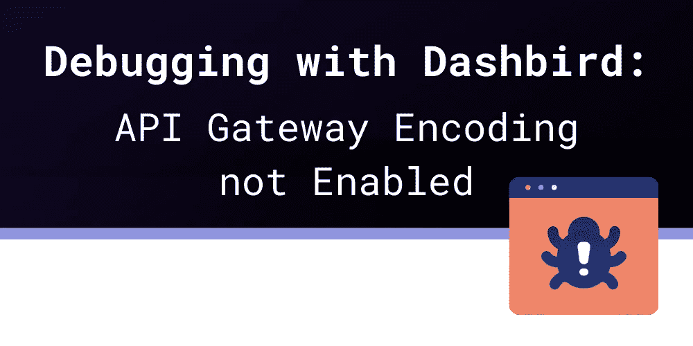
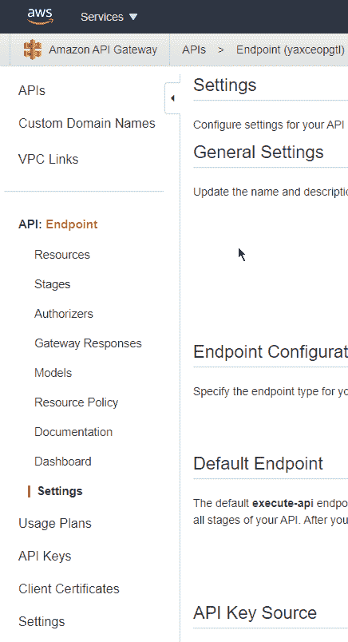
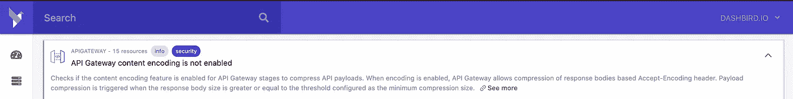

# 使用 Dashbird 进行调试:API 网关编码未启用

> 原文：<https://blog.devgenius.io/debugging-with-dashbird-api-gateway-encoding-not-enabled-2ad818fc29ca?source=collection_archive---------3----------------------->

当使用其他人创建的服务时，他们的意思往往不明显，更不用说如何修复它们了。在使用[亚马逊 API 网关](https://dashbird.io/knowledge-base/api-gateway/what-is-aws-api-gateway/)时，你可能会看到的[错误消息](https://dashbird.io/event-library/)之一是“**编码未启用**”。

这里的第一个问题是，**这个错误信息指的是什么样的编码**？第一个想法可能会进入视频或音频编码方向，并导致一个死胡同，因为你可能没有发送任何音频或视频文件。错误消息令人困惑，因为它的目的是压缩您的响应负载。

# “API 网关编码未启用”是什么意思？

当您创建一个新的 API 时，默认情况下内容编码将被禁用。因此，很可能您已经有一个或多个不使用该特性的 API 在运行。

根据 API 响应的大小，**禁用内容编码可能会导致不必要的高流量**。AWS 的出站流量可能会很快变得昂贵。

# 如何启用 API 网关内容编码？

如果您正在使用 API 网关控制台，您可以**简单地在您的 API 设置**中启用内容编码。

请注意，有两个“设置”菜单项。首先，你需要**选择你的 API** ，然后你**选择那个 API** 的设置，而不是底部 API 网关服务的一般设置。

下面，您可以看到一个名为“端点”的网关的突出显示的“设置”菜单项

如果您使用的是 [AWS CLI](https://aws.amazon.com/cli/) ，下面的命令将更新您的 API。

$ aws apigateway 更新-rest-api \

— rest-api-id <your_api_id>\</your_api_id>

—修补操作 op=replace，path=/minimumCompressionSize，value=0

用您想要启用内容编码的 API 的 ID 替换<your_api_id>。如果选择大于 0 的压缩值，低于该值的所有响应**将不会被压缩**。</your_api_id>

对于 CloudFormation，您必须设置 AWS::ApiGateway::RestApi 资源的 MinimumCompressionSize 属性。

# 为什么应该禁用内容编码？

在大多数情况下，内容编码不会带来任何问题。如今压缩算法得到了优化，**几乎所有的 HTTP 客户端都可以使用压缩响应负载**。

保持禁用的一个原因是**性能**。压缩你的回答不是免费的。最小响应或二进制响应通常**不会压缩得很好**，所以你最好不要压缩就发送它们，通过取消压缩步骤来节省延迟。

另一个原因是**调试**。如果你出于某种原因需要用 WireShark 之类的工具扫描一些网络帧，**禁用内容编码会给你更多的洞察力**。

最后一个原因是对**遗留浏览器**的支持。如果你在一家发展缓慢的公司工作，你很可能会有一些旧版本的 Internet Explorer。这可能导致压缩响应的问题，特别是当它们的**内容是已经压缩的文件**时。

# 摘要

内容编码是关于你的 API 响应的压缩，你应该考虑启用它来**节省外发 AWS 流量的钱**。

如果您有特定的需求，比如发送难以压缩的二进制文件或者只有最小的响应负载，您可以**选择退出以挤出最后几毫秒的延迟**。

您还可以使用 [Dashbird](https://dashbird.io/) 检查是否为 API Gateway stages 启用了内容编码功能，以压缩 API 有效负载。[架构良好的洞察特性](https://dashbird.io/blog/introducing-well-architected-insights/)将让您快速、轻松地了解当前设置对整个系统的影响，具体影响的是什么，以及如何应对:

延伸阅读:

[使用 Dashbird 调试:格式错误的 Lambda 代理响应](https://dashbird.io/blog/malformed-lambda-proxy-response/)

[构建复杂的架构良好的基础设施](https://dashbird.io/blog/building-complex-well-architected-serverless-architectures/)

[AWS 架构良好的无服务器框架:安全支柱](https://dashbird.io/blog/well-architected-framework-security/)