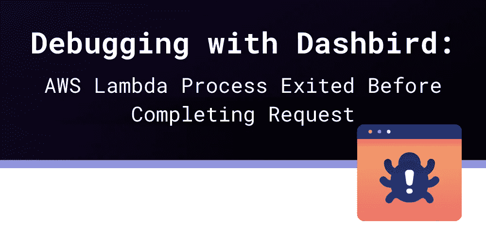

# 使用 Dashbird 进行调试:AWS Lambda 进程在完成请求之前退出

> 原文：<https://blog.devgenius.io/debugging-with-dashbird-aws-lambda-process-exited-before-completing-request-56564c5cea11?source=collection_archive---------10----------------------->

**另一个常见错误消息**来自我们最喜欢的 FaaS 供应商 AWS Lambda。

同样，出现这个问题有多种原因。让我们先看看 AWS Lambda 的[基础，以便在以后出现问题时有更好的直觉。](https://dashbird.io/knowledge-base/aws-lambda/introduction-to-aws-lambda/)

# AWS Lambda 是异步的

Lambda 本质上是一个**异步的基于事件的服务**。Lambda 服务异步调用您的函数——这并不意味着所有的事件都被异步处理，但是**主要与您必须在函数中使用的编程模型**有关。

**这不应该与 Lambda 的事件处理**混淆，后者可以是同步的，也可以是异步的。

**在同步事件处理**中，例如，当您的函数处理一个 [API Gateway](https://dashbird.io/knowledge-base/api-gateway/what-is-aws-api-gateway/) 事件时，事件提供程序会一直等待，直到您处理了该事件，以便它可以向自己的客户端提供您的结果。

浏览器向 API Gateway 发送请求，API Gateway 反过来将请求作为事件发送给 Lambda 函数。浏览器现在将等待响应，API Gateway 将等待处理该事件。函数运行的时间越长，浏览器和 API 网关等待的时间就越长。**直到最多 30 秒，API Gateway 才会收工，并告诉浏览器您的功能超时**。

**在异步事件处理**中，事件提供者只会把事件交给 Lambda，然后就收工了。**它不会等待你的 Lambda 函数的回答**，不管是三秒还是十分钟。

如果你从 S3 上传中触发了一个 Lambda 函数, S3 服务将永远不会注意到 Lambda 函数在处理事件时是成功还是失败。它只会触发该功能，然后继续其他任务。

# 异步事件处理

在 Lambda 函数中，你必须编写异步代码。你不能简单地接受一些参数，然后直接返回你的计算结果，就像下面的例子。

> exports.handler = **(** 事件，上下文**)**=**>****{** const result = event . data . x*****event . data . x；
> 返回 {status code:200，body:result**}**；
> **})**；

**你必须使用一些异步计算结构来处理结果。在 AWS Lambda 当前支持的 Node.js 运行时版本中，您必须使用承诺或异步函数来处理您的返回值。**

一个有希望版本应该是这样的:

> exports . handler =**(**event，context**)**=**>****new**Promise**(**resolve，reject**)**=**>****{** const result = event . data . x*****event . data . x；
> 解析 **({** statusCode: 200，body:result**})**；
> **})**；

您的处理函数将直接返回一个新的 promise 对象，该对象将在将来被解析。如果一切顺利，您可以调用 resolve，如果遇到错误，您可以调用 reject。

相应的异步函数如下所示:

> exports . handler = async**(**事件，上下文**)**=**>****{** const result = event . data . x*****event . data . x；
> **返回** **{** statusCode: 200，body:result**}**；
> **})**；

异步函数是开头标有 async 的常规函数。这个关键字将整个函数包装在一个 promise 中，因此您不必手动完成。如果你回来了，承诺就解决了。如果你抛出一个错误，承诺将被拒绝。这样，**你可以编写看起来同步但行为异步的代码**。

使用异步函数是编写 Lambda 处理程序的“事实上的”标准。

# 传统方式

当 Node.js 版本 11 仍然受支持时，您必须使用上下文或回调进行返回。

上下文版本如下所示:

> exports.handler = **(** 事件，上下文**)**=**>****{** const result = event . data . x*****event . data . x；
> context.done **(null** ， **{** statusCode: 200，body:result**})**；
> **})**；

这里 context.done 的第一个参数是一个错误对象；如果不存在，我们可以使用 null。

回调版本看起来像这样:

> exports.handler = **(** 事件，上下文，回调**)**=**>****{** const result = event . data . x*****event . data . x；
> 回调 **({** statusCode: 200，body:result**})**；
> **})**；

正如你所看到的，异步事件处理在[新的 Node.js 版本](https://dashbird.io/blog/aws-lambda-nodejs-10-vs-14/)中得到了简化，所以你只需要从一个异步函数返回，Node.js 会处理剩下的事情。

# 完成一个请求意味着什么？

现在我们对 AWS Lambda 的工作原理有了基本的了解，让我们看看我们的错误。

*AWS Lambda 流程在完成请求之前退出*

在上面的代码示例中，我们看到了当我们完成一个请求时的样子，所以您可能知道什么会导致错误发生。

在使用`context.done`或`callback`、**的遗留代码中，当您的代码没有到达其中一个调用**时，就会发生这个错误。

在当前使用承诺或异步函数的版本中，**如果承诺没有解决或者函数没有返回**就会出现这个错误。

所以，你的函数代码完成了所有的工作，但是没有达到这四个结束状态中的一个。

如果没有剩余代码要处理，异步函数会隐式返回，因此即使您不编写 return 语句，它仍然会“完成”,只是没有任何返回值。完成的其他三个版本要求你显式地调用某个东西，无论是`context.done`、`callback`还是`resolve`。

# 是什么导致了这个错误？

**该错误主要与遗留行为**有关。如今，除了这个错误，还会触发其他错误。所以，这个错误主要是一个“捕捉剩下的”类型的错误。

在函数退出之前没有调用显式返回函数有多种原因，但是**大多数都会导致超时或者超出内存限制**类的错误。

您编写的代码落入其他错误未涉及的领域的可能性很大。如果您调用上游服务，比如 DynamoDB，并且它们由于某种原因无声无息地失败了，这种情况就会发生。

# 这个错误怎么解决？

使用一个独立的 Lambda 函数没有多大意义——通常，您使用一个函数来连接其他具有某种转换和业务逻辑的服务。

**在这里，你最好的做法是查看这些服务的** [**限制**](https://dashbird.io/blog/exploring-lambda-limitations/) ，以及你用 AWS SDK 调用它们的所有地方。如果您一次发送了太多的数据，或者在 SDK 调用中忘记了一些属性，事情可能会失败，并且没有任何明确的错误消息。

如果你使用异步函数风格来表示你的函数已经完成，你就不能忘记在最后调用正确的函数了。