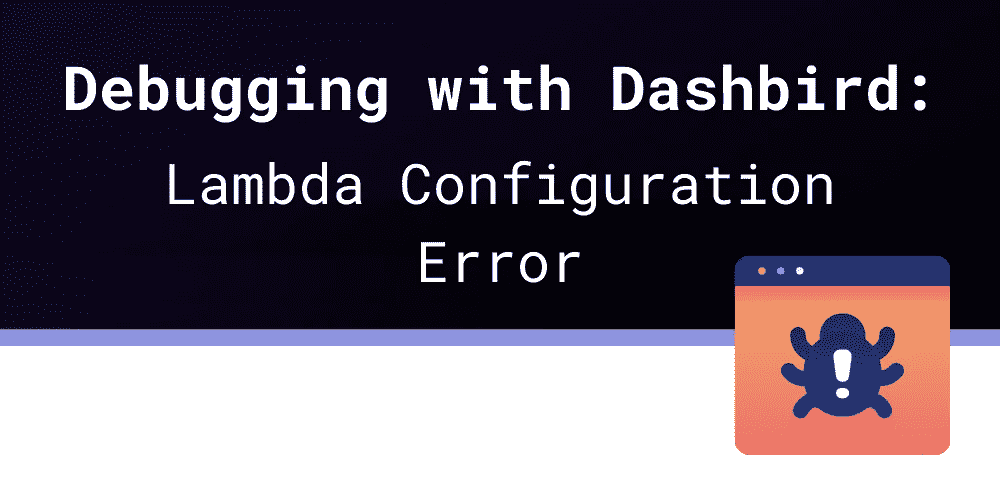
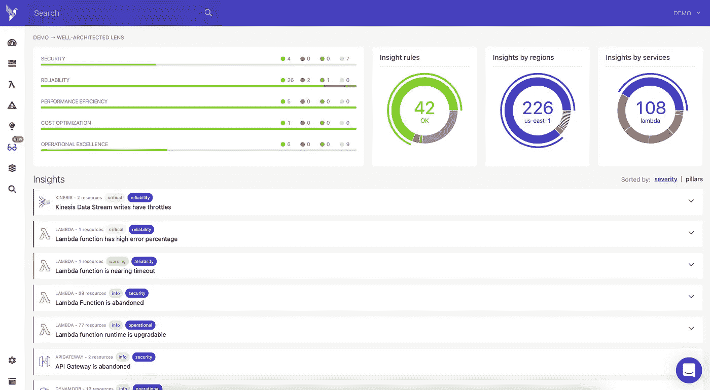

# 使用 Dashbird 进行调试:Lambda 配置错误

> 原文：<https://blog.devgenius.io/debugging-with-dashbird-lambda-configuration-error-9b6ccd163a2e?source=collection_archive---------8----------------------->

本文最初发表于:[https://dashbird.io/blog/lambda-configuration-error/](https://dashbird.io/blog/lambda-configuration-error/)

Lambda 配置错误是最常见的错误消息之一，这并不奇怪，我们都知道 AWS 错误消息并不特别详细。您经常会遇到其他模糊的错误消息，如“[编码未启用](https://dashbird.io/blog/api-gateway-encoding-not-enabled/)”或“流正在失败”，根据上下文，这可能意味着您的服务可能会完全关闭。

**λ配置错误**是最常见的；你可以为你的 Lambda 函数设置几十个配置属性，如果你不记得它们，任何东西都可能是罪魁祸首。

# “Lambda 配置错误”是什么意思？

这个错误可能有很多原因，但它仅仅意味着 **Lambda 服务无法到达您的处理函数**。

Lambda 是一款[功能即服务](https://dashbird.io/blog/what-is-faas-function-as-a-service/) (FaaS)产品，试图简化托管。虚拟机和容器是长期运行的服务器，它们保存状态，而 FaaS 删除状态，只执行一个功能。**函数接收输入并产生输出或有副作用**。

当你想使用 Lambda 时，你必须为它提供一个受支持的编程语言函数。**如果这个函数丢失或者由于其他问题而无法使用**，你将会以可怕的 Lambda 配置错误而告终。

# 我如何修理它？

错误可能有多种原因，但是**它们都归结为路径问题**。

如果你用某种基础设施作为代码(IaC)工具创建一个 Lambda 函数，你必须给它提供一个函数的路径；否则，Lambda 不知道在发生事件时应该执行什么。

# Lambda 如何找到函数定义？

让我们看一个 AWS SAM 示例。

> AWSTemplateFormatVersion**:**' 2010–09–09 '
> Transform:AWS::server less-2016–10–31
> Resources:
> my Function:
> Type:AWS::server less::**Function** Properties:
> Runtime:nodejs 14 . x
> Handler:index . Handler
> CodeUri:./lambda 代码

我们的 MyFunction 资源有三个属性:运行时、处理程序和 CodeUri。

运行时告诉 AWS Lambda 我们正在使用哪种编程语言。另外两个，Handler 和 CodeUri，告诉它在哪里可以找到实际的函数代码。

几乎所有支持 Lambda 函数的 IaC 工具都使用这两个属性。

CodeUri 告诉服务代码文件的位置。在 AWS SAM 的情况下，这是一个到目录的**路径，包含您的函数定义的文件位于该目录中。但这只是 AWS SAM 提供的一些便利；毕竟 Lambda 不能从你的本地机器加载代码；**它必须在云中，在上传到 S3 桶的 ZIP 存档中**。所以，通常情况下，CodeUri 会**指向云中的这个 ZIP 存档**，而不是你的本地内容。**

在上面的例子中，CodeUri 指向。/lambda-code，所以 AWS SAM 会将所有文件打包到一个 ZIP 存档中，并上传到 S3 存储桶中。

**下一部分**是 Handler 属性，它从 CodeUri 结束的地方开始。CodeUri 将 Lambda 指向一个 ZIP 存档；现在， **Lambda 需要找出你在文件**中的什么地方实现了那个函数。根据您的函数的大小，您可能会在那个归档中有相当多的文件。

**使用 Node.js 运行时的 Lambda 函数的 Handler 属性中最常见的路径**可能是 index.handler，点之前的一切都是文件路径，点之后的字符串是该文件中导出函数的名称。Node.js 开发人员使用 index.js 文件作为他们的应用程序入口文件，所以从 index 开始是很常见的。

假设我们的项目在/home/user/dev/project 内部。这意味着我们的 AWS SAM 模板 yaml 文件位于/home/user/dev/project/template . yml

模板中的 CodeUri 声明 Lambda 函数代码位于。/lambda-code，所以 AWS SAM 会将/home/user/dev/project/lambda-code 的内容捆绑到一个 ZIP 文件中，并上传到一个 S3 桶中。

该模板中的 Handler 属性表示处理程序位于 index.handler，因此 Lambda 将在该 ZIP 存档的根目录中查找 index.js 文件。Node.js Lambda 运行时将尝试查找名为 handler 的命名导出，并将其作为函数执行，并将事件数据作为输入传递给它。

**如果这两个属性中的任何一个没有正确实现**，AWS Lambda 将无法找到您的文件并抛出“Lambda 配置错误”这可能意味着双方，文件和目录名称，以及各自的属性配置的打字错误。

# 结论

Lambda 错误并不总是显而易见的，但大多数都是**通常并不难修复**——Lambda 配置错误不是例外，而是普遍现象。你能做的最好的事情就是**熟悉你选择的 IaC 工具**。**了解**它如何找到你的本地 Lambda 源文件，如何打包，以及如何上传它们。

最后，**部署到 AWS 的所有东西都将在 CloudFormation** 模板文件中定义——由您编写或由您的 IaC 工具生成——该文件指向一个带有 ZIP 存档的 S3 桶。

作为最后一招，**如果你真的不知道**发生了什么，并且没有办法检测或修复这个 Lambda 配置错误，尝试找到上传到 CloudFormation 的模板，并将其与它指向的 S3 桶的内容进行比较。

如果您想知道问题出在哪里，我们的[架构良好的洞察功能](https://dashbird.io/blog/introducing-well-architected-insights/)将让您快速轻松地了解您当前的设置如何影响您的整个系统，具体影响了什么，以及如何应对。[自己尝试一下](https://dashbird.io/)。

延伸阅读:

[AWS Lambda 错误处理步骤功能](https://dashbird.io/blog/aws-lambda-error-handling-step-functions/)

[AWS Lambda 日志记录:错误类型](https://dashbird.io/knowledge-base/logging/lambda-invocation-function-and-runtime-errors/)

[AWS Lambda 配置错误](https://dashbird.io/event-library/aws-lambda/aws-lambda-configuration-error/)