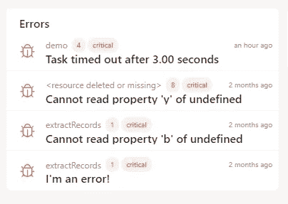

# 使用 Dashbird 进行调试:Lambda 任务在 X 秒后超时

> 原文：<https://blog.devgenius.io/debugging-with-dashbird-lambda-task-timed-out-after-x-seconds-ab873016c0b4?source=collection_archive---------5----------------------->

当构建无服务器应用程序时，Lambda 函数通常构成系统的主干。他们可能只提供了几行代码，但是这些行通常将由许多托管服务组成的整个架构联系在一起。

这种风格被称为事件驱动架构，它在无服务器应用中最为流行。API 网关**从你的用户那里收集**请求，**将**请求转换成事件，**沿途发送**这些请求。有时，上游服务，如 DynamoDB 或 SQS，可以直接处理这样的事件来节省 Lambda 调用成本。

通常情况下，我们需要**对事件**应用一些验证和转换，以便服务可以处理它。这就是 Lambda 发挥作用的地方，也是我们超时的一个来源。

# 等待其他服务

**初学者在实现 Lambda 函数时的一个主要错误是等待该函数中的其他服务。**

通常是这样的:

您创建了一个需要向多个其他服务读取或写入数据的函数；这可以是 S3，Kinesis，甚至是另一个λ函数。因此，您选择这些服务中的一个作为 Lambda 的**事件源，然后尝试在您的函数中调用其他服务**。它们都是通过网络连接的，所以你的函数等待它们的所有响应。

根据你正在做的事情和涉及的服务数量，这个等待时间将会累加，迟早，Lambda 超时会关闭你的功能。

# Lambda 函数的默认最大超时是多少？

Lambda 函数的默认超时是**三秒**。这意味着，如果您不显式配置超时，您的函数调用将在三秒钟后暂停。

现在，如果您调用几个服务，其中一些服务目前已满负荷，一个请求本身就很可能需要一秒钟。所以很快达到三秒钟的超时也就不足为奇了。

# 如何增加 Lambda 超时限制？

**这个问题的简单解决方案是在功能配置中增加超时**。毕竟 Lambda 的超时上限是 15 分钟，所以跑道还是蛮有的。

这个解决方案的问题在于**它不是自由的**。您为您的功能等待并无所作为的每一毫秒付费。这包括网络另一端的错误。如果某项服务有问题并且没有回答您，您仍然需要为等待支付费用，只是为了得到服务超时的通知，并且您没有得到任何您想要的东西。更不用说，如果这个功能直接影响到最终用户，这是一个主要的 UX 问题。

重构您的架构是一个更好的主意。

# 链接事件流

如果您有一个 Lambda 函数因为等待多个服务的时间太长而超时，您可以**尝试使用这些服务作为新 Lambda 调用的事件源**。例如，不要让一个 Lambda 函数调用十个服务，如图 1 所示；让它只调用一个，但是这个服务在完成后会触发一个新的 Lambda 函数，如图 2 所示。

这样，**您可以链接多个服务**和 Lambda 函数，而**不必为 Lambda 调用时间**付费，而其他服务可以工作。

# 使用排队服务

**你不应该用 Lambda 函数来编排**。当您的工作负载足够复杂时，您应该**使用排队服务**来协调它。AWS 提供了大量的受管队列，而且大部分都是无服务器的。 **SQS、SNS、运动学和 Step 函数**是在 Lambda 函数之外管理架构中数据流的方法。

**Step Functions 可以等待数周**等待事件解决，甚至使用人工交互处理的手动解决器。在上面的图 3 中，您看到了架构是什么样子的。首先，API Gateway 调用 Step 函数，然后 Step 函数负责编排其他服务，比如 Lambda 和 DynamoDB。

# 构建复杂功能

超时的下一个原因是复杂的 Lambda 函数，它一次做的事情太多了。**如果您来自一个更单一的应用架构，您可能会倾向于将尽可能多的逻辑放入一个函数中**。这可能会增加完成所需的时间。

# 增加超时限制

Lambda 的默认超时时间为三秒，但它允许您更改此配置。最多 15 分钟，但请记住，您必须为此付费。如果您真的有无法减少的长时间运行的流程，**也许 Lambda 不是正确的解决方案**，您应该研究 EC2 或 ECS。

此外，API Gateway 有 30 秒的硬限制。因此，即使您可以将您的 Lambda 函数配置为运行 15 分钟，当您使用 API Gateway 调用您的 Lambda 函数时，您也会达到一个极限。

# 增加内存分配

如果你增加 Lambda 函数的内存，它也会获得更多的 CPU 能力。**更强的计算能力意味着更快的执行速度，进而意味着更短的执行时间**。但是随着超时时间的增加，这并不总是免费的。有时更多的内存加速了功能，使它更便宜，但有时它甚至变得更贵。

你应该使用 Lambda Power Tuner 这样的工具来充分利用你的函数。否则，你很可能会把钱和业绩留在桌面上。

# 简化你的功能

这里最安全的方法是**简化你的 Lambda 函数**。例如，**不要写一个用 3 分钟完成 10 项任务的函数，而是试着把它拆分开来**。十个功能每个只需要 20 秒，比**更加灵活**。此外，它允许更多的集成选项(参见 30 秒 API 网关限制)，并且您可以单独调优这些任务中的每一个。

也许，一个任务占用了大部分时间，你可以为它分配更多的内存。其他任务可以用更低的内存运行，这样会更便宜。

# Dashbirds 如何帮助超时

**Dashbird 向您展示了所有 Lambda 误差的中心位置**。因此，即使你的 AWS 帐户中有数百个 Lambda 函数，你也只需查看一个地方就能知道发生了什么。

Dashbird 应用程序将向您显示您的 AWS 帐户中最近的错误。下面的图 4 显示了一个列表，其中包含了我们刚才谈到的超时错误。

**如果您点击超时错误，您将直接进入相关事件的详细视图**，如图 5 所示。它包括事件和相关调用的所有指标。

如果您想了解更多，那么您可以点击 occurrences 下面底部的一个调用，您将看到图 6 中的视图。

在这里，您可以找到与超时调用相关的所有内容——持续时间、错误和日志。如果您为您的功能启用了 X 射线追踪，您甚至可以检查与其他服务通信需要多长时间。在图 7 中，您可以看到它的样子。

有了 traces，你马上就能看到你是否为等待其他服务付费。

[免费试用 dash bird](https://app.dashbird.io/auth/register)——这是无服务器可观测性的行业标准，将帮助你调试那些讨厌的超时。