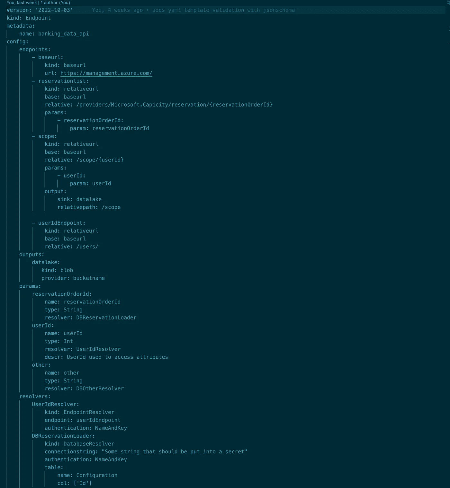

# 一次声明，随处部署:管理 REST API 与 IngestLess 集成的无服务器方法——第二部分

> 原文：<https://blog.devgenius.io/declare-once-deploy-anywhere-a-serverless-approach-to-managing-rest-api-integrations-with-c73ec84c0cce?source=collection_archive---------10----------------------->


由[卢卡·布拉沃](https://unsplash.com/@lucabravo?utm_source=medium&utm_medium=referral)在 [Unsplash](https://unsplash.com?utm_source=medium&utm_medium=referral) 拍摄的照片

这是实现新的无服务器 REST API 集成框架概念验证的系列文章的第二部分

在 [**系列文章的第一部分**](/kubernetes-for-rest-integration-c916dcafe769) 中，我们定义了声明性 REST API 集成工作流的需求，阐述了高级组件架构，以及我们实现的一些指导原则。

# 实现 YAML 模板解析器

在今天的文章中，我们看一个选项来实现将接收我们的文件的`TemplateParser`,应用模式验证步骤来检查正确性，并将 YAML 配置解析为一组具有定义的接口的类，这些接口将允许所有下游服务愉快地解析、编排、编译和部署它到我们正在寻找的最终 IaC 输出。

我们需要**大致满足这些要求**:

*   可以从给定的文件路径加载 YAML 文件
*   可以对照目标模式验证文件模式
*   使未来的模式版本能够并行使用
*   将配置解析成我们可以进一步优化的内部表示

在第一次概念验证中，我们很可能会忽略这些要求:

*   可以向用户突出显示模板中的配置错误
*   可以对典型的拼写错误提供拼写纠正

## 定义模式

因为 Kubernetes 已经为我们实现了这个结构，所以我将从重用模板部分的主要思想开始。

通过概述样本模板 YML 文件中的主要部分，我们可以迭代我们的构造之间的主要交互，直到我们对初始结果满意为止。



我们现在以下面的部分结束**:**

1.  **版本**:标识用于模板解析器的模式版本
2.  **种类**:标识已定义构造类型的关键字。这使我们能够在将来将模板文件分解成一组子结构，以防我们的整体定义变得太长。主要考虑从输出和解析器声明中扩展端点定义，因为它们本身将来可能会收集很多属性。
3.  **元数据**:元数据
4.  **配置**:它保存了我们在这里定义的`Construct`的总体`kind`中定义的任何可行的`Construct`定义对象。现在，我们将把它保留在`endpoints`、`params`、`resolvers`和`outputs`的列表中

## 配置部分

在我们的模板中，配置部分是最需要参数化的元素，这也是大部分验证工作要做的地方。

`endpoint`配置:

*   一个`Endpoint`可以是一个`baseurl`或一个`relativeurl`建立在一个引用的 relativeurl 之上
*   一个`baseurl`可能包含一个参数，但在我看来，为了保持逻辑的纯粹性并包含对`relativeurl`的参数化，它不应该包含参数
*   在`relativeurl`‘相对’路径属性中使用的每个变量必须映射到链接到`parameter`结构的`params`
*   每个`relativeurl`可以输出到一个或多个`outputs`目标，同样像`params`一样，这需要映射到下面定义的实际`output`

`params`配置:

*   一个`parameter`需要被一个`resolver`解析，该构造采取行动从一个专用的源收集参数项，并将其提供给`endpoint`的执行环境，后者将在其 API 请求中使用它
*   它需要定义它所解析的变量`type`,以便在稍后阶段验证输入的预期结构

`resolvers`配置:

*   一个`resolver`标识一个可执行文件(想想无服务器功能),它包含连接、验证和检索特定源类型数据的逻辑。
*   `kind`标识要使用的源，每种解析器都提供自己类型的参数接口。

`outputs`配置:

*   `kind`再次选择合适的存储类型提供者，以便定义多个自变量接口
*   配置的其余部分目前在 WIP 中，将在以后更新。通常，它应该为每种存储类型提供一个配置接口，以配置资源标识符、身份验证和配置参数。

`TemplateParser`类:

因此，让我们看看如何利用 JSONSchema 验证框架来卸载我们所有的验证需求。

我们创建一个模式文件，首先定义模板模式的所有部分。这将有助于我们在深入细节之前，对预期的结构保持清晰的了解。

```
"""
Defines the JSONSchema object schemata 
expected in a given version of the code
"""

TemplateSchema = {
    "type": "object",
    "properties": {
        "version": {"type": "string"},
        "kind": {"type": "string"},
        "metadata": {"type": "object"},
        "config": {"type": "object"},
    },
    "required": ["version", "kind", "config"]
}
```

然后，我们跟进每个属性字典的细节，以防我们想要扩展只包含单个构造的模板文件的编译。我们可以定义`params`、`endpoint`和`resolver`的细节，因为我们进一步细化了框架，它的大小需要进一步细分，因为我们从 K8s 中知道它。现在，重点在于组件交互的结构和架构，我们不需要担心这些细节。

因此，配置的实现只针对模板和元数据模式 ATM 进行扩展。

```
 MetadataSchema = {
    "type": "object",
    "properties": {
        "name": {"type": "string"},
    },
}

ConfigSchema = {
    "type": "object",
    "properties": {
        "endpoints": {
            "type": "array",
            "items": {
                "type": "object",
                "properties":{
                    "kind" : {"type": "string"},
                    "url" : {"type": "string"},
                    "base" : {"type": "string"},
                    "relative": {"type": "string"},
                    "params": {
                        "type": "array",
                        "items": {
                            "type": "object",
                            "properties": {
                                "name" : {"type": "string"}
                            }
                        }
                    }
                }
            }
            },
        "params": {"type": "object"},
        "resolvers": {"type": "object"},
    },
    "required": ["endpoints", "params", "resolvers"]
}

# 
ParamsSchema = {
    "type": "object",
    "properties": {
        "name" : {"type": "object"},
        "name" : {"type": "string"},
        "name" : {"type": "string"},
        "name" : {"type": "string"},
    },
}

#TODO: Define schema
EndpointSchema = {
    "type": "object",
    "properties": {
        "name" : {"type": "string"},
    },
}

#TODO: Define schema
ResolverSchema = {
    "type": "object",
    "properties": {
        "name" : {"type": "string"},
    },
} 
```

switch-dict 将这一切联系起来，因此我们可以选择在 TemplateParser 类中验证哪个模板。

```
# Mapping dictionary to facilitate resolution of schema to keys
schema_mapping = {
    'template': TemplateSchema,
    'metadata': MetadataSchema,
    'config': ConfigSchema,
    'endpoints': EndpointSchema,
    'params': ParamsSchema,
    'resolvers': ResolverSchema
}
```

考虑到我们可以将所有繁重的工作转移到 JSONSchema 验证器上，我们的类只是一个瘦逻辑接口，支持 YAML 解析，并使用 jsonschema python 绑定进行验证。

```
"""
Template Parser

Enables the YAML based declarative definition of resources to be created
and managed by the RestMap framework. 

Along the lines of the Kubernetes API, the files can be stored in a local
folder structure and parsed using this class.

It drives the file input, linting, structure parsing, component validation
and class conversion of the read attributes into schema elements to be exported
further for scheduling.
"""

from pathlib import Path
from typing import Union, List, Dict

from dataclasses import dataclass, field
import jsonschema
from utils import io as ioutils
from enums import StatusCode

@dataclass
class MetadataDict:
    name: str = ''
    tags: list[str] = field(default_factory=list)

@dataclass 
class ConfigurationDict:
    endpoints: dict
    params: dict 
    resolvers: dict
@dataclass
class TemplateSchema:
    """
    Defines the base class for the component schema classes
    """
    version: str
    kind: str
    metadata: MetadataDict
    config: ConfigurationDict

class TemplateParser:
    """
    Implements the parser interface
    """

    def __init__(self) -> None:
        pass       

    # PUBLIC API______________
    def load(self, path: Union[str, Path]) -> TemplateSchema:
        """
        Attempts to verify and load a Template from a given file location.
        """
        path = ioutils.ensure_path(path)
        try:
            template_dict = self._read_template_file(path)
            # Validate required components are defined. Raises if it fails
            self._validate(template_dict)
            # Load all components and lint component schemata
            template: TemplateSchema = self._parse(template_dict)
            return template
        except FileNotFoundError:
            raise FileNotFoundError("The file provided does not exist")

    # INTERNAL API_______________-
    def _read_template_file(self, path: Path):
        """
        Reads the given file, ensures it is valid yaml and loads it
        """
        import yaml
        file = path.read_text()
        template_dict = yaml.safe_load(file)
        return template_dict 
```

验证逻辑归结为对 jsonschema.validate 的简单调用，模板的每个部分都根据其定义的 jsonschema 副本进行验证。就这么简单。这是一个省时的方法，我们刚刚抓住了这个漂亮的验证框架的源头。

如果这对你来说是新的，一定要试试用 [JSONSchema](https://json-schema.org/) 可以实现的强大表达能力。在早期的项目中，我设计了一个模式验证框架，该框架可以自动从物联网传感器数据样本中提取超过 4k 列的模式，并将其转换为 JSONSchema 表示，以半自动地设置验证要求，并根据这些要求验证新的传入物联网流。它简单明了，易于使用。爱死了！

```
def _validate(self, template_dict: dict) -> bool:
        """
        Ensure the file template confirms with expected
        file schema
        @template_string: Parsed dict from yaml input
        """
        from restmap.templateParser.schemata import schema_mapping
        # Validate overall schema first
        try:
            jsonschema.validate(template_dict, schema_mapping['template'])
            for key, values in template_dict.items():
                if key in schema_mapping:
                    jsonschema.validate(values, schema_mapping[key])
        except jsonschema.ValidationError as e:
            raise e
        return True

    def _parse(self, template_dict: dict ) -> TemplateSchema:
        """
        Parse a yaml template string into a TemplateSchema instance

        Does currently hardcode the structure of the expected template
        schema. 
        """
        metadata_dict = MetadataDict(template_dict['metadata'])
        config_dict = ConfigurationDict(**template_dict['config'])
        template_dict['metadata'] = metadata_dict
        template_dict['config'] = config_dict
        return TemplateSchema(
            **template_dict
        )
```

总的来说，我们从最少的代码中获得了用例的大量功能，并且拥有了一个可以随着模板中配置需求的增长而扩展的结构。

# 下一个

今天，我们看了一个模板解析和验证逻辑的解决方案，以一种简单但强大的 YAML 格式驱动我们的配置界面，我们都已经习惯了 K8s。

在下一篇文章中，我们将研究如何实现`Resolver`,它将接受我们的配置，并确保我们的定义中跨结构的依赖性实际上可以得到正确的解决。这不仅意味着每个链接的构造在模板中实际上有一个适当的配置块，而且还意味着在`endpoints`和`resolver`中使用的参数的解析可以一直解析回一组独立的基本函数，这些基本函数没有上游依赖性。最后，我们的构造必须被定义为 DAG(没有循环依赖的图)，否则我们将找不到解决方案。

我们将实现一个简单的`ResolutionGraph`作为树结构，并用一个类来表示模板中的每个构造，以在树的最终遍历过程中对每个组件实现一个 resolve 方法。

我们希望共享元素被表示为指向`ResolutionGraph`中公共节点的指针，这样我们可以进一步将它们的依赖关系编码到基础设施中，最终能够真正`resolve`我们的配置中引用的参数。

如果您想直接进入当前 PoC 的混乱状态，请访问:

[https://github.com/data-native/ingestless](https://github.com/data-native/ingestless/restmap)

这是一个爱好项目，如果你喜欢这个想法，你可以通过评论、鼓掌和在 GitHub 项目上提出问题来支持它。