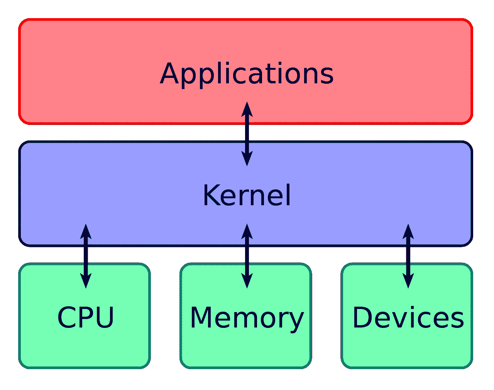

# 解码 Linux 术语

> 原文：<https://blog.devgenius.io/decoding-linux-terminology-6e9a6eee64c4?source=collection_archive---------6----------------------->

试图理解 Linux 伴随着许多新的术语。作为一名自学成才的开发人员，我相信学习计算的基础和学习如何编码一样重要。今天，我一直在努力理解操作系统。这是我的一些笔记。

# Linux 是内核，不是操作系统

内核是操作系统的一部分，它有助于硬件和软件之间的通信。

用 Linux 信息项目的话说:

> 内核是构成计算机操作系统核心的程序。它完全控制系统中发生的一切。

(引自 Linux 信息工程:[*http://www.linfo.org/kernel.html*](http://www.linfo.org/kernel.html))

(图片来源:Bobbo-Own 作品，CC BY-SA 3.0，【https://commons.wikimedia.org/w/index.php?curid=4392180】T4)

# Linux 类似于 Unix，但是不使用 Unix 代码

Unix 是 20 世纪 70 年代开发的操作系统，是许多现代操作系统的祖先。随着 Unix 越来越受欢迎，不同的公司开始修改它并扩展它的功能，生产出互不兼容的竞争版本。

苹果的 Mac OS 源自伯克利软件发行版(BSD)，BSD 源自 Unix。

Linux 内核和 GNU 操作系统一起运行。虽然 GNU 肯定不是 Unix，但它是类 Unix 的，融合了几个 Unix 概念。

# GNU 是一个操作系统

GNU 操作系统是由 GNU 项目开发的，其目标是给计算机用户使用、研究、修改和共享软件的自由。

术语 GNU 是一个递归首字母缩略词，代表“GNU 不是 Unix”。

1991 年，Linus Torvalds 开发了 Linux 内核。内核不是一个完整的操作系统，所以 Linux 无法独立运行。相反，内核与来自 GNU 操作系统的工具和库一起运行。

尽管 Linux 经常被认为是一个操作系统，但它抢走了 GNU 的功劳。GNU/Linux 被认为是一个更准确的名字。

# GNU/Linux 有几种不同的风格，称为“发行版”

最终的操作系统包含一个 Linux 内核、GNU 工具/库和附加软件，如包管理器、窗口系统和桌面环境。

这些组件可以以不同的方式组合在一起。最终产品被称为“分配”。

Ubuntu、Debian、Fedora 和 Linux Mint 是数百个 GNU/Linux 发行版中的几个。

发行版的选择归结于应用和个人品味。Ubuntu 和 Linux Mint 以用户友好著称。Raspbian 是一个为 Raspberry Pi 设计的发行版。

# 进一步阅读

*   **TechRadar 的一篇文章比较分布:**【https://www.techradar.com/uk/best/best-linux-distros 
*   【http://www.linfo.org/kernel.html】内核的解释，用简单的英语写:
*   **更详细的解释 GNU 和 Linux 的关系:**[https://www.gnu.org/gnu/linux-and-gnu.html](https://www.gnu.org/gnu/linux-and-gnu.html)

感谢您的阅读。我欢迎你在评论中的反馈。