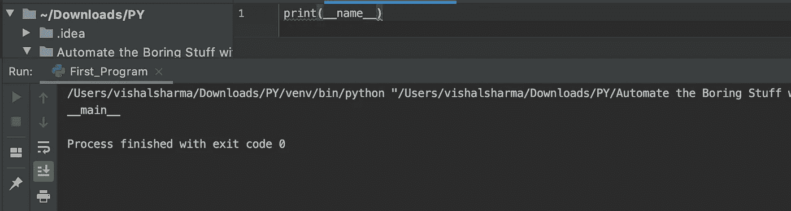
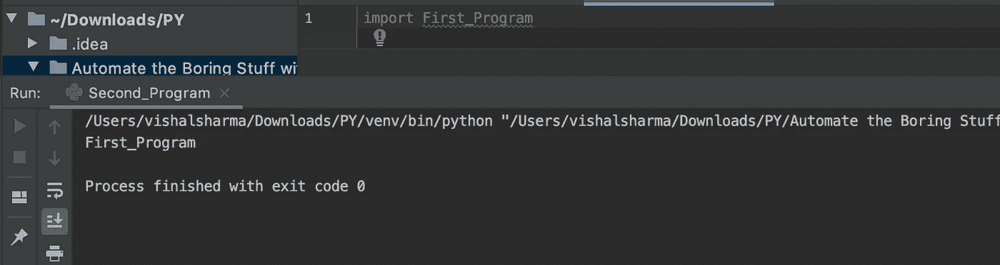
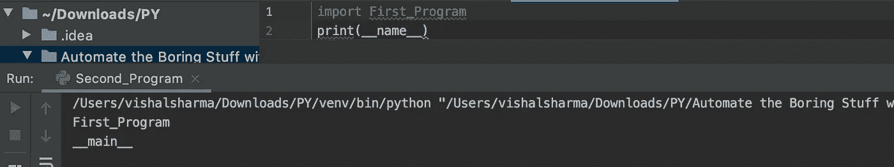
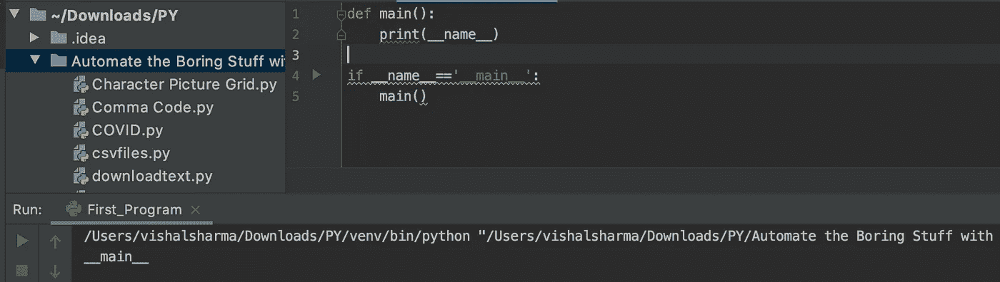
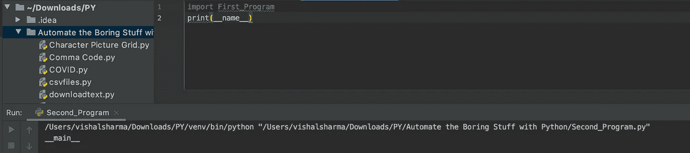
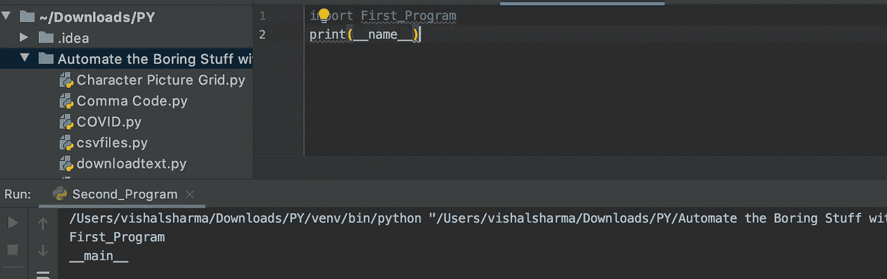

# 解码 Python 的 if _ _ name _ _ = = ' _ _ main _ _ '

> 原文：<https://blog.devgenius.io/decoding-pythons-if-name-main-8fc51e9d495?source=collection_archive---------22----------------------->

## if __name__ == '__main__ '


Emile Perron 在 [Unsplash](https://unsplash.com/s/photos/python-programming?utm_source=unsplash&utm_medium=referral&utm_content=creditCopyText) 上的照片

写过 Python 代码吗？如果你有，你可能熟悉在 Python 中，你不必显式定义**主**函数。如果您来自 C 之类的语言，您可能会觉得这很奇怪。但是，这是事实！

> 不需要明确定义“主”函数

但是，Python 仍然提供了定义执行行的其他约定。您可以使用 python 文件的 __name__ 属性来定义它。

## 作为脚本运行

打开你的 IDLE，写下下面的语句，运行程序“ **First_Program** ”。

```
print(__name__)
```



它将输出一个字符串“__main__”。这是怎么回事？

每当 Python 运行一个文件时，它都会设置一些特殊的变量，而' __name__ '就是其中之一。所以，当 Python 直接运行文件时，它将这个“__name__”变量设置为“__main__”。

## 作为模块运行

假设您创建了另一个名为“Second_Program”的 Python 脚本。但是，这次您导入了上一个脚本。

```
import First_Program
```

现在，当您导入模块并运行程序时，输出将类似于这样。

```
First_Program
```



因此，每当你导入一个文件，在我们的例子中，也就是‘First _ Program ’,它就运行那个代码。但是，为什么它输出的是' First_Program '，而不是' __main__ '。原因是这次 Python 脚本不是直接运行的，而是作为一个模块导入的。

在同一程序中，让我们添加一行代码，即

```
print(__name__)
```

输出会是什么？这次 Python 直接运行脚本，因此输出是“__main__”。

```
First_Program
__main__
```



## **破解 if __name__== '__main__'**

看上面的两个场景。你可能会理解为什么我们需要这个声明。

> 基本上就是说这个文件是直接由 Python 运行的还是被导入的。

现在让我们更改我们的“First_Program ”,使其如下所示。

```
def main():
    print(__name__)

if __name__=='__main__':
    main()
```

这次 Python 会检查 __name__ 是否等于 __main__。然后，让我运行 main()函数。

> Python 脚本直接运行(输出):__main__



现在，运行“Second_Program ”,如下所示。

```
import First_Program
print(__name__)
```

程序运行时，Python 会运行导入的“First_Program”的代码。但是，这次它不会返回任何内容，因为“__name__”即“First_Program”不等于“__main__”。

> Python 脚本运行时带有一个模块(输出):__main__



这两个脚本这次将返回相同的输出。但是，如果你在第一个脚本中做了如下的事情。

```
if __name__!='__main__':
    main()
```

> Python 脚本运行时带有模块(输出):“First_Program”和“__main__”



可以像这样在 Python 中显式定义' main()'。而且，它是 Python 中' __name__ '最重要的用例之一。

## 摘要

if __name__== '__main__ '语句在初学者的编程实践中并不常见。但是，如果您查看任何应用程序的 Python 代码，您可能会遇到这种情况。这就是我决定解码它的原因。下一次，你看到这个声明，你一定知道它是什么意思，是做什么的。

**平安！**