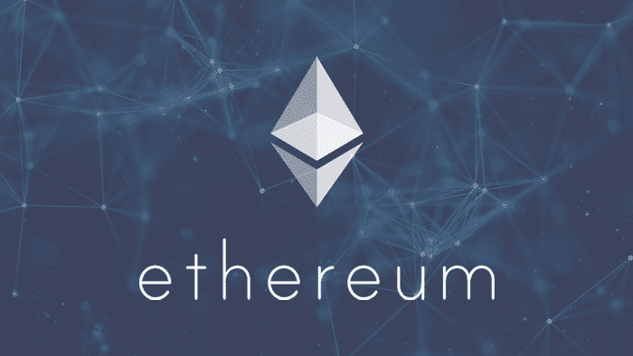
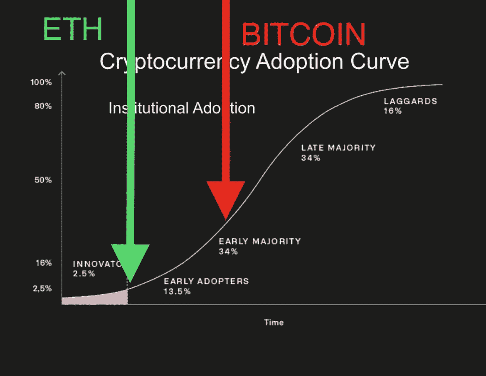
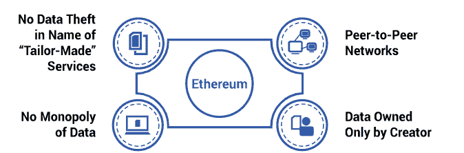
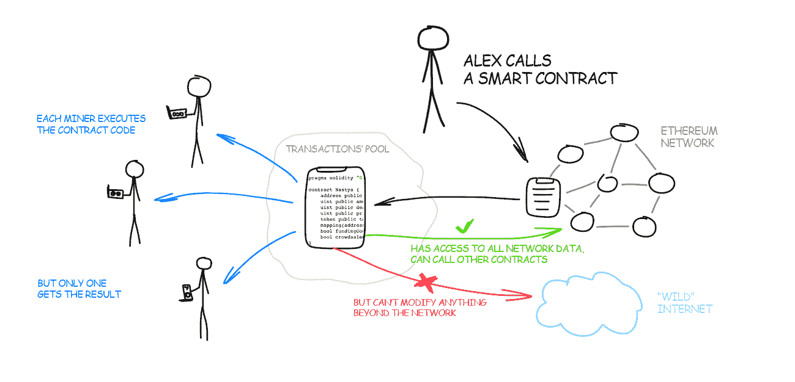
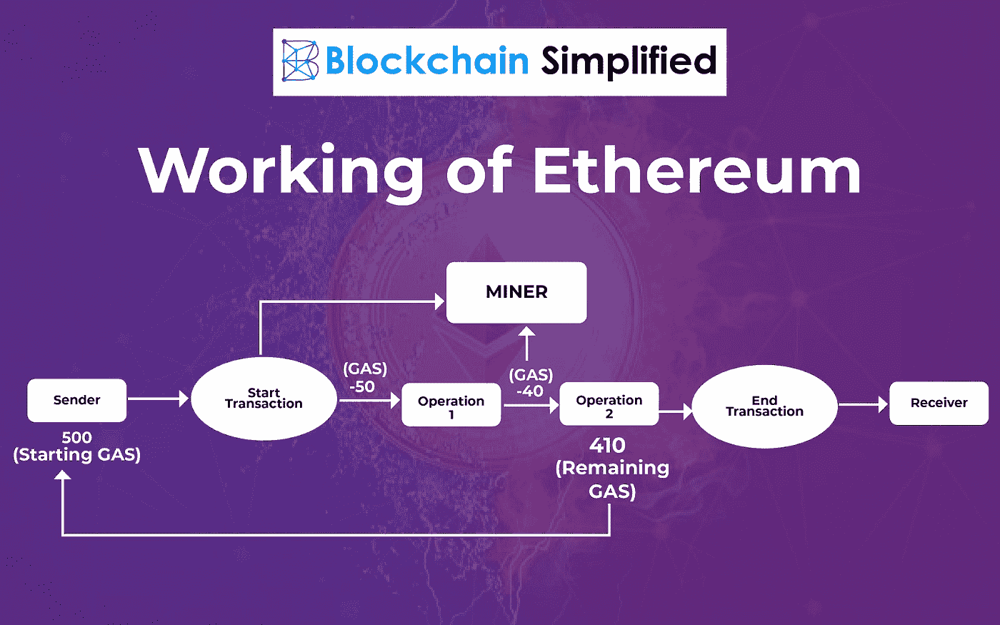
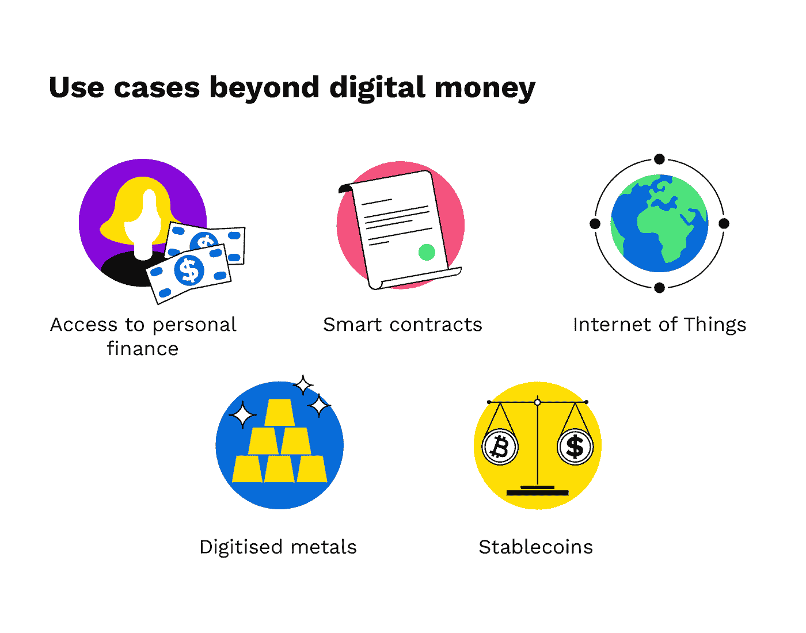

# 解读以太坊的科学及其顶级用例

> 原文：<https://blog.devgenius.io/decoding-the-science-of-ethereum-its-top-use-cases-d2fba40c0cbb?source=collection_archive---------8----------------------->

以太坊被称为加密货币问世以来最重要的发明之一。以太坊的市场每天都在扩大(请看下面的统计数据)。

[图像来源](https://www.reddit.com/r/ethereum/comments/kl6l3l/opinion_btc_vs_eth_adoption/)

因此，希望部署区块链技术来提高生产率、数据安全性以及为流程注入更多透明度的企业对以太坊的需求也在不断增加。

然而，并不是每个企业都清楚这种技术是什么以及如何使用它。因此，在本文中，我们将讨论以太坊及其用例。

那么，让我们来看一下以太坊区块链及其使用案例。

## **以太坊是什么？**

以太坊是 Vitalik Buterin 在 2013 年建立的一个加密货币和去中心化计算平台。它允许人们构建与金融、法律等相关的应用程序。，而不需要集中的软件或服务器。

此外，以太坊可以用作新的区块链项目的基础层，这些项目使用其自己的智能合同脚本语言从零开始构建。不仅如此，Etheressum 还允许用户创建自己的去中心化应用。

由于它非常受欢迎，以太坊通常被称为“世界计算机”，因为它的区块链除了可以用于金融应用之外，还可以用于其他应用。此外，以太坊到目前为止取得了令人难以置信的成功，看起来它的受欢迎程度在未来几年只会继续增长。

[图片来源](https://www.leewayhertz.com/what-is-ethereum-blockchain/)

因此，IT 公司见证了以太坊区块链开发者将该技术部署到各种商业垂直领域的巨大需求。此外，以太坊区块链的使用量每天都在增加。

但是！在收集更多以太坊及其用例之前，让我们更多地了解以太坊和区块链技术是如何相对相称的。

## **以太坊是如何运作的？**

像其他加密货币一样，以太坊使用区块链技术。在以太坊使用区块链的主要目的是确保交易安全。除此之外，它还提供分散控制。

简而言之，它是一个名为“区块链”的共享公共账本，记录用户之间的每一笔交易，以便任何更改都可以轻松追溯，没有任何风险。

与比特币或 ripple 等由一个中央机构管理的其他数字货币不同，没有单一实体管理以太币。它使用一个底层技术平台，该平台是使用名为以太坊虚拟机(EVM)的高级协议创建的。

更重要的是，以太坊使用区块链技术，但不像任何其他加密货币。总之，它使用智能合约的方式与比特币或 ripple 略有不同。

要理解以太坊的用例，了解一点智能合约是很关键的。“合同”一词意味着双方之间的协议，一旦双方就条款达成一致，在条件满足之前，没有人可以撤销它们，这发生在以太坊区块链的数字环境中。

智能合约不仅仅是一种理论；他们已经存在了。我们都熟悉的最著名的智能合约是自动售货机；这些智能自动售货机可以感应插入其中的硬币或纸币。

[图像来源](https://vas3k.com/blog/ethereum/)

一旦您插入硬币或纸币，它就会触发一个机制，在完成预定义的条件后自动分发所需的产品。如果你想利用这一概念，以太坊开发公司可以帮助你了解这一机制如何使你的业务受益，这取决于你所从事的行业。

虽然智能合约是以太坊技术的一个重要子集，但在您的系统中使用这种机制可以极大地方便处理用户或客户的数据/信息。

此外，您需要了解以太坊是如何工作的，以便考虑它在您的组织中的应用。

那么，我们来了解一下它的核心机制。

# **以太坊如何使用区块链技术？**

以太坊基于区块链技术，它的工作方式类似于区块链。所以，我们需要了解的是以太坊如何使用区块链。

简而言之，区块链只是一个分布式分类账，它记录了许多计算机上的所有交易，篡改数据几乎是不可能的。

区块链上的每个块保存用户之间的批量单个事务；这些块是加密的，因此它们可以被公开验证，但不能被修改。

此外，这些信息不断相互核对，这使得篡改或伪造任何交易几乎是不可能的。

有人入侵交易的唯一方法是获得比网络上其他人多 51%或更多的计算能力。

只要一半以上的计算能力保持诚实(即分散)，任何一个人都没有足够的能力在任何一次交易中损害信任。

这可以防止欺诈在系统内的任何地方发生。此外，每个区块链都包含自开始以来的所有历史交易，从而消除了集中控制。这一方面允许更大的透明度和问责制。

此外，它使任何人都能够验证特定的交易是否正确完成。这有助于促进信任，即使是在不认识或不完全信任对方的人之间。

[图像来源](https://blockchainsimplified.com/blog/what-is-ethereum-blockchain/)

事实上，区块链平台在很大程度上仍处于基础设施阶段。虽然以太坊可以说是一种更先进的实现。

它的值令牌被称为以太，你挖掘它(或者更确切地说，获得奖励)是因为你贡献了你的计算机能力来验证它网络上的块。简而言之，以太坊是一个改进的分散系统，是区块链系统的更好版本。

此外，以太坊开发团队由从事以太坊区块链开发的不同方面的各种编码人员组成，例如事务建模、智能合约开发、数据安全等等。

这都是因为实现技术的所有概念需要技巧&很长的时间。从这些方面，现在你已经了解以太坊是如何工作的，以及它与其他区块链有何不同。尽管如此，你一定想知道在哪里可以使用以太坊。

因此，让我们不要陷入假设，并了解以太坊区块链在当前市场中的一些关键使用案例，在当前市场中，数字化转型正处于顶峰。

# **当前数字化转型舞台上以太坊的主要使用案例**

## **支付网关**

以太坊最令人兴奋的用例之一是支付和汇款。免费向全球汇款的能力使其成为需要向海外发送小额汇款的用户的可行选择。

然而，使用加密货币进行支付并不像发送数字现金那么简单。交易仍需在区块链上得到矿商的确认，才能被视为完成。

注入了密码或以太坊的支付网关允许用户将资金存储在一个账户中，当交易发生时，该账户将代币转换为法定货币(如美元或欧元)。

然后，用户可以完全控制他们的资金，直到他们选择将其转换回加密货币。

## **ICO 平台**

以太坊区块链的一个应用是通过初始硬币发行(ico)进行众筹。Bancor 和 Storj 等公司正在让推出新的数字货币或平台变得容易。

这将催生一个新兴经济体，给予消费者、投资者和开发商比以往任何时候都更大的权力。

以下是一些利用 ico 作为融资机制的有趣平台:假人。假人允许用户出租他人的个人电脑。

该平台通过与以太坊钱包集成，支持按需租赁计算节点，以换取假人令牌(GNT)。

因此，您可以让他人使用您的计算机资源，同时获得报酬。可以把它想象成将计算机硬件/软件货币化，如果没有人付费使用它们，这些硬件/软件就不会被使用。

[图像来源](https://www.bitpanda.com/academy/en/lessons/five-use-cases-of-cryptocurrencies/)

## **去中心化 App**

这些类型的应用程序运行在 P2P 网络上，没有任何中心故障点。而且像 Metamask，uPort，EtherDelta 等 app。，可以使用以太坊区块链建造。

实际上，这些解决方案是由智能合约驱动的。在这些应用程序中发生的每一笔交易都必须经过它们，并记录在公共账本上。

创建一个由以太坊支持的去中心化应用的目的是消除对中央权力的依赖&注入更多的透明度。此外，任何企业都可以通过选择以太坊区块链开发服务来创建 Dapp。

此外，像假人和 Augur 这样的应用程序可以帮助用户发现他们的计算能力如何得到利用。当用户将其系统出租给其他需要它的人时，平台会相应地对他们的努力给予补偿。

假人将拥有闲置资源的用户与出于人工智能/机器学习目的而需要处理能力的用户联系起来。你猜怎么着？它也使用以太坊的对等框架！

## **数字身份系统**

在总部位于区块链的身份解决方案准备好进入黄金时间之前，还有很长的路要走。此外，越来越明显的是，区块链在数字身份系统的效用。

Bitnation 项目正在区块链之上创建一个完整的治理体系。总之，微软已经获得了一个应用程序的专利，该应用程序利用区块链式的公共账本作为安全的身份管理解决方案。

凭借其分散的特性和开放源代码，区块链技术代表了一个创造更安全的数字识别解决方案的重大机遇。

## **智能合约**

智能合同是一堆用代码写的承诺，可以被计算机读取并根据其规则进行评估。因为智能合同在区块链上运行，它们也不需要任何一方的信任——不需要中央权威或外部执行机制。

这使得它们可以作为金融资产、实物资产(例如汽车钥匙)或信誉系统。此外，智能合约允许开发人员创建不依赖于第三方的应用程序。

许多项目都使用以太坊作为平台来构建他们的应用程序，因为它安全且易于使用。此外，已经为开发人员创建了许多工具，例如充当 ETH 操作系统的 Mist browser。

## **物联网**

每天，我们都在向我们的网络家庭添加越来越多的物联网设备。我们有控制空调和炉子的恒温器，通过 Spotify 播放音乐的扬声器，可以与笔记本电脑和电视通话的手机，以及观看人脸。

默认情况下，所有这些设备都已经连接在一起，但它们几乎都被孤立在各自独立的世界中。像以太坊这样区块链承诺提供一种方法，将它们连接在一个巨大的网络中，并为数据内置更多的安全性。

## **区块链上的业务**

一些公司已经在利用分散账本的优势来提高业务效率。以 LO3 能源公司为例。

这家总部位于纽约的初创公司正在使用区块链技术来促进邻居之间的绿色能源交易。通过取消中间商，它削减了成本，增加了透明度。

这是以太坊智能合约如何在商业中使用的一个例子——没有政府或银行等外部执行机构来执行它们。这种智能合约还有另一个方面:身份验证。

由于所有这些方面，企业被驱动在区块链网络上运行业务。如果你想在你的企业中注入一个类似以太坊的区块链，你可以 [**雇佣具有 Dapps 开发专业知识的以太坊开发者**](https://www.valuecoders.com/hire-developers/hire-ethereum-developer)&BaaS。

## **包装完毕**

以太坊是一种基于区块链的技术，它使开发人员能够构建和部署分散的应用程序。此外，以太坊平台最广泛的应用是作为数字货币以太网(ETH)的基础。

此外，创建基于以太坊的区块链平台也被认为是更先进的生态系统和安全。因此，企业渴望以各种方式尝试这种技术，以提高组织的生产率、数据安全性和透明度。

因此， [**区块链发展服务**](https://www.valuecoders.com/blockchain-development-company) 在当前舞台上获得了更多的需求&以太坊是最抢手的之一。