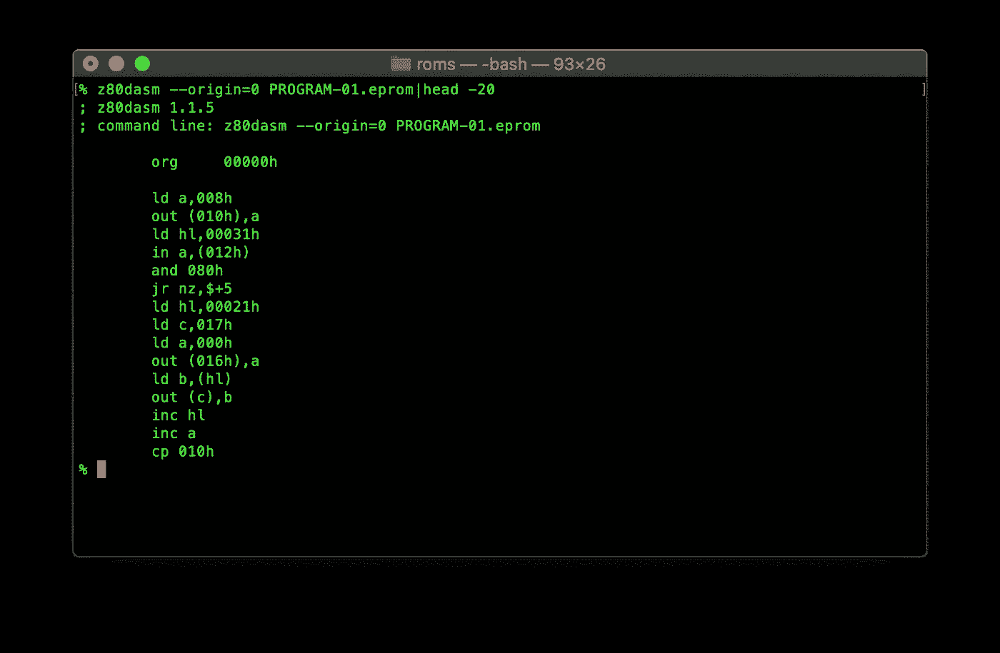

# 解码三和弦 T2556

> 原文：<https://blog.devgenius.io/decoding-the-triad-t2556-6f0ed4cd1125?source=collection_archive---------21----------------------->

## T2556 三联体系列之四

GIMP 中的[检查和清理痕迹的任务真的是漫长而乏味的。一路上，我决定休息一下，看看各种只读存储器是怎么回事。](https://medium.com/@alexwking/tracing-the-triad-t2556-1c9ff7822f0e?source=friends_link&sk=af2fdbb1c6506b9a370725c38696da2d)

我知道主板上有三种不同类型的设备:包含代码的 EPROM，视频控制器(可能)使用的 EPROM，以及有一些神秘应用有待确定的 PROM。

提取 EPROMs 的内容是一件轻而易举的事情，这要感谢容易获得且价格合理的 [TL866A](http://www.autoelectric.cn/en/tl866_main.html) 编程器，特别是当它与优秀的 [Minipro](https://gitlab.com/DavidGriffith/minipro/) 项目配对时，它让我可以在 Mac 上从命令行做任何事情。

7x9 和 5x7 字符 EPROMS 的转储

为了查看两个视频 EPROMS 的内容，我编写了一个小 Python 脚本来将位渲染到图像中，考虑到这两个视频 EPROMS 下面的 PCB 上的丝网印刷显示的是`GRAPH/7x9`和`GRAPH/5x7`，它们包含位图字体也就不足为奇了。7x9 在地址空间的后半部分有这个略显粗糙的 Wild West 双宽度字符集。公平地说，这是上世纪 80 年代的事了。

但是 5x7 块的前半部分包含什么呢？看起来有点奇怪。也许当按计划展示时，它会变得更明显。推迟到以后的事情。

EPROM 程序有点不同。我原以为是 Z80 机器码和一些 ASCII 文本的混合。检查文本的一个快速方法是使用`strings`命令。

这看起来很有希望！我注意到对`TRANS/MULTI`和`DIFFERENTIAL`的引用，这可能是指当[第一次查看电路板](https://medium.com/@alexwking/discovering-the-triad-t2556-19aa184c1bc3?source=friends_link&sk=355b623f82eb24b785190dbcb7a526cb)时出现的两个不寻常的设备。

在上电和复位时，Z80 从地址 0 开始执行代码。我找到了`z80dasm`作为合适的 Z80 拆解器，试用了一下。让我们看看它在 EPROM 的开头找到了什么:

太棒了。这看起来完全像 Z80 代码。我们知道 EPROM 包含程序代码和数据，比如字符串等，但是我很好奇这两者是如何在地址空间中共存的。当我进一步深入研究 EPROM 时，这将像“地图”一样工作。我编写了一个快速的 Python 程序，该程序遍历包含 EPROM 映像的文件，并根据地址的内容为像素着色:如果字节小于 32，则为红色；如果值为零，则为黑色；如果值大于 127，则为青色；如果值是可打印的 ASCII 码(即超出这两个范围),则为橙色。另外，如果前面的三个字节也是可打印的，它就变成黄色。为了有助于进一步简化，编码被分成页面或 256 (16x16)字节块。

EPROM 程序的彩色编码图

所以看起来有几个黄色的热点是 ASCII 序列所在的地方。在第四页也有相当大的黑色区域。

现在足够好了。

但是真正的挑战是弄清楚那个 [74LS471](https://archive.org/stream/bitsavers_tidataBookcomputerComponentsDataBook_16851665/1977_TI_Bipolar_Microcomputer_Components_Data_Book#page/n173/mode/2up) 上有什么，特别是因为它不被 EPROM 程序员支持。

我从互联网上获得灵感，找到了一个 page☨，他谈到了使用二进制纹波计数器来记录地址范围。这意味着我只需要几个引脚就可以遍历整个 8 位地址范围，因此可以在 Arduino Uno 上运行。万岁！

电路看起来像这样:

将 PROM 数据提取到 Arduino 的 KiCad 原理图

我将一个 Arduino 连接到一张厚纸板上，还有一个原型板，所以一旦 [74HC4040](https://web.archive.org/web/20161104125848/http://www.ti.com/lit/ds/symlink/sn74hc4040.pdf) 到达，连接起来非常容易，记住这个设备是静电敏感的，并观察适当的处理。当然，我还需要写一张[草图](https://gist.github.com/ak15199/f38ccbff70a03b32837452793c18c90d)来驾驶 Arduino。

正在运行 PROM 捕获

然而结果令人困惑:这个芯片上没有任何代码，事实上大部分是空的。有点奇怪。

几乎所有来自 PROM 的数据都是 1，只有一小块数据看起来更有趣。

怎么了？我插上示波器，看看我在 Arduino 上的程序是否以某种方式记录了错误的位，但不是这样。

PROM 内容

在检查连接并重新运行代码三四次后，我至少确信结果是一致的，即使我不知道它们是什么意思。

当我绘制出原理图时，我脑海中的灵光一现，事实证明没有理由担心——一切都运行得很好。我们改天再谈那个故事。

在项目的这一阶段，我觉得我得到了一些答案，但也发现了同样多的问题。

然而，这是进步，时间会揭示更多。不过，在我超越自我之前，我可能应该把所有的事情放回一起

☨:不幸的是，我在笔记或书签中找不到那一页的参考文献。如果你是我的灵感，请告诉我，我会给你的作品添加一个链接。