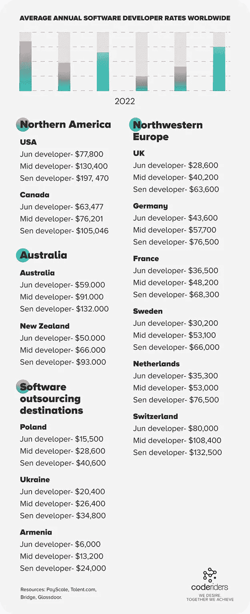

# 专职软件开发人员和自由职业者:哪个更好？

> 原文：<https://blog.devgenius.io/dedicated-software-developers-or-freelancers-which-is-better-8104dd7615bb?source=collection_archive---------13----------------------->

CodeRiders 提供合格的专业远程软件开发人员、UI/UX 设计人员和其他 IT 专家来开发最复杂的软件解决方案

当企业主或 C 级专家写信给我们，“我对软件外包有所顾虑，我不确定我们是否准备好聘请软件开发公司”，我们并没有结束我们的谈话。此外，我们继续询问他们对软件外包的主要关注点和问题。

这并不是因为我们想推广我们的软件设计和开发服务，根本不是。我们只是想确保我们交谈的人了解什么是软件外包，它的利弊，软件外包的各种模式，以及其他相关信息。不幸的是，很多时候，商业领袖在没有意识到的情况下，错过了有益的软件外包合作的好机会。我们怎么知道？我们的业务开发团队在这方面有直接的经验。

我们并不是说你应该总是雇佣专门的软件开发人员，并把软件外包出去。当然，在某些情况下，雇佣自由职业者是更好的解决方案。然而，了解雇佣专门的软件开发人员和自由职业者的利弊是有用的。

本文旨在阐明什么时候软件外包比雇佣自由职业者更好、更有利，反之亦然。首先，让我们了解一下商业领袖对软件外包的两个主要关注点。查看 [CodeRiders](https://www.coderiders.am/) 提供的解决方案。

**软件外包关注#1**

与软件开发公司合作比雇佣自由职业者要贵得多。

**回答**:如果你选择了正确的软件外包目的地，与代理公司的远程软件工程师合作并不昂贵。世界上有几个有益的软件外包目的地。这些国家因拥有众多以低价提供高质量软件解决方案的软件外包公司而赢得了良好的声誉。

让我们考虑一下[亚美尼亚](https://www.coderiders.am/blog/is-armenia-a-top-software-outsourcing-country)。亚美尼亚是南高加索地区的一个小国。在《T2》杂志上，它被定义为世界下一个科技中心。尽管它的人口很少，但它在国际 it 行业中作为最可靠、最安全、最高效的软件外包目的地之一而闻名。由于国家对 IT 部门的支持、便利的教育和低生活成本，这个国家可以灵活地将高质量的软件解决方案与低价格结合起来。大多数软件开发公司没有代理费和运营成本。因此，事实证明，你可以和来自可靠的软件外包和优秀公司的有经验的软件开发人员一起工作，价格和自由职业者一样。

这是一个理想的解决方案，特别是对于软件开发服务成本非常高的国家，如美国、加拿大、西北欧国家、澳大利亚、新西兰、东亚国家、南非共和国等。为了更好地理解，让我们来比较一下这些国家和热门软件外包目的地之间的软件开发率和巨大差距。

**软件外包关注点之二**

无法完全控制远程专用软件开发人员

**答**:在国际软件开发行业有两个广泛使用的术语:软件外包和软件外包。客户更喜欢这两者中的任何一个，这是基于他们希望在软件开发过程中包含多少内容。

**软件外包**是雇佣第三方公司(在这种情况下，是一家软件开发公司)来完成技术工作的过程。在软件外包期间，客户也可以选择从同一家公司雇佣其他 IT 专业人员，如项目经理和 QA 专家，作为一个团队一起工作，帮助客户处理[软件开发生命周期](https://www.coderiders.am/blog/what-is-software-development-lifecycle-stages-and-importance)。客户通常在软件开发过程中扮演最小的角色，并且是软件开发公司处理和执行整个 SDLC。

**软件外包**是从软件外包公司雇佣专门的开发人员、UI/UX 设计师或其他专业人士的过程。在软件外包期间，客户成为软件开发人员的新雇主，这意味着他们像内部员工一样在客户的完全控制下工作。客户与开发人员直接接触，有权采访他们并分配测试任务，就像他们在雇佣自由职业者之前所做的那样。

你可能会问，“个人专用软件开发人员和自由职业者有什么区别。主要区别是工作和服务质量。虽然专门的软件开发人员和设计人员受客户控制，但软件开发公司对服务质量负责。它更加安全、可靠和舒适。

**什么时候与软件外包公司的专职软件开发人员和设计师一起工作会有好处？**

**●** 如果您需要专业可靠的软件开发人员、UI/UX 设计师以及其他 IT 专家。你非常关心软件外包服务的质量。

**●** 如果不想完全掌控软件开发过程，需要第三方帮助。

**●** 如果你关心知识产权，需要一份签名的 NDA。

**●** 如果您有兴趣在整个软件开发项目中雇佣更多的软件开发人员、UI/UX 设计师和其他相关的 IT 专业人员。如果你正与来自机构的专业开发人员和设计人员一起工作，找到新的专业人员并顺利地将他们整合到正在进行的项目中会容易得多，压力也小得多。

**●** 如果需要快速定制软件实现和支持。软件外包公司的软件工程师和设计师了解软件外包的生命周期及其阶段。有了专门的软件工程师，可以更容易地确定您处于 SDLC 的哪个阶段，以及您将走向何处。这自动地促进和加速了整个软件开发、实现和支持过程。

**什么时候与自由软件开发人员和设计师一起工作更好？**

**●** 如果你没有稳定的经济来源，有一个小的、短期的项目和次要的技术要求，不如找自由职业的软件开发者和设计师。软件开发公司通常会寻找稳定的软件开发项目。他们不会在次要的任务上浪费开发人员和设计人员的时间。因此，从机构中寻找专用资源可能有点困难。另一方面，自由职业者喜欢做小而不复杂的工作，因为这些人通常有稳定的工作或者在多个远程项目上工作。风险被降到最低。

**●** 如果你需要软件开发人员和设计师，请尽快联系。寻找自由软件开发者和设计师需要更少的时间和资源。我们有如此多的国际自由职业者在线平台。你可以在网上发布你的工作公告，它将对全球合适的候选人开放。寻找候选人不是问题。然而，你应该格外注意你的选择标准。如果你正在寻找长期的候选人从事复杂的项目。

**●** 如果不存在关键和隐私信息泄露的风险。

**与自由软件开发者和设计师合作的风险**

**●** 自由职业者或者远程软件开发者，UI/UX 设计师可以有自我管理和自律的问题。

**●** 可能存在工作不一致、质量差的风险。

**●** 当您与个人合作时，可能会有知识产权和安全问题。

**●** 自由职业者对公司愿景的兴趣和参与度较低。

自由职业者可能会从事多个项目。

**●** 你不知道你的自由软件开发人员和设计人员多久注册一次专业课程，更新他们的知识。

综上所述，与软件外包公司合作并不意味着放弃对你的远程员工的控制。远程软件公司提供特定类型的定制软件开发服务，如软件外包和外包。更多地了解国际软件开发行业中的各种远程服务，并确定您的需求、项目目标和要求，将有助于确定您理想的离岸软件开发模式，无论是雇佣自由职业者还是专门的软件开发人员和设计人员。