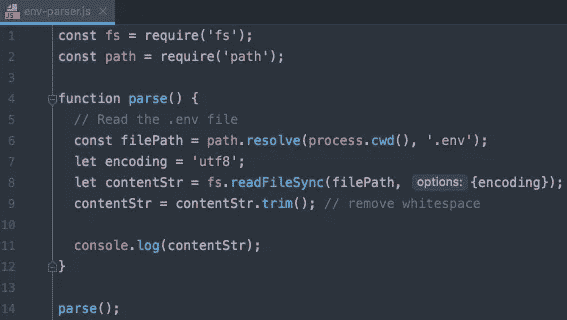

# 深入研究。env 文件并自己实现它的机制

> 原文：<https://blog.devgenius.io/deep-dive-into-the-env-file-in-javascript-projects-and-implement-its-mechanism-on-our-own-e1ff003c2116?source=collection_archive---------2----------------------->

*JavaScript 深潜系列— 1*

如果您使用前端框架如 Vue.js 或 React.js 已经有一段时间了，您可能已经熟悉了项目中的`.env`文件。我们用它们来切换到不同的`modes`，例如`development`、`test`和`production`。基本上，我们可以在那些文件中定义一些“环境变量”，然后在代码中，我们可以通过`process.env.xxxx`访问它们。比如这里是关于这个题目的 [***Vue CLI 文档***](https://cli.vuejs.org/guide/mode-and-env.html) 。

知道`.env`文件在幕后是如何工作的一定很有趣，所以让我们自己实现它的机制。

# 定义步骤并实施

`.env`文件在项目中是如何工作的？这是它做的三件事:

*   将读取`.env`文件
*   文件的内容将被处理
*   文件中定义的“环境变量”将被添加到`process.env`对象上。

首先，让我们创建一个示例`.env`文件，如下所示:

因为这个机制是在 Node.js 环境下运行的，所以我们新建一个名为`env-parser.js`的 js 文件，并把它和`.env`文件放在同一个目录下。在`env-parser.js`中，由于我们需要从磁盘中读取`.env`文件，我们将在 Node.js 中导入`fs`和`path`模块:

此外，还创建了一个名为`parse`的函数，我们的主逻辑将在其中。

现在让我们继续阅读文件并输出其内容:

以字符串格式成功读取内容。第一步完成了。

接下来，我们将解析内容字符串，并最终将“环境变量”添加到`process.env`对象上。因为内容字符串由`\n`分隔，所以我们可以将其转换成数组以便于后续处理:

现在我们可以迭代这个数组。对于每一项，我们将使用分隔符`=`将其拆分，`split()`的结果是一个字符串数组。然后我们从数组中获取键和值部分，并将它们添加到前面定义的对象`obj`中:

这是一大进步！最后一步是将`obj`的内容添加到`process.env`上。为此，我们将检查来自`obj`的键是否已经存在于`process.env`上，如果不存在，只将键-值对添加到`process.env`上:

现在，如果您输出`process.env`，您可以看到最初在`.env`文件中定义的三个新的键值对。这就是每个`.env`文件在 JavaScript 项目中的工作方式！

# 结论

如果你打开你的 Vue 或者 React 项目，在它的`node_modules`目录中你会发现一个名为`dotenv`的依赖项。这是读取和解析所有`.env`文件的实际库。如果你看一下它的[源代码](https://github.com/motdotla/dotenv/blob/master/lib/main.js)，核心逻辑和我们上面的例子差不多。`dotenv`主要有两个名为`config`和`parse`的函数，但是在我们的简化实现中，我们只使用了一个函数。

如果你觉得这篇文章很有用，请关注我，因为我每周都会发布 web 开发文章。