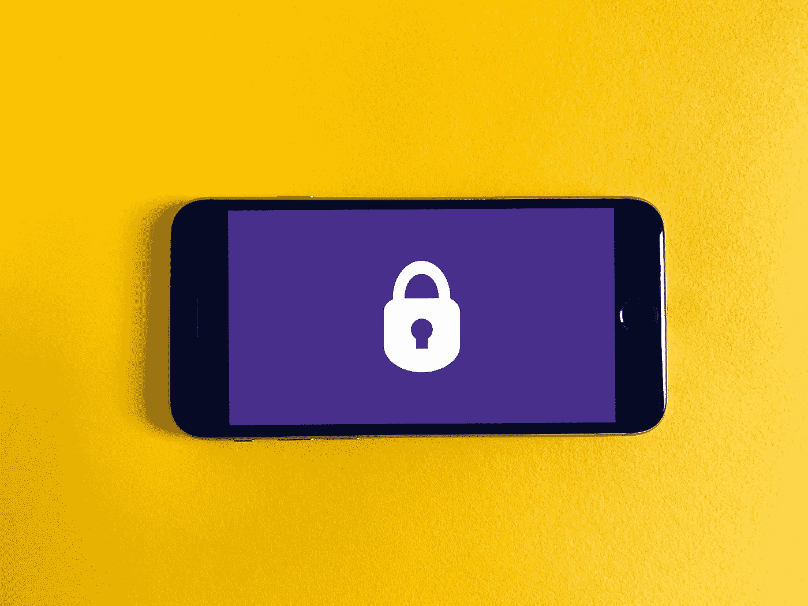
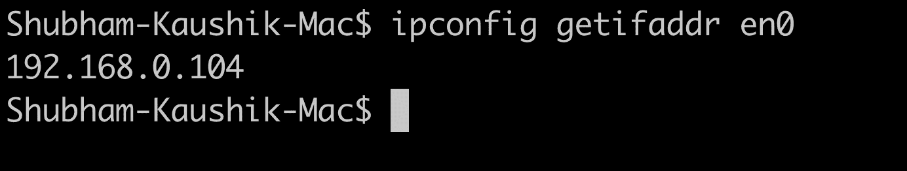
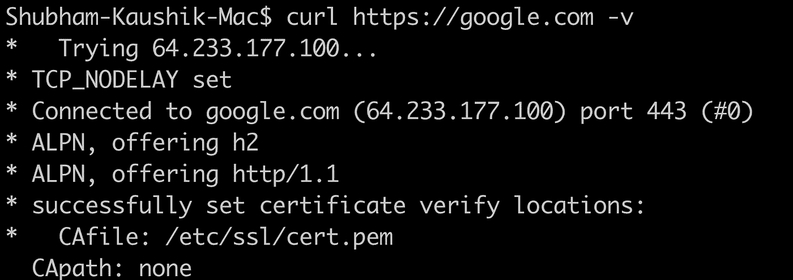
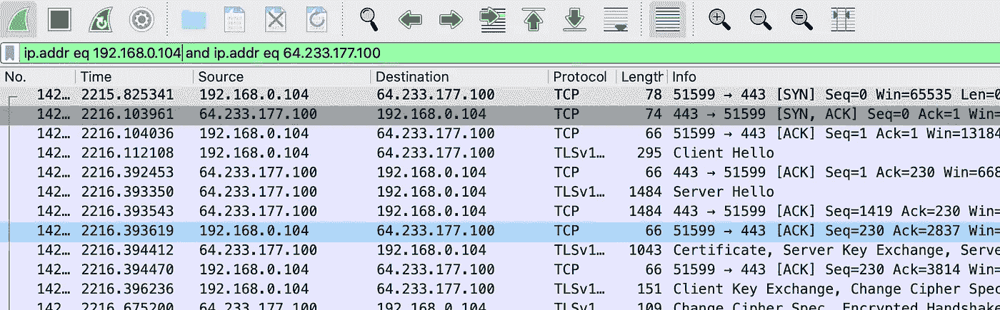
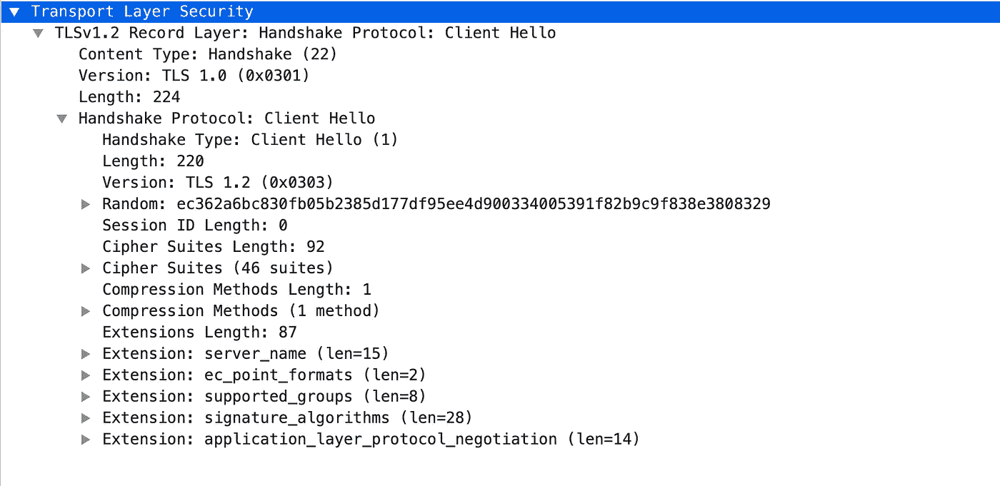
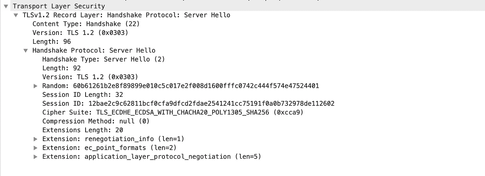
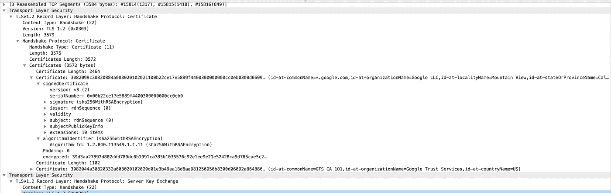
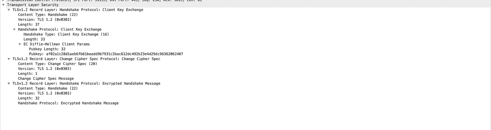
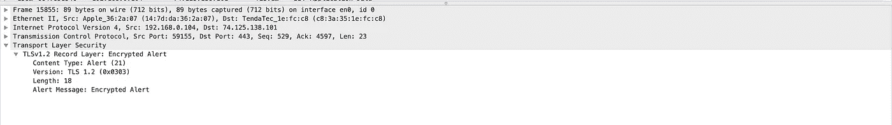
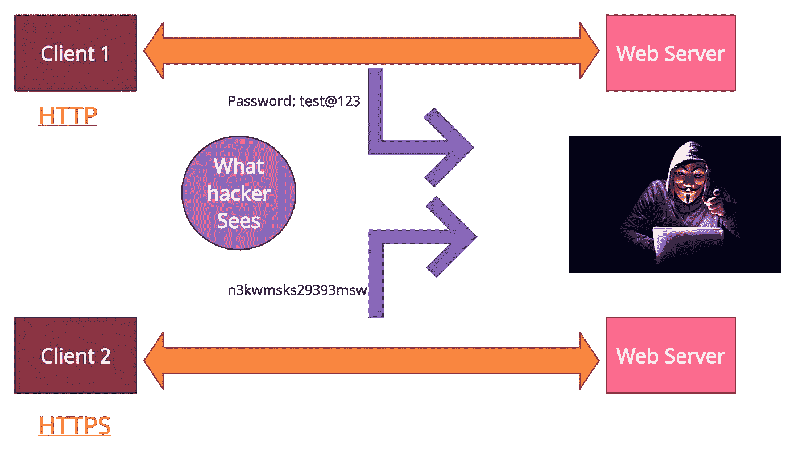

# 使用 WireShark 深入了解 TLS/SSL 握手🦈

> 原文：<https://blog.devgenius.io/deep-dive-into-tls-ssl-handshake-using-wireshark-5abfe83560ce?source=collection_archive---------0----------------------->



照片由[弗兰克](https://unsplash.com/@franckinjapan)在 [Unsplash](https://unsplash.com/) 上拍摄

在本文中，我们将尝试了解浏览器和网站如何创建安全连接，从而为服务器和客户端之间的通信提供隐私和数据完整性。当我们通过浏览器浏览 HTTPS 网址时，我们可能不会体验到 SSL 握手。但是，浏览器正在使用单向 SSL 握手创建 HTTPS 安全连接(将在本文后面讨论)。我们将使用一个开源的数据包分析工具，即 Wireshark，来简单理解 TLS 握手。

> 如果你生来就是为了解决问题，那你就来对地方了！*😃*

# 先决条件

1.  Wireshark(用于理解 TLS 握手)
2.  TCP 概述
3.  将咖啡转化为代码的能力是☕的加分项

# 什么是 TLS 握手？

he TLS 代表“传输层安全”。这是一种加密协议，旨在保护互联网通信的安全。TLS 握手是启动使用 TLS 加密技术的安全通信会话的过程。

在 TLS 握手期间，以下过程将按以下顺序发生:

*   客户端和服务器交换消息以相互确认。
*   然后他们互相验证对方的身份。
*   建立他们将用于保护通信消息的加密算法。
*   并就会话密钥达成一致。

> 如果你不明白任何步骤，不要担心！我们将在后面详细介绍每一步。

# TLS 握手的类型

SSL 握手的主要目的是为服务器和客户端之间的通信提供隐私。在握手过程中，服务器和客户端将交换建立安全连接所需的重要信息(*我们将在本文后面了解正在交换的重要信息*😊).

有两种类型的 SSL 握手，描述如下:

*   **单向 SSL —** 在单向 SSL 中，只有客户端验证服务器的身份。当我们浏览 HTTPS 网站时，通常使用单向 SSL，只有我们的浏览器(客户端)验证网站(服务器)的身份。
*   **双向 SSL:** 在双向 SSL 中，客户端和服务器都验证彼此的身份。通常，在服务器到服务器的通信中，使用双向 SSL。

# TLS 与 SSL

TLS 实际上只是 SSL(安全套接字层)的一个更新版本。它修复了早期 SSL 协议中的一些安全漏洞。SSL 2.0 于 1995 年 2 月首次发布(SSL 1.0 由于安全缺陷从未公开发布)。尽管 SSL 2.0 公开发布，但它也包含安全缺陷，并在 1996 年很快被 SSL 3.0 取代。然后，在 1999 年，TLS 的第一个版本(1.0)作为 SSL 3.0 的升级版发布了。自那以后，又有三个 TLS 版本，最近的一个版本是 2018 年 8 月的 TLS 1.3。

> 在这一点上，这两个公共 SSL 版本都已被否决，并且存在已知的安全漏洞。

# **TLS 握手发生在什么时候？**

基本上，每当我们搜索运行 HTTPS 协议的网站并且浏览器首先开始查询网站的源服务器时，我们都会遇到 TLS 握手。此外，TLS 握手发生在通过 TCP 握手打开 TCP 连接之后。

# TLS 握手期间会发生什么？

在 TLS 握手过程中，客户端和服务器将一起执行以下操作:

*   指定 TLS 的版本(TLS 1.0、1.2、1.3 等。)他们会用。
*   决定他们将使用哪些密码套件(如下所述)。
*   通过服务器的公钥和 SSL 证书颁发机构的数字签名来验证服务器的身份。
*   生成会话密钥，以便在握手完成后使用对称加密。

# 配置 WireShark

让我们看一下 TLS 握手中涉及的每个步骤。我们将首先配置 Wireshark，以便理解 TLS 握手中的每个步骤。以下是配置 Wireshark 所需的步骤:

*   **找到你机器的 IP 地址**——我们可以使用下面的命令来找到 IP 地址。

```
ipconfig getifaddr en0 
```



*   我们需要向任何支持 HTTPS 协议的网站发出 curl 请求，并找到它的 IP——这里我们将使用“[*https://google.com*](https://google.com)”网站。为了找到 IP 地址，我们可以使用下面的命令。

```
curl [https://google.com](https://google.com) -v
```



在上述命令的输出中，我们将获得 IP 地址，复制该 IP 地址，并在下面的步骤中使用它。

*   **最后，我们需要在 Wireshark 过滤器中添加源和目标 IP 地址**



# TLS 握手中涉及的步骤

现在，我们终于可以了解 TLS 握手中涉及的步骤了，我们还可以使用 Wireshark 控制台来验证这些步骤。在 SSL 握手过程中，服务器和客户端遵循以下一组步骤。

## **客户您好**

客户机向服务器发送一条消息，说“**我想建立一个加密会话。下面是我愿意使用的密码套件和 SSL/TLS 版本的列表。我还将发送我的公钥，您稍后可以使用它**



客户你好

在上面的日志中，我们可以看到客户端正在用 TLS 版本 1.2 发送“Hello”。这样，客户端通知服务器它支持 TLS[1]1.2 版和更低版本。此外，它还发送客户端支持的密码套件列表(这里是 46 个)。服务器将从该列表中选择一个它支持的密码套件。如果列表包含服务器不支持的密码套件，服务器将忽略这些密码。如果发现服务器不支持任何密码套件，则会发送失败警报，并且服务器会关闭连接。

## **服务器你好**

服务器回复**“嘿，你好！让我们使用你列表中的这个特殊的密码套件。我还检查了我可以使用你的 TLS 版本，所以我们准备好了。这是我的证书，包括我的公钥。”**



服务器你好

随着服务器 Hello，服务器将发送带有证书链的服务器的证书。证书链将由客户端根据其信任存储进行验证。我们可以看到服务器发送的证书日志，如下所示。



服务器发送的证书链

## 证明

客户端验证服务器的证书，然后提取公钥。客户端用公钥加密一个新的**【预主密钥】**，然后发送给服务器。我们可以在下面的日志中看到，客户端将这个加密的密钥发送到服务器，如下所示。



客户端密钥交换

## **预主密钥解密**

服务器使用其私钥解密预主密钥

## **会话密钥已创建**

客户端和服务器都从客户端公钥、服务器公钥和预主密钥生成会话密钥。它们应该得到相同的结果。

## **客户端准备就绪**

客户端发送用会话密钥加密的“完成”消息。

## **服务器准备就绪**

服务器发送用会话密钥加密的“完成”消息。

## **实现安全对称加密**



握手完成后，使用会话密钥继续通信。

# HTTP 和 HTTPS 有什么区别？

使 HTTP 和 HTTPS 协议如此不同的唯一区别是 SSL 证书。基本上，HTTPS 是一种具有额外安全性的 HTTP 协议。当我们处理用户的敏感数据(如信用卡信息、密码和银行详细信息等)时，这种额外的安全性极其重要。



此外，HTTPS 通过 TLS(传输层安全性)得到保护，这一点我们在上面已经了解过。TLS 有助于提供数据完整性和身份验证，前者有助于防止数据传输被修改或损坏，后者证明我们与之通信的服务器的身份。

# 问候！

*我们已经成功完成了 TLS/SSL 握手的所有步骤。此外，我们还使用 Wireshark(数据包分析器)工具交叉检查了这些步骤。*


整个 SSL 握手过程发生在几百毫秒内，并且都是在幕后进行的。这是 HTTPS 连接中必须发生的第一件事，甚至先于从 web 服务器获取网页内容。

当 SSL 握手完成时，客户机和服务器之间就建立了加密连接。现在，所有从客户端发送到服务器或从服务器发送到客户端的数据都使用会话密钥进行保护。

SSL/TLS 握手是一个迷人的过程，对于确保互联网安全非常重要，然而它在幕后快速而安静地发生，大多数人一开始都不知道它在工作。

# 摘要

为了这篇文章的完整性，让我们快速回顾一下到目前为止我们所学的内容。

*   什么是 TLS/SSL 握手？
*   我们如何使用 TLS 协议加密客户端和服务器之间的整个通信？
*   HTTP vs HTTPS

> 如果你喜欢这篇文章，别忘了给它一个掌声！


请随时在 [**Linkedin**](https://www.linkedin.com/in/shubham-kaushik-temp/) 上 ping 我，敬请期待下一期！

# 参考

[1] SSL 官网[https://www.ssl.com/](https://www.ssl.com/)

[2] Cloudflare 网站[https://www . cloud flare . com/en-in/learning/SSL/transport-layer-security-TLS/](https://www.cloudflare.com/en-in/learning/ssl/transport-layer-security-tls/)

[3] WireShark 网站[https://www.wireshark.org/](https://www.wireshark.org/)