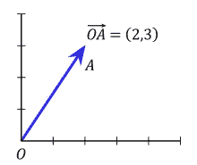
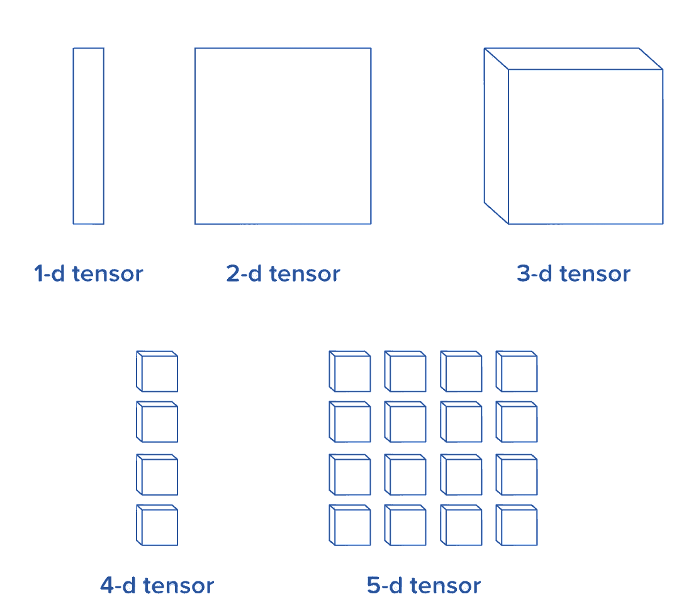
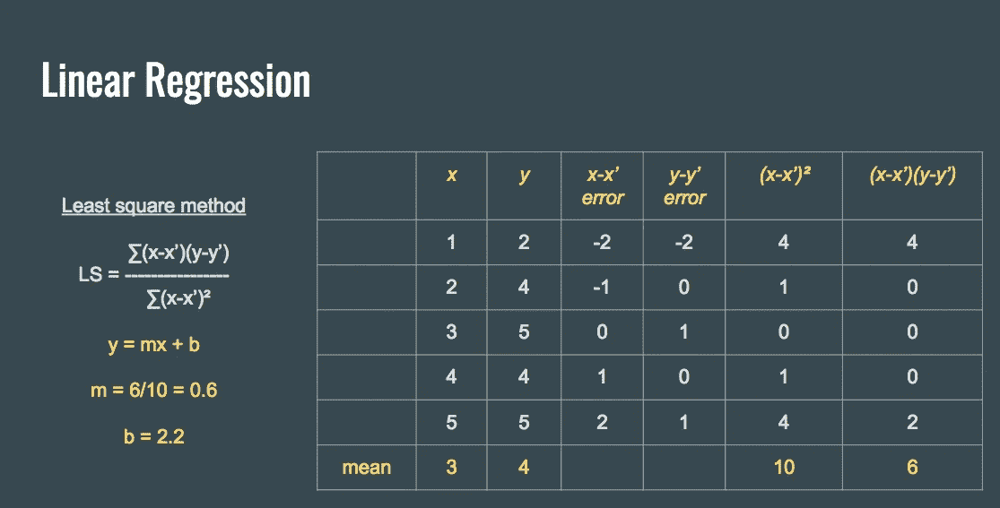
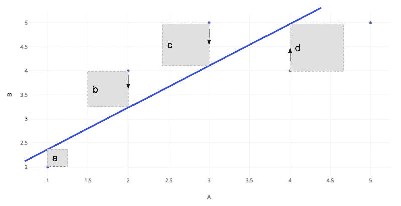
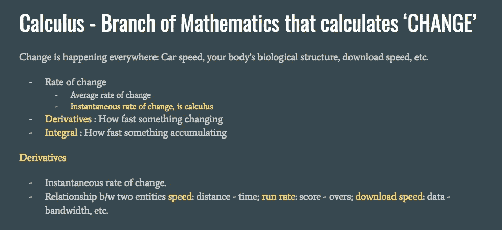
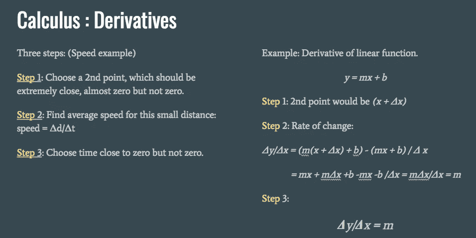
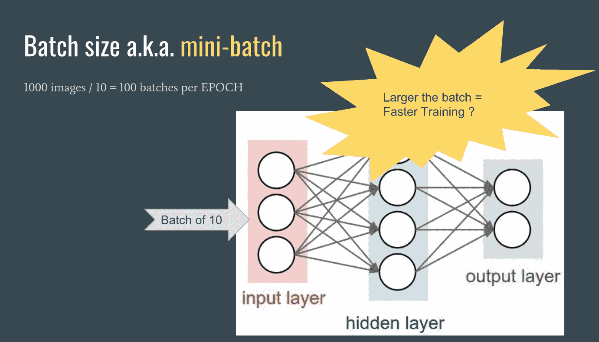
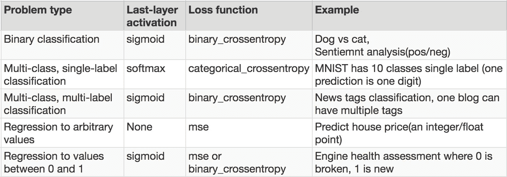
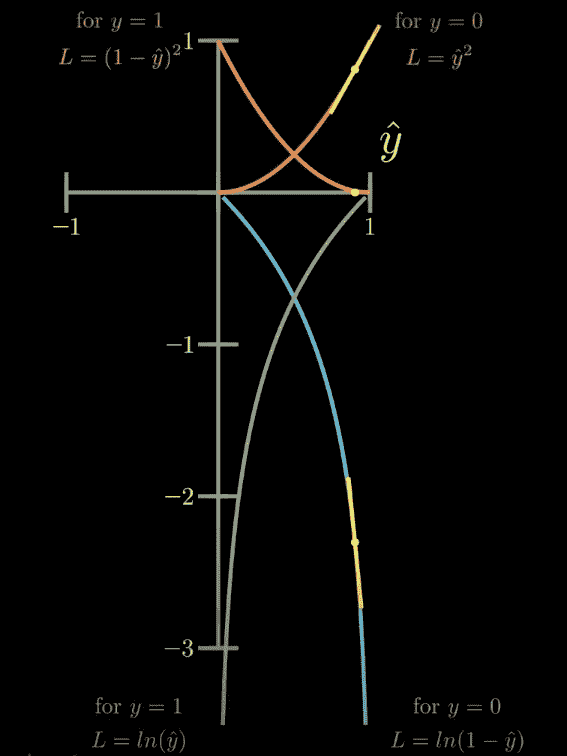

# 深度学习:以梯度下降的方式！—第一部分

> 原文：<https://blog.devgenius.io/deep-learning-in-gradient-decent-style-part-1-ed747e7cc2a3?source=collection_archive---------0----------------------->

***老实说，我花了一些时间来理解“深度学习”的概念，但正如他们所说的，不同的学习速率、大量的干净数据和足够的 EPOCS 将导致更好的准确性。我想说，现在我的准确率已经接近“y-hat”了，但仍然需要更多的学习。但是到目前为止这段旅程真的很棒！***

让我们先从**几个**关键定义开始，这样我们在开始学习神经网络之前就有了一些基本的理解，然后再去理解更大的概念。有各种各样的关键字，当我们到达那个点时，让我们处理它们。

**线性代数**:在神经网络的环境中，线性代数运算描述了信息从一层流向另一层时的转换。线性代数是一个数学工具箱，用于处理包含信息/数据的向量和矩阵。现代计算机具有(图形处理单元)GPU，该 GPU 被设计成以最佳速度并行进行矢量和矩阵运算。用于深度学习的线性代数在这篇文章中有很好的描述。

**线性方程**:线性方程是一次多项式。例: *y = x* 或 *y = 2x 是一次多项式*。当你用这些等式在图上画出这些点时，它将形成一条直线。如果你增加更多的维度，它将形成*平面*或*超平面*，但它们的形状将始终是直的和*线性的*，没有任何曲线。要获得多维线性平面的直观感受，请看下面的视频。

多维对象

**非线性方程**:高次多项式(*多于一个*)在图形上绘制点时会形成曲线，例如: *y = x* 或 *sin* 或*余弦*等。类似地，多维非线性平面看起来会像下面这样:


非线性方程的 3D 视图

**矢量**:在线性代数中，矢量是点 *a* 到 *b* 的运动，既保持方向又保持大小。



矢量

向量[2，3]表示右边的 2 个点和向上的 3 个点。同样，直线上的所有点也可以通过以下等式获得:

```
***y = mx + c***where:*m = slope
c = intersection*
```

**矩阵**:一维以上的向量称为矩阵，即 2D、3D 等。顺便说一句，深度学习是向量或矩阵的不可知论者，这意味着数据可以是任何形式:1D，2D，3D，…格式。

**Tensor/Numpy** :它们是向量和矩阵的数学概括，因此被称为多维数组。张量的几个例子:



下面的视频将更详细地解释它们:

**线性回归**:线性回归试图用观测数据的线性方程( ***y = mx + c*** )来模拟两个变量之间的关系。一个变量被认为是解释变量 ***(x)*** ，另一个被认为是因变量 ***(y)*** 。例如，如果您必须预测您所在地区的房价，其中价格是解释变量，而“房屋大小”是因变量。换句话说，线性回归就是将一条直线拟合到由***(x)******(y)***创建的一组点上。



使用最小二乘法的线性回归示例

为了对上面的例子有更好的直觉，让我们看下图:



最小二乘法

直觉上，如果你能想到将它向上或向下移动一点，将会改变所有方块各自的面积(即 **a、b、c、d** )。这个想法是，当所有的平方和最小时，就定义了直线的斜率，或者说是最佳拟合直线。

(面积 **a** +面积 **b** +面积 **c** +面积 **d** )应该是最小的，将是直线的最佳拟合斜率。

**微积分*(在几张幻灯片中)*** :



**特征图/特征矩阵/过滤器/权重/内核:**首先，所有这些术语的意思都是一样的。这些是保存在矩阵中的训练过程中学习到的重量。它们更像一个容器，在训练时保持重量的状态。一旦系统被训练得非常精确，这些权重就被用于预测。

**感受野:**神经网络中被滤波器覆盖的小区域称为感受野。根据定义，这种连接的空间范围是一个超参数，称为神经元的**感受野**(相当于滤波器大小)。换句话说，过滤器叠加的数据部分是感受野。

**挤压**:将输入限制为一个有限值。比方说，忽略长宽比，将图像压缩到(宽:224，高:224)大小。

**激活**:“激活是一个数”，其背后的思想暗示，“ ***这个*** 特征是在 ***这个*** 位置并与 ***这个*** 置信”。训练的权重只不过是激活。比方说，我有一个大小为 3x3 的过滤器，因此过滤器中的所有 9 个权重都是激活，它们都代表一个非常小但特定的属性。

**激活函数**:它们帮助神经网络捕捉特征，不仅能够学习线性函数，也能够学习非线性函数。换句话说，它们在系统中引入了非线性。非线性在多层网络中很重要，否则，如果没有非线性，系统将给出线性输出。有各种类型的激活:Sigmoid 和 Tanh，ReLU，leaky ReLU，softmax，…下面的[文章](https://towardsdatascience.com/activation-functions-neural-networks-1cbd9f8d91d6)给出了很好的想法。

**训练数据:**我们用来训练系统的数据，这是网络看到并开始学习的数据。

验证数据:作为培训的一部分，我们也验证数据及其结果的准确性。这是相同的数据，通常数据集的一部分图像被搁置起来，稍后用于验证。

**测试数据:**这些图像以前从未被系统看到过，我们对系统进行真正的测试，因为在验证过程中，验证的端口被涂抹，它成为训练数据的一部分，这就是为什么验证结果可能很高，但必须用系统以前从未见过的图像进行真正的测试。

**退出**:顾名思义，在训练中随机退出一些早先学习的激活。这是确保神经网络不会过度拟合的方法之一。

**历元:**历元是对给定数据集的完整遍历。也就是说，在一个时期结束时，神经网络将已经暴露给数据集内的每个记录一次。

假设我们的数据集中有 100 个样本，我们的小批量是 10。这意味着 10 个小批量将覆盖数据集中的所有数据样本。10 个小批量完成一遍所用的时间称为 1 个时期。

**批量/小批量**:批量是在一个时间点通过网络的样本组。这也被称为“批量”或“小批量”。例如:一个历元传递 1000 幅图像，一个批次的大小是 100 幅图像，那么我们将需要 10 个批次来传递数据集中的所有图像。批量大小是一个超级参数。

> 批量越大=训练越快

现在，问题是，如果我的机器支持 32 批次大小，我应该使用这个数字吗？答案是肯定和否定的，确保所有的硬件模块都支持它，如 GPU，内存，互连总线。这不仅仅取决于机器能够并行处理多少数据。Keras 文件提到以下内容:

> 一个**批次**通常比单个输入更接近输入数据的分布。批量越大，近似值越好；然而，批处理将花费更长的时间来处理，并且仍然只导致一次更新，这也是事实。对于推断(评估/预测)，建议在不超出内存的情况下选择尽可能大的批处理大小(因为较大的批处理通常会导致更快的评估/预测)。



小批量

**特征空间:**如前所述，可以有“n”维矩阵，这些数据可以用“n”维表示，这样的特征空间称为特征空间。当从机器学习模型中提取特征时，我们基于它们的属性对它们进行聚类，这些属性可以很多(很多真的可以是'*很多*'，理论上没有限制)。

**数据拟合**:这是关于你的激活在训练过程中如何正确设置的，因为一个系统应该是良好的通用系统(*良好的准确性*)。这就像是过度适应与欠适应以及达到最小局部最优之间的细微界限。如果将数据集适当地分为训练和验证是重要的，则在向前传递和向后传递中的所有数据之后设置权重。一个系统通常应该是一个好的通用器。

**模型评估**:在高层次上，我们可以考虑以下类别之一的模型:

1.  **过拟合**:这意味着训练损失远低于验证损失。这样的数据被称为具有高偏倚。
2.  **欠拟合**:此处训练和验证损失都很高，被视为高方差。
3.  **良好拟合**:训练和验证误差都较低，但略高于训练误差。在即将达到过度拟合之前训练模型总是一个好主意。

**偏差-方差权衡:**让我们考虑以下损失/误差条件:

```
+------------+-----------------+----------------------+
| Train loss | Validation loss |         Remark       |
+------------+-----------------+----------------------+
| 2%         | 12%             | High variance        |
| 15%        | 17%             | High bias            |
| 14%        | 32%             | High bias & variance |
| 0.1%       | 0.5%            | Low bias & variance  |
+------------+-----------------+----------------------+
```


来源:Jermey 的 Fastai 笔记本

**图**:这是我们模型的结构，或者说是我们计划训练的模型的架构。它由一个接一个的不同层组成，它们本质上执行以下三种操作:卷积、池化、全连接层等。

**冻结图形**:训练后，我们的模型学习到大量与图形/模型中所有这些节点相对应的小权重。将图形和相应的权重保存在外部缓冲区意味着冻结图形。这将在以后用于重新加载图表或进行推理。

> *他们就像蜂箱里装满了甘露。*

**BatchNormalization** :非常重要的一点是，在输入 DNN 之前，输入数据的预处理也必须对数据进行归一化处理。同样，我们也将 DNN 层之间的数据标准化，这称为 BatchNorm。这是它们进入下一个神经网络层之前的数据处理。它在相同的尺度上转换数据，并避免任何不稳定性。这有两个部分:

1.  归一化:对于 DNN，通常我们在从 *0 到 1* 的范围内缩小数据。让我们假设我有 *data_values = [1，200，100000，500]* 。这是一个相当大的值范围，我们需要将它们缩小到 0 到 1 的范围，中间有很多浮点。这一点很重要，否则网络将变得不稳定，数据点的范围很广，训练将花费很长时间，也不能保证网络将正确收敛。
2.  标准化:这实际上是计算 Z 分数，并使数据集的均值为“零”，标准差为“一”。

```
 x — m
                              Z = -----
                                    S
Where: 
x = data point
m = Mean of dataset
S = Standard deviation
```

关于 tensorflow batch-norm 的大文章[和](http://ruishu.io/2016/12/27/batchnorm/)。

**量化**:在归一化过程中，数字被转换为浮点，为了在内存中存储单精度浮点格式(IEEE-754)，我们需要 32 位内存。量化是将浮点内存存储从 32 位减少到 8 位的过程(事实上，就我所知，还可以进一步减少)。这也影响准确性，但不是很明显，因此这是一个权衡。

**最后一层激活&损失函数:**



最后一层激活和损失函数

**均方误差(MSE)与二元交叉熵(BCE)/对数损失:**

MSE 损失函数给出连续值，因此用于回归问题。而 BCE 给出离散值，即 0 类或 1 类，因此用于逻辑回归问题。如果你看下面的图表，你会知道梯度值增加非常快，并惩罚模型权重。这就是我们在输出中得到离散值的方式。



*有许多重要的遗漏项，但这需要对神经网络有所了解，因此将其保留为* [*第二部分*](https://medium.com/@tomdeore/deep-learning-in-gradient-descent-style-part-2-e159e2cf8a99) *。*

在下一篇文章中，将涵盖更大的神经网络概念。

**可以在|**[**LinkedIn**](https://www.linkedin.com/in/mdeore/)**|**[**网站**](https://tomdeore.wixsite.com/epoch)**|**[**Github**](https://github.com/milinddeore)**|**