# 深度学习:以梯度下降的方式！—第二部分

> 原文：<https://blog.devgenius.io/deep-learning-in-gradient-descent-style-part-2-e159e2cf8a99?source=collection_archive---------0----------------------->

*在前面的* [*part-1*](https://medium.com/@tomdeore/deep-learning-in-gradient-decent-style-part-1-ed747e7cc2a3) *中我们抓住了几个关键词，在这一部分我们将获得对神经网络及其构建模块的直觉。*

在软件编程中，典型的函数如下所示:

```
 #include <stdio.h> void functionName() **<<------|**
          {                           **|** 
              . . . .  . .  . . . .   **|**
              . . . .  . .  . . . .   **| **         
                                      **|**  
**|--------** }                           **|**
**|**                                     **|**
**|**        int main()                   **|** 
**|**        {                            **|**
**|**            . . . .  . .  . . . .    **|**
**|**            . . . .  . .  . . . .    **|**       
**|**                                     **|** 
**|**            functionName();  **--------|**              
**|**           
**|------->>**    . . . .  . .  . . . .
              . . . .  . .  . . . .
          }
```

函数名()；

这里的整个思想是传递输入并获得输出，其中函数是一个' ***'黑盒'*** 。这个黑匣子有一些由人类使用其中一种编程语言编写的逻辑。这就是我们到目前为止为实现应用程序和逻辑所做的工作。这在 Andrej Karpathy 的文章[软件 2.0](https://medium.com/@karpathy/software-2-0-a64152b37c35) 中有详细描述。

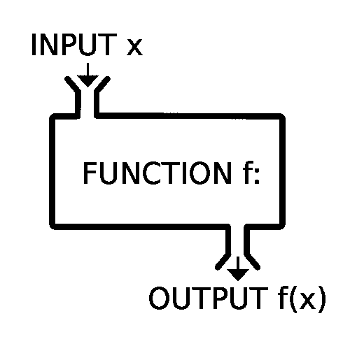

在神经网络中，我们执行完全相同的任务，但这里的'**黑盒'** magic 是一个数学函数。事实上，神经网络可以描述任何数学函数，因此被称为 ***通用函数逼近器*** 。这种数学函数在本质上是非线性的，具有大量的维度，但不要担心，我们很快就会进一步证明这一点。

如果你需要同样的视觉证明，需要数学解释，迈克尔·尼尔森的免费书籍[第四章](http://neuralnetworksanddeeplearning.com/chap4.html)会给*最好的见解。我建议你通读所有的章节，因为对我来说，这是一本关于数字图书馆的最好的书。*

> *注意:在继续之前，浏览一下迈克尔·尼尔森的免费书籍[第 4 章](http://neuralnetworksanddeeplearning.com/chap4.html)。*

*如果这第一直觉是清楚的，为什么我们说神经网络是通用函数逼近器？我们现在的状态非常好，可以进入细节了。*

# *资料组*

*干净的数据集对于神经网络按照我们希望的方式执行和预测是必不可少的。神经网络只理解整数作为输入数据，因此所有输入都必须转换为整数类型。假设:从 0-255(灰度图像数据)或一组人走过的距离 100-100，000(公里)，性别类型(男性为 0，女性为 1)等。它不理解文本、字符串等。*

*下一个要点是，在我们将数据输入神经网络之前，我们必须将数据转换成神经网络可以使用的东西。这种类型的转换称为数据预处理，预处理是对原始数据进行规范化和标准化。*

*数据的标准化意味着将任意范围内的任何数据降低到确定的范围内，即介于(0 到 1)之间，标准化可以消除异常值。如果数据不标准化，可能会导致网络不稳定，并可能导致爆炸梯度问题。*

*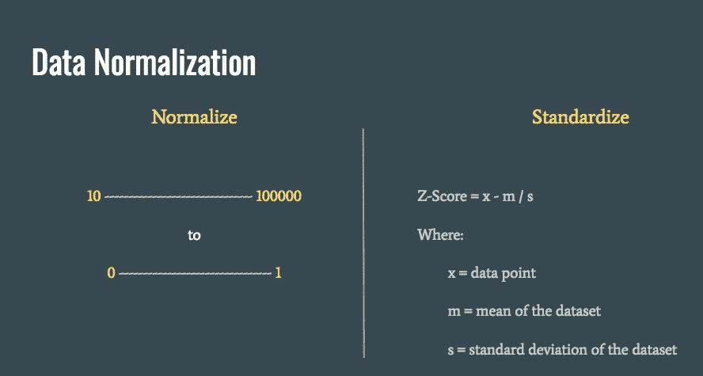*

*继续讨论数据的形式，它可以是以下两种形式:*

*   ***非结构化数据**:图像/图片、音频、视频等。*
*   ***结构化数据**:股票、天气等。*

*当然，由于数据的形式不同，因此网络也应该不同。在逻辑上，我们将讨论处理结构化和非结构化数据的各种不同方法。*

*在本文中，我们将考虑图像数据，因为我们可以在视觉上获得更好的直觉。*

# *感知器与神经网络的形成？*

*一个神经网络可以 ***刻画*** 任何数学函数。重要的词是' ***描绘*** '，因为我们没有明确地编写这样的函数，而是让网络 ***学习*** 一个最适合给定数据集 *的函数。*我再重复一遍，我们并不明确地为一项任务手工制作这些神经元，而是将数据集暴露给它们，让它们(作为一个完整的神经元网络)收敛到一个函数，该函数在这个给定数据集的属性上最适合*。换句话说，**最佳匹配**意味着概括输出，不是硬编码，而是知道输入的属性并预测它们各自最接近的匹配。**

**因此，训练是一个对输入数据集了解越来越多的迭代过程，为此，拥有 ***干净、充足、合适的数据集*** 非常重要，这是关键！**

**感知器是神经网络的基本构建模块，假设我们想要描绘一个数学函数***f(x)= MX+b****，*和计算器***∑(MX+b)***它看起来像下面这样:**

**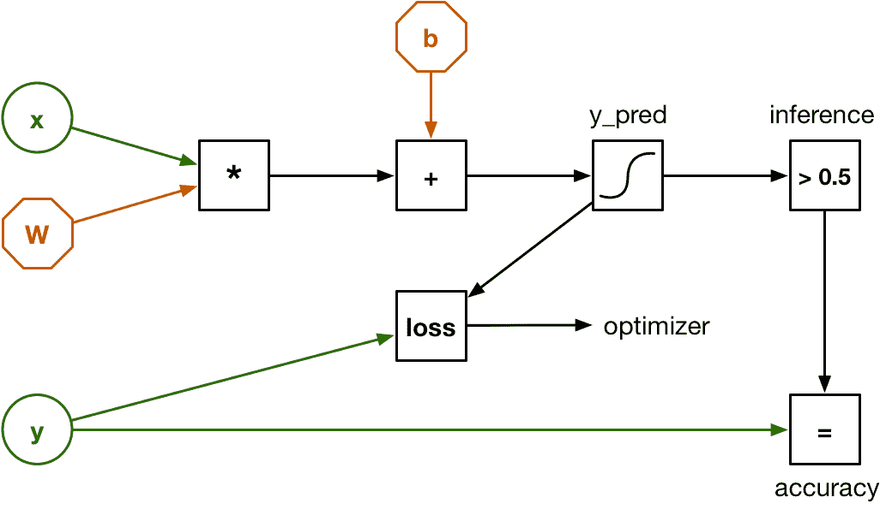**

**感知器—向前和向后传递**

**只是快速回顾一下对迈克尔·尼尔森的书[第四章](http://neuralnetworksanddeeplearning.com/chap4.html)的理解:**

*****【f(x)***是一个线性函数，网络中的每个神经元进行线性运算，有多层叠加，会产生线性输出，即最终产生线性函数。**

> **但是等等！**

**我们说神经网络可以描述包括非线性在内的任何函数，那么这里缺少什么呢？**

> **答案是激活功能**

**激活函数意味着在网络中引入非线性，它们的作用就像迈克尔·尼尔森在第四章中解释的*(没有使用代数)，他使用视觉图形给阶跃函数以直观性，帮助我们理解非线性的概念。例如，Sigmod 或任何激活函数本质上都是非线性的，如果我们应用它们，每个神经元都会产生非线性输出，哇！***

***在这一点上，如果你想回到迈克尔尼尔森给出的那些可视化的例子，将是非常有用和有趣的！***

***因此，我们现在可以认为神经网络可以描述我们喜欢的任何数学函数，即使只有一个隐藏层的神经元也可以构建这样一个复杂的函数，如下所示:***

***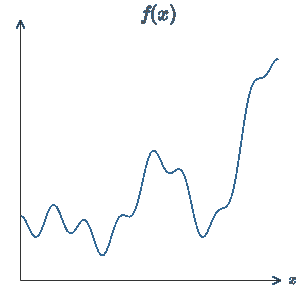***

***让我们从神经网络的角度来考虑线性回归问题。***

*****ŷ** 是我们想要预测的输出，这是一所房子的*最佳价格*，其中:y 轴是价格，x 轴是房子中卧室的数量。这里我们考虑，问题只有一个输入/特征，即“卧室数量”。如果你画出这个问题，它将是图形上的最佳拟合或直线，其中图形上所有数据点的损失是最小的。***

**使用成本函数寻找损失，并使用梯度下降算法收敛到局部最小最优。收敛的整个过程称为反向传递或反向传播。**

# **多重特征**

**上面的房价例子很简单，因为我们只能从一个特征中选择，即多个卧室。但是生活并不总是那么简单，相反，在现实世界中，问题是复杂的，并且有许多相关的特征:**

1.  **卧室数量**
2.  **房子的面积**
3.  **位置**
4.  **预算**
5.  **公共交通**
6.  **学校**
7.  **房子里的便利设施(这些可以分解成单独的功能)**
8.  **社会福利设施等。**

**因此，如果你画一个上述问题的计算图，它看起来会像下面这样:**

**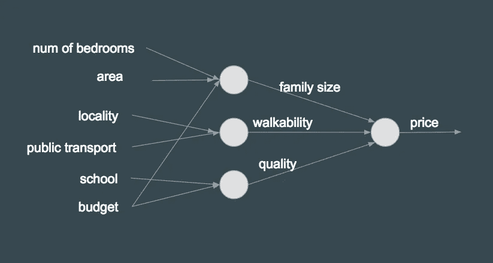**

**正如您在上面看到的，链接/连接是基于关系的，而在神经网络中，所有节点都连接到它之前和之后的所有其他节点，这意味着它是完全网状的网络(逐层)。随着输入/特征数量的增加，函数变得更加复杂，这对神经网络来说更好。这本质上表明， ***让神经网络在它的节点*** 中找到可能的最佳关系，而不是人工设计它，因此所有的节点都在具有其对等层的全网状网络中，看起来像下面这样:**

**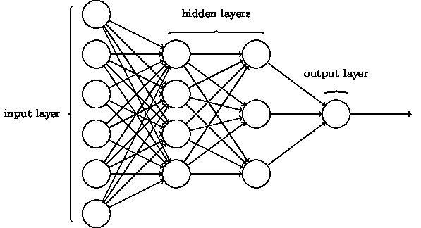**

**这将使每个隐藏层神经元的方程看起来像下面这样:**

```
**z = (w¹x¹ + w²x² + w³x³ + w⁴x⁴ + w⁵x⁵ + w⁶x⁶) + bα = σ(z)where:
x¹ - Number of bedrooms
x² - Area
x³ - Locality
x⁴ - Public transport
x⁵ - School
x⁶ - Budget**
```

**有了多个特征，网络的维数增加，为了形象化它，考虑一个多维结构，否则它与单输入网络相同。**

**在这里，每个特征将具有其自己的局部最小值，并且将学习特定的特征，并且在网络的末端，所有这样的特征被收集在一起，在称为全连接层的东西中，以预测类别。深度学习以学习图像中的多个特征而不是一个特征而闻名。**

**例子:看下面的图片，深度学习应该能够讲述一个故事或至少一个句子，类似于**

> **“两个骑自行车的孩子，停下自行车与某人分享微笑”**

****

**否则，我们会孤立地识别物体，比如:**自行车**或**男孩**。**

**培训是一项练习，我们在其中执行一些重要的操作:**

1.  **用输入数据集训练系统。**
2.  **用结果验证输入数据，并找出与预期值的差值或偏差，称为损失/误差。**
3.  **用已知的损失，弥补差距。这也被称为反向传播(又名**反向传播**)和“*神经网络的心脏*”。**

**上述步骤循环进行，直到网络学习到最大精度，并且损耗最小。这需要时间和学习周期。这就像一个蹒跚学步的孩子在多次尝试失败后学会了走路。**

## **学习网络的类型**

1.  **被监督的*(跟老师学)***
2.  **强化*(有限反馈学习)***
3.  **无人监督*(无帮助学习)***

# **CNN 简介**

**卷积是从输入数据中提取信息的一种方式。卷积神经网络用于图像澄清，有各种最先进的架构，但我们将讨论一般的 CNN。**

**这是一种监督学习，训练数据被标记。这样做的方法是将一个特定对象的所有图像保存在一个目录中，并为其命名，该名称成为该对象的类/类别。例如:“猫”和“狗”图像保存在两个不同的目录中。名为“猫”的目录将包含所有猫的图片，同样，名为“狗”的目录将包含所有“狗”的图片。在图像分类的情况下，这些标签通常被称为类或类别。**

**CNN 有三大层:**

1.  **卷积层(conv)**
2.  **汇集层(池)**
3.  **全连接层**

**我们将在创建网络时逐一介绍这些内容。**

# **什么是卷积？**

**这个[例子](http://setosa.io/ev/image-kernels/)解释了一切。**

**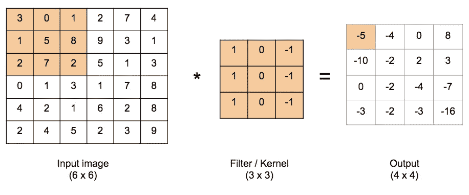**

**单通道图像上的卷积**

**输入图像是我们想要找到特征的图像，在这种情况下，这是灰度(二维)图像，因此具有单通道。卷积从左上角开始，向右滑动一步，直到到达图像中的最后一个像素，向下移动一个像素，然后从左侧开始，依此类推。示例:输入图像上的彩色部分和过滤器卷积产生以下结果*(3 * 1+0 * 0+1 *-1+1 * 1+5 * 0+8 *-1+2 * 1+7 * 0+2 *-1)=-5***

**同样，我们向右移动一步，执行*(0 * 1+1 * 0+2 *-1+5 * 1+8 * 0+9 *-1+7 * 1+2 * 0+5 *-1)=-4***

**如上所述，结果存储在输出图像中。**

**RGB 有三个通道，如下所示:**

**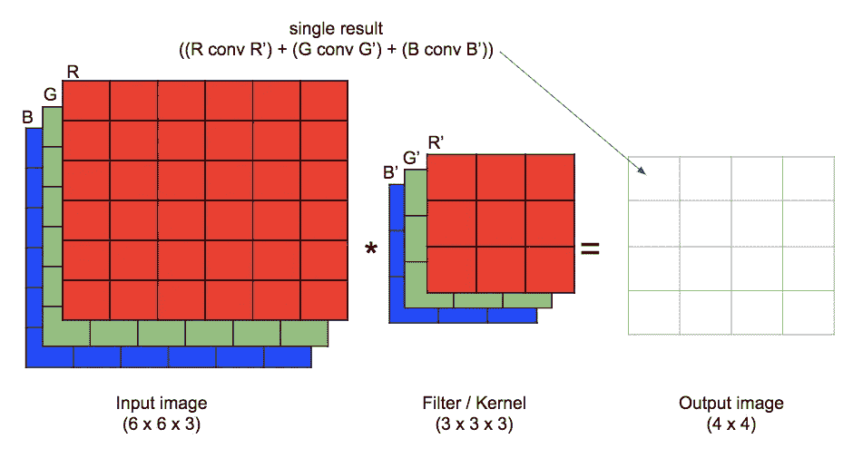**

**RGB(三通道)图像上的卷积**

**在 RGB 的情况下，每个红色滤光器与红色图像卷积，绿色滤光器与绿色图像卷积，蓝色滤光器与蓝色图像卷积，并且将它们的结果相加到输出图像。**

> **到目前为止，它非常简单，但是让我们增加上面操作的复杂性。**

****如何得到输出图像的尺寸？****

```
****(n — f + 1) x (n — f + 1)**Where: 
n x n = dimension of input image
f x f = dimension of filterand therefore, if we apply this to the above grey scale example:(6 - 3 + 1) x (6 - 3 + 1) ==> (4 x 4) matrix**
```

**同样的公式也可以应用于 RGB 图像，只是 RGB 有通道，但我们看的是尺寸(即高度和宽度，而不是通道)。**

## **有两个主要问题——图像卷积**

1.  ****图像在维度上缩小**:一个 6x6 的输入矩阵变成了 4x4，其中内部像素比外部像素经常被触摸一次。因此，与内部像素相比，边界像素的影响不会太大。**
2.  ****信息丢失**:丢弃图像边缘的大量信息。同样，与内部像素相比，它们的影响较小。**

**解决方法是**垫高！****

**通过添加额外的边框来填充输入图像，这将保持与没有填充时相同的尺寸。**

**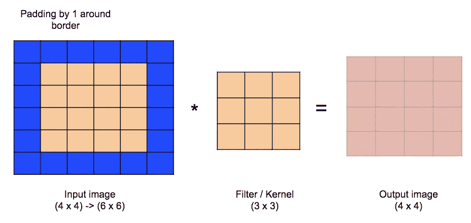**

**输入图像上的填充**

**正如我们所看到的，填充将保持输出图像与输入图像相同的尺寸。现在尺寸公式变为:**

```
****(n + 2p — f + 1) x (n + 2p — f + 1)**Where: 
n x n = dimension of input image
f x f = dimension of filter
p     = paddingLet us say, **Input Image Dimensions = Output Image Dimensions**n + 2p -f + 1 = n
p = (f - 1) / 2So, if filter is **(3 x 3)**, padding = (3 - 1) / 2 = **1**if filter is **(5 x 5)**, padding = (5 - 1) / 2 = **2****
```

# **步幅卷积**

**还有另一种用于减小图像尺寸的重要技术，叫做步幅**

**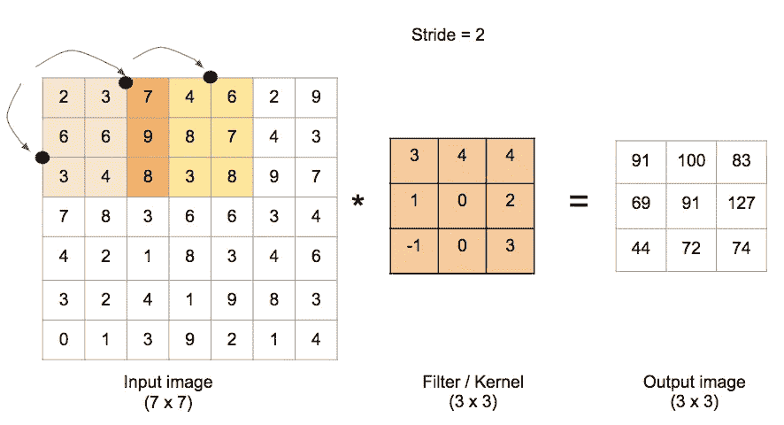**

**输入图像上的步幅**

**当像素与另一个相邻像素有很强的相关性时，减小输出图像的大小是非常合理的。但小心这可能导致信息丢失，那意味着更大的步幅将导致更大的损失。但是我们将很快看到何时更恰当地使用 stride 是有意义。现在，只需理解卷积和步幅的概念。**

**随着跨步的到来，输出图像的尺寸变为:**

```
****(n + 2p — f)           (n + 2p — f)
 ---------- + 1    x    ---------- + 1
      s                   s**Where: 
n x n = dimension of input image
f x f = dimension of filter
p     = padding
s     = stride**
```

# **单层网络**

**这就是单层卷积网络(嗯！它还不是网络，而只是一个层)看起来像:**

**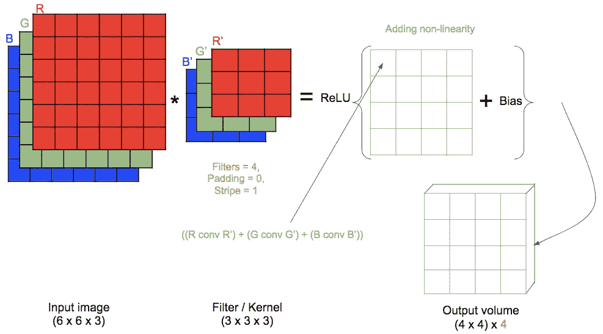**

**CNN 中的单卷积层**

**我们有 3 个 RGB 通道的(6×6)输入图像，这意味着我们将需要 3 个通道滤波器，在这种情况下，滤波器尺寸为(3×3)。输入图像没有任何填充，卷积运算的步长为 1。将有 4 个这样的(3×3)滤波器将与输入图像进行卷积，每个滤波器输出的结果将与偏差相加(图像中的每个像素将与偏差相加),并且 ReLU 非线性将应用于结果图像。每 4 个处理后的输出图像的最终结果将被连接以形成'**体积'**,我们称之为输出体积。**

**该层中的参数数量=((滤波器的尺寸*通道的数量)+偏差)*滤波器的数量)**

**在我们的例子中，**

***参数= ((3 *3 *3)+ 1) *4)= 112***

**此时，你的脑海中会有很多疑问，如果没有，请再次经历这个过程:**

*****谁用什么值初始化滤镜？*****

**重要的是要理解，这些是我们试图训练的权重，以便我们的系统预测正确的输出，但如果权重初始化为零或任何特定的整数，那么所有神经元都将得到相同的结果，这是不希望的，需要打破这种情况。因此解决方案是权重的随机分布，因此网络将考虑克服随机性计算成本，并在梯度下降期间解决它。我强烈推荐写得很好的[答案](https://stats.stackexchange.com/questions/200513/how-to-initialize-the-elements-of-the-filter-matrix)。**

*****这些参数是什么？*****

**同样，这些是我们正在训练和调整的个体权重，最终会学习到。但是，如果你的网络中有太多的参数，就很难训练所有的参数，这意味着你需要大量不同的数据。这是网络被设计得更深以减少整个网络中的参数的原因之一。还有其他各种各样的原因，比如:大规模分类需要深度网络，但我们不讨论这个。我们关心的是可训练参数，这些是重量。这些权重在反向传播期间被更新和调整。**

**现在，这是什么反向传播？**

**又名反向传播，是神经网络的核心。假设使用单个训练数据输入，我们获取网络的输出，通过与我们想要获得的输出进行比较来找到误差，在每个节点找到偏导数(对于权重和偏差),并将其推回到网络中，直到最后一个节点。这更像是一次为单个示例数据调整多个旋钮。下面的视频很好地解释了这一点。**

**在这一点上，我们结束了这一部分，在下一部分中，我们将从头开始制作网络，这也基本上意味着我们将从此开始玩代码。**

## **民众**

1.  **视觉[演示](https://youtu.be/Oqm9vsf_hvU?t=267)由*奥塔维奥好。***
2.  **Excel [演示](https://github.com/fastai/fastai/blob/master/courses/dl1/excel/layers_example.xlsx)(下载该文件并在 excel/Google-spreeds sheets 中打开)作者*杰瑞米·霍华德***

****你可以在|**[**LinkedIn**](https://www.linkedin.com/in/mdeore/)**|**[**网站**](https://tomdeore.wixsite.com/epoch)**|**[**Github**](https://github.com/milinddeore)**|****