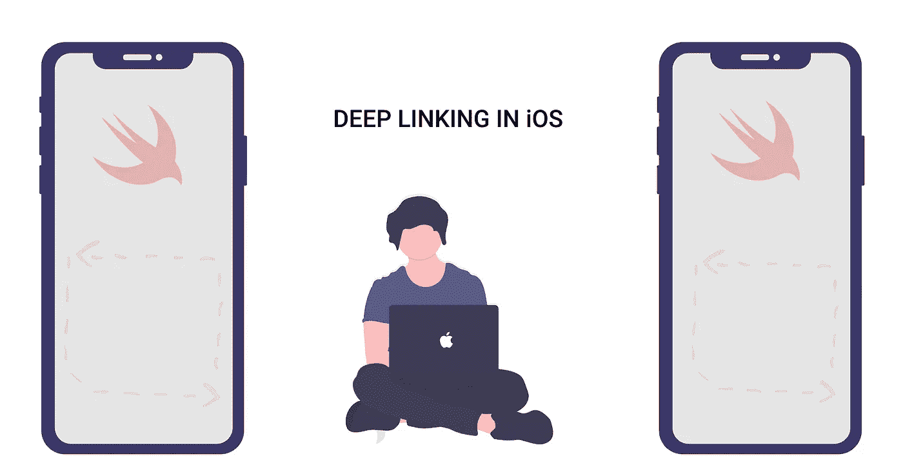
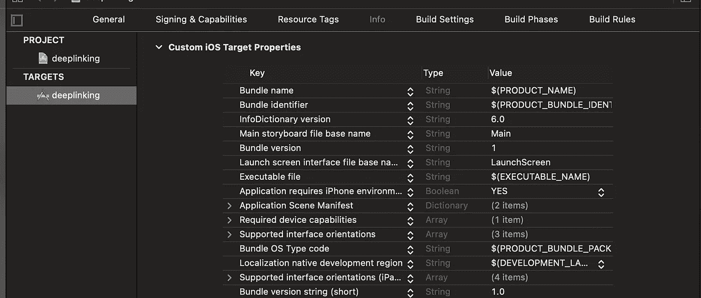
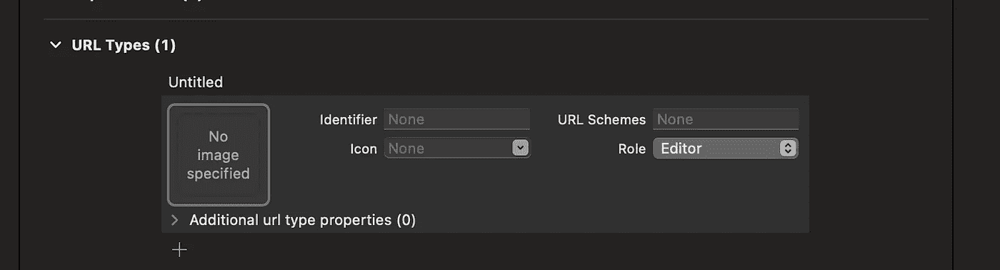
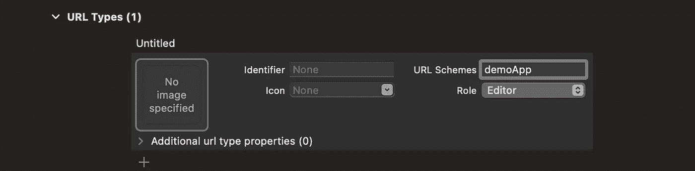

# 使用 URL 方案在 iOS 中进行深度链接

> 原文：<https://blog.devgenius.io/deep-linking-in-ios-f5bfa2959d0a?source=collection_archive---------1----------------------->

## 打开应用程序的链接



# iOS 中的深度链接是什么？

深度链接是使用语义链接来引导用户访问应用程序中的特定内容。

# 如何在 iOS 中实现深度链接？

我们可以通过两种方式实现

*   URL 方案
*   通用链接

在这个博客中，我们将看到关于 URL 方案。

# 为什么要 URL 方案？

*   很简单
*   这不需要额外的后端

## 骗局

*   在打开应用程序之前将总是询问许可(使用链接)
*   将无法在其他平台(Android)和应用程序未安装时工作

# 执行

步骤 1:项目设置->信息



第二步:在“*中添加 URL 类型*



在 URL 方案中，给出您想要的名称



第三步:测试地点

只需运行你的应用，进入 safari，输入`**demoApp://**` 你的应用就会打开。

好了，现在，如何在应用程序中重定向用户。

简单，像这个`**demoApp://page=mainpage**`或者`**demoApp://page=ThatPageYouWant**`

第四步:

在此之前，转到`sceneDelegate`并键入`url`将获得此功能

```
**func** scene(**_** scene: UIScene, openURLContexts URLContexts: Set<UIOpenURLContext>) {}
```

现在试试`print(URLContexts.first.url)`你可以使用你在 safari 中输入的网址。

```
**if** **let** url = URLContexts.first?.url {**let** urlString = url.absoluteString**let** component = urlString.components(separatedBy: "=")
}
```

第五步:现在使用 if 条件并移动到你想要的页面。

感谢我

நன்றி வணக்கம்