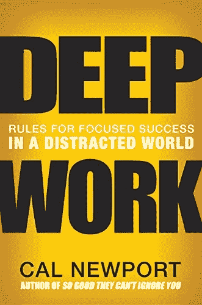

# 技术方面的深度工作

> 原文：<https://blog.devgenius.io/deep-work-in-tech-4eb4cdae3a3e?source=collection_archive---------14----------------------->

“深层”代码的表示

# 技术方面的深度工作

我最近完成了一本书，作者是卡尔·纽波特，书名是《深度工作》。这是一本很棒的书，我推荐你去读。然而，它也非常以学生、教授和知识工作者为中心。对于程序员和从事技术工作的人来说，有一些例子和用例。然而，这本书的大部分是写给其他类型的人的。因此，为了弥补这一点，我将写下我是如何在生活中实现深度工作的，以及我认为它在哪里适合科技世界。

这本书我绝对没有写，但你应该看看。

如果你没有读过《深度工作》这本书，我将快速总结一下什么是深度和浅层工作。深度工作是一种令人满足的、精神上困难的工作，会把你推向极限。而浅薄的工作是很容易被复制并且不是很有成就感的工作。(例如电子邮件。)

在这本书里，有比深/浅作品更多的概念，然而，这是你从这本书里理解我的文章所需要知道的全部。这本书讲述了许多使用深度工作的策略，甚至更多提高你注意力的方法。我个人只会使用其中的一些策略，因为每个人都是不同的，喜欢以不同的方式做事。虽然这篇文章的主要观点是我认为深度工作可以很容易地应用于技术。

我将从比较深度工作和我的编程工作时注意到的第一个问题开始。例如，Cal Newport 根据学习一个主题所需的时间来衡量深度工作的方法。虽然在大多数情况下它是好的，但在科技领域却不那么容易应用。这是因为对有上百个教程的东西进行编程是相当容易的。你只需要复制、粘贴、编辑就可以了。那么，这是否意味着只有最晦涩、最突破界限的项目才能有深度呢？当然不是。我认为我们所要做的就是将我们的视野转移到程序员旅程的不同部分。收集经验和理解编程背后的基本概念的部分。虽然对以前做过数千次的事情进行编码，但这本身可能不是一项深入的工作。它所收集的思想和经验是。请注意，这主要只适用于软件技术，而不适用于电子技术。

我在网上看到很多建议，说只是使用别人的程序来运行你的项目，从商业角度来看，这可能是有意义的。然而，从深层的工作角度或个人成长角度来看，突然之间，从零开始建立几乎所有的东西变得更有意义了。当你为自己做东西时，你会更好地理解它，从而从中获得经验。这让你成长并理解深层的概念，有希望将你引向深度工作和脑力劳动的项目。

我决定只把书中的一些概念运用到我的生活和职业中。我做到这一点的主要方法是按照书中的建议，留出更多的时间来集中注意力。不过，我也开始更多地了解我正在使用的代码，而不是过度使用的复制和粘贴方法。不是说不工作。我只是借用一本非常流行的书来说:理解你的代码。当做一个项目时，复制不属于你的或者你不理解的代码是可以的，这是学习的一部分。只要确保当一天结束，你的项目完成时，你理解了大部分代码，如果不是全部的话。否则它就是你的吗？当然，也许你把它放在一起并修改它，但如果你不理解它，你所做的只是建立一个乐高积木。如果你做的是程序员，那你还是程序员。虽然在我看来，不是很好。

我知道了解你的代码的一切听起来令人畏惧。如果不是令人望而生畏，那肯定是非常耗时和累人的。我只是最近才开始这样做。但是我保证，当你理解了代码的所有方面时，继续下一个项目会感觉好很多，你会学到更多。

你在学习你的代码

总而言之，技术本身并不总是深奥的。事实上，一个初学程序员开始的很多工作都是肤浅的。但是只要你理解你的代码并且学习。随着时间的推移和大量的努力，它可以成为各种雪球。如书所述，一个深层次概念的雪球，导致真正令人满意的事情。

我们暂时换个话题。在这篇文章的大部分时间里，我观察深层工作的方式是相当简单的。虽然在卡尔·纽波特的书中，它经历了许多变化和变异。另一种看待深度工作的方式就是专注和集中的能力。当深度工作像这样被指定时，它甚至更容易应用于技术行业和编程。