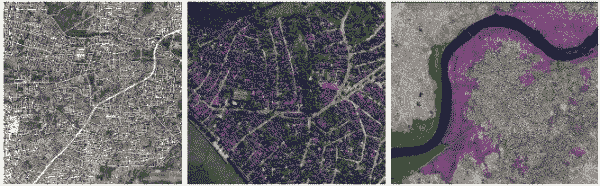
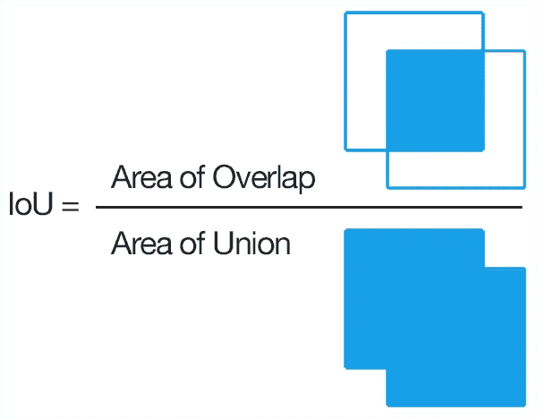
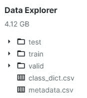
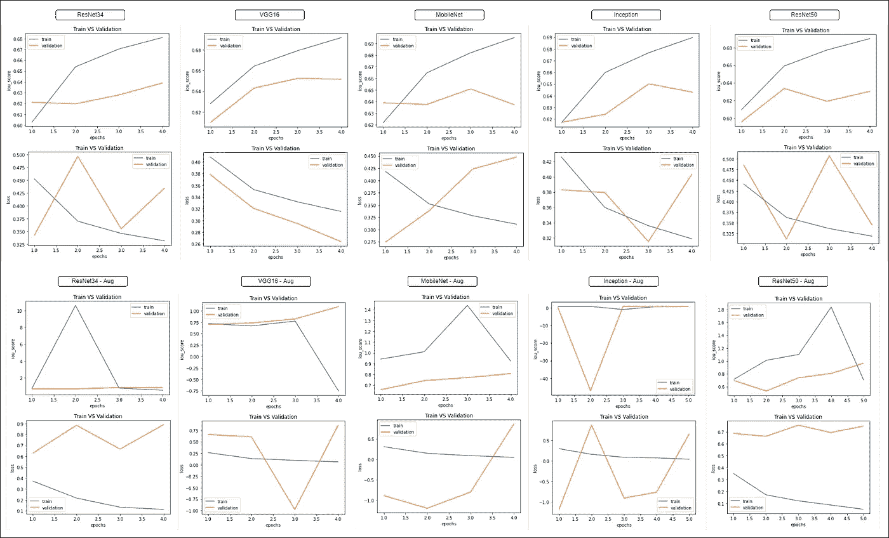
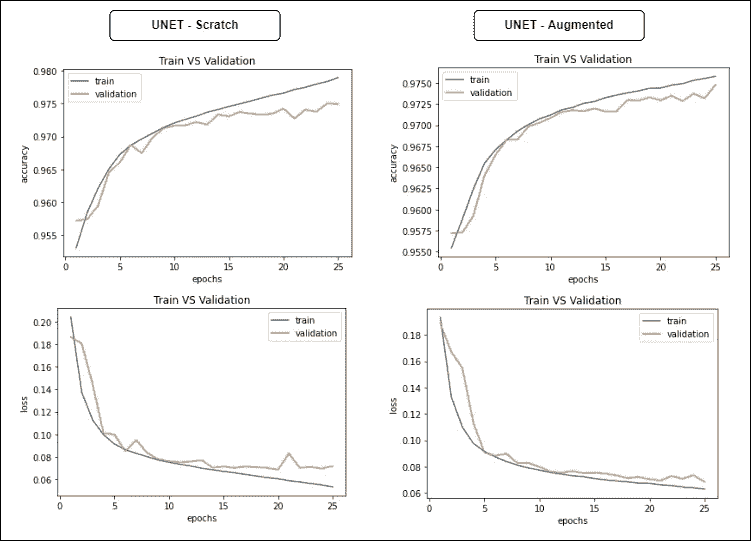
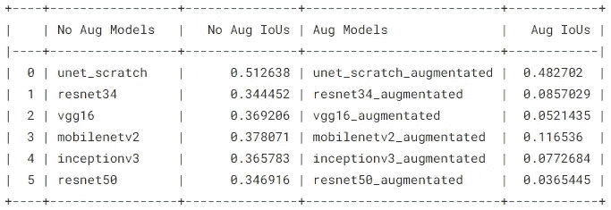
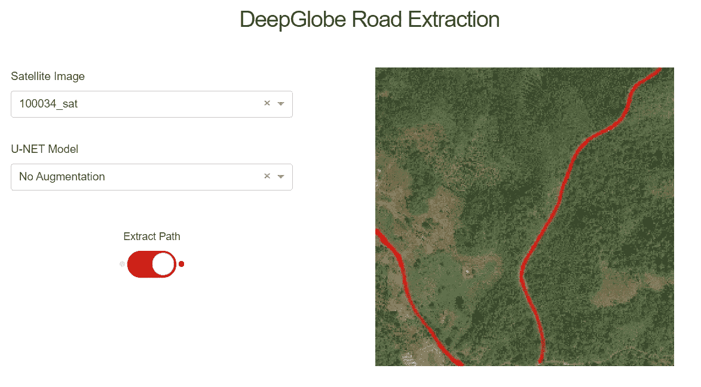

# DeepGlobe 道路提取—挑战

> 原文：<https://blog.devgenius.io/deepglobe-road-extraction-challenge-1ae101966d24?source=collection_archive---------4----------------------->

端到端深度学习案例研究

Jaromír Kavan 在 [Unsplash](https://unsplash.com?utm_source=medium&utm_medium=referral) 上拍摄的照片

# 介绍

地球科学和遥感学会是学习和贡献地理空间科学的知名社区之一，它赞助了 2018 年的 DeepGlobe 机器视觉挑战赛，其中包括对地球卫星图像的深度分析。

三大挑战是-

*   道路提取
*   建筑物检测
*   土地覆盖分类

作为其中的一部分，我提出了道路提取的问题，因为道路在交通运输、交通管理、城市规划、道路监控、GPS 导航等各个方面都是至关重要的部分。

> DeepGlobe 的挑战纯粹是基于研究的，专注于真正的问题。

# DL 问题公式

## 数据概述

1.  来源→[https://competitions.codalab.org/competitions/18467](https://competitions.codalab.org/competitions/18467)
2.  总的来说，我们有`14796`张图片。其中

*   `6226` →训练卫星图像
*   `6226` →训练掩模图像
*   `1243` →验证卫星图像
*   `1101` →测试卫星图像

3.验证和测试数据集不包含各自的掩模图像。这是我们需要预测的事情。

## 问题类型

1.  如果我们观察面具，有`2`类。因此，这是一个二值图像分割任务。
2.  这个任务是一个计算机视觉任务，其中我们正在处理图像(卫星图像)。

## 绩效指标

因为这是一个图像分割任务，我们坚持的标准是-

1.  **IoU** 得分——预测分割和基础事实之间的重叠面积除以预测分割和基础事实之间的联合面积。

*   `0` **IoU** 表示预测分割和地面实况之间没有重叠。
*   `1` **IoU** 表示预测分割和地面真实完全相同。

2.**准确度** —它是正确预测与输入样本总数的比率。这里的一个警告是，我们需要有相同数量的类来考虑这个度量。

来源→[pyimagesearch.com](https://jovian.ai/outlink?url=http%3A%2F%2Fpyimagesearch.com)

## 数据下载

1.  数据集内存消耗在`4GB`左右。我们可以通过使用 Kaggle APIs 或 CURL WGET chrome 扩展来轻松下载这个数据集，与常规下载相比，这需要更少的时间。
2.  为了方便，我已经把它下载到我的系统里了。提取文件后的数据结构如下。

作者图片

3.`metadata.csv`文件包含所有训练、验证和测试集的图像路径。

# 探索性数据分析

1.  原来，每个图像的大小是`(1024, 1024)`。如果我们考虑这个尺寸来训练模型，它将会有更多可训练的参数。我们需要确保图像尺寸小，并且具有一致性。
2.  还提到一些训练掩模不是二进制图像。二进制图像是像素为`0`或`255`的图像。为了保持一致性，我们需要在`OpenCV`包的帮助下对训练掩码进行二值化。

## 二值化

想了解更多关于图像二值化的知识，可以随时查看我的[博客](https://msameeruddin.hashnode.dev/binarization-of-image-using-numpy)。

输出如下。

## 图像大小调整

我们想要的图像的理想形状是`(256, 256)`。我们需要调整训练集、验证集和测试集中所有图像的大小。

> 一些从业者也认为图像的形状是`(128, 128)`。

## 训练图像

让我们设想一个训练数据的样本，它包括卫星图像及其各自的掩模图像。

通过观察这个样本数据，我们可以知道这个任务仅限于提取清晰可见的较大路径。

## 验证图像

如果有验证蒙版图像就更好了，这样就可以更容易地跟踪模型的性能。不幸的是，我们没有得到掩模图像的验证数据。

> 为了补贴这个问题，我们可以把训练数据的`1%`作为验证，训练模型。

这个样本集混合了较大的路径和较细的路径。

## 测试图像

测试数据集不包含目标或掩模图像。这是我们需要预测的事情。让我们同样想象一下。

这个样本集混合了较大的路径和较细的路径。

> 这结束了我们的 EDA。不过，如果你想知道所有代码的完整细节，你可以查看我在 Jovian 平台上托管的[笔记本](https://jovian.ai/msameeruddin/00-cs2-basic-eda)。

# 迁移学习

迁移学习是 ML 和 DL 问题的一部分，其中在解决一个问题时训练的模型知识被存储，并进一步用于解决另一个非常相似的问题。

迁移学习的主要优点是我们不必从头开始训练模型，而是使用预先训练好的模型。Google 的 Tensorflow 是一个用于实现深度学习模型的便捷库。它还包括各种预先训练的模型，这些模型可以通过对模型架构的轻微调整来解决任何问题陈述。

我们把这个建模(迁移学习)部分分成`2`个方面。

*   [没有增强](https://jovian.ai/msameeruddin/01-cs2-modeling-main#C11)
*   [增强](https://jovian.ai/msameeruddin/01-cs2-modeling-main#C75)

## 没有增加

**ResNet34**

下面的输出是验证数据预测。最右边的图像是预测遮罩，我们可以观察到，对于那些包含较大路径的图像，模型能够提取路径，但效率不如所需。

下面的输出是测试数据预测。右边的图像是预测遮罩。通常，该模型只识别较大的路径，而不识别较细的路径。我们还可以看到一些已经被预测的不完整路径。

**VGG16**

下面的输出是验证数据预测。最右边的图像是预测掩码，我们可以观察到其性能与之前的(`ResNet34`)模型非常相似。有灌木覆盖的路径的复杂模式无法正确识别。

下面的输出是测试数据预测。右边的图像是预测遮罩。通常，该模型只识别较大的路径，而不识别较细的路径。我们还可以看到一些已经被预测的不完整路径。

**移动互联网**

下面的输出是验证数据预测。最右边的图像是预测遮罩，我们可以观察到，对于那些包含较大路径的图像，模型能够提取路径，但效率不如所需。

下面的输出是测试数据预测。右边的图像是预测遮罩。与上述以前的型号相比，这种型号的性能没有达到标准。

**盗梦空间**

下面的输出是验证数据预测。最右边的图像是预测遮罩，我们可以观察到，对于那些包含较大路径的图像，模型能够提取路径，但效率不如所需。

对于复杂的模式，该模型表现不佳。但它在识别清晰的较薄图案方面做得很好。

下面的输出是测试数据预测。右边的图像是预测遮罩。对于某些模式来说，它做得很好，这是无法通过`ResNet34`或`VGG16`识别的。

**ResNet50**

下面的输出是验证数据预测。最右边的图像是预测遮罩。它只能提取看起来非常清晰的较大路径。

测试数据预测。

## 增大

> 我通过稍微增加数据来训练相同的模型列表。结果没有达到标准。

## 模型性能

1.  比较结果以选择最佳模型。
2.  与原始数据(没有增加)相比，增加数据的结果不太好。显然，通过检查各种型号的性能，可以注意到这一点。
3.  事实上，为扩充数据获得的掩码不如为原始(无扩充)数据获得的掩码清晰。
4.  因此，考虑已经在扩充数据上训练的模型不是有效的决定。
5.  现在剩下的唯一选择是从已经根据原始(无增强)数据训练的其他模型中选择最佳模型。
6.  以上所有型号中最好的型号是`ResNet34`、`VGG16`和`Inception`。

> 请随意查看我的[笔记本](https://jovian.ai/msameeruddin/01-cs2-modeling-main)上托管在 Jovian 平台上的迁移学习。

# u 网模型

除了实现迁移学习模型之外，我还希望通过实现一种著名的深度学习算法来交叉检查性能，这种算法称为 U-NET，主要用于图像分割任务。

图片来自互联网

U-NET 模型的性能明显优于迁移学习。像往常一样，我们将这分为`2`个方面。

*   [无增强](https://jovian.ai/msameeruddin/02-cs2-unet-scratch#C10)
*   [增强](https://jovian.ai/msameeruddin/02-cs2-unet-scratch#C26)

## 没有增加

下面的输出是验证数据预测。最右边的图像是预测遮罩，我们可以观察到该模型能够提取大多数路径(包括较细的路径)。

甚至在原始掩模中没有被突出显示的路径，仍然在该模型的帮助下被识别。

测试数据预测。

## 增大

在数据扩充的情况下，模型仍然表现最佳。扩增有助于识别复杂的模式。验证预测的结果如下所示。

测试数据预测。

## 模型性能

1.  以上是从零开始开发的 U-NET 模型得到的结果。
2.  左边的图像对应于根据原始(无增强)数据训练的模型的结果。
3.  右侧图像对应于根据原始(扩充)数据训练的模型的结果。
4.  显然，通过观察这些图表，我们可以说左边的图(模型)与右边的图(模型)相比有轻微的过度拟合。虽然，这种差别似乎可以忽略不计。
5.  我个人认为，根据增强数据训练的模型确实显示了一些更接近的预测。这是我们在错误分析的过程中应该观察到的。

> 请随意检查我的[笔记本](https://jovian.ai/msameeruddin/02-cs2-unet-scratch)上的木星平台托管的 U-NET 建模。

# 误差分析

误差分析非常有助于(在我们有多个模型的情况下)决定哪个模型是最好的，哪个不是。在这个阶段，我们可以知道应该如何改进模型或数据集。

总的来说，我们有`6`个模型已经在扩充数据和非扩充数据上进行了训练。IoU 分数是我们考虑的性能指标。根据我的观察，基于非增强数据训练的 U-NET 恰好是最好的模型，因为它具有最高的 IoU 得分。

作者图片

必须对样本数据进行误差分析。但是如果你有时间和有效的系统需求，你也可以考虑整个数据集。对于这个分析，我只考虑了`100`个随机图像。

> 请随意查看我的[笔记本](https://jovian.ai/msameeruddin/03-cs2-error-analysis)，获取 Jovian 平台上的深度错误分析。

# 单幅图像分割

作为其中的一部分，我们需要在传递单幅卫星图像时提取道路路径作为模型的输入。这在现实场景中很重要，因为我们通常不会将整个测试集传递给模型。与其获取预测掩膜，不如在卫星图像本身上高亮显示道路路径。我们可以用任何颜色来突出路径。

一旦我们加载了模型，我们总是可以传递一个图像来获取路线。在获得预测掩码后，借助简单的图像处理技术，我们仍然可以保留背景，只突出显示路径。

因此，下面的函数。

## 没有增加

**100034 _ 星期六**

**100393_sat**

## 增大

**100034_sat**

**100393 _ 星期六**

## UI 部件

作者图片

## 视频演示

 [## 深全球道路提取由 msameeruddin | Jovian

### msameeruddin 的笔记本收藏。

jovian.ai](https://jovian.ai/msameeruddin/collections/deep-globe-road-extraction) 

[https://www.linkedin.com/in/mohammed-sameeruddin-596a70133/](https://www.linkedin.com/in/mohammed-sameeruddin-596a70133/)

# 参考

1.  appliedaicourse.com
2.  【youtu.be/GAYJ81M58y8 
3.  [cs.toronto.edu/~urtasun/publications/mattyu..](https://www.cs.toronto.edu/~urtasun/publications/mattyus_etal_iccv17.pdf)
4.  [arxiv.org/pdf/1908.08223.pdf](https://arxiv.org/pdf/1908.08223.pdf)
5.  [kaggle.com/vanvalkenberg/road-maps-from-aer..](https://www.kaggle.com/vanvalkenberg/road-maps-from-aerial-images)
6.  [kaggle.com/balraj98/road-extraction-from-sa..](https://www.kaggle.com/balraj98/road-extraction-from-satellite-images-deeplabv3)

嗯，我这边就这样了。请务必订阅我的时事通讯，以免错过我发布的独家内容的更新。