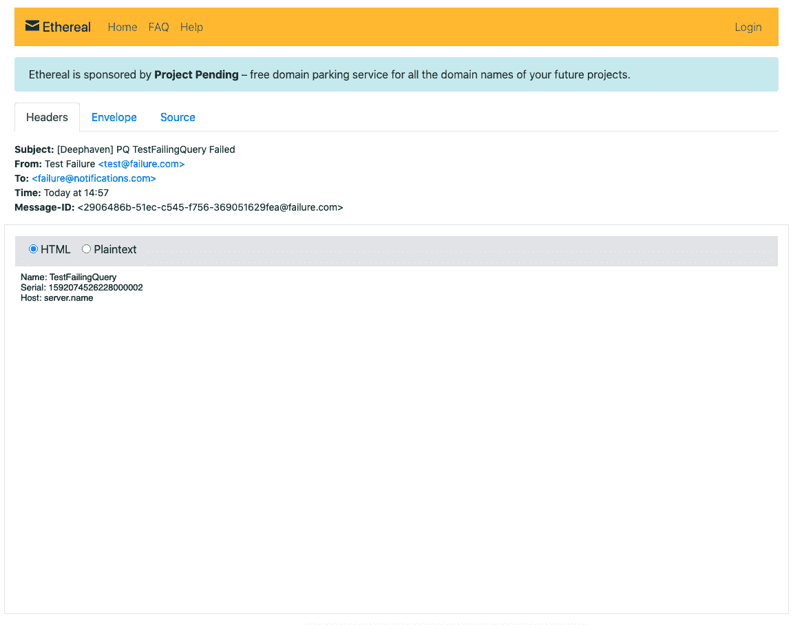

# 使用 Node.js 进行 Deephaven 系统监控

> 原文：<https://blog.devgenius.io/deephaven-system-monitoring-using-node-js-37a928da4ab0?source=collection_archive---------23----------------------->

## 如何设置外部监控和电子邮件提醒

马修·鲁尼恩

在 [Unsplash](https://unsplash.com?utm_source=medium&utm_medium=referral) 上由 [Krsto Jevtic](https://unsplash.com/@krstoj?utm_source=medium&utm_medium=referral) 拍摄的照片

# 为什么要监控持久查询？

Deephaven 的持久查询应该是，顾名思义，持久的。但这并不意味着他们不会犯错。也许更新没有按计划进行，或者您的服务器正在耗尽分配日常查询的资源，或者您的查询耗尽了 RAM。这可能会导致有问题的故障。令人欣慰的是，Deephaven 让故障排除方法触手可及。其中一个选择是使用 OpenAPI 和 Node.js 从外部监控 Deephaven。

监控可以通过 4 个简单的步骤完成:

1.  连接到一个 Deephaven 实例(在这里了解这个)
2.  配置通知服务
3.  倾听失败
4.  向电子邮件、Slack 等发送失败通知。

本文展示了一个如何使用 Deephaven 的 OpenAPI 和 Node.js 来轻松监控持久查询状态并在出现错误或失败时发送警告电子邮件的示例。(当然，您可以设置关于任何事情的警报，比如表更新。)

# 连接到深水港

我们将使用“【Deephaven OpenAPI 和 Node.js 入门”中的基础项目作为起点。请注意，app.js 中的代码使用了服务器位置和凭证的示例值，需要对这些值进行更改以匹配您的身份验证细节。本教程假设您已经有一些想要监控的持久查询。

下面是一些基于连接到深水港的启动代码的示例代码。连接后，它获得通知配置(配置细节)，然后创建我们的故障监视器。

# 配置通知服务

连接到 Deephaven 后，我们需要配置我们的认证服务。对于电子邮件通知，Nodemailer 包([https://nodemailer.com/](https://nodemailer.com/))是一个不错的选择。要使用 Nodemailer，我们必须用我们的电子邮件服务器选项创建一个传输对象。这个传送器可以用来发送信息。

为了简化测试我们的电子邮件(并防止垃圾邮件进入我们的收件箱)，我们将使用 Ethereal 的测试帐户([https://ethereal.email/](https://ethereal.email/))，它很方便地包含在 Nodemailer 中。Ethereal 允许您在浏览器中预览电子邮件，而无需发送电子邮件。如果你想发送真实的电子邮件，那么传送器需要反映你的实际电子邮件服务器配置。

创建节点邮件传输器的代码如下:

# 监听故障

现在我们需要监控我们的持久查询是否失败。每个持久查询可以以几种状态之一存在，包括:

*   收购工人
*   正在初始化
*   运转
*   不成功的
*   错误
*   不连贯的
*   停止

当前状态是查询配置的一部分。方便的是，OpenAPI 提供了一种监听配置更新的方法，配置更新通常是由状态变化触发的。然后，我们可以检查每个配置更新的状态，以查看查询是否已经进入失败状态(“断开”、“错误”或“失败”)之一，并发送通知。

对于本例，我们将创建一个名为“PQAlertMonitor”的类来监视故障并发送通知。在这个类的构造函数中，我们将为持久查询配置更新添加事件侦听器，以便在我们创建该类的实例时立即开始监控。

构造函数代码如下:

如上所述，有三种坏的状态我们想要被通知:“断开”、“错误”和“失败”。我们还需要从配置中收集一些关于查询失败的额外信息，这将有助于故障排除。一些有用的配置属性是**名称**——查询的人类可读名称(例如，“我的查询”)——和**序列号**——一个更有助于在日志中快速定位准确查询的唯一标识符。

检查查询是否处于错误状态的代码如下:

# 发送失败消息

我们监控系统的最后一部分是实际发送信息。我们将只发送一个简单的消息，包含我们的查询、序列号和查询主机的名称。即使有数百个正在运行的持久查询，这些信息也应该足以准确定位您正在查找的查询。(Deephaven 用户可能希望查看我们关于 Deephaven 内部表的文档，例如 QueryPerformanceLog，以了解更多关于查找查询细节以及如何解决其糟糕状态的信息。)

发送电子邮件的代码如下所示:

这些消息可以很容易地与任何其他服务(Slack、SMS 等)一起发送。)通过切换信使对象和相应的功能。我们使用 Ethereal 来轻松预览我们的电子邮件格式，如果需要，可以在不影响收件箱的情况下进行修改。Nodemailer 允许您在 Ethereal 上检索消息的 URL。下面显示了一个消息预览示例。

示例电子邮件

一旦对电子邮件的格式感到满意，就可以更改 Nodemailer 配置，使用实际的电子邮件服务器来代替 Ethereal。

# 包扎

在本文中，我们介绍了如何使用 Node.js 从外部监控 Deephaven 持久查询，以便在出现问题时发送通知。多亏了 Deephaven 的 OpenAPI，代码变得简短、简单和直观。我们现在可以高枕无忧了，因为我们知道任何可能出现的持续查询失败都会被立即报告，并提供足够的详细信息来快速找到日志文件，从而解决问题。

在 GitHub 上查看完整的项目。