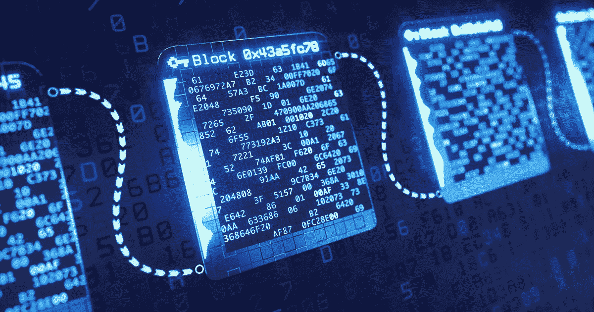

# 区块链技术:深入而简单的解释

> 原文：<https://blog.devgenius.io/deeply-but-simply-explained-blockchain-technology-9c4b48b7318c?source=collection_archive---------10----------------------->

区块链缩略图 by [newalltimehigh](https://newalltimehigh.com/)

这是深入但简单解释系列的第一篇文章。在这个系列中，我们将着眼于一些比较难理解的话题，并找到它们的症结所在。如果你想让我做研究或者写你感兴趣的话题，请告诉我。你会在这篇文章的底部找到我的电子邮件。

以下是我们将在本文中涉及的主题-

1.  **什么是区块链？**
2.  **为什么叫区块链？**
3.  **区块链的设计是为了解决什么问题？**
4.  **区块链是如何工作的？**
5.  **区块链有哪些不同的层？**
6.  **区块链有哪些不同类型？**

让我们开始-

> **简介-**

或多或少，区块链技术正在逐渐重塑数字世界。我可以肯定地说，实际上现在存在的每个行业都将受到这项技术的影响。因此，现在是你应该学习所有关于它的知识的时候了。

区块链无疑是一项复杂的技术，它的许多基本组件都需要解释。事实上，一个新手会发现所有这些都非常吓人。

如果简单而深入地解释，这篇文章将涵盖区块链的特色和使其如此独特的方面。

> **什么是区块链？**

> 一个**区块链**是一个数字存储数据**的概念**。区块链技术是实现**去中心化**的一种全新的创新方式。一言以蔽之，区块链技术是一个解决中心化问题的方案。

这些数据是以块的形式出现的，所以想象一下数字数据块。因为这些块链接在一起，它们的数据**不能被改变**。一个数据块一旦链接到其他数据块，就不能再修改它的数据。任何想再次看到它的人都可以公开获得它，就像它曾经被添加到区块链一样。

想象一系列类似链条的相互连接的砖块。在这种情况下，所有块都将连接到它前面的块和它后面的块。此外，链充当连接结构的表示，其中的每个块都包含某种数据。实际上，密码术将被用于连接每一个单独的块。此外，该链中的每个块将具有加密散列 ID、交易信息和时间戳。

这是相当开创性的，因为它使我们能够跟踪我们可以想象的几乎任何东西，而不用担心有人篡改数据(仅举几个例子:财产权、身份、资金余额和医疗记录)。

> **为什么叫区块链？**

假设我们维护着一个包含多页记录的共享分类账(链)。每一页都以它前面一页的摘要开始。如果您更改了上一页的一部分，您也必须更改当前页上的摘要。所以这些页面是链接在一起的。

在技术术语中，页面被称为块。由于每个块都链接到前一个块的数据，因此我们有一个块链或区块链。

> 很多人认为比特币的神秘发明者中本聪创造了区块链技术。从技术上来说，他只是创造了它的第一个现实实现——**比特币**。“区块链”这个词甚至从未在 Satoshi 的原始白皮书中提到过。他最接近于说区块链是“区块链”。

> **区块链是为了解决什么问题？**

***常规技术-***

在当今世界，我们如何辨别某样东西是假的还是真的？我们有记录，对吗？假设在纸币的情况下。它有一个银行记录的序列号。在驾照的情况下，它在 RTO 印度记录中有驾照号码。

每当你想核实一份文件是合法的，你只需向有关当局查询。我们甚至有公证人，政府授权他们作为证人来证明和记录信息或身份的有效性。

但所有这些机制都有一个共同点:它们都是集中的，这意味着有一个中央机构，无论是银行、国家机关还是有权发布和验证信息的个人。

***这种方法的问题——***

这些中央权力机构拥有很大的权力，如你所知，权力有时可能会导致腐败。那么，如果其中一个权威想要改变事实，甚至稍微改变一下历史，会发生什么呢？中央集权是主要问题。我们需要分散的东西。

权力下放降低了腐败、欺诈和操纵的风险。这就是比特币诞生的原因。这是第一种不需要中央权威的货币形式。它的记录由每个人保存，不仅仅是中央银行。当每个人都在跟踪和核实事实时，这意味着你再也不能在任何事情不合理的时候或者因为更方便而改变交易的分类账。

> **区块链是如何工作的？**

> 问这个问题的另一种方式是——我如何创建一个允许每个人创建、验证和更新记录的系统？

嗯，区块链需要四个要素才能拥有自己的生活。

1.  **对等网络—** 计算机网络，也称为同等特权节点。它对任何人和所有人开放。这基本上是我们今天已经拥有的互联网。我们需要这个网络，以便我们能够远程交流和共享。
2.  **密码术—** 第二个要素是密码术。密码术是在敌对环境中安全通信的艺术。它允许我验证消息，并证明我的消息的真实性，即使当恶意玩家在附近。因为第一个因素，我们需要密码学。记住，我说过任何人都可以参与这个网络——包括坏演员。我可以交流这很好，但我也需要确保我的交流不被改变。
3.  **共识算法/规则—** 第三个要素是共识算法。你可以把技术词“算法”换成“规则”。这意味着我们需要就如何向记录中添加新页面(也称为块)的规则达成一致。共识规则有很多种。但是要运行一个分散的分类账，你需要至少选择一个，否则，在网络中与这么多人达成共识真的很难。
4.  惩罚与奖励- 这一元素确保永远遵守规则符合人们的最佳利益。到目前为止，我们已经建立了一个网络，它有一种安全通信的方式，并遵循一套达成共识的规则。现在，我们将通过奖励帮助我们维护记录和添加新页面的人来将这些元素粘合在一起。这个奖励是一个代币，或者硬币，每次达成共识和一个新的区块加入到我们的链中时奖励它。另一方面，试图欺骗或操纵系统的坏演员最终会失去他们在计算能力上花的钱，或者他们的硬币会被拿走。最后，要记住的重要一点是，惩罚和奖励系统对心理行为起作用。它把系统的规则从你需要遵循的变成你想要遵循的，因为这样做对你最有利。

但是，还有第五元素不能合成。

**市场采用** —我们可以让一个五人小组使用一致的算法共享一个账本，但这不会使它分散，因为没有足够的人成为系统的一部分。此外，如果没有人收养，我们的硬币就没有任何价值，第四个因素惩罚和奖励也不是很有效。只有当用户数量达到临界质量时，区块链才会变得真正去中心化，从而变得不可改变。在那个时候，区块链的硬币通常会开始升值。

> ***让我们把所有东西放在一起……***

区块链使用账本机制来存储所有数据。此外，“事务”是指任何种类的数据交换。区块链不再只是为了数字货币的交换；它现在也可以用于其他类型的数据。网络的用户统称为“节点”，每个用户都会收到一份最新的账本。此外，每个节点使用独特的方法与其他节点通信。从区块链到区块链，制度各不相同。

让我们现在开始概述区块链技术！

用户将首先向网络请求交易。他或她将在这里收到公钥和私钥。但是只有私钥可以被用户用于交易。此外，如果您向收款人汇款，您将需要收款人的公钥来找到他们。

在这两种情况下，都会在请求后生成一个包含所有事务细节的块。整个块被加密以增加安全性。

它将在生成后被广播到网络中的每个节点。根据区块链科技的解释，你需要从其他节点确认你所说的是真的。因此，其他节点使用一致过程来验证数据。确认后，您的区块将被添加到链中。您完成的交易也将同时进行。

理解它的工作原理似乎不再那么困难了，是吗？

> **区块链有哪些不同的层？**

现在让我们讨论区块链技术的各个层次。它由五个主要层组成，我们将在下面详细介绍每一层。

**1。应用层—** 实际上包括应用托管、 **DApps** 、 **DApp 浏览器**、**用户界面**。您可以使用 dApp 浏览器访问分散的应用程序。遗憾的是，Chrome 或 Firefox 等传统浏览器无法浏览分散的应用程序。因此，在这个类似于标准浏览器的浏览器中，您将会遇到完全不同的用户体验。然而，你也可以用它们浏览标准互联网。

接下来，由于应用程序托管，您可以在这一层执行每个分散的应用程序。没有这个组件，任何 DApps 都不能在互联网上运行。自然，托管协议也将是完全分散的。此外，因为没有危险，保持这些托管服务器是完全安全的。

接下来是分散的应用程序。通常这些与今天的应用程序相似，但有一个明显的变化。他们都有一个分散的网络。此外，这些现在非常容易制作。

**2。服务层—** 在应用层之后，这是下一层。您将获得创建和管理 DApps 层的所有必要设备。实际上，所有的基本组件都包含在区块链解释的这一层中。

更具体地说，您将了解治理、**侧链**、**链外计算**、**状态通道**和**数据馈送。**

**数据馈送**是一种可以从所有可靠来源获取最新信息的方法。因此，它将帮助节点获得最新的网络信息。

另一方面，**链外计算**的存在是为了在区块链之外完成计算过程。此外，它鼓励更多的隐私，并从中央网络系统中删除烧毁的组件。这里还提供了一个治理框架。事实上，这些都是自治的，没有人性的组织，可以营造一个公正的环境。

此外，**状态通道**实际上充当两个节点之间的路由。因此，两个节点可以通过状态通道相互通信。

除此之外，在区块链的层中还有其他组件。Oracles、多重签名文档、智能合同、数字资产、钱包、分布式文件系统、数字身份等。是这些的主要例子。

这些都是可选的，因为区块链技术可能有或没有。

**3。语义层——共识技术、虚拟机、各种参与标准**等。都在这一层。

没有**共识算法**区块链网络是不可能的。事实上，一致性算法是保持所有节点一致的基本需求。实际上，这是一个所有节点对分类帐中包含的数据达成共识的过程。

此外，没有人可以开始一笔交易并将其记入分类账。他或她也不可能诚实。因此，所有节点达成共识，以确保块中的数据是合法的。

参与**的先决条件**如下。实际上，这些基本上是网络用来确定谁被允许和谁不被允许使用该系统的准则。此外，该组件主要用于现有的私有区块链系统。

另一方面，**虚拟机**提供了一个安全的环境，在其中可以执行所有的网络功能。它通常在智能合同的执行过程中使用。下一步是侧链，程序员可以访问不同的区块链环境，在不干扰主网络的情况下创建分散的应用程序。

**4。网络层—** 它包括 **Roll your own 机制、RLPx、块交付网络、可信执行环境(TEE)** 等等。

本质上，**可信执行环境(TEE)** 有助于维护设计中的可伸缩性问题。它不仅有助于网络解决这一问题，还加强了网络的安全性。此外，它还有助于将数据存储在主网络之外，以减轻 it 压力。

这些协议通常用于传统协议不能完全适应基础设施的情况。所以你可以更好地适应它，它使你能够改变其他协议。宜用普通的。但有时，标准可能还不够。

**另一方面，RLPx** 是一个网络套件，方便了对等体之间的数据传输。无论如何，它建立了一个用户界面，以方便用户与区块链网络的互动。

最后， **block delivery networks** 是一种为您提供所需网页或材料的网络系统。事实上，通常的互联网架构证明了这一点。

然而，如果您正在开发一个分散的应用程序，您将需要某种交付机制来访问在线资料，不是吗？

**5。基础架构层—** 区块链技术的架构止于这一层。在这个例子中，您可能会遇到挖掘即服务的协议。然而，由于需要过多的电力，采矿业目前正在慢慢消亡。

能够创建任何类型的虚拟资源，包括服务器、网络、存储、操作系统等。是由虚拟化提供的。此外，它在三个不同的层次上运行:硬件、系统和服务器。这一层还包括节点。节点是网络中任何链接的设备。

实际上，没有任何节点就不会有任何区块链技术。网络的分散存储是这一层的另一个惊人的特点。它比以往任何时候都更安全，因为它是分散的。

事实上，令牌也可能出现在这一层。令牌是网络上的自然资产，有助于维护生态系统。

这就是区块链技术的五个层面。

> 区块链有哪些不同的类型？

区块链的类型

> **公共区块链—**

**工作原理—** 公共区块链是第一种区块链技术。这是分布式账本技术(DLT)首次出现的地方，催生了比特币等加密货币。它消除了集中化的缺点，如降低安全性和透明度。

DLT 通过对等网络分发数据，而不是存储在一个位置。由于其分散的性质，必须使用某种形式的认证数据。通过使用共识机制，区块链的用户可以就分类帐的当前状态达成一致。两种流行的共识技术是工作证明(PoW)和利益证明(PoS)。

任何有互联网连接的人都可以加入区块链平台成为授权节点，因为公共区块链是开放的，不需要许可。这个人可以访问最近的和旧的数据，他们可以执行挖掘操作——确认交易并将其添加到分类帐中所必需的复杂计算。在网络上，任何合法的记录或交易都不能被修改，因为源代码通常是开源的，任何人都可以检查交易，寻找错误，并提出修复建议。

**优势—** 公共区块链的一个好处是它们完全独立于组织。只要计算机仍然与它们连接，公共区块链将继续运行，即使推出它的公司倒闭了。

公共区块链还提供了透明网络的好处。只要用户严格遵守安全规定和程序，公共区块链通常是安全的。

**缺点—** 公司不能限制访问或使用，因为网络可能会很迟钝。如果黑客控制了公共区块链网络 51%或更多的处理能力，他们就能够单方面改变该网络。

公共区块链的规模同样很差。随着节点数量的增加，网络速度会变慢。

**用例—** 比特币等加密货币的挖掘和交换是公共区块链最典型的用例。它还可用于对书面证词和财产所有权的公开文件进行电子公证，以创建具有可审计监管链的永久记录。

对于基于开放和信任的组织，如社会支持网络或非政府组织，这种区块链是合适的。由于网络的开放性，私营企业可能希望远离。

> **私有区块链—**

**工作原理—** 私有区块链是在封闭网络等受限环境中运行的区块链网络，或者由单一机构管理的网络。虽然它在点对点连接和分散化方面的功能类似于公共区块链网络，但这个特定的区块链的范围要窄得多。私有区块链通常在公司或组织内部的有限网络上运行，不允许任何人加入并贡献处理能力。他们也被称为商业区块链或特许区块链。

**优势—** 权限级别、安全性、授权和可访问性由治理组织控制。例如，私有区块链网络的建立允许组织控制哪些节点可以查看、贡献或修改数据。此外，它还可以限制外界对某些信息的访问。

公立区块链更像互联网，而私立区块链更像内部网。由于规模限制，私有区块链执行事务的速度可能比公共区块链快得多。

**缺点—** 私立区块链也有缺点，包括有争议的说法，即它们不是真正的区块链，因为区块链的核心理念是去中心化。由于集中的节点决定什么是真实的，因此完全建立对信息的信任也更具挑战性。节点数量少也可能导致安全性降低。如果几个节点行为不稳定，共识过程可能会受到危害。

此外，来自私人区块链的源代码通常是封闭源代码和专有的。它不能被用户独立地审计或验证，这可能导致较差的安全性。在私人区块链，也没有匿名。

**使用案例—** 当区块链需要加密保护，但管理实体由于速度原因不希望数据被普通公众访问时，私有区块链是最佳选择。

例如，企业可能会决定利用区块链技术，而不会将其相对于竞争对手的优势拱手让给外界。私有区块链可用于审计和管理商业秘密。

供应链管理、资产所有权和内部投票是私有区块链的进一步用例。

> **混合区块链—**

**工作原理—** 组织偶尔会采用混合区块链，这是一种区块链技术，包含私有和公共区块链的组件，以实现两全其美。它使企业能够建立一个私有的、基于许可的系统和一个公共的、无许可的系统，使他们能够控制哪些数据可供公众使用以及谁可以访问这些数据。

在混合区块链中，交易和数据通常是私有的，但可以根据需要进行验证，例如通过智能合约授予访问权限。尽管机密信息在网络内部受到保护，但仍可能被验证。混合区块链可能归私人机构所有，但它不能改变交易。

加入混合区块链的个人可以完全访问网络。除非他们进行交易，否则其他用户无法获知该用户的身份。然后另一方知道他们的身份。

**优势—** 由于混合区块链在一个封闭的环境中运行，它的一个主要优势就是外部黑客无法对网络发起 51%的攻击。此外，它保护隐私，同时允许第三方联系。与公共区块链网络相比，它具有更高的可扩展性，并提供快速和廉价的交易。

**缺点—** 这种区块链可以隐藏信息，所以不完全透明。用户参与网络或为网络做贡献的动机很小，升级也很困难。

**用例—** 房地产是混合区块链技术众多引人注目的用例之一。企业可以使用混合区块链来安全地运行系统，同时向公众显示一些信息，如列表。混合区块链可用于简化零售部门以及高度监管行业(如银行业)的程序。

混合区块链可用于存储医疗记录。用户可以使用智能合约访问他们的信息，但任意第三方无法看到这些数据。政府也可以利用它在各种实体之间安全地交流和保存公民数据。

> **财团区块链—**

**运作方式—** 区块链财团由私人和公共区块链元素组成，有时也被称为联合区块链，是区块链的第四种形式。然而，它的不同之处在于分散的网络是由几个组织成员合作使用的。区块链联盟本质上起到私有区块链的作用，限制特定组的访问，消除了仅由一个实体管理私有区块链上的网络所带来的危险。

区块链联盟中的共识过程由预定的节点管理。它有一个执行事务启动、接收和验证的验证器节点。成员节点能够发送或接收事务。

**优势—** 与公共区块链网络相比，区块链财团通常更加可靠、可扩展且高效。它支持访问控制，就像私有和混合区块链一样。

**劣势—** 与区块链相比，区块链财团的透明度较低。如果一个成员节点受到攻击，网络的运行仍可能受到区块链自身规则的阻碍。

**用例—** 这种区块链有两个应用:银行和支付。由许多银行组成的财团可以决定哪些节点将验证交易。希望跟踪食品的组织以及研究机构可以开发一个类似的模型。它非常适合供应链，尤其是那些涉及食品和药品的供应链。

这是四种主要的区块链，尽管还有额外的共识算法需要考虑。

除了 PoW 和 PoS 之外，任何寻求建立网络的人也应该考虑其他种类，这些种类可以在 Wave 和 Burstcoin 等各种平台上访问。举例来说，租用的股权证明使用户能够从挖掘中获利，而节点本身不必进行挖掘。为了给每个用户分配优先级，重要性证明需要平衡和事务。

最终，区块链技术越来越被企业所接受和支持。这些区块链品种都有潜在的用途，可能会提高信任度和透明度，同时也产生更好的交易记录。

> **总结思路:**

在所有的发明中，区块链技术可能是最酷的之一。十年前，我们甚至不知道去中心化的应用是可以想象的。但是现在考虑一下 IT 部门。每个人都在试图找出如何将这个新系统与他们当前的系统结合起来。

实际上，适应新结构并完全取代旧结构需要更多时间。但我有信心，一点也不会不愉快。

本文到此为止。希望你喜欢。你怎么看待区块链？请随意评论你的想法。感谢您的阅读。

本文是一篇了解**区块链技术的入门文章。在下一篇文章中，我们将涵盖区块链技术的所有更深入的领域，例如:不同的共识算法、去中心化、智能合同。**

敬请期待下一期。

如果你想让我为你写一篇文章，请随时通过——itssouravshrivas@gmail.com 联系我，或者在下面留言。