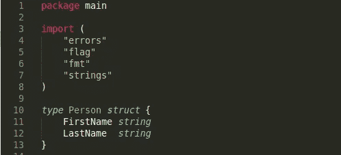

# 在 Go 1.19 中定义自定义命令行标志类型

> 原文：<https://blog.devgenius.io/define-custom-command-line-flag-types-in-go-1-19-e9a9c8838c5f?source=collection_archive---------3----------------------->

命令标志提供了一种设置程序选项的方法。Go 对处理标志有很大的支持。随着 Go 1.19 的发布，Go 标志包中又增加了一个新的内容。标志包现在可以处理自定义结构类型。这意味着程序员可以停止编写代码来后处理命令标志，以实例化自定义结构类型。在这篇文章中，我将详细介绍我实现`encoding.TextUnmarshaler`和`encoding.TextMarshaler`接口的方法。

# 基础知识

首先，我将定义一个名为 Person 的结构类型。该结构将有 2 个字段，这些字段将被命名为`FirstName`和`LastName`。我选择了 2 个字段来演示一个字符串如何填充 2 个 struct 字段。下面是结构定义:

下一步我将添加两个方法来输入 Person。这是为了同时满足`encoding.TextMarshaler`和`encoding.TextUnmarshaler`接口。这将是指定字符串如何成为您的自定义类型，以及您的类型如何成为字符串的区域。以下是我的实现:

在定义`UnmarshalText`时，重要的是返回并寻找错误。在这种情况下，在分割字符串之后，我验证数组长度。如果提供了一个名称，则长度将为 1，导致错误提示两个名称。如果你注意到，p 被称为指针，这是为了确保字段数据被设置持久。既然接口令人满意，那么是时候测试实现了。

# 履行

用自定义类型定义和访问标志非常简单。首先，您需要定义一个期望类型的变量。解析后，该变量还将保存标志数据。下一步是调用`flag.TextVar`。TextVar 函数将定义一个带有自定义数据类型的标志。下面是将标志`person`处理为类型 Person 的实现:

下面是终端上的代码:

在这张 gif 中，我展示了可能的用例。我故意犯了一个错误来显示我之前写的错误消息，并用 flag -h 调用程序来显示生成的文档。

# 结论

标志包是提取用户定义的程序选项的好方法。这也是在编写代码的同时生成命令行文档的好方法。从技术上来说，这一新增功能增加了命令行标志的静态类型。它还使程序员能够定义吸引用户的字符串输入格式。

# 来源

 [## medium _ examples/flag types at main cheikh shift/medium _ examples

### 中型文章的代码示例。在 GitHub 上创建一个帐户，为 cheikhshift/medium_examples 开发做贡献。

github.com](https://github.com/cheikhshift/medium_examples/tree/main/flagtypes)