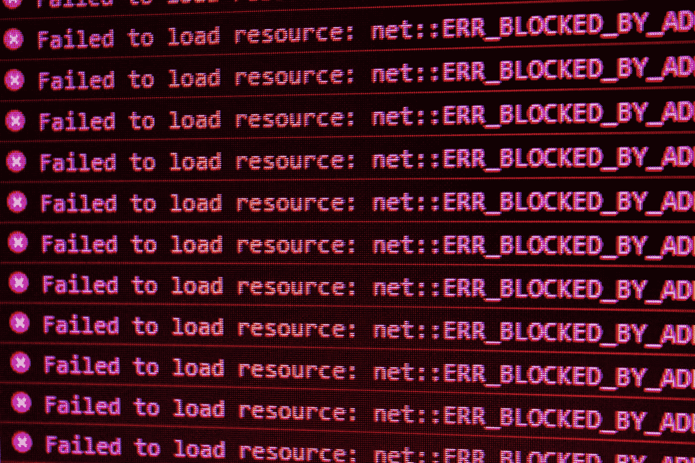

# 为您的服务定义 SLO

> 原文：<https://blog.devgenius.io/defining-slos-for-your-services-4b68af6e09bb?source=collection_archive---------5----------------------->

作为工程团队，我们总是希望量化我们系统的健康状况。在本文中，我们将探讨如何使用 SLO 来度量和维护我们软件系统的健康状况。

# 什么是 SLO？

服务水平目标用于为系统的可用性和弹性分配一个数值。您的系统会根据使用情况、延迟、网络、错误等不断生成数据。，当我们测量和观察它们时，我们可以定义一个成功系统的标准。

> *这些工具不仅仅是有用的抽象。没有它们，您就无法知道您的系统是否可靠、可用甚至有用。如果它们没有明确地与你的业务目标联系起来，那么你就没有关于你所做的选择是帮助还是伤害你的业务的数据。*——[杰伊·贾科维兹·SRE 基础知识:SLIs，SLA 和 SLOs](https://cloud.google.com/blog/products/devops-sre/sre-fundamentals-slis-slas-and-slos)

照片由 [Fotis Fotopoulos](https://unsplash.com/@ffstop?utm_source=medium&utm_medium=referral) 在 [Unsplash](https://unsplash.com?utm_source=medium&utm_medium=referral) 上拍摄

以下是我们作为 Weave 的合作伙伴 DRE 团队发现的一些最佳实践，帮助我们最好地管理新的、现有的和遗留服务的多样化生态系统。

# 预警预算

就像金钱一样，预警预算也是要花出去的。它们与工程师处理和解决由警报引起的问题所花费的时间有关。

> *没有故障的系统，虽然健壮，却变得脆弱不堪。当故障发生时，更有可能的情况是响应团队毫无准备，这可能会极大地增加事故的影响。* ( [数据库可靠性工程，莱恩·坎贝尔&慈善专业](https://www.oreilly.com/library/view/database-reliability-engineering/9781491925935/) s)

当使用 SLO 时，我们需要在假设所有系统都失败的情况下工作，试图实现 100%的正常运行时间是不合理的。相反，我们希望系统以的频率*失败，但是我们希望最小化解决问题的时间，从而最小化停机时间。例如，假设您的预算是每季度停机 10 小时。如果您一周有 5 分钟的停机时间，客户几乎不会注意到差异。如果发生一次 10 小时的停机，您的客户和工程团队将直接受到影响。*

设置错误和警报预算的目的是为了花费。如果我们承诺 99.9%的可用性，那么我们需要在 3 个月内的 2.16 小时内收到警报。这些错误(或警报)向我们展示了可以优化系统和服务的地方，但我们希望以高频率看到它们。与 2.16 小时的单一停机时间相比，3 个月内的 2.16 小时对客户的损害要小得多。

# 配置策略

## Opsgenie 和警报

在 Weave，有四类目标:**临界**、**高**、**高-慢**和**低**。每个类别通过 OpsGenie 发送不同类别的警报。每一类警报都封装了一组不同的预定义目标。一般来说，并不是所有的服务都同样重要，有些服务属于**低**类是可以的。

由[大卫·普帕扎](https://unsplash.com/@dav420?utm_source=medium&utm_medium=referral)在 [Unsplash](https://unsplash.com?utm_source=medium&utm_medium=referral) 上拍摄的照片

这些类别没有行业标准，它们的存在是为了帮助对目标进行简单的默认设置，但我们建立的系统也允许开发人员设置完全自定义的目标或只是调整默认类别。例如，一个团队可能对非即时响应的事件使用一个**低级**警报，并选择创建一个补救单来处理该警报，该警报可以在下一个 sprint 中添加和完成。然后，该团队可以使用 **critical** 类警报来指示整个团队应该停止所有工作并努力解决错误。

## 紧急

SLO 并不总是衡量紧急事件。有时它们被用作潜在事件或未来停机时间的指示器。**临界燃烧速率**警报使用 1h、5m、6h 和 3d 速率。因此，这些数据仅在 6 小时后才有效，高警报仅使用 6 小时和 3 维指标。三天后就有效了。烧钱率也不需要完全客观的窗口来告诉你将会超出你的预算。任何人都可以看到一条线下降，并告诉你它将在 30 天内低于零，而实际上不需要等待 30 天就会发生。您应该使用类别来表示警报的紧急程度和响应时间。

简而言之，**临界烧钱率**警报表明你的预算突然大幅下降。而**高燃烧率警报**表明预算缓慢损失，随着时间的推移，将导致该期间预算剩余< 0%。

## 起始阈值

当使用现有或遗留服务时，您不希望选择您的服务尚未满足的延迟或可用性指标。诀窍在于，我们的警报不仅仅使用 30 天的数据。他们使用多个窗口的组合，并在最长 28 天的窗口内重置。在 Weave，我们的开发人员体验团队创建了 SLO 工具。这些工具旨在发挥作用，防止不可操作、无效或转移注意力的警报。警报过多的团队应该设定较低的目标。我们有多个警报预设是有原因的。*大部分服务大概不应该有* ***临界级别警报*** 。低或高-慢作为起点是完全可以接受的。

不启动 95%的正常运行时间是可以的。在 Weave，我们只有美国的客户，他们主要在白天活动。对我们来说，这意味着低可用性、高延迟和高错误率在非工作时间更容易被接受。随着团队开始采用 SLO，低目标将允许那些团队理解痛点并随着时间调整它们。我们建议在您采用这些警报时，每周或每两周对 SLO、指标和警报进行一次评估。应该注意的是，如果您发现您的警报太低，没有捕获停机时间的实例，您应该提出它们。如果你看到太多的事件，那么降低目标，规划战略计划，解决技术债务，优化你的服务。

# SLO 的好处

## 维护预算

作为工程师，我们不断维护服务。我们有 bug 标签、维护目标、大规模重构和迁移。我们分配了一定数量的工程时间来完成这些任务，我们称之为**维护预算**。有效的 SLO 有助于我们优先考虑关键服务上的关键警报，而不是低流量服务上的低优先级警报，从而优化我们利用维护预算的方式。

## 减少支持电话

> *任何忽视业务目标的系统可用性衡量标准都是毫无价值的，因为它混淆了实际的可用性，导致各种危险的场景、错误的安全感和失败。* - [AJ Ross 和 Adrian Hilton SLOs，SLIs，SLAs，oh my-CRE 生活课程](https://cloud.google.com/blog/products/devops-sre/availability-part-deux-cre-life-lessons)

作为工程团队，我们有工具让我们第一个了解脆弱或制动系统。SLO 来加强我们的基础设施。由于我们致力于有效管理我们的 SLO 并缩短解决关键警报的平均时间，我们的服务所经历的停机时间不会对我们的客户产生大的或持久的影响，从而减少支持电话。

来自吉菲[https://media.giphy.com/media/eImrJKnOmuBDmqXNUj/giphy.gif](https://media.giphy.com/media/eImrJKnOmuBDmqXNUj/giphy.gif)

## 长期可维护性

> *生产的智慧:你从生产中运行的东西中获得的智慧——它实际上如何运行的混乱细节，以及软件实际上应该如何设计，而不是脱离实际情况的服务的白板视图。你得到的所有页面，团队得到的票，等等，都是与现实的直接联系，应该通知更好的系统设计和行为。* ( [SRE 练习册](https://sre.google/workbook/how-sre-relates/#work-to-minimize-toil))

没有人愿意把时间花在单调乏味的工作和维护上。SLOs 的长期目标是自动化维护工作。有了适当的 SLO，我们在维护服务方面变得更加积极主动，我们专注于新产品工作和业务目标，我们尽可能为客户提供最可靠的服务。

## 参考

*   [SLO 视频](https://youtu.be/sfwnr5K8oCs])
*   [谷歌 SRE 图书](https://sre.google/sre-book/service-level-objectives/)
*   [SRE 工作手册](https://sre.google/workbook)