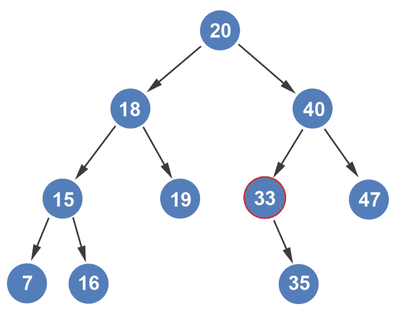
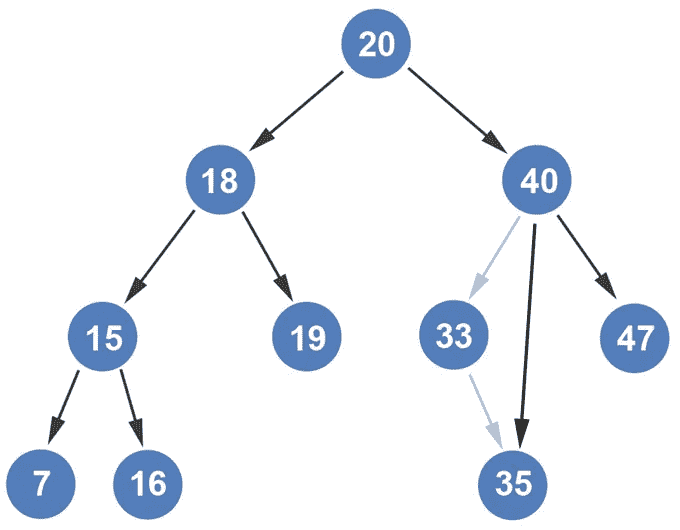
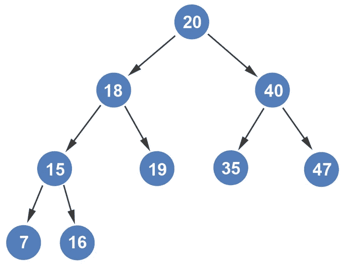

# 从树中删除一个只有一个孩子的节点

> 原文：<https://blog.devgenius.io/deleting-a-node-with-one-child-from-a-tree-visually-explained-9d62543cb974?source=collection_archive---------9----------------------->

听起来确实如此。我们将从只有一个子节点的树中删除一个节点。让我们看看我们的树，检查哪些节点有一个孩子。在我们的例子中，只有节点 33 有一个子节点。所有其他节点都有两个子节点。

如果我们从列表中删除节点 47，我们将有两个节点，每个节点有一个子节点；节点 40 将有一个直接子节点，节点 33 将有一个直接子节点。然而，让我们保持例子不变。对读者来说，重要的是在头脑中有这样的视觉效果。

那么，我们如何从上面显示的树中删除节点 33 呢？这很简单。节点 33 的父节点 40 在切断与节点 33 的边之后，将指向节点 33 的子节点。

节点 35 将移动到节点 33 的位置。如果我们检查二叉查找树，我们可以有把握地得出结论，每个父节点的左子树中的所有内容都小于父节点，每个父节点的右子树中的所有内容都大于父节点。

就是这样。简单。

如果你喜欢你所读的，我的书，**【算法的说明性介绍】，涵盖了这个算法和更多。**

**

*Dino Cajic 目前是 [LSBio(寿命生物科学公司)](https://www.lsbio.com/)、[绝对抗体](https://absoluteantibody.com/)、 [Kerafast](https://www.kerafast.com/) 、 [Everest BioTech](https://everestbiotech.com/) 、 [Nordic MUbio](https://www.nordicmubio.com/) 和 [Exalpha](https://www.exalpha.com/) 的 IT 负责人。他还是我的自动系统公司的首席执行官。他有十多年的软件工程经验。他拥有计算机科学学士学位，辅修生物学。他的背景包括创建企业级电子商务应用程序、执行基于研究的软件开发，以及通过写作促进知识的传播。*

*你可以在 [LinkedIn](https://www.linkedin.com/in/dinocajic/) 上联系他，在 [Instagram](https://instagram.com/think.dino) 上关注他，或者[订阅他的媒体出版物](https://dinocajic.medium.com/subscribe)。*

*阅读迪诺·卡吉克(以及媒体上成千上万的其他作家)的每一个故事。你的会员费直接支持迪诺·卡吉克和你阅读的其他作家。你也可以在媒体上看到所有的故事。*