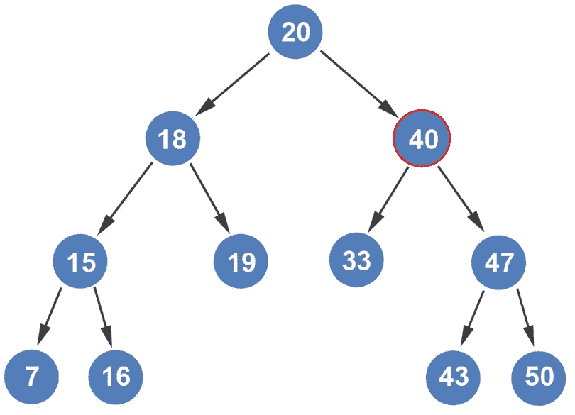
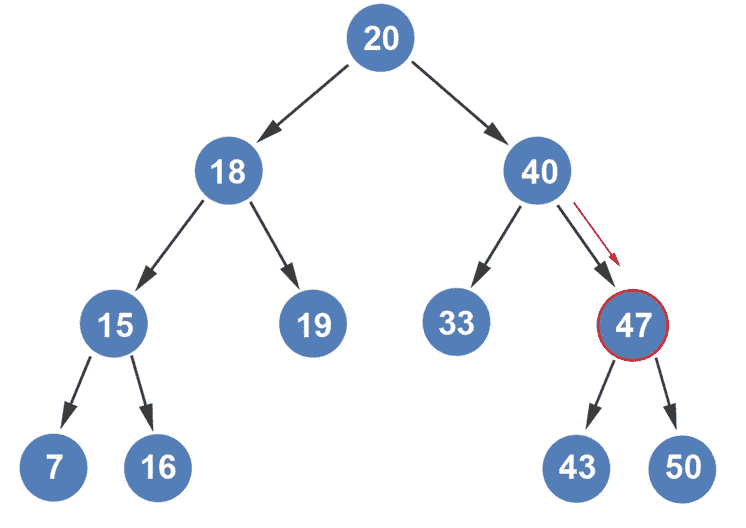
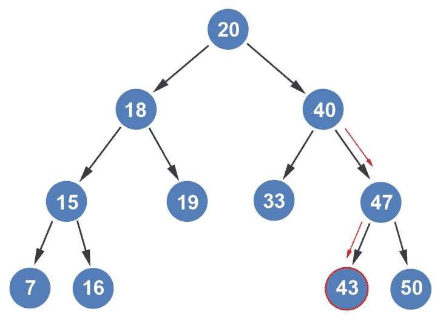
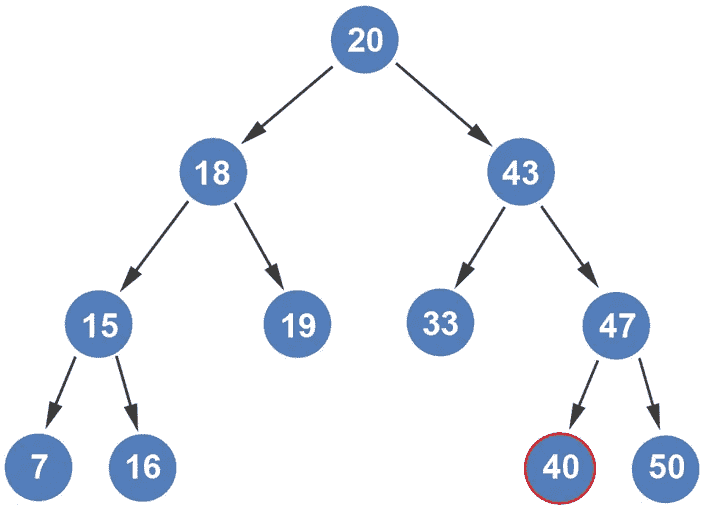
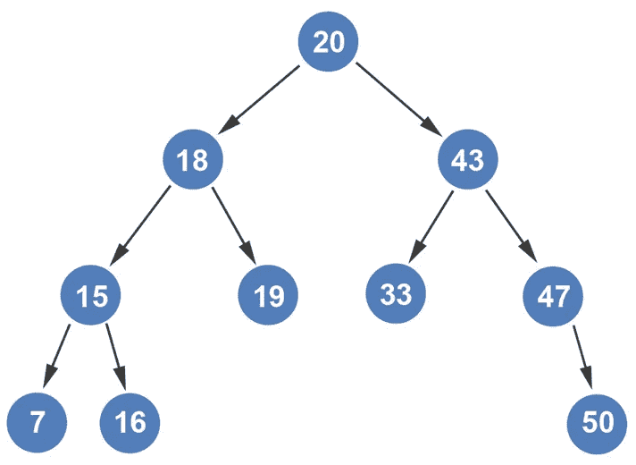

# 从树中删除一个有两个子节点的节点

> 原文：<https://blog.devgenius.io/deleting-a-node-with-two-children-from-a-tree-visually-explained-fa3d9aab5d6a?source=collection_archive---------12----------------------->

如果我们想从下面的树中删除节点 40 会发生什么？

由于节点 40 有两个孩子，我们不能简单地指向它的孩子，并希望它能工作。这个问题也有一种算法。我们删除这个节点的方法是用下一个最大的值替换它。我们如何获得下一个最大值？通过进入右边的子树，然后沿着左边的子树，直到我们到达叶节点。

让我们更仔细地看一下。

我们进入节点 40 的右子树。

然后我们沿着左边的子树路径，直到到达一个叶节点。所以，我们去
节点 43。

由于节点 43 是叶节点，我们将节点 40 与节点 43 交换。

我们现在可以从树中删除节点 40。

如果我们检查树，我们可以看到二叉树的性质仍然成立。左侧子树中的所有节点都小于父节点，右侧子树中的所有节点都大于父节点。请记住，要删除一个有两个子节点的节点，首先要查看它右边的子树。右边子树中最左边的节点将替换您试图移除的节点。

*如果你喜欢你所读的，我的书，***算法的说明性介绍，涵盖了这个算法和更多。**