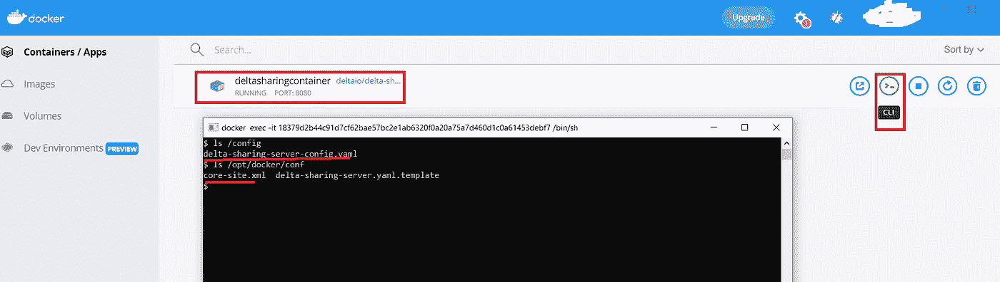
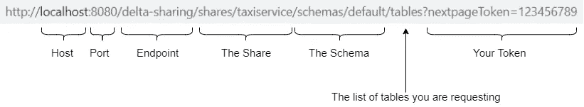

# Azure 上的 Delta 共享

> 原文：<https://blog.devgenius.io/delta-sharing-on-azure-a64a4fb8b0c2?source=collection_archive---------2----------------------->


今年是不平凡的一年！在数据方面，这一年，新的数据工程/处理/存储功能如雨后春笋般涌现*[*[*Delta Live Tables*](https://databricks.com/product/delta-live-tables)*，*[*Delta Sharing*](https://github.com/delta-io/delta-sharing/blob/main/README.md)*，*[*Unity Catalog*](https://databricks.com/product/unity-catalog)*，* [*多任务数据块作业编排*](https://databricks.com/blog/2021/07/13/announcement-orchestrating-multiple-tasks-with-databricks-jobs-public-preview.html) *，Delta Tables/Spark 3.0*

因此，在我们即将迎来新的一年之际，我想在博客中介绍一下这些新特性中的一个，这是一个令人兴奋且前景看好的协议，名为[***【Delta Sharing】***](https://github.com/delta-io/delta-sharing/blob/main/README.md)***。*** 因此我分享两篇文章:

+)第一个，将在下面详细介绍，致力于展示如何在 Azure 上设置增量共享，共享增量表，以及将它们与 Apache Spark (PySpark)和 Power BI 一起使用。

+)第二篇将是一篇简短的博客，讲述如何使用 Azure Synapse Analytics 通过 [***增量共享***](https://github.com/delta-io/delta-sharing/blob/main/README.md) 协议查询增量表，敬请关注这一篇！[ → [***链接***](https://medium.com/@wahidatoui/azure-synapse-how-to-use-delta-sharing-f9f76e5083b7) ]

一般来说，要在 Azure 上设置增量共享，您可以使用:

delta 共享服务器的预建包。

+)增量共享服务器的预建 docker 映像。

+)内置的增量共享作为 Databricks 或实现该协议的另一个数据提供者上的服务。

对于这篇博客，我将在 Azure Windows 虚拟机上运行 Delta 共享服务器的预建 docker 映像作为容器， *作为* 如下图所示:


增量共享协议涉及两方:[1]数据提供者(增量共享服务器)，其共享以增量湖格式作为逻辑表存储在云存储上的数据，以及[2]数据接收者，其是支持该协议的任何客户端。

为了使用增量共享协议读取增量表，数据接收者需要请求访问 ***【基于承载令牌】*** 并提交查询。如果允许访问数据，数据提供者将向接收者发回一组短期的预签名 URL(指向云存储上的数据)。

> 提供者和接收者之间不会传输任何数据，后者可以使用云存储带宽大规模并行地直接读取共享数据，也无需再次向云存储进行认证。

**先决条件**

+)存储在 Azure Data Lake Gen2 文件夹中的 lake house(几个 delta 表)。

+) Docker 桌面(→ [***此处***](https://docs.docker.com/desktop/windows/install/) )。

+)支持虚拟化的 Azure VM。(→ [***此处***](https://docs.microsoft.com/en-us/azure/virtual-machines/acu) )

让我们开始我们的旅程

它会稍微长一点😵勒紧你的腰带，袖手旁观😳

对于虚拟机供应，我建议选择支持虚拟化的较便宜的虚拟机，因为不处理数据的 Delta 共享服务器仅用于检查访问、记录访问和生成短期 URL。

选择虚拟机并使用 RDP 登录后，您可以跳到下面的第一步。

1.  通过执行以下 Powershell 命令，在虚拟机上启用 Hyper-V:

```
Enable-WindowsOptionalFeature -Online -FeatureName Microsoft-Hyper-V -All
```

2.在虚拟机上安装 Docker 桌面。

3.禁用 WSL 2。


4.创建一个本地目录并将其挂载到 Docker 容器中。

更多详情请见 [***此处***](https://docs.docker.com/desktop/windows/)


5.为增量共享服务器设置配置文件。

我们必须准备两个文件:

+)***delta-sharing-server-config . YAML***:这个文件包含了要共享的 delta lake 表的描述，以及访问令牌、主机、端口、端点等服务器设置……您可以使用这个 [***模板***](https://github.com/delta-io/delta-sharing/blob/main/server/src/universal/conf/delta-sharing-server.yaml.template) 作为填充文件的起点。


+)***core-site . XML***:这个文件包含了云存储的连接细节，比如帐户名和访问密钥。您可以使用此 [***模板***](https://github.com/delta-io/delta-sharing#azure-data-lake-storage-gen2) 作为起点来填充您的文件。


准备好配置文件后，在步骤 4***【docker share】***中共享的目录下创建一个子目录，命名为***【config】***，将配置文件复制/粘贴到其中。


6.将增量共享服务器 docker 映像作为容器运行

在***D***[***ocker-Hub***](https://hub.docker.com/r/deltaio/delta-sharing-server)会合，截至今天的最新版本是 0.3.0(见标签页)。它将由 docker 检索，并在 Powershell 上运行以下命令后执行:

```
docker run --name deltasharingcontainer \ 
-p 8080:8080 \
--mount type=bind,source=c:\dockershare\config\delta-sharing-server-config.yaml,target=/config/delta-sharing-server-config.yaml  \
--mount type=bind,source=c:\dockershare\config\core-site.xml,target=/opt/docker/conf/core-site.xml deltaio/delta-sharing-server:0.3.0 \
-- --config /config/delta-sharing-server-config.yaml
```

我们来分解一下上面的命令:

```
--name deltasharingcontainer
```

docker 容器的名称。

```
-p 8080:8080
```

作为容器的端口号，您必须使用您在***【delta-sharing-server-config . YAML】***文件中为 delta 共享服务器选择的相同端口。

```
--mount type=bind,source=c:\dockershare\config\delta-sharing-server-config.yaml,target=/config/delta-sharing-server-config.yaml
```

我们告诉 docker 从***【c:\ docker share \ config】****中加载***【delta-sharing-server-config . YAML】****并将其放在容器的文件夹****[/config/】****中。**

```
--mount type=bind,source=c:\dockershare\config\core-site.xml,target=/opt/docker/conf/core-site.xml
```

同样的目标为***【core-site . XML】****文件*，与前面命令唯一不同的是容器端的目标文件夹***[/opt/docker/conf/]****。*

```
deltaio/delta-sharing-server:0.3.0
```

然后告诉 docker 下载标签为 **0.3.0** 的 Delta 共享服务器映像，如果它不存在于您的虚拟机上的话。

```
-- --config /config/delta-sharing-server-config.yaml
```

在第一个 ***mount*** 命令上将服务器的配置文件位置设置为上传到容器中的文件。

7.检查增量共享服务器容器状态

在没有错误地运行上一步中的命令后，您将获得如下内容:


你现在能做的就是检查配置文件***【delta-sharing-server-config . YAML】******【core-site . XML】***是否成功上传到容器。在 docker 桌面上，您可以使用***【deltasharingcontainer】****CLI:*



因为 Delta 共享协议是基于[***REST API***](https://github.com/delta-io/delta-sharing/blob/main/PROTOCOL.md)的，所以我们可以在数据接收者和 Delta 共享服务器(作为 Docker 容器运行)之间实现一个开始简单的连通性检查。在这种情况下，接收到的数据将是您使用虚拟机中的网络浏览器**接收到的数据。要获得所有共享表的列表，我们可以使用以下 URL:**

```
*# Please don’t blame me for putting the token directly on the url, I am using it just for testing ;)*[http://localhost:8080/delta-sharing/shares/taxiservice/schemas/default/tables?nextpageToken=123456789](http://localhost:8080/delta-sharing/shares/taxiservice/schemas/default/tables?nextpageToken=123456789)
```

URL 详细信息如下:



通常，您会收到来自服务器的如下响应:


至此，容器已经启动并以正确的配置运行，数据接收者[*您作为测试人员*]可以从服务器本身到达服务器。= > ***现在的目标是启用来自 Azure VM*** 外部的连接。

8.启用从主机(Azure VM)外部到 docker 容器(增量共享服务器)的连接

转到 Azure 门户，选择您的虚拟机，然后从“网络”选项卡，您可以在端口 8080 上添加一个新的入站端口规则(由 Docker 容器和 Delta 共享服务器使用)


如果您在虚拟机外部使用下面的 URL 再次重新测试，您必须从服务器收到与上一步相同的响应:

```
[http://VM_IP_ADDRESS:8080/delta-sharing/shares/taxiservice/schemas/default/tables?nextpageToken=123456789](http://localhost:8080/delta-sharing/shares/taxiservice/schemas/default/tables?nextpageToken=123456789)
```

恭喜你。服务器配置良好，运行良好😆

**作为数据接收方(APACHE SPARK/POWER BI)，我能做些什么？**

在提交查询之前，数据接收者必须使用 [***简档文件***](https://github.com/delta-io/delta-sharing/blob/main/PROTOCOL.md#profile-file-format) 请求访问增量共享服务器；包含用户凭证的 json 文件。


1.  ***作为数据接收者的权力匕***

您可以使用 power bi 中的 [***delta 共享连接器***](https://docs.microsoft.com/en-us/power-query/connectors/deltasharing) 根据 delta 共享服务器共享的 delta 湖数据创建报告。

这里要提到一个重要的注意事项:连接器仍处于测试版，唯一支持的数据导出模式是 **Import** ，因此您需要确保加载的数据适合您机器的内存。[作为一种解决方法，您可以限制导入的行数，默认情况下该值为 1 百万行]


2. ***APACHE SPARK 作为数据接收者***

您 [***可以设置 Apache Spark***](https://github.com/delta-io/delta-sharing#apache-spark-connector) 以以下两种方式加载 Delta 共享连接器:交互式运行**或作为**项目**。**

**让我们使用 PySpark 测试交互方式，因此您必须如下启动 shell:**

```
pyspark --packages io.delta:delta-sharing-spark_2.12:0.3.0
```

**通常，如果使用增量共享的 shell 包的初始化没有错误，您将获得如下内容:**

****

**您可以使用 Pyspark 查询增量共享表，如下所示:**

****

**让我们看看服务器如何通过导出容器日志来响应前面的查询。如下所示，服务器用指向增量表*【taxi service . default . taxi trip】*的完整文件列表的 **61 个 URL**进行响应。**

****

> **如果我们要过滤数据并读取表的子集，会发生什么？过滤器会被 ***下推*** *到* ***云存储*** *还是会发生在* ***数据接收者*** *上？***

****

**为了测试这个场景，我们可以提交一个新的查询来计算表*[taxi service . default . taxi trip]*中特定范围【trip year = 2017 AND passenger count>1】的行数。**

***(*)该表由两列 TripYear 和 TripMonth 划分。***

**因此，在导出 delta 共享容器的日志并分析之前查询的 SQL 计划之后，我们可以注意到，尽管 Delta 共享服务器为与 Delta 表的最后版本(61 个文件)相对应的完整文件列表生成了 URL，但是 spark 引擎将过滤器下推到云存储中，以便重新调整所需的数据(15 个文件)。**

****

**另一个需要注意的是:如果您将数据移动到云/区域之外，需要支付云出口成本。幸运的是，数据过滤发生在云存储上，这在某些情况下减少了接收者和提供者之间移动的数据量。**

**这就是了，我希望你喜欢我的文章，一如既往地期待你的评论或问题。不要忘记查看我的博客，了解如何使用 Azure Synapse Analytics 通过增量共享协议查询增量表。[ → [***链接***](https://medium.com/@wahidatoui/azure-synapse-how-to-use-delta-sharing-f9f76e5083b7)**