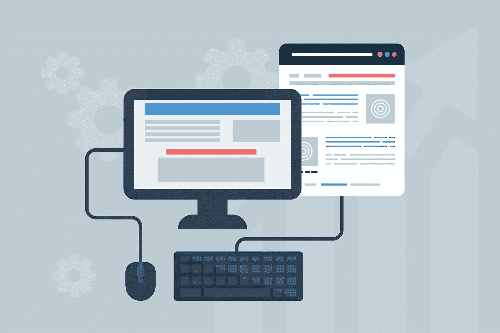

# 揭秘走向生产

> 原文：<https://blog.devgenius.io/demystifying-going-to-production-1912c329f2f3?source=collection_archive---------28----------------------->

# 介绍

软件开发领域的每个人都听说过进入生产环境，但是进入生产环境意味着什么，人们如何知道他们什么时候准备好部署到生产环境？在这篇文章中，我将解释一个应用程序如何从开发到生产，以及在开发一个有弹性的、持久的应用程序时应该记住什么。

# 为什么要去生产？

开发这些应用程序是一项艰苦的工作，我们的主要目标是让其他人使用它们。我们希望确保每个人都能在一天中的任何时间访问我们的服务。然而，在笔记本电脑或台式机上运行我们的应用程序无法实现这一点。更不用说我们的机器将没有足够的计算能力来有效地服务每个用户。在本地运行服务有许多值得注意的问题:

*   不可靠的
*   不稳定的
*   性能差
*   不可扩展

创造一个适合生产的环境并不容易。必须对位置、硬件、安全性、可伸缩性、性能等进行大量考虑。

# 本地服务器与云服务器

我们的机器容易受到断电、网络连接不良、机器部件性能低下等因素的影响。这些风险使得它不适合托管应用程序。我们需要能够满足这些期望的基础设施，因此我们可以走传统路线，构建一个大型服务器机架，并配备一个能够满足所有用户请求的网络，或者我们可以选择一个云平台来为我们管理服务器和网络。

由于成本原因，人们正迅速放弃传统的服务器机架，转而使用云平台。考虑到购买新硬件的成本、每月的企业网络费用、电费等，管理一个服务器机架会变得非常昂贵。云平台有一个令人信服的模型，你只需为你使用的东西付费，这使得它非常具有成本效益。无论您选择使用本地服务器机架还是云平台，在保持性能和可用性稳定的同时降低成本都应该是选择生产环境时的首要任务。

# 安全编程

一旦你有了专用的生产环境，下一步就是确保你的应用和环境是安全的。对于应用程序来说，这意味着任何密码或访问密钥都被安全地隐藏在配置文件中。这些配置文件不应该提交到 GitHub 或任何其他公共位置。一个很大的安全漏洞可能来自编程时暴露的密码或密钥，因此每当您连接到需要身份验证的数据库或外部服务时，您都希望确保不暴露任何可能对您不利的机密信息。

调试时，日志是程序员的朋友，但是如果在生产中不管理这些日志，它可能很快变成敌人。拥有详细的日志记录或打印语句可能会泄露安全密钥或用户的个人信息。当从开发转移到生产时，您希望确保应用程序只记录对用户没有威胁的信息。

# 生产环境安全

生产内部的网络应该受到严格监管。除了应用程序使用的端口之外，所有进入的流量都应该被阻止。例如，如果应用程序是 web 服务器，那么除了端口 80 之外的所有端口都将被阻塞，因为端口 80 用于通过 http 和 https 进行连接。我们还想保留一个开放的端口，以便使用 ssh 连接到机器，这个端口应该是 22。还需要通过用户名和密码 ssh 到这个生产环境来保护这个端口。有了这一层网络安全，就确保了我们的环境不会被任何人劫持。

使用外部 api 时，请确保使用 API 的生产版本。这可能需要对配置进行一些更改，比如为生产创建新的访问密钥，或者更改为生产应用程序指定的 api 请求路由。这将确保外部服务在发出请求时也是加密和安全的。

说到数据库，拥有两个或更多数据库用于测试、开发和生产始终是一个好的做法。这允许您在不对生产数据库造成任何问题的情况下进行测试和开发。所有数据库都需要用户名和密码。如果数据库曾经用于存储敏感的用户信息，那么在存储之前应该对这些信息进行加密。例如，密码不应该明文存放在数据库中，它们应该事先加密。

# 构建和部署

在设置了生产环境并确保一切安全之后，最后一步是构建可以在生产环境中运行的可执行文件。构建阶段将根据正在构建的内容而有所不同。Java 构建。jar 文件，C 和 C++可以制作 GNU 可执行文件，javascript 可以使用节点脚本或其他工具。所以这个过程真正依赖于项目的技术。尽管有这些变化，一旦构建成功，下一步就是将构建打包成 zip 文件，通过 scp 或 ftp 发送到生产环境。

一旦您创建了一个具体的构建和部署方法，使用像 [CircleCi](https://circleci.com/) 这样的持续集成工具来自动化这个任务将会非常有益。这允许进行持续的开发，同时也可以频繁地部署到生产环境中，以使其保持最新的特性。

# 打开包装并安装

既然应用程序已经在生产环境中了，那么是时候解压缩任何文件，并设置任何环境变量了。这也是下载任何更新或运行应用程序所需的软件的时间。最后要做的是运行应用程序，并通过发出一些请求来测试它的负载。

# 结论

为了传达创建生产环境时要采取的步骤，本文过于简单了。当谈到技术栈和工具时，有大量的变体，所以我不认为强调一种特定的构建和部署方式是有益的。最简单的生产环境是安全的、高性能的和可扩展的，这使得它能够服务于广泛的用户。