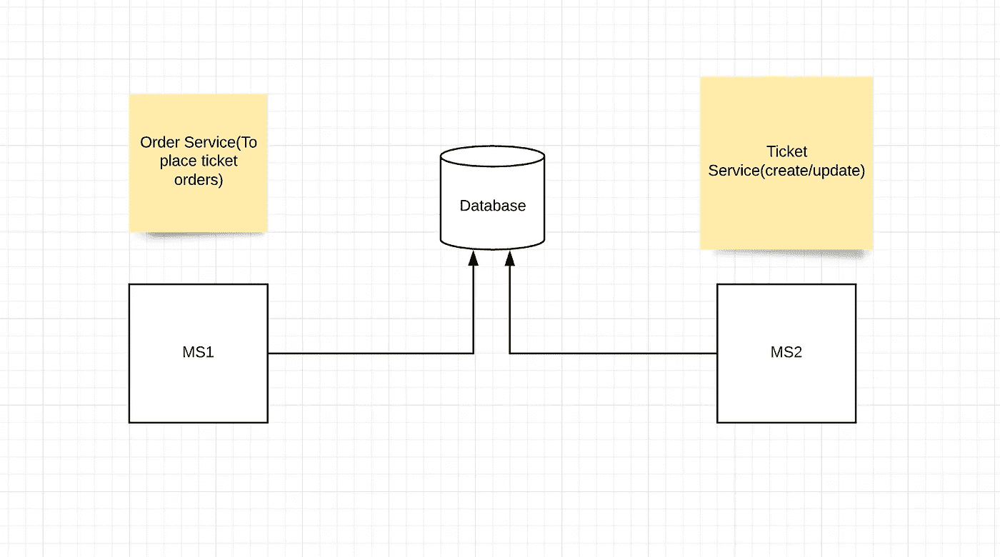
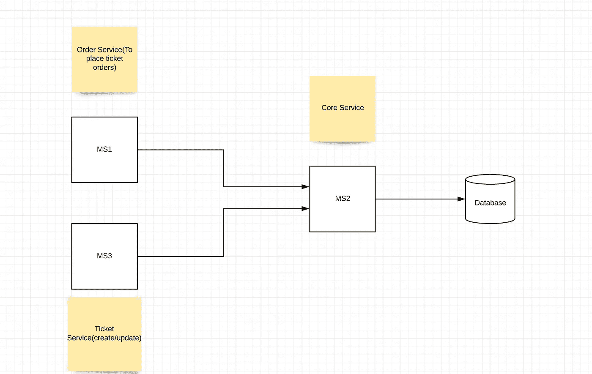
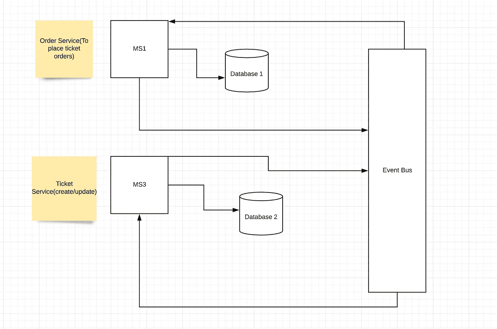

# 揭秘微服务模式

> 原文：<https://blog.devgenius.io/demystifying-microservices-pattern-95d26f0feb3b?source=collection_archive---------14----------------------->

随着数字化和云技术的兴起，构建和维护微服务是软件行业最受欢迎的技能之一。在开始微服务架构的模式之前，让我们看看微服务到底是什么。

**什么是微服务架构？**

它是一种面向服务的架构风格，将应用程序安排为松散耦合的服务，可以独立开发、部署和维护。在理想情况下，每个服务都通过 API 相互通信。

> 在整个博客中，我们将着眼于订单服务和票务服务来理解不同的模式。订单服务负责下订单和管理机票订单，而票务服务处理机票的创建/更新。

**共享数据库模式**

如上面的架构图所示，订单和票务服务在共享数据库上运行。这两种服务都可以独立管理和部署，但是，它们共享一个数据库依赖关系，每当必须进行与数据库相关的更改时，都必须主动进行沟通。在一个[敏捷](https://en.wikipedia.org/wiki/Agile_software_development)设置中，如果这些服务归两个不同的团队所有，他们将永远无法作为绝对独立的单元运作。

**共享服务模式**

在这种模式中，数据库归共享服务所有，消费者应用程序不需要担心数据库的任何变化。订单和票务服务将能够通过共享服务公开的 API 进行数据库更新。这种设置使两个服务成为绝对独立的单元。但是，如果共享服务关闭，将导致所有消费者应用程序不可用。

**基于事件的模式**

这是所有模式中最复杂的，但同时在管理和维护方面具有最大的灵活性。每个服务拥有一个数据库，并且总是在其数据库中进行更新。不同服务之间的数据库同步使用事件总线进行，事件总线本身是一个独立的服务。

为了更清楚起见，我们来看一个在票务数据库中创建票据的场景。票务服务将发布一个活动，该活动将由活动总线挑选并在全球范围内发布。订购服务将侦听传入的票据创建事件，并在其数据库中进行更新，以便可以在新创建的票据上创建订单。类似地，在票据上创建订单时，订单服务会发布一个事件，以便票据服务更新其数据库中的票据状态。

当您选择这种模式时，必须考虑许多并发场景。然而，该模式使得服务在真正意义上是独立的。

如果你喜欢读这篇文章，别忘了鼓掌。👏👏

你也可以在 twitter [@Akash940](https://twitter.com/Akash940) 上关注我的 JavaScript 或 React 更新。

谢谢你！