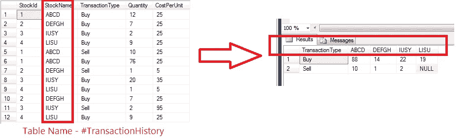

# 揭开透视命令的神秘面纱— SQL

> 原文：<https://blog.devgenius.io/demystifying-pivot-command-sql-bed3ba1bdd02?source=collection_archive---------0----------------------->


尽管我已经写 SQL 查询好几年了，但是在我的 SQL 查询中使用 PIVOT 仍然是一件很痛苦的事情。在我的职业生涯中，还没有哪一次我能够在不花 10-15 分钟浏览不同样本的情况下编写一个数据透视表查询。“PIVOT”的概念很简单，但是它的查询结构让我很困惑。

是时候结束这种痛苦了。在本文中，我采用了一个用例，然后按照 PIVOT 查询的模板来分解每个部分。希望这能帮助那些和我有相似经历的人。

在本例中，输入表由特定客户的交易历史组成。客户想要交易股票数量的简化视图。



根据 Microsoft 文档，透视查询的语法如下:

```
SELECT <non-pivoted column>,  
    [first pivoted column] AS <column name>,  
    [second pivoted column] AS <column name>,  
    ...  
    [last pivoted column] AS <column name>  
FROM  
    (<SELECT query that produces the data>)   
    AS <alias for the source query>  
PIVOT  
(  
    <aggregation function>(<column being aggregated>)  
FOR   
[<column that contains the values that will become column headers>]   
    IN ( [first pivoted column], [second pivoted column],  
    ... [last pivoted column])  
) AS <alias for the pivot table>  
<optional ORDER BY clause>;
```

从上面的模板:让我们标记所有我们需要的不同值。

**<非透视列> :** 交易类型

**透视列:**列 StockName 中的相关值。在我们的例子中，它将是 all ([ABCD]、[DEFGH]、[IUSY]、[LISU])。因此[第一个旋转列]将是[ABCD]，[第二个旋转列]是[DEFG]，依此类推。

**<选择产生数据的查询> :** 从#TransactionHistory 中选择数量、库存名称、交易类型

**聚合函数:** SUM

**<列被汇总> :** 数量

**<包含将成为列标题的值的列> :** 股票名称中的相关值

一旦确定了以下值，最终的查询将类似于

```
drop table #TransactionHistoryCREATE TABLE #TransactionHistory(StockId int, StockName nvarchar(max), TransactionType nvarchar(max), Quantity int, CostPerUnit int);INSERT INTO #TransactionHistory(StockId, StockName, TransactionType, Quantity, CostPerUnit)VALUES(1, ‘ABCD’,’Buy’,12,25),(2,’DEFGH’, ‘Buy’,7,25),(3, ‘IUSY’,’Buy’,2,25),(4, ‘LISU’,’Buy’,9,25),(1, ‘ABCD’, ‘Sell’,10,25),(1, ‘ABCD’, ‘Buy’,76,25),(2,’DEFGH’, ‘Sell’,1,5),(3, ‘IUSY’,’Buy’,20,35),(4, ‘LISU’,’Buy’,1,5),(2, ‘DEFGH’,’Buy’,7,25),(3, ‘IUSY’,’Sell’,2,95),(4, ‘LISU’,’Buy’,9,25);select TransactionType, [ABCD],[DEFGH],[IUSY],[LISU] from (select Quantity, StockName, TransactionType from #TransactionHistory) ppivot(sum(Quantity)for StockName in ([ABCD],[DEFGH],[IUSY],[LISU])) pp;
```

希望这将结束我与 PIVOT 命令的斗争。如果没有，我把我的理解记录下来供参考。

谢谢

塔伦

页（page 的缩写）s-Medium 是一个阅读、写作和向其他作者学习的绝佳平台。如果你想加入我的旅程，今天就加入 [medium](https://tarunbhatt9784.medium.com/membership) 。