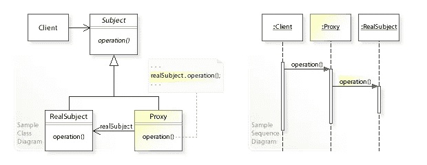
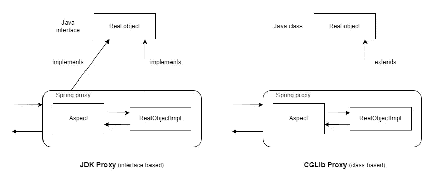
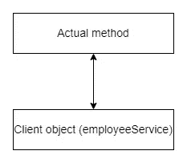
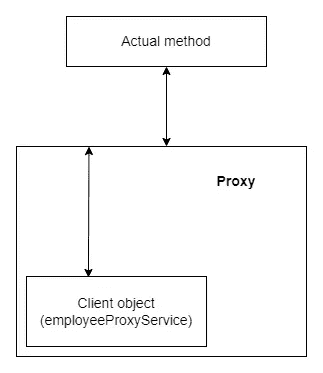

# Spring 代理设计模式初学者指南

> 原文：<https://blog.devgenius.io/demystifying-proxy-in-spring-3ab536046b11?source=collection_archive---------2----------------------->

在本文中，我们将发现什么是代理，以及 Spring 如何使用代理来抽象复杂性并使开发人员的生活变得更容易。


马库斯·斯皮斯克在 [Unsplash](https://unsplash.com?utm_source=medium&utm_medium=referral) 上的照片

# 定义

`define: proxy`

> 如果你自己不能做某事，你授权某人代你做

在软件开发术语中，您可以将代理定义为

> 一个对象，充当另一个对象的占位符，以控制它所代表的真实对象的创建和访问

# 代理设计模式

它是处理类和对象组合的结构设计模式的一部分。

## 使用这种模式，我们试图解决什么问题？

*   控制对象的访问。
*   在访问对象时提供附加功能。

## **与 adaptor 和 decorator 有什么不同？**

*   它提供与它所引用的对象相同的接口，并且不以任何方式修改数据。
*   它有关于编译时真实主题的信息。

在这个 UML 类图和序列图中，你可以看到代理作为客户端和真实主体之间的接口。



作者范德乔——自己的作品，CC BY-SA 4.0，[https://commons.wikimedia.org/w/index.php?curid=62347717](https://commons.wikimedia.org/w/index.php?curid=62347717)

# Spring AOP 及其代理机制

*AOP(面向方面编程)是一种编程范式，旨在增加方面的模块化。方面支持关注点的模块化，比如跨越多种类型和对象的事务管理。*

## **春天有什么帮助？**

*   它提供声明式企业服务，特别是作为 EJB 声明式服务的替代。最重要的服务是*声明式事务管理*。
*   它允许用户实现定制的方面，用 AOP 补充他们对 OOP 的使用。

## **代理机构**

Spring AOP 是一个基于代理的 AOP 框架。这意味着为了实现目标对象的方面，它将创建该对象的代理。这可以通过以下两种方式实现:

1.  **JDK 动态代理:**Spring AOP 的首选方式。只要目标对象实现了一个接口，就会使用 JDK 动态代理
2.  **CGLIB 代理:**如果目标对象没有实现接口，那么可以使用 CGLIB 代理



JDK 和 CGLIB 代理的黑白差异

## **通过示例理解代理机制**

**案例一:无代理**

```
**public** **class** EmployeeServiceImpl **implements** EmployeeService {

   **public** **void** method1() {
      **this**.method2();
   }

   **public** **void** method2() {
      log.info("understanding self invocation")
   }
}// This is Main class where we will invoke method1 of 
// EmployeeService object
**public** **class** Main {

   **public** **static** **void** main(String[] args) {
      EmployeeService employeeService = **new** EmployeeServiceImpl();
      employeeService.method1();
   }
}
```



这里客户端对象直接调用实际的方法(非代理的情况)

在这个例子中没有代理，方法是直接在对象引用上调用的。

**案例二:带代理**

```
**public** **class** EmployeeServiceImpl **implements** EmployeeService {

   **public** **void** method1() {
      **this**.method2();
   }

   **public** **void** method2() {
      log.info("understanding proxy")
   }
}// This is Main class where we will invoke method1 of 
// EmployeeService object behind a proxy
**public** **class** Main {

   **public** **static** **void** main(String[] args) {
      ProxyFactory factory = **new** ProxyFactory(
          **new** EmployeeServiceImpl()
      );
      factory.addInterface(EmployeeService.**class**);
      factory.addAdvice(**new** RetryAdvice());

      EmployeeService employeeProxyService = (EmployeeService)
          factory.getProxy();    
      employeeProxyService.method1();
   }
}
```



在这里，客户端对象与代理和实际方法的代理委托进行交互(被代理的情况)

在这个例子中，客户端代码引用了代理，而不是实际的方法。然后代理委托给实际的方法。

这就是为什么我们在使用@Async、@Cacheable、@Transactional 等装饰器时应该避免犯这种[错误](https://pratiyush.medium.com/one-common-mistake-which-we-should-avoid-while-using-async-and-cacheable-in-spring-boot-a967cea27d55)。

# 替代代理

替代代理的方法是字节码编织。当使用字节码编织机制时，永远不会有第二个对象(也就是代理)。相反，如果需要应用行为(如事务管理或安全性)，它会被“编入”现有代码，而不是“围绕它”。

一般来说，字节码编织方法需要更多的时间来设置，这取决于您的环境。在某些情况下，您需要设置一个 java 代理，在其他情况下，您可能需要修改您的编译过程，其他框架可能需要使用不同的类加载器。换句话说，字节码编织有点难以设置。

# 代理的经验法则

*   代理增加了开销，如果应用于被代理的对象的行为与长时间运行的操作有关，则这种开销可以忽略不计。
*   如果您需要非常细粒度的行为，并希望将其应用于一大组对象，那么使用字节码编织方法可能更安全，比如 AspectJ。
*   使用基于代理的系统可能可以解决 80%的需求。对于最后一英里，或者剩下的 20%，选择字节码编织方法可能是一个好的选择。

在研究这个话题的时候，我读了很多文章，这是我所学到的最重要的东西。如果你想深入挖掘，你可以浏览这些博客

*   [https://www.baeldung.com/java-proxy-pattern](https://www.baeldung.com/java-proxy-pattern)
*   [https://en.wikipedia.org/wiki/Design_Patterns](https://en.wikipedia.org/wiki/Design_Patterns)
*   [https://docs . spring . io/spring-framework/docs/3.2 . x/spring-framework-reference/html/AOP . html # AOP-proxing](https://docs.spring.io/spring-framework/docs/3.2.x/spring-framework-reference/html/aop.html#aop-proxying)
*   [https://www.baeldung.com/spring-aop](https://www.baeldung.com/spring-aop)
*   [https://spring . io/blog/2007/07/19/揭穿-神话-代理-影响-性能/](https://spring.io/blog/2007/07/19/debunking-myths-proxies-impact-performance/)
*   [https://www . bael dung . com/Java-structural-design-patterns #:~:text = Decorator % 20 pattern&text = which % 20 proxy % 20 and % 20 Decorator % 20 patterns，reference % 20 to % 20 the % 20 original % 20 object](https://www.baeldung.com/java-structural-design-patterns#:~:text=Decorator%20Pattern&text=Although%20Proxy%20and%20Decorator%20patterns,reference%20to%20the%20original%20object)
*   [https://spring . io/blog/2012/05/23/transactions-caching-and-AOP-understanding-proxy-usage-in-spring](https://spring.io/blog/2012/05/23/transactions-caching-and-aop-understanding-proxy-usage-in-spring)