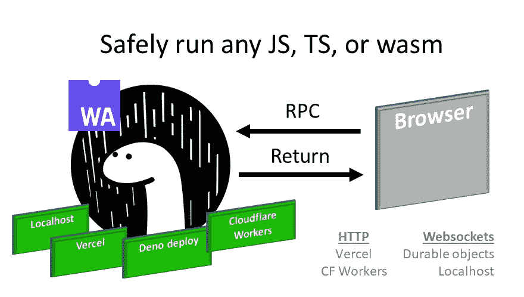

# Deno + Svelte(第 2 部分):在 Svelte ❤️中使用 Deno 函数🦕

> 原文：<https://blog.devgenius.io/deno-svelte-part-2-using-deno-functions-in-svelte-%EF%B8%8F-2386accd4274?source=collection_archive---------3----------------------->

在你的苗条应用中安全地运行任何 JS、TS 或 wasm

上一次[我写这个话题](https://douganderson444.medium.com/deno-svelte-compiled-frontend-without-package-headaches-d336f1a6555a)的时候，苗条的生态系统还处于它的婴儿期。我们可以用 Deno 编译一个苗条的脚本，但仅此而已。

自第一篇文章以来，已经发生了一些很好的改进:

1.  苗条的生态系统已经成长为更好地支持 Deno(通过 [Snel](https://github.com/crewdevio/Snel) )，并且
2.  我对如何与来自 Svelte 的 Deno 互动的想法已经成熟。

让我们在这些部分中描述我的编码经验:

**A 部分:Snel——使用 Deno 构建苗条的应用程序！**

**B 部分:Snel —将 Svelte 远程连接到 Deno**

**C 部分:使用来自 Svelte 的 Deno 方法**

**A 区— Snel**

现在我们有了一个在 Deno 中构建苗条应用的萌芽框架: [Snel](https://github.com/crewdevio/Snel) 。我想尝试在没有任何 Nodejs 交互的情况下，100%用 Deno 构建这个苗条的应用程序。Snel 是最有希望的答案。

TL；博士:基本上，它是有效的！ *多半。*

使用 Snel 的嵌入式 Trex 工具按照 Snel 的说明进行操作，可以让您非常快速地完成一个项目。然而，如果你想做一些更复杂的汇总工作(比如你的精简代码中的一个文件),那么对 T2 插件和 T3 的支持还不够成熟。但到目前为止，导入一个`json`文件是 Snel 唯一不让我做的事情。不幸的是，Snel 似乎也不允许你从你的细长代码中调用 [Deno.readFile](https://deno.land/manual/examples/read_write_files) (),所以我对这个问题的解决办法有点困惑。最后，我只是复制并粘贴了我正在寻找的`json config data`并继续前进。我想很快会有一个解决这种小事的方法。

**B 部分:Snel — Deno 连接**

好了，我们有了一个可以用 Deno 构建的工作前端。现在是激动人心的部分！

我们知道 Deno 最好的一点是，你可以从“net”和“read/write”这样的环境中[保护你的 JavaScript 代码](https://deno.land/manual@v1.10.1/getting_started/permissions),以真正保持对可编程访问的控制。这在运行其他人的代码(OPC)时尤其重要。甚至 ***更重要的是*** 当你用 ***你的*** 数据运行别人的代码时。您最不希望看到的是一些内置功能、深度嵌套的库或 JavaScript bug 将您的个人信息偷偷转移到远程服务器。

我们希望在 Deno 中执行其他人的代码(OPC ),但是在 CLI 之外，所以我们需要一个前端来与 Deno 交互——因为[没有 Deno 标准 GUI](https://github.com/denoland/deno/discussions/3234)—我们可以使用 Svelte 作为我们的 GUI，并建立客户端-服务器关系来相互交互。

但是我们需要一种方法，从我们纤细的浏览器代码中获取 Deno 的命令和数据。

**回车:远程过程调用(RPC)**

RPC 很酷，就像电影《阿凡达》中的[或者手套箱。你在那里得到所有的功能，而不是真的在那里。安全距离内的功能。](https://www.imdb.com/title/tt0499549/)

来源:[https://commons . wikimedia . org/wiki/File:S _ Krikalev _ with _ miniglovebox . jpg](https://commons.wikimedia.org/wiki/File:S_Krikalev_with_miniglovebox.jpg)

将 RPC 与 Deno 一起使用给了我们所有来自浏览器的控制，但也给了我们 Deno 所有的安全性。

另外:我也考虑过用其他方法进行试验，比如用服务器端渲染或 Puppeteer 来编译 Deno 中的 JS 代码，这也是可行的，但是在这些情况下，JavaScript 在渲染过程中被剥离，使得我们的站点变成了相当静态的 HTML。使用 RPC，我们仍然可以在客户端代码中获得相当高的反应性。稍后我可能会写另一篇关于 SSR/木偶版本的文章，但是现在我们是以 RPC 方式进行的😎*。*

**RPC 类型:HTTP vs Websockets**

第一个困境是选择 HTTP POST，还是用 websocket 来回连接？考虑 Deno 运行的环境:如果你在本地主机上运行 Deno，你可以使用 websockets，如果你是 Cloudflares 持久对象的内部测试用户，你也可以使用 websockets。但是如果你要在 Vercel 函数或普通的 Cloudflare Workers 中使用 Deno，它们不支持 websockets，所以你不能使用这些工具。

> 所以，由于 HTTP 是最小公分母，我选择了 HTTP POST。

*此外:Deno 中最新的原生 HTTP 服务器(以及 Deno Oak 服务器)使用 Rust 的 Hyper server，* [*支持 HTTP/2*](https://twitter.com/deno_land/status/1382049535782948870) *因此，如果你的前端支持 HTTP/2，你就是未来的 prof。*

既然我们已经选择了一个协议，我们需要找出 RPC 等式。我选择了 [JSON-RPC](https://www.jsonrpc.org/) ，因为它看起来非常简单易懂。

为了设置 Deno JSON RPC，我们需要一个 Deno 服务器，所以我选择了 Deno 的 [Oak 服务器](https://oakserver.github.io/oak/),因为它让路由变得更容易。但是我们的服务器需要一个函数来执行，让我们使用一个 Javascript + WebAssembly 函数来返回“答案”给我们，并将其命名为`getAnswer()`:

Deno Oak 服务器的 getAnswer()处理程序

我选择执行 WebAssembly (wasm)来说明一个目的。从字节码来看，你真的不知道这段代码在做什么。据你所知，它会把你珍贵的号码发送到某个远程服务器。

最棒的是，我们可以在 Deno 中以无信任的方式运行这个 JavaScript 和 WebAssembly 代码，因为默认情况下 Deno 不允许脚本访问互联网！或者硬盘。[除非我们这么说](https://deno.land/manual/getting_started/permissions)。

在这个原型的未来版本中，我们将从互联网上获得这个`getAnswer`代码，而不必自己编写。但是为了举例，我们需要先自己设置一些东西，这样就可以了。

现在我们已经有了答案处理程序，我们只需通过 Oak 中的`.post()` 路由访问它，并使用 JSON-RPC 返回响应。这个服务器路由所做的就是获取函数，运行它，并将响应返回给服务器。

**C 部分:在苗条中使用 Deno 方法**

事情苗条的一面更简单，因为我们已经完成了 Deno 面的大部分处理。

我们需要在一个`.js`文件中设置 JSON-RPC 方法来为我们执行实际的调用:

RPC 函数对服务器进行 fetch 调用，传递任何参数。`new [Proxy](https://developer.mozilla.org/en-US/docs/Web/JavaScript/Reference/Global_Objects/Proxy)` [是一个标准的 JavaScript 对象](https://developer.mozilla.org/en-US/docs/Web/JavaScript/Reference/Global_Objects/Proxy)，它使我们能够截取并重新定义该对象的基本操作，因为我们希望将动作重定向到服务器，而不是在本地调用它。

为了将这个远程 RPC 代理导入到 Svelte 中，我选择将它包含在将 Svelte 注入到 HTML 页面的`main.js` 中，但是您也可以将它导入到代码中的任何地方。但是这样一来，`App.svelte`就可以将方法作为属性(prop)使用。

现在在细长的代码中，我们可以调用我们的 Deno TypeScript/JavaScript Wasm 函数！

那是非常漂亮的！代码在 Deno 中安全执行，但在 Svelte 中可以用作本地函数。

利用这个框架，我们可以做更多的事情。比如从互联网上下载代码来运行，在 Vercel 中设置 Deno 函数，这样这些都可以无服务器地完成*。*无服务器*是单词了吗？*

*我相信我会在未来的基础上继续努力(所以，点击“喜欢”按钮，订阅，等等，等等，更新)。*

> *所以，点击“喜欢”按钮，订阅等…等…更新*

*在我之前关于 Deno + Svelte 的文章中，通过一个简单的编译步骤，我们已经从这个设置的 1.0 版本走了很长的路。*

*完整的代码在这里:*

* [## DougAnderson444/deno-rpc

### 受 rpcseed 和 Snel 的启发，如果您想对数据运行不可信的 javascript、typescript 或 webassembly 代码，您…

github.com](https://github.com/DougAnderson444/deno-rpc)*