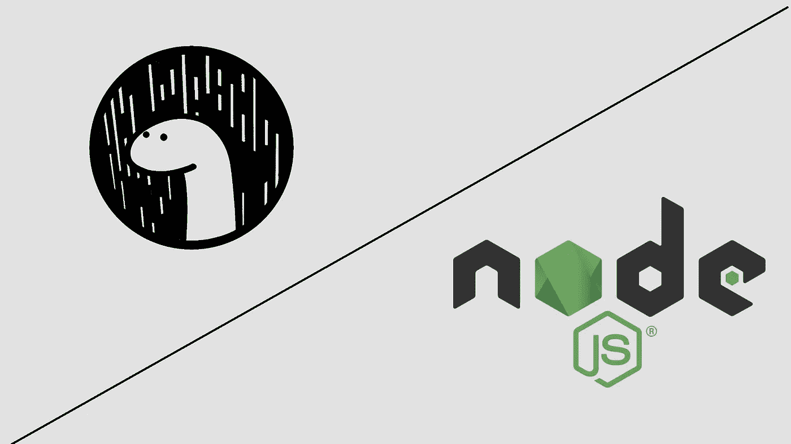

# Deno 与 Node:详细比较

> 原文：<https://blog.devgenius.io/deno-vs-node-a-detailed-comparison-af892a98a4e2?source=collection_archive---------1----------------------->

# 什么是德诺？

Deno 是一个编写工作端 JavaScript 的原始方法。它解决了作为节点的许多问题。它和 Node 是由同一个人创建的。它使用 V8 JavaScript 引擎，但其余的运行时是在 Rust 和 typescript 中实现的。

## 现在问题来了，Deno 利用 rust 的原因是什么？

Deno 可能是 Chrome V8 上安全的 TypeScript 运行时。它最初是在 Go 中编写的，现在在 Rust 中进行了修改，以远离潜在的垃圾收集器问题。Deno 类似于 Node js，但它以安全性为中心。Deno 提出的基本原理是 JavaScript。比拥有一个对你的东西了如指掌的竞争对手更可怕的是，Deno 是为了修复 Dahl 所看到的 NodeJs 的致命弱点——包括安全问题、集中式存储系统(npm)的使用和笨重的工具。

## 使用 Deno 的优势

1.  它使用 ES6 模块指南
2.  它与 Typescript with Deno 兼容:没有令人信服的理由来为您重新排列和样式化 Typescript，它只是开箱即用。
3.  毫无疑问，Rust 可能是一种非常快速的编程语言，可以让个人构建出可靠且高效的软件。
4.  它有很强的内置安全性。

# 什么是节点？

Node.js 是 Chrome V8 上的一个开源 Javascript 运行时环境，允许您毫不费力地开发快速和可伸缩的 web 应用程序。它使用场合驱动的、无阻碍的 I/O 模型，这使得它对于满足普通小工具的信息集中的正在进行的应用程序来说是轻量级的、熟练的和极好的。

节点 js 可以影响大量的并发请求。这通常是基本的解释；它立即被记录在设计师和大型组织中。节点可以影响多个并发请求，而不会给开发人员带来压力。由于流行的语言和许多程序的帮助和支持，它是所有编程语言中运行时间最快的。从各方面来看，Node 在前端世界的未来似乎是辉煌的，因为在进一步通知之前，没有 Node 的前端改进是不可想象的。

> 又念:[Deno 比 Node 快吗？](https://graffersid.com/deno-vs-node/)

# Deno 与 Node:详细比较

## 安全性:

Deno 非常重视安全性，并优先考虑它。它在沙箱中执行代码，而不是在 Node 中，所以默认情况下，我们的程序不能访问文件系统、网络、环境、变量和其他脚本的执行。如果我们想使用这些资源，我们必须在运行脚本时请求许可或使用相应的安全标志。

## 打字稿:

默认情况下，typescript 编译器是内置在 Deno 中的，你所要做的就是用点 T 作为扩展名来命名你的文件，然后你就可以在你的代码中使用 typescript 了。之后，你需要任何确认或安装。另一方面，在 Node 中，您必须安装一个 typescript update package.json，添加一个 TS 配置文件，并确保您的模块支持类型。

## 浏览器 API:

与 Node 不同，Deno 可以访问浏览器 API，这意味着您可以使用浏览器 API 中的任何内容，而无需安装任何额外的包。例如，您可以使用“开箱即用”。在 Node 中，您必须安装节点获取包。您可以直接访问窗口目标，从而获得更干净、更少的包装端口。

## ES 模块:

Deno 完全支持 ES 模块，所以我们可以像在 react 中一样使用导入。例如，ES 模块与 require 相比有两个主要优势，即导入依赖项的节点方式是同步加载资源，而导入是同步的，这在导入时性能更好，您可以只加载您需要的包并节省内存。

## 分散包:

有了 Deno，你可以忘记 NPM 软件包和大尺寸的节点模块文件夹。而是在加载时将包从 URL 和缓存导入到硬盘。这意味着导入的依赖项被缓存，如果您必须在其他地方使用它，您不必再次下载它。

## 荣誉奖测试:

Deno 有一个内置的测试运行器，我们可以用它来测试我们的 JavaScript 或 typescript 代码。如果您熟悉 Just 或 Jasmine 等流行的 JavaScript 测试库，您会对相同的文本很熟悉。

# 作者简介

Sidharth Jain，Graffersid， [**网络和移动应用程序开发公司**](http://graffersid.com/) 的创始人。Graffersid 有一个设计师团队和专门的远程开发人员。雇佣 react js 开发者，受 YC、哈佛、谷歌孵化、BluChilli 等初创公司的信任。他知道如何利用技术解决问题，并将其知识贡献给领先的博客网站。