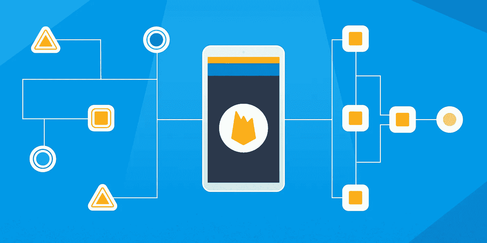

# iOS 中的依赖管理

> 原文：<https://blog.devgenius.io/dependancy-management-for-ios-27dd681d7ea0?source=collection_archive---------2----------------------->



# **什么是依赖管理器？**

软件包/依赖项管理器可以说是一种工具，它自动化了在我们的应用程序中安装、升级、配置和删除软件的过程。

假设我们需要在应用程序中处理网络请求，但是我们不想浪费时间去创建已经存在的东西。我们只是想使用一个健壮、可靠、制作精良、经过充分测试的现有框架。

这些框架是我们的应用程序所依赖的。

依赖项/包管理器帮助管理我们的应用程序中的依赖项。Alamofire 是我们为网络请求添加的一个框架/依赖项。

依赖项可以静态或动态地链接到 iOS 项目。

在静态链接中，所有依赖项都在编译时复制到项目中，而动态链接只允许通过在运行时加载依赖项来将它们的引用存储在我们的项目中。

像 UIKit 这样的系统框架是动态链接的，因此不需要每次修改应用程序时都进行更新。像 AFNetworking、ObjectMapper 这样的第三方框架可以静态或动态链接。

**手动依赖管理**

手动将依赖项添加到项目时，请遵循以下步骤:

1.  下载项目/将其添加为 git 子模块

```
$ git submodule add https://github.com/Alamofire/Alamofire.git

2\. Add a project to your existing project
```

打开新的`Alamofire`文件夹，将`Alamofire.xcodeproj`拖到应用程序 Xcode 项目的项目导航器中。

在项目导航器中选择`Alamofire.xcodeproj`,并验证部署目标是否与您的应用程序目标相匹配。

3.将框架添加到项目设置

在窗口顶部的标签栏中，打开“常规”面板。点击“嵌入式二进制文件”部分下的`+`按钮。根据需求选择框架`Alamofire.framework`，因为它包括 iOS 和 macOS 框架。

## **使用依赖关系管理器进行依赖关系管理:**

以下是 iOS 最常用的依赖管理器:

1.  椰子足类
2.  迦太基
3.  Swift 软件包管理器

软件包管理器应该具有以下能力:

*   将软件包和源代码集中托管在公共服务器上，供开发者或贡献者使用
*   在运行时下载源代码，这样我们就不需要将它包含在存储库中。
*   通过包含源文件，将源代码链接到我们的工作存储库。
*   允许对包进行版本控制

# **椰子**

1.  集中式依赖管理器
2.  可用于快速和客观的可可项目
3.  开源
4.  用 Ruby 构建
5.  Cocoa pods 基于名为 Specs.git 的主要中央回购协议
6.  Specs.git 托管所有框架规范
7.  为了让其他开发人员可以使用软件包管理器，软件包开发人员必须使用 pod 命令行将代码推送到这个 repo
8.  它的网站上有一个公共搜索特性，这样开发者可以在一个地方搜索不同的框架
9.  支持所有苹果平台——iOS、macOS、tvOS、watchOS

**安装** `$ sudo gem install cocoapods`

为了使用 Cocoa pods 集成依赖项，我们需要在项目根文件夹中创建 **Podfile** 。 **pod init** 命令将创建空的 Podfile。

使用 **pod install** 下载依赖项，这将生成 **Podfile.lock** 文件。

还会创建一个名为“ **Pods** 的文件夹。

```
platform :ios, '11.0'
use_frameworks!
target 'Project Name' **do**# Pods for "Project Name"
pod 'Alamofire', '~> 5.2'**end**
```

**COCOAPODS 和 XCODE 协作**

1.  Cocoapods 和 XCode 协同工作，将依赖关系集成到 iOS 项目中。
2.  **pod 安装**命令创建。 **xcworkspace** 文件放在。 **xcodeproj** 文件打开项目
3.  在项目根文件夹中创建 Podfile.lock 文件
4.  **Pod**目录，该目录包含添加到 Podfile 中的所有 Pod 依赖项的源代码。
5.  更改 XCode 项目设置。

**椰子——利弊**

**优点**

1.  易于设置和使用。
2.  自动完成所有 XCode 项目设置。在 iOS 项目中添加依赖项不需要手动设置。
3.  有许多贡献者可用，所以动态库可用于集成。使用 Cocoapods 网站上的公共搜索，轻松搜索图书馆。

**限制**

1.  它是建立在 Ruby 之上的，我们必须管理 Ruby 的依赖，比如 Bundler，Gems 等等
2.  CocoaPods 更新 Xcode 项目和文件就像变魔术一样，不知道发生了什么变化。
3.  集中的

# **袁绍**

1.  Carthage 是 Swift 和 Objective-C Cocoa 项目的分散依赖管理器
2.  **分散化:**Carthage 没有中央 specs.git 存储库。

这减少了维护工作和中心故障点的可能性。

1.  但是，我们需要检查每个依赖关系回购是否过期，而不是 Cocoa-pods 中的集中回购。
2.  支持所有苹果平台:iOS，MacOS，tvOS。watchOS
3.  Carthage 命令行工具只能在 Mac 上使用。
4.  开源
5.  使用 Swift 构建

**迦太基和 XCODE 协作**

1.  不会更改 XCode 和项目文件。
2.  控制 XCode 需要添加哪些文件。
3.  Carthage 很简单，只需添加和构建依赖项，让开发人员将二进制文件添加到项目中。

**第一步:**

**迦太基安装方法:**

安装 Carthage 有多种选择:

*   **安装人员**:

下载 Carthage 软件包安装程序

```
[https://github.com/Carthage/Carthage/releases](https://github.com/Carthage/Carthage/releases)
```

下载迦太基的最新版本:

```
[https://github.com/Carthage/Carthage/releases](https://github.com/Carthage/Carthage/releases)
```

选择最近的构建，然后在下载下选择 Carthage.pkg。

双击 **Carthage.pkg** 运行安装程序。点按“继续”，选择安装软件包的位置，再次点按“继续”，最后点按“安装”。

**可能的困难:**

如果 Carthage.pkg 未安装，您可能会看到一条消息，说明“Carthage.pkg 无法打开，因为它来自一个身份不明的开发人员。”

打开 finder 右击 Carthage . pkg→open with→Installer

安装过程开始选择安装位置，点击继续。

检查版本:

```
carthage version
```

*   **自制**

使用命令安装自制软件:

```
/usr/bin/ruby -e “$(curl -fsSL https://raw.githubusercontent.com/Homebrew/install/master/install)"
```

安装迦太基:

```
brew install carthage
```

如果你之前安装了 Carthage 的二进制版本，你应该删除`/Library/Frameworks/CarthageKit.framework`

*   **Macports** :

[https://www.macports.org](https://www.macports.org)

在下载下，选择最新的软件包。

为 macOS 安装 MacPorts **2.6.4**

**运行命令:**

```
sudo port selfupdate 
sudo port install carthage
```

**第二步:**

在“终端”中导航到项目的根目录

```
cd /Users/sukanksha.paralikar/Documents/POC/DemoCarthageDependencyManager
```

**第三步:**

使用 touch 命令创建一个空的 Cartfile:

```
touch Cartfile
```

使用命令打开 Cartfile:

```
Open -a Xcode Cartfile
```

添加要添加到项目中的依赖项

```
 github “Alamofire/Alamofire”
```

**第四步:**

键入命令以获取更新的依赖项。

```
carthage update — platform iOS
```

**第五步:**

Carthage 创建 Cartfile.resolved 文件，这样当你从服务器签出代码的时候，就应该在项目中添加相同版本的相同依赖项。

使用以下命令打开目录:

打开迦太基

迦太基目录有两个文件夹-

1.  构建-> iOS
2.  检验

Build 中有 iOS 文件夹，其中有添加到 cart 文件中的框架

“签出”文件夹包含添加到项目中的依赖项的源代码。

**第六步:**

在项目目标的“常规”设置选项卡上，在“链接的框架和库”部分，从磁盘上的 Carthage/Build 文件夹中拖放每个要使用的框架。

常规->链接的框架和库->添加文件夹->项目目录路径-> Carthage ->构建-> iOS -> Alamofire.framework

**第七步:**

在应用程序目标的“构建阶段”设置选项卡上，单击“+”图标并选择“新建运行脚本阶段”。创建一个运行脚本，在其中指定您的 shell(例如:/bin/sh)，将以下内容添加到 shell 下的脚本区域:

应用程序目标->构建阶段->图标->新运行脚本阶段->运行脚本->Shell

在外壳文本字段中键入以下内容:

```
/usr/local/bin/carthage copy-frameworks
```

检查->在构建日志中显示环境变量

选中->仅在安装时运行脚本

**第八步:**

在输入文件下:

```
$(SRCROOT)/Carthage/Build/iOS/“Result.framework”
```

**第九步:**

将复制框架的路径添加到“输出文件”中

1.  导航至*构建阶段*选项卡
2.  点击+按钮，选择*新建复制文件阶段*
3.  展开*复制文件*部分。
4.  对于*目的地*下拉列表，选择*框架*。
5.  将 *Alamofire.framework* 文件放到拖放目标中(此处显示“在此添加文件”)。出现提示时，勾选*目的地:如果需要，复制项目*复选框。
6.  同时确保勾选复选框*副本上的代码符号*。仅在安装框时不勾选*副本。*

**迦太基——优缺点:**

**优点**

1.  向开发人员提供控制，因为不涉及 XCode 项目
2.  分散

**限制**

1.  贡献者不多，因为迦太基有一个小的社区在工作。
2.  缓慢且不稳定
3.  需要许多手动步骤来使用 Carthage 集成依赖性。

# Swift 软件包管理器

**Swift**包管理器从**Swift**3.0 就有了。在 Xcode 11 中，苹果增加了 Swift 包管理器支持，用于管理 iOS 中 Swift 代码的分发。

一个 Swift 包主要包括两个部分:源代码，它是包的核心，以及一个*清单*文件，即 *Package.swift* ，它是包配置发生的地方。

要检查您是否安装了 Swift Package Manager:

> 快速构建–版本

**使用 SPM 创建一个包:**

打开终端并创建一个名为 Demo 的目录，然后进入 SPMDemo

```
mkdir SPMDemo
cd SPMDemo
```

**SPM —优缺点:**

**优点**

1.  Swift 的官方包管理工具
2.  由苹果公司管理
3.  在服务器端 swift 项目中非常有用

**限制**

1.  相对于椰子和迦太基的新工具
2.  仅支持 macOS 和 Linux

# 摘要

通过这种方式，我们看到了向您的 iOS 项目添加依赖项的不同方法及其优缺点。虽然我们有 cocoapods 和 Carthage，但与 Swift Package Manager 相比，它可能是苹果未来官方工具的更好选择。

快乐阅读:-)