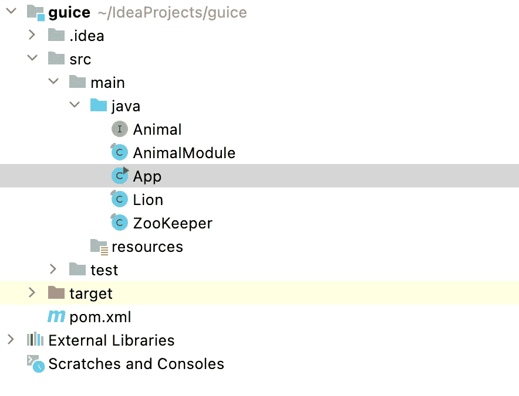

# 依赖注入:Guice 概述和示例-第 1 部分

> 原文：<https://blog.devgenius.io/dependency-injection-design-pattern-and-google-guice-examples-part-1-534d248025d2?source=collection_archive---------5----------------------->

# 概观

依赖注入(DI)是一种提供客户端依赖而不是后者显式获取它们的方法。DI 是一种设计模式，其中类的依赖关系被注入到类中。为了应用 DI，我们必须注入(绑定)请求它们的客户机的依赖项。在本文中，我们不仅可以手动实例化客户端类，还可以使用框架(Guice)来自动执行这些任务。

DI 有两个主要好处:

*   将应用程序代码中的类分离，以便于维护和扩展。
*   使单元测试更容易。

Guice 是一个开源的基于 Java 的 DI 框架。

> 简而言之，Guice 减少了在 Java 代码中对工厂和 new 的需求。把 Guice 的@Inject 当做新的 new。在某些情况下，您仍然需要编写工厂，但是您的代码不会直接依赖于它们。您的代码将更易于更改、单元测试和在其他上下文中重用。
> 
> Guice 支持 Java 的类型安全特性，尤其是在 Java 5 中引入的特性，比如泛型和注释。您可能认为 Guice 填补了核心 Java 缺失的特性。理想情况下，语言本身会提供大部分相同的特性，但是在这样的语言出现之前，我们有 Guice。
> 
> Guice 帮助你设计更好的 API，Guice API 本身就是一个很好的例子。Guice 不是厨房水槽。我们用至少三个用例来证明每个特性。当有疑问时，我们就把它排除在外。我们构建通用功能，使您能够扩展 Guice，而不是将每个功能添加到核心框架中。
> 
> Guice 旨在使开发和调试更容易、更快，而不是更难、更慢。在这种情况下，Guice 避开了惊喜和魔法。不管有没有工具，你都应该能够理解代码，尽管工具可以让事情变得更简单。当错误发生时，Guice 会额外生成有用的消息。

# 依赖注入示例

这个例子展示了不使用任何框架的 DI 的核心功能。这个例子有一个由具体类(Lion 类)实现的接口动物:

带功能语音的动物接口():

```
**public interface** Animal {
  String voice();
}
```

Lion 类实现了动物接口的语音功能，返回“grrrrr”。

```
**public final class** Lion **implements** Animal {
  @Override
  **public** String voice() { **return "grrrrr"**; }
}
```

ZooKeeper 类的构造函数将有一个动物作为参数，还有 getAnimal()的方法

```
**public final class** ZooKeeper {
  **private final** Animal **animal**;

  **public** ZooKeeper(Animal animal) {
    **this**.**animal** = animal;
  }

  **public** Animal getAnimal() {
    **return animal**;
  }
}
```

在主应用程序中，我们将绑定它们:

```
**public class** App {
  **public static void** main(String[] args) {
    ZooKeeper zooKeeper = **new** ZooKeeper(**new** Lion());
    System.***out***.println(zooKeeper.getAnimal().voice());
  }
}
```

它将打印输出:grrrrr

从上面的例子中我们可以看到，这是阿迪的实现，没有任何框架或库。我们称之为 DI 的原因是因为 ZooKeeper 类不知道它所调用的动物:

*   ZooKeeper 类依赖于 Animal 接口而不是 Lion 实现，所以这些类是解耦的。
*   在单元测试实现时，单元测试用例可以将一个模拟动物传递给动物园管理员，使单元测试更容易，而无需了解动物种类的细节。

# 指南示例

理解了上面的 DI 示例之后，在这一节中，我们将介绍如何用 Guice 实现同样的功能。让我们回顾一下下面这个使用 Guice 实现的例子。请注意，这只是一个简单的例子，用 Guice 演示 DI 概念。如果项目的代码有许多依赖项，Guice 的主要优势就体现出来了。

在 Maven central 上[可以使用](https://mvnrepository.com/artifact/com.google.inject/guice) [Guice](https://github.com/google/guice) 。要使用 Guice，我们需要在 Maven 中将这个依赖项添加到 pom.xml 文件中:

```
<**dependencies**>
  <**dependency**>
    <**groupId**>com.google.inject</**groupId**>
    <**artifactId**>guice</**artifactId**>
    <**version**>4.1.0</**version**>
  </**dependency**>
</**dependencies**>
```

首先，当我们让 Guice 创建一个类的实例时，它会找到标有@Inject 的构造函数。如果 Guice 可以找到，它会将该构造函数的参数理解为类的依赖项，并将注入它。参考下面的示例代码，看看我们如何注入来让 Guice 为构造函数注入一个动物:

```
import [javax.inject](https://source.corp.google.com/piper///depot/google3/third_party/java_src/jsr330_inject/java/javax/inject/package-info.java;rcl=458814561;l=155).[Inject](https://source.corp.google.com/piper///depot/google3/third_party/java_src/jsr330_inject/java/javax/inject/Inject.java;rcl=458814561;l=185);
**public final class** ZooKeeper {
  **private final** Animal **animal**;

  @Inject
  ZooKeeper(Animal animal) {
    **this**.**animal** = animal;
  }

  **public** Animal getAnimal() {
    **return animal**;
  }
}
```

Guice 还支持回退注入。但是，我们应该显式声明并标记@Inject to 构造函数，以澄清该类是由 Guice 创建的，如下面的示例 Lion 类:

```
import [javax.inject](https://source.corp.google.com/piper///depot/google3/third_party/java_src/jsr330_inject/java/javax/inject/package-info.java;rcl=458814561;l=155).[Inject](https://source.corp.google.com/piper///depot/google3/third_party/java_src/jsr330_inject/java/javax/inject/Inject.java;rcl=458814561;l=185);
**public final class** Lion **implements** Animal {
  @Inject Lion(){}
  @Override
  **public** String voice() { **return "grrrrr"**; }
}
```

其次，下面的代码告诉 Guice 如何通过继承 Guice AbstractModule 来了解依赖关系，并覆盖 configure()函数。这个函数将让 Guice 实例化实现类的一个实例。

```
**import** com.google.inject.AbstractModule;

**public final class** AnimalModule **extends** AbstractModule {
  @Override
  **protected void** configure() {
    bind(Animal.**class**).to(Lion.**class**);
  }
}
```

最后，在我们有了具有依赖关系的@Inject 构造函数和提供依赖关系的 AbstractModule 类之后，我们通过调用 Guice.createInjector()创建一个注入器来将它们联系在一起。

```
**import** com.google.inject.Guice;
**import** com.google.inject.Injector;

**public class** App {
  **public static void** main(String[] args) {
    Injector injector = Guice.*createInjector*(**new** AnimalModule());
    ZooKeeper zooKeeper = injector.getInstance(ZooKeeper.**class**);

    System.***out***.println(zooKeeper.getAnimal().voice());
  }
}
```

现在，这将打印到输出:grrrrr

这是上面示例的 Java Maven 项目结构:



Java 项目结构

# 摘要

在本文中，我们讨论了在 Java 应用程序中实现自动化 DI 任务的 Guice 的基本功能。我希望这个关于 Guice 功能的基本概述能帮助大家继续学习，并能应用到你的项目中。

接下来，我将撰写本系列的第 2 部分，这样我们就可以看到 Guice 如何帮助在项目中更容易地实现单元测试。

如果你喜欢这个故事，请[关注](https://medium.com/@techisbeautiful)、[让我](https://medium.com/subscribe/@techisbeautiful)成为第一个收到我下一个故事邮件的人。

[你可以在这里](https://medium.com/@techisbeautiful/membership)成为媒介会员，就可以**无限制访问**媒介平台上的每一个故事。如果你使用上面的链接，它也支持我，因为我有一个来自 Medium 的小佣金。谢谢大家！

# 参考

[1][https://github.com/google/guice](https://github.com/google/guice)