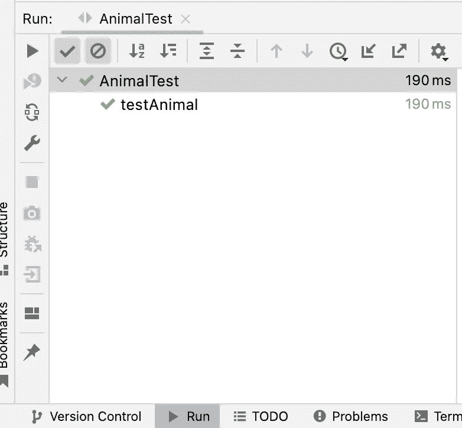

# 依赖注入:单元测试指南-第 2 部分

> 原文：<https://blog.devgenius.io/dependency-injection-google-guice-for-unit-testing-part-2-32ee351ec09f?source=collection_archive---------1----------------------->

# **概述**

在之前的[第 1 部分](https://medium.com/@techisbeautiful/dependency-injection-design-pattern-and-google-guice-examples-part-1-534d248025d2)中，我们探讨了依赖注入(DI)的基本功能以及如何用 Guice 实现 DI。在本文中，我们将探讨 Guice 如何帮助更容易地实现单元测试。

# 使用 DI 的单元测试示例

在更详细地讨论实现之前，我们应该考虑一下为什么单元测试会因为依赖注入而变得更简单？因为一个类的依赖关系都是通过它们的构造函数传递的，所以我们可以在单元测试用例中传递这些依赖关系的模仿或伪造。

让我们回顾一下[第一部分](https://medium.com/@techisbeautiful/dependency-injection-design-pattern-and-google-guice-examples-part-1-534d248025d2)中的例子，如果动物园管理员类必须直接构造一个狮子实例，那么我们就没有办法在没有狮子的情况下测试动物园管理员。在真实的项目中，Lion 类可能会有错误，或者创建一个新的实例非常昂贵。使用 Guice，因为 ZooKeeper 在其构造函数中采用了 Animal 接口，所以它不依赖于具体的 Animal 实现。在 ZooKeeper 的单元测试中，我们并不依赖于动物实现，而是创建一个非常简单的 MockAnimal 类，并将其传递给 ZooKeeper 的构造函数。例如，这是 ZooKeeperTest:

```
**import** org.junit.Test;
**import** org.junit.runner.RunWith;
**import** org.junit.runners.JUnit4;

@RunWith(JUnit4.**class**)
**public final class** ZooKeeperTest {
  @Test
  **public void** ownerTest() **throws** Exception {
    ZooKeeper zooKeeper = **new** ZooKeeper(**new** MockAnimal());

  }
}
```

MockAnimal 类很简单:

```
**public class** MockAnimal **implements** Animal {

  @Override
  **public** String voice() {
    **return "This is a mock animal"**;
  }
}
```

如上例，我们可以创建一个简单的单元测试类，不需要任何框架或库。这是编写单元测试用例时的最佳实践模式。然而，对于更复杂的项目，我们应该使用 Guice 为我们创建类实例。简单的方法是创建一个包含测试用例所需绑定的 AbstractModule，并调用 getInstance()方法来实例化测试用例下的类。这是一个如何使用提供 MockAnimal 绑定的 AnimalTestModule 编写一个测试的例子，该测试将 MockAnimal 类注入 ZooKeeper。

```
**import** com.google.inject.AbstractModule;

**public final class** AnimalTestModule **extends** AbstractModule {

  @Override
  **protected void** configure() {
    bind(Animal.**class**).to(MockAnimal.**class**);
  }
}
```

MockAnimal 类实现了第 1 部分示例中的 Animal 接口:

```
**import** javax.inject.Inject;

**public class** MockAnimal **implements** Animal {

  @Inject
  MockAnimal() {}

  @Override
  **public** String voice() {
    **return "This is a mock animal"**;
  }
}
```

这是真正的动画课:

```
**import** com.google.inject.Guice;
**import** javax.inject.Inject;
**import** org.junit.Assert;
**import** org.junit.Before;
**import** org.junit.Test;
**import** org.junit.runner.RunWith;
**import** org.junit.runners.JUnit4;
**import static** org.hamcrest.CoreMatchers.*instanceOf*;
**import static** org.junit.Assert.*assertThat*;@RunWith(JUnit4.**class**)
**public final class** AnimalTest {
  @Inject ZooKeeper **zooKeeper**;

  @Before
  **public void** setup() {
    Guice.*createInjector*(**new** AnimalTestModule()).injectMembers(**this**);
  }

  @Test
  **public void** testAnimal() **throws** Exception {
    Assert.*assertNotNull*( **"This object should not be null"**, **zooKeeper**);
    *assertThat*(**zooKeeper**.getAnimal(), *instanceOf*(MockAnimal.**class**));
  }
}
```

AnimalTest 类的输出:



测试用例通过

# 摘要

本系列第 1 部分和第 2 部分中涉及的 Guice 功能足以支持真实项目中的大多数用例。当然，Guice 还有其他一些特性。然而，这将增加一些复杂性，所以如果我们可以避免他们，如果可能的话。这些是 Guice 的一些高级功能，可以考虑未来的学习:Guice 中的[辅助对象](https://github.com/google/guice/wiki/AssistedInject)，多绑定[等。](https://github.com/google/guice/wiki/Multibindings)

如果你喜欢这个故事，请[关注](https://medium.com/@techisbeautiful)，[订阅我](https://medium.com/subscribe/@techisbeautiful)成为第一个收到我下一个故事的电子邮件的人。

[你可以在这里](https://medium.com/@techisbeautiful/membership)成为媒介会员，就可以**无限制访问**媒介平台上的每一个故事。如果你使用上面的链接，它也支持我，因为我有一个来自 Medium 的小佣金。谢谢大家！

# **参考文献**

[1][https://github.com/google/guice](https://github.com/google/guice)