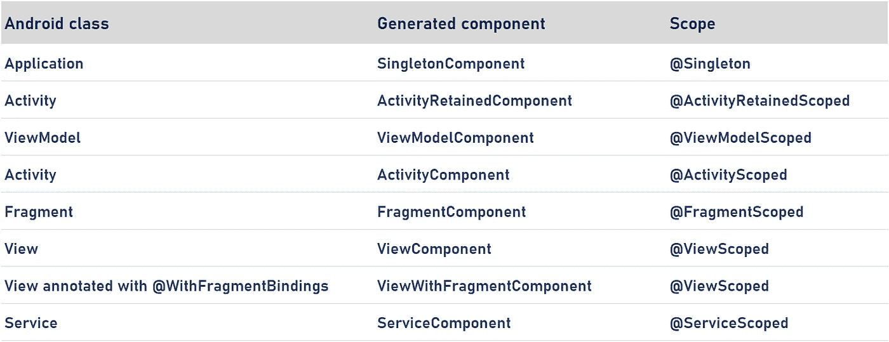

# 使用 Hilt 的依赖注入(Kotlin)

> 原文：<https://blog.devgenius.io/dependency-injection-with-hilt-kotlin-562963c6c779?source=collection_archive---------1----------------------->


一直以来， ***匕首*** 被用来做 ***依赖注入*** 的操作。然而， ***剑柄*** 最近已经作为一个 Jetpack 元素被包含在 ***匕首*** 上。通过这种方式，我们有了一个可以在 Android 上使用的更加简单有效的**依赖注入**框架。

那么，什么是**依赖注射**？

# 依赖注入

最简单的形式，我们可以把它想象成一个自动化 ***实例*** 创建的库。通过例子解释可能更容易。所以，让我们创建一个 Android 应用程序。

1-)首先，将***hilt-Android-gradle***插件添加到你项目的根 ***build.gradle*** 文件中:

```
buildscript {
    ...
    dependencies {
        ...
        classpath 'com.google.dagger:hilt-android-gradle-plugin:2.38.1'
    }
}
```

2-)然后，应用 Gradle 插件并将这些依赖项添加到您的***app/build . Gradle***文件中:

```
...
plugins {
  id 'kotlin-kapt'
  id 'dagger.hilt.android.plugin'
}android {
    ...
}dependencies {
    implementation "com.google.dagger:hilt-android:2.38.1"
    kapt "com.google.dagger:hilt-compiler:2.38.1"
}
```

**注意:**使用 Hilt 的项目需要 Android Studio 4.0 或更高版本。

3- ) Hilt 使用 Java 8 特性。要在您的项目中启用 Java 8，请将以下内容添加到***app/build . gradle***文件中:

```
android {
    ...
    compileOptions {
        sourceCompatibility JavaVersion.VERSION_1_8
        targetCompatibility JavaVersion.VERSION_1_8
    }
}
```

好了，我们准备了一个可以用 Hilt 的 Android 项目。那么，我们开始吧。

# 刀柄应用等级

首先，我们需要做的第一件事是创建一个类。然后，从 Application 类继承这个类，我们必须用 ***标注我们创建的这个类。***

```
@HiltAndroidApp
class MyApplication : Application()
```

我们必须在清单文件中定义下面的行。

```
<application
    android:name=".MyApplication"
    ...
```

这个生成的 Hilt 组件被附加到应用程序对象的生命周期中，并提供对它的依赖。此外，它是应用程序的父组件，这意味着其他组件可以访问它提供的依赖项。

# 将依赖注入 Android 类

使用*的地方——例如* ***活动*** *或* ***片段*** *-* 我们必须打开相关的类并创建一个入口点作为*。*

```
*@AndroidEntryPoint
class MainActivity : AppCompatActivity(){
      ...
}*
```

*Hilt 目前支持以下 Android 类:*

*   *应用程序(通过使用`@HiltAndroidApp`*
*   *ViewModel(通过使用`@HiltViewModel`*
*   *活动*
*   *碎片*
*   *视角*
*   *服务*
*   *广播接收机*

*如果你用`@AndroidEntryPoint`注释一个 Android 类，那么你也必须注释依赖于它的 Android 类。例如，如果您注释一个片段，那么您也必须注释任何使用该片段的活动。*

*让我们以一个例子来研究 ***喷射类型*** 以使其更容易理解。*

```
*class Car(brand: Brand, engine: Engine) { fun information(){
        *println*("Car information...")
    }
}class Engine {

}class Brand {

}*
```

*我们有一个汽车类，这个类从另外两个类中获取参数。虽然我们需要从 car 类创建一个对象，但我们也需要从 ***Brand*** 和 ***Engine*** 类创建一个对象。*

*为了自动创建 ***实例*** ，即使用 ***句柄*** ，我们必须使我们现有的 ***类可注入*** 。*

```
*class Car @Inject constructor(brand: Brand, engine: Engine) { fun information(){
        *println*("Car information...")
    }

}class Engine @Inject constructor() {}class Brand @Inject constructor() {}*
```

# *注射剂的种类*

> ***现场注射***

```
*@AndroidEntryPoint
class MainActivity : AppCompatActivity() {
    // Field Injection
    @Inject
    lateinit var firstCar : Car...
    override fun onCreate(savedInstanceState: Bundle?) {
        super.onCreate(savedInstanceState)
        setContentView(R.layout.*activity_main*)firstCar.information()}*
```

> ***构造函数注入***

```
*// Constructor Injection
class Brand @Inject constructor()*
```

# *什么是范围？*

****作用域*** 不是我们必须使用的 ***标注*** 。*

*但是如果我们要使用它，我们需要按照下表来使用它。*

**

*如果我们在范围中指定 Hilt 将创建的实例将依赖于哪个类，我们就可以创建更健康的项目。*

*让我们在上面展示的汽车类中指定一个范围。首先，看看我们在哪里创建了 Car 类的实例。*

*我们创建的实例在 MainActivity 类中。所以这是一个**活动课。**因此，我们有 3 种不同的范围可供选择。*

*   *`@Singleton`*
*   *`@ActivityRetainedScoped`*
*   *`@ActivityScoped`*

*如果我们在它们下面选择一个作用域，例如@FragmentScoped，应用程序将抛出一个错误。因为我们使用了类，所以我们在活动中创建了一个实例，而不是在片段中。*

*那么，下面的问题应该出现在我们的脑海中，如果我们使用我们将在活动类和片段中创建实例的类，我们会做什么？*

*答案很简单。在这两个范围中，应选择表中较高的一个。例如，如果我们在视图类和片段类中创建一个实例，我们应该查看表并选择 FragmentScope。*

# *界面问题*

*如何使用 ***刀柄*** 与 ***接口*** 一起工作？*

*让我们首先创建一个接口和一个实现它的类。*

```
*interface MyInterface { fun myPrintFunction(): String}class MyInterfaceImplementor @Inject constructor() : MyInterface { override fun myPrintFunction(): String {
        return "My Interface Implementor"
    }}*
```

*现在让我们打开另一个类，使用我们创建的这个接口。*

```
*class ClassExample @Inject constructor(
    private val myInterfaceImplementor: MyInterface
) {
    fun myFunction(): String {
        return "Working:${myInterfaceImplementor.myPrintFunction()}"
    }
}*
```

*我们不能从接口创建对象。因此，我们需要我们创建的 InterfaceImplementor 类来使用 Interface。但是我们还没有在上面的类中做这样的定义。*

*因此，如果我们试图运行下面的活动，我们将得到一个错误。因为我们没有告诉 ***刀柄*** 如何初始化 ***接口。****

```
*@AndroidEntryPoint
class MainActivity : AppCompatActivity() { @Inject
    lateinit var myClass : ClassExample override fun onCreate(savedInstanceState: Bundle?) {
        super.onCreate(savedInstanceState)
        setContentView(R.layout.*activity_main*)*println*(myClass.myFunction())*
```

# *模块*

*当使用**模块**时，我们需要使用**安装注释**。在 InstallIn 注释中，我们需要根据上面提到的表格给出一个**组件**。*

> ***@绑定***

*如果我们使用这个方法，我们将创建的类和函数必须是**抽象的**。根据 InstallIn 注释中给出的组件，我们应该给出一个方便函数的作用域。*

*例如:*

*   *@ install in(Singleton component::class)= > @ Singleton*
*   *@ install in(activity component::class)= > @ activity scoped*
*   *@ InstallIn(fragment component::class)= > @ FragmentScoped*

```
*@InstallIn(SingletonComponent::class)
@Module
abstract class MyModule {

    @Singleton
    @Binds
    abstract fun bindingFunction(myImplementor: MyInterfaceImplementor) : MyInterface}*
```

> ***@提供***

*这是 Android 希望我们使用的方法，在我看来，这比以前的方法更容易。我们所要做的就是告诉这个函数，它将返回一个 ***接口*** ，这个接口将是我们之前创建的 ***实现者*** 。*

```
*@InstallIn(ActivityComponent::class)
@Module
class MyModule { @ActivityScoped
    @Provides
    fun providerFunction() : MyInterface {
        return MyInterfaceImplementor()
    }
}*
```

*这种方法更适合与外部库一起使用。*

# *问题:接口被多次绑定！*

*我们只有一个接口和一个实现它的类。那么，如果我们有许多实现一个接口实现者类会怎么样呢？*

*我们必须使用更多的解释性注释。因此，我们必须创建自己的注释。*

> *在这种情况下，我们有一个接口和两个实现者，如下所示:*

```
*interface MyInterface { fun myPrintFunction(): String}class MyInterfaceImplementor @Inject constructor(): MyInterface { override fun myPrintFunction(): String {
        return "My Interface Implementor"
    }}class SecondInterfaceImplementor @Inject constructor() : MyInterface { override fun myPrintFunction(): String {
        return "My Second Interface Implementor"
    }}*
```

*同样，我们使用这些**接口**和**实现者**的类应该如下。*

```
*class ClassExample @Inject constructor(
    private val myInterfaceImplementor: MyInterface,
    private val mySecondInterfaceImplementor: MyInterface
) { fun myFunction(): String {
        return "Working: ${myInterfaceImplementor.myPrintFunction()}"
    } fun secondFunction(): String {
        return "Working: ${mySecondInterfaceImplementor.myPrintFunction()}"
    }}*
```

*最后，在我们的 ***模块类*** 中，我们必须定义我们添加的第二个实现者类。*

```
*@InstallIn(SingletonComponent::class)
@Module
class MyModule { @Singleton
    @Provides
    fun providerFunction() : MyInterface {
        return MyInterfaceImplementor()
    } @Singleton
    @Provides
    fun secondProviderFunction() : MyInterface {
        return SecondInterfaceImplementor()
    }
}*
```

> *我们什么都做了。有什么问题吗？为什么我的应用程序无法运行？*

*因为我们已经将两个不同的实现者连接到一个接口，并且我们使用了来自这些实现者的两个不同的函数。*

*我们在**模块类**中编写的函数返回 MyInterface。但是 ***句柄*** 从 MyInterface 中找不到使用哪个 ***实现者*** 。所以我们需要更详细的描述。*

# *创建我们自己的注释*

*我们为两个不同的实现者创建了两个不同的注释，如下所示。*

```
*@Qualifier
@Retention(AnnotationRetention.*BINARY*)
annotation class FirstImplementor@Qualifier
@Retention(AnnotationRetention.*BINARY*)
annotation class SecondImplementor*
```

*使用这些注释，我们可以告诉 ***柄*** 实现者将使用哪些类。*

```
*@InstallIn(SingletonComponent::class)
@Module
class MyModule { @FirstImplementor
    @Singleton
    @Provides
    fun providerFunction() : MyInterface {
        return MyInterfaceImplementor()
    } @SecondImplementor
    @Singleton
    @Provides
    fun secondProviderFunction() : MyInterface {
        return SecondInterfaceImplementor()
    }
}*
```

*然后，在我们使用实现者的类中，我们需要告诉构造函数我们已经创建了这些注释。*

*如下所示:*

```
*class ClassExample @Inject constructor(
    @FirstImplementor private val myInterfaceImplementor: MyInterface,
    @SecondImplementor private val mySecondInterfaceImplementor: MyInterface
) {}*
```

*这就是使用 Hilt 进行依赖注入的目的。感谢您的阅读。我希望这是对你有用的内容。*

*在创建这个资源时，我使用了 [Android 开发者文档](https://developer.android.com/training/dependency-injection/hilt-android)。如果需要，您可以通过单击链接来查看源代码。*

**

*[丹尼·米勒](https://unsplash.com/@redaquamedia?utm_source=medium&utm_medium=referral)在 [Unsplash](https://unsplash.com?utm_source=medium&utm_medium=referral) 上的照片*