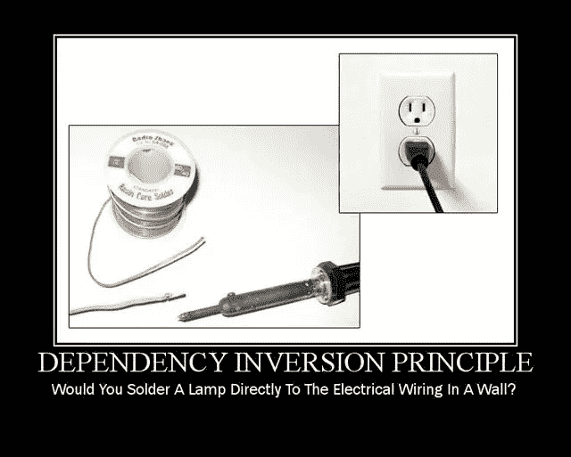

# C++ |固体如岩石中的从属反演原理

> 原文：<https://blog.devgenius.io/dependency-inversion-principle-in-c-solid-as-a-rock-79c3d86b9adc?source=collection_archive---------39----------------------->



**D**dependency**I**inversion**P**principle(在 C++中)是 SOLID as a Rock 设计原则系列的第五个&最后一个设计原则。坚实的设计原则集中于开发易于维护、可重用和可扩展的软件。在本文中，我们将看到一个带有流程&的示例代码，它在 DIP 的帮助下得到纠正。我们还将在文章的结尾看到指南&DIP 的好处。

> */！\:原载@*[](http://www.vishalchovatiya.com/category/design-patterns/)**。**

*顺便说一句，如果你还没有浏览过我以前关于设计原则的文章，下面是快速链接:*

1.  *[**S** RP —单一责任原则](http://www.vishalchovatiya.com/single-responsibility-principle-in-cpp-solid-as-a-rock/)*
2.  *[**O** CP —开启/关闭原理](http://www.vishalchovatiya.com/open-closed-principle-in-cpp-solid-as-a-rock/)*
3.  *[LSP—利斯科夫替代原理](http://www.vishalchovatiya.com/liskovs-substitution-principle-in-cpp-solid-as-a-rock/)*
4.  *[**I** SP —界面偏析原理](http://www.vishalchovatiya.com/interface-segregation-principle-in-cpp-solid-as-a-rock/)*
5.  *[**D** IP —依赖反转原理](http://www.vishalchovatiya.com/dependency-inversion-principle-in-cpp-solid-as-a-rock/)*

*您在这一系列文章中看到的代码片段是简化的，而不是复杂的。所以你经常看到我不使用像`override`、`final`、`public`(同时继承)这样的关键字，只是为了让代码紧凑&可消耗(大部分时间)在单一标准屏幕尺寸。我也更喜欢`struct`而不是`class`，只是为了节省代码行，有时不写`public:`，还会故意忽略[虚拟析构函数](http://www.vishalchovatiya.com/part-3-all-about-virtual-keyword-in-c-how-virtual-destructor-works/)，构造函数[，复制构造函数](http://www.vishalchovatiya.com/all-about-copy-constructor-in-cpp-with-example/)，前缀`std::`，删除动态内存。我也认为自己是一个务实的人，希望用尽可能简单的方式，而不是标准的方式或使用术语来传达一个想法。*

****注:****

*   *如果你是在这里被直接绊倒的，那么我建议你浏览一下[什么是设计模式？](http://www.vishalchovatiya.com/what-is-design-pattern/)一、哪怕是鸡毛蒜皮的小事。相信会鼓励你对这个话题进行更多的探索。*
*   *您在本系列文章中遇到的所有这些代码都是使用 C++20 编译的(尽管我在大多数情况下使用了 C++17 之前的现代 C++特性)。因此，如果你无法获得最新的编译器，你可以使用已经预装了 boost 库的[https://wandbox.org/](https://wandbox.org/)。*

# *目的*

> **= >高层模块不应该依赖低层模块。两者都应该依赖于抽象。抽象不应该依赖于细节。细节应该依赖于抽象。**

*   *上面的线一开始可能看起来很神秘，但是不要停留在这里，继续前进。你会通过例子得到它。*

***高层&低层模块有哪些？***

****= >*** **高层模块** : *描述操作*本质上更抽象&包含更复杂的逻辑。这些模块在我们的应用程序中编排低级模块。
***=>*****低层模块** : *描述实现*更具体的&个别到组件关注细节&应用的更小部分。这些模块在高级模块中使用。*

# *违反依赖倒置原则*

```
*enum class Relationship { parent, child, sibling };struct Person {
    string      m_name;
};struct Relationships {      // Low-level <<<<<<<<<<<<-------------------------
    vector<tuple<Person, Relationship, Person>>     m_relations; void add_parent_and_child(const Person &parent, const Person &child) {
        m_relations.push_back({parent, Relationship::parent, child});
        m_relations.push_back({child, Relationship::child, parent});
    }
};struct Research {           // High-level  <<<<<<<<<<<<------------------------
    Research(const Relationships &relationships) {
        for (auto &&[first, rel, second] : relationships.m_relations) {// Need C++17 here
            if (first.m_name == "John" && rel == Relationship::parent)
                cout << "John has a child called " << second.m_name << endl;
        }
    }
};int main() {
    Person parent{"John"};
    Person child1{"Chris"};
    Person child2{"Matt"}; Relationships relationships;
    relationships.add_parent_and_child(parent, child1);
    relationships.add_parent_and_child(parent, child2); Research _(relationships); return EXIT_SUCCESS;
}*
```

*   *当后来`Relationships`的容器从`vector`变成`set`或任何其他容器时，你需要在许多地方改变，这不是一个很好的设计。即使仅仅是数据成员的名字，例如`Relationships::m_relations`发生了变化，您也会发现自己破坏了代码的其他部分。*
*   *如您所见，低级模块(即`Relationships`)直接依赖于高级模块(即`Research`)，这实质上违反了 DIP。*

# *依赖性倒置原则示例*

*   *相反，我们应该创建一个抽象，并将低级和高级模块绑定到这个抽象上。考虑以下修复:*

```
*struct RelationshipBrowser {
    virtual vector<Person> find_all_children_of(const string &name) = 0;
};struct Relationships : RelationshipBrowser {     // Low-level <<<<<<<<<<<<<<<------------------------
    vector<tuple<Person, Relationship, Person>>     m_relations; void add_parent_and_child(const Person &parent, const Person &child) {
        m_relations.push_back({parent, Relationship::parent, child});
        m_relations.push_back({child, Relationship::child, parent});
    } vector<Person> find_all_children_of(const string &name) {
        vector<Person> result;
        for (auto &&[first, rel, second] : m_relations) {
            if (first.name == name && rel == Relationship::parent) {
                result.push_back(second);
            }
        }
        return result;
    }
};struct Research {                                // High-level <<<<<<<<<<<<<<<----------------------
    Research(RelationshipBrowser &browser) {
        for (auto &child : browser.find_all_children_of("John")) {
            cout << "John has a child called " << child.name << endl;
        }
    }
    //  Research(const Relationships& relationships)
    //  {
    //    auto& relations = relationships.relations;
    //    for (auto&& [first, rel, second] : relations)
    //    {
    //      if (first.name == "John" && rel == Relationship::parent)
    //      {
    //        cout << "John has a child called " << second.name << endl;
    //      }
    //    }
    //  }
};*
```

*   *现在不管容器的名称或容器本身在低级模块、高级模块或 DIP 之后的代码的其他部分中发生变化，都将保持不变。*
*   *依赖倒置原则(DIP)表明，最灵活的系统是那些源代码依赖仅指抽象而非具体的系统。*
*   *这就是为什么大多数有经验的开发人员使用 STL 或库函数以及通用容器的原因。甚至在适当的地方使用`auto`关键字可能有助于用不太脆弱的代码创建通用行为。*
*   *有许多方法可以实现 DIP，只要 C++关注大多数人使用静态多态性(即 [CRTP](http://www.vishalchovatiya.com/7-advanced-cpp-concepts-idiom-examples-you-should-know/#CRTP) 除非他们需要动态的一个)，模板特殊化，[适配器设计模式](http://www.vishalchovatiya.com/adapter-design-pattern-in-modern-cpp/)，[类型擦除](http://www.vishalchovatiya.com/7-advanced-cpp-concepts-idiom-examples-you-should-know/#Type-Eraser)等等。*

# *制作依赖倒置原则(DIP)友好软件的标准*

*   *如果你发现实施 DIP 很困难，那么就先设计抽象&在抽象的基础上实现你的高级模块。而无需了解低级模块或其实现。因为这种流程的 DIP 也被称为 ***编码到*** 接口。*
*   *请记住，所有低级模块/ [子类](http://www.vishalchovatiya.com/memory-layout-of-cpp-object/)都遵循[利斯科夫替换原则](http://www.vishalchovatiya.com/liskovs-substitution-principle-in-cpp-solid-as-a-rock/)。这是因为低级模块/ [子类](http://www.vishalchovatiya.com/inside-the-cpp-object-model/)将通过抽象接口使用，而不是具体的类接口。*

# *利益*

# *= >可重用性*

*   *实际上，DIP 减少了不同代码之间的耦合。因此我们得到了可重用的代码。*

# *= >可维护性*

*   *同样重要的是要提到改变已经实现的模块是有风险的。通过依赖抽象&而不是具体的实现，我们可以通过不改变项目中的高层模块来降低风险。*
*   *最后，当正确应用时，DIP 在我们的应用程序的整个架构级别上给我们带来了灵活性和稳定性。我们的应用程序将能够更安全地发展，变得稳定和健壮。*

# *结论*

*如你所见，我们举了一个基本的代码例子&把它转换成一段可重用的、灵活的、模块化的代码。如果我必须用简单而简短的句子来总结 DIP，那么应该是这样的:*

> **除非有充分的理由，否则不要直接使用具体对象。用抽象代替。**

*DIP 训练我们从行为的角度考虑类，而不是从构造或实现的角度。*

*[有什么建议，查询或者想说](http://www.vishalchovatiya.com/contact-2/) `[Hi](http://www.vishalchovatiya.com/contact-2/)` [？减轻压力，只需点击一下鼠标。](http://www.vishalchovatiya.com/contact-2/) 🖱️*