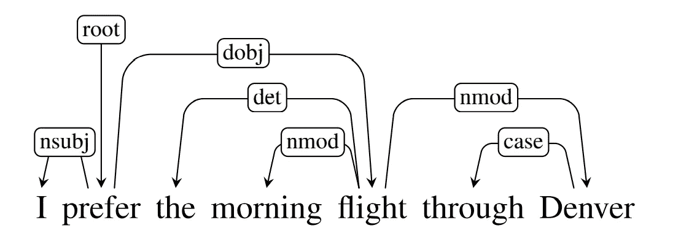
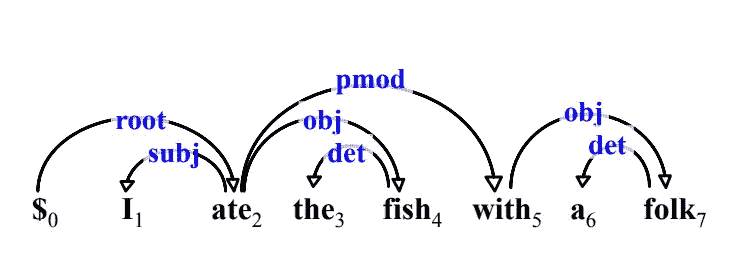
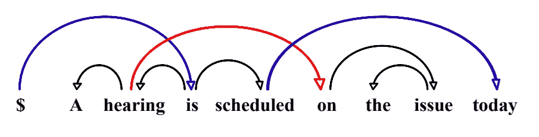
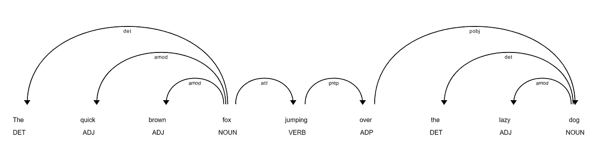
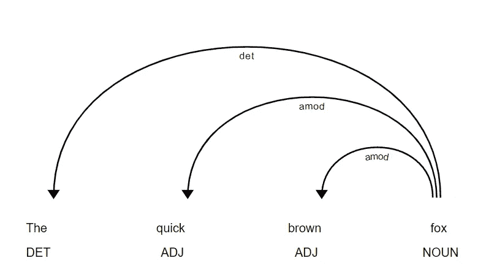

# 相依性剖析[NLP，Python]

> 原文：<https://blog.devgenius.io/dependency-parsing-nlp-python-9e5a214f47af?source=collection_archive---------4----------------------->



来源:语音和语言处理——丹尼尔，詹姆斯

依存结构显示了哪个单词或短语依赖于其他哪个单词或短语。我们使用基于依存关系的解析来分析和推断句子中的结构和语义依存关系以及标记之间的关系。

单词之间的关系如上图所示，从**头到家属**的有向*标注弧线*。它还包括根节点，明确标记整个句子结构的头部。
(如上图:-
**prefer →** 为根节点，
**flight →** 为→ **the** and，
“the”为 dependent，与 flight 相关，为 ***限定词*** ，用` **det`** 表示)

依存句法分析在信息抽取、问题回答、共指消解以及自然语言处理的许多方面都很有用。

依赖形式
我们正在讨论简单有向图的依赖结构。我们表示结构 G = (V，A ),其中 V 是顶点集，A 是弧集——这表示关系。

一棵依赖树应该满足几个约束:
-单头
-连通
-非循环

总之，这些约束确保每个单词都有一个中心词，依存结构是相连的，并且有一个根节点，从该节点可以沿着唯一的有向路径到达句子中的每个单词

**投射性**

它强加了源自单词顺序的附加约束。如果有一条从中心词到句子中心词和从属词之间的每一个词的路径，则称它是投射的。如果组成依赖树的所有弧都是射影的，那么就说依赖树是射影的。非正式地，“射影”意味着树不包含任何交叉弧。并且非投影依赖树包含交叉弧。

**射影-**



投射依赖[来源:依赖解析:陈文亮、李政华、张敏的过去、现在和未来]

**非投射-**



非投射依赖[来源:依赖解析:过去、现在和未来，作者:陈文亮、李政华、张敏]

如果你想深入了解，我建议你看看这篇关于依存句法分析的文章——链接
你应该看看《语音和语言处理》第 14 章——作者丹尼尔·朱拉夫斯基&詹姆斯·马丁。

**依赖标签**

你可以在这里查看标签的说明。

## 履行

让我们看看“快速的棕色狐狸跳过懒惰的狗”的依赖结构

## 空间依赖分析

```
import spacy 
from spacy import displacy 
nlp = spacy.load("en_core_web_sm")sentence = "The quick brown fox jumping over the lazy dog"
doc = nlp(sentence)print(f"{'Node (from)-->':<15} {'Relation':^10} {'-->Node (to)':>15}\n")for token in doc:
    print("{:<15} {:^10} {:>15}".format(str(token.head.text), str(token.dep_), str(token.text)))displacy.render(doc, style='dep')
```

`token.dep_` →显示依赖关系
`token.head.text` →显示头像
`token.head.text` →显示依赖关系

`{:<15} {:^10} {:>15}` →它只是用于格式化字符串以获得漂亮的输出。你可以在这里查看如何格式化

输出:

```
Node (from)-->   Relation     -->Node (to) fox                det                 The
fox                amod              quick
fox                amod              brown
fox                ROOT                fox
fox                acl             jumping
jumping            prep               over
dog                det                 the
dog              compound             lazy
over               pobj                dog
```



让我们检查这个依赖树的子部分



上图中*狐狸*和*【The，quick，brown】*之间有关系，如你所知**是限定词，因此从“狐狸”指向“The”**的关系被命名为***det****(*限定词*)，“狐狸”到“quick”【brown】的关系被命名为*****

## *****节依赖分析*****

```
***import stanza
stanza.download('en')nlp = stanza.Pipeline(lang='en', processors='tokenize,mwt,pos,lemma,depparse')doc = nlp("The quick brown fox jumping over the lazy dog")for sent in doc.sentences:
    for word in sent.words:
        print(f'id:{word.id}\tword: {word.text}\thead id: {word.head}\thead: {sent.words[word.head-1].text if word.head > 0 else "root"}\tdeprel: {word.deprel}', sep='\n')***
```

*****`word.deprel` →此处显示依赖关系
输出:*****

```
***id: 1	word: The	head id: 4	head: fox	deprel: det
id: 2	word: quick	head id: 4	head: fox	deprel: amod
id: 3	word: brown	head id: 4	head: fox	deprel: amod
id: 4	word: fox	head id: 0	head: root	deprel: root
id: 5	word: jumping	head id: 4	head: fox	deprel: acl
id: 6	word: over	head id: 9	head: dog	deprel: case
id: 7	word: the	head id: 9	head: dog	deprel: det
id: 8	word: lazy	head id: 9	head: dog	deprel: amod
id: 9	word: dog	head id: 5	head: jumping	deprel: obl***
```

*****你可以在这里查看更多关于节依赖解析器的信息。*****

*******Spark NLP 依赖解析器:**你可以在这里检查这个[的代码。](https://colab.research.google.com/github/JohnSnowLabs/spark-nlp-workshop/blob/master/tutorials/streamlit_notebooks/GRAMMAR_EN.ipynb#scrollTo=TzJSQhTnFix5)*****

*****你可以在 [corenlp.run](http://corenlp.run/) 上在线尝试斯坦福 corenlp 依赖解析*****

*****我希望这能理清一些思路，并有助于实现依赖解析。*****