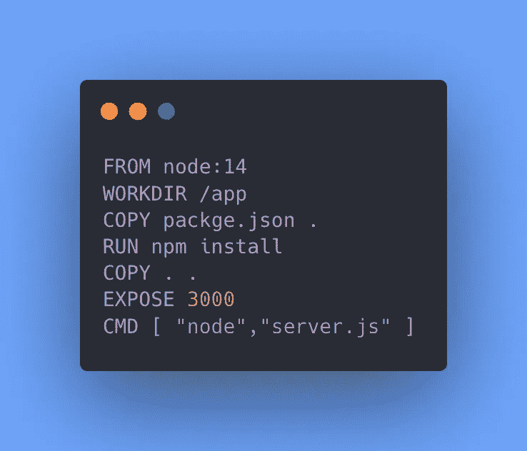
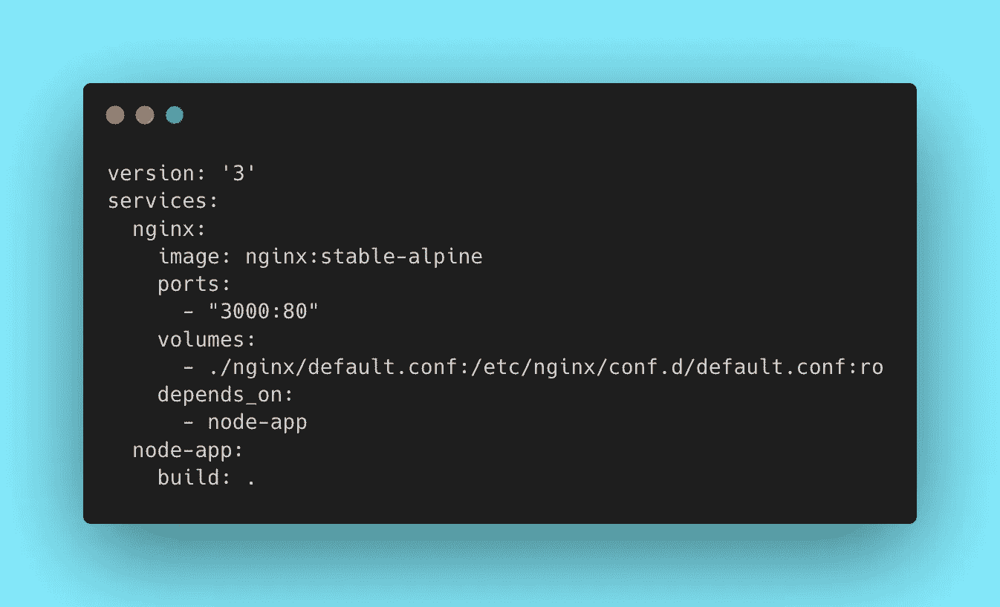
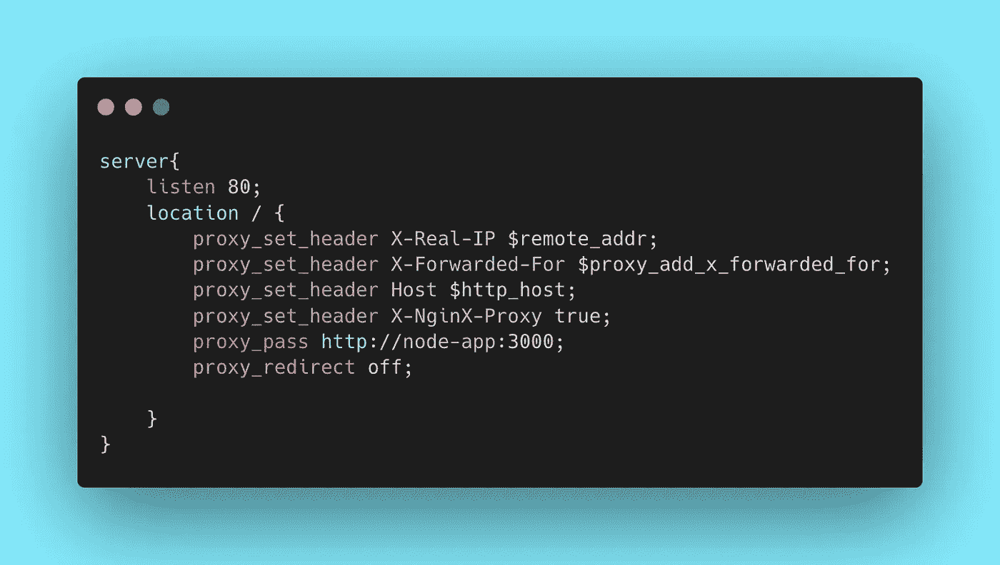
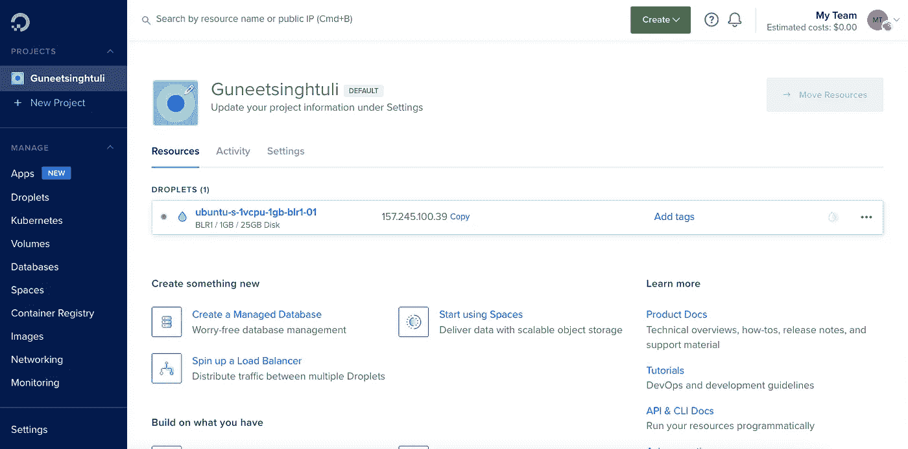

# 在 5 分钟内在数字海洋水滴上部署 NodeJS 应用程序

> 原文：<https://blog.devgenius.io/deploy-a-nodejs-application-on-digital-ocean-droplet-in-5-minutes-936b4835c440?source=collection_archive---------7----------------------->


为了将我们的应用程序托管到数字海洋水滴中，我们将使用

1.  Nginx，它是一个 web 服务器(如果你以前没用过也不用担心)
2.  一个基本的 NodeJS 应用程序(您可以在您的应用程序中尝试一下)
3.  docker——这不是必须的，但是它使部署变得更加容易

我们可以从创建一个基本的 NodeJS 应用程序开始，如果你现在还没有，你可以从[这里](https://github.com/Guneetsinghtuli/basic-node.git)克隆它。现在我们在同一个页面上，我们可以开始编辑 Dockerfile 文件。



你可以复制上图中的命令，要了解每个命令的更多信息，你可以阅读[这里](https://guneetsinghtuli.medium.com/dockerize-your-nodejs-application-in-5-minutes-ad0ee052b75e)。确保安装 Docker 桌面来运行和测试 Docker 文件。

为了通过创建容器来测试 Dockerfile，您可以运行以下命令。首先，您需要使用命令创建一个映像

```
docker build --tag node-app .
```

然后，您可以使用命令从映像 **node-app** 创建一个容器。成功创建容器后，您可以尝试在**"**[**http://localhost:3000/**](http://localhost:3000/)**"上进行操作，这将返回您“嘿，你好！”**。

```
docker run -p 3000:3000 -d --name node-app-container node-app
```

如果你已经成功地达到了这里，你会很棒，如果你发现任何问题，请确保你评论出来，以便我们可以帮助你。

我们已经完成了设置应用程序的第一件事，现在是配置 Nginx 服务器的时候了，为此我们必须创建另一个运行 Ngnix 的容器。

由于处理许多容器变得很麻烦，我会使用 **docker-compose** 来处理。让我们从**创建一个名为“docker-compose . yml”**的文件开始。docker-compose 文件将包含我们可以在一个命令中启动和停止的所有服务(容器)



**确保复制代码，因为它与上面的缩进相同，因为在 yaml 文件中缩进非常重要。如果你写的一切都很完美，我们可以创建一个 nginx 文件夹，在这个文件夹中我们将拥有 nginx 的所有配置。**

在 nginx 文件夹中创建一个“default.conf”文件。



完成 nginx 和 docker-compose 的配置后，可以使用下面的命令测试一切是否顺利

```
docker-compose up -d
```

如果一切顺利，你会看到“嘿，你好！”在“ [http://localhost:3000/](http://localhost:3000/) 上”。

祝贺您，因为您已经成功解决了部署过程中最困难的问题，所以让我们来完成所有其他步骤吧。

是时候在数字海洋上创建一个水滴了，我会选择一个 Ubuntu 5$机器，因为我只需要学习。在您的 droplet 准备好之后，您可以使用



```
ssh root@<your-ip-address>
```

现在我们需要将 Docker 安装到这个服务器或 droplet 中。你可以本本[](https://www.digitalocean.com/community/tutorials/how-to-install-and-use-docker-on-ubuntu-20-04)****来了解一下如何安装它。****

**要确认 docker 是否成功下载，您可以使用以下命令。其中显示了当前安装的 docker 版本。默认情况下，您可能最终没有安装 docker-compose，但是可以使用下面提到的命令来安装它**

```
docker -v
sudo apt install docker-compose
```

**当你在服务器上安装完所有的东西后，是时候把源代码放到服务器上了，你可以把所有的代码提交到你自己的 github 库，然后在服务器上下载。**

**这会将您的源代码克隆到服务器上。这不是部署应用程序的完美方式，但是因为您是第一次这样做，所以这不会是一个问题。**

****我很快会写另一篇关于最佳部署方式的文章，所以请务必订阅，现在您可以使用**来克隆存储库了**

```
git clone <code-repo>
cd <repo>
```

**现在只需使用**

```
docker-compose up -d
```

**尝试点击 IP，检查是否一切正常，确保运行 hhtp 连接，而不是 https，否则你什么也看不到。如果一切都做得很成功，你会唱“嘿，你好！”**

> ****我希望你喜欢它，并从这个故事中学到很多，如果你不想错过我发布另一个故事的任何时间，请确保关注我并订阅以获得电子邮件更新。****

***你可以关注我的*[***Twitter***](https://twitter.com/Guneetsingh02)*和*[***Linkedin***](https://www.linkedin.com/in/guneetsinghtuli/)*在我分享更多信息的地方。***