# 使用 Github 操作和 Bitbucket 管道将 React 应用程序部署到亚马逊 S3

> 原文：<https://blog.devgenius.io/deploy-a-react-app-to-amazon-s3-using-github-actions-and-bitbucket-pipelines-74791ae10a7c?source=collection_archive---------2----------------------->

**本演练是一个简单的分步指南，介绍如何使用 Github 操作或 Bitbucket 管道将 React Web 应用程序部署到亚马逊 S3**

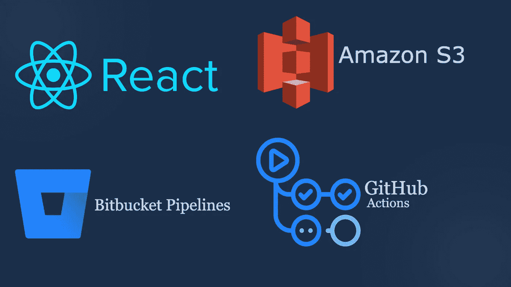

# 亚马逊简单存储服务(S3)？

亚马逊简单存储服务(S3)是亚马逊网络服务(AWS)提供的众多服务之一，AWS 是一个按需云计算平台。亚马逊 S3 通过一个 web 服务接口提供可伸缩的对象存储，该接口用于在任何时间从 web 上的任何地方存储和检索任何数量的数据。

# Github Actions？

当使用 Github 时，GitHub Actions 可以轻松地自动化您的工作流，如构建、测试和部署，GitHub 是一个使用 Git 为软件开发版本控制提供托管的平台。

在这篇文章中，我们将介绍:

1.  如何创建一个亚马逊 S3 桶？
2.  如何建立一个虚拟主机 S3 桶？
3.  如何配置我们的 Github 动作来自动将变更部署到 S3 存储桶。最后部署一个 React App 来直播。

在我们开始之前，您需要:

1.  Github 帐户
2.  比特桶帐户
3.  AWS 帐户

# 创建亚马逊 S3 桶

首先，登录您的 AWS 帐户。在 AWS 管理控制台上，从`Storage`部分下的服务列表中单击`S3`或使用搜索栏。

在`Amazon S3`页面上，点击`Create Bucket`

要创建一个桶，提供一个`Bucket Name`。在亚马逊 S3 的所有桶中，桶名必须是唯一的。另外，记下您正在创建的 bucket 所在的`Region`。对于这篇文章，我们使用的是`Asai Pacific(Tokyo)`，也就是`ap-northeast-1`

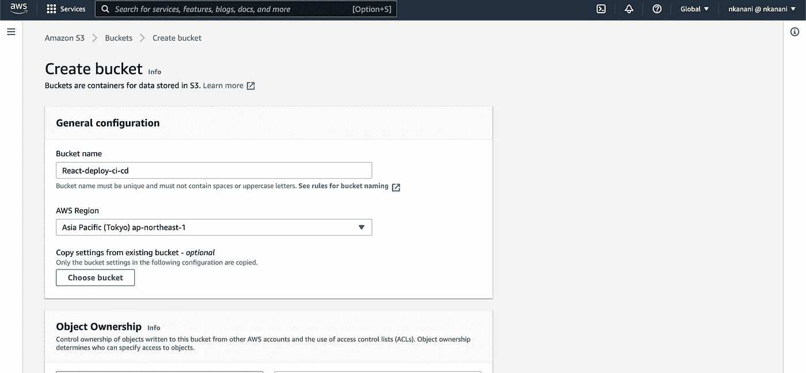

取消勾选`Block all public access`的复选框。之后，点击`Create bucket`。

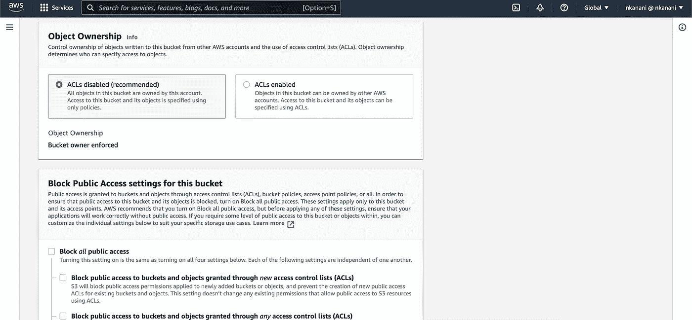

## 添加存储桶策略

这使得您的存储桶的内容可以公开。当使用`S3`铲斗时，不建议采取此动作，但对于我们的目的来说，这是可以的。

在 Buckets 下，选择您的 bucket 的名称`(react-deploy-ci-cd)` >选择`Permissions` >选择`Bucket Policy`。

复制以下存储桶策略，并将其粘贴到编辑器中。

更新代码片段以包含您的存储桶名称。在存储桶策略中，`<bucket-name>`您必须更新此名称以匹配您的存储桶名称。
然后，点击`Save changes`

## 启用静态网站托管

选择`Properties` >选择`Static website hosting`。点击编辑并启用静态网站托管。

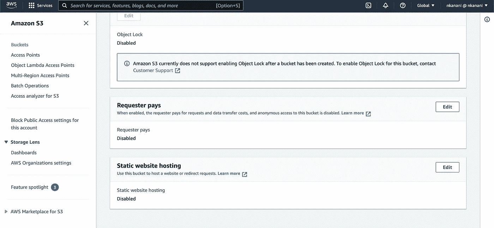

在静态网站托管中选择启用并在`Index document`字段中输入`index.html`和`Save changes`。

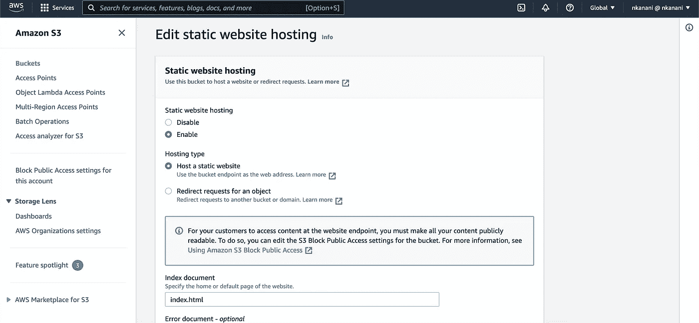

**注意:记下端点 URL，我们的网站将可在使用此 URL 的浏览器中访问。**

## 创建 React 应用并将其推送到 GitHub 和 Bitbucket

现在我们有了我们的 S3 桶，是时候创建并把我们的 React 应用程序推送到 GitHub 了。

*   在 GitHub 上创建一个`New Repository`。
*   在 Bitbucket 上创建一个`New Repository`。

创建存储库后，您可以:

*   使用 [Create React App](https://create-react-app.dev/) 创建一个 React 应用程序，并确保在`package.json`文件中有一个构建脚本将输出到`dist`文件夹。**或**克隆我们将在这篇文章中使用的样本 React 应用库`S3-Github Actions React App`，并添加您的库的`remote` URL。 [GitHub 回购- S3-Github 行动反应 App](https://github.com/kananinirav/react-pipeline)

为了设置我们的工作流，我们需要在 other 中提供`S3`桶的`AWS_ACCESS_KEY_ID`和`AWS_SECRET_ACCESS_KEY`和`AWS_REGION`，以便成功连接到亚马逊 S3。

## 获得 AWS 授权

在 AWS 控制台上:

1.  点击`IAM`
2.  点击`Users`并选择您的首选用户。
3.  在`Security Credentials`下，点击`Create Access Key`。这将创建一个`AWS_ACCESS_KEY_ID`和`AWS_SECRET_ACCESS_KEY`，复制这些值。您还可以通过删除或停用密钥来管理密钥访问。

永远不要共享您的访问密钥。

这就是为什么我们会在 GitHub 上传递一些非常重要的值作为`Secrets`，然后在工作流文件中使用表达式语法访问它们。`${{ <expression> }}`

## 回到 Github

点击`Settings`标签，在左侧菜单中选择`Secret`，然后点击`New Secret`添加一个提供`Name`和`Value`的秘密。

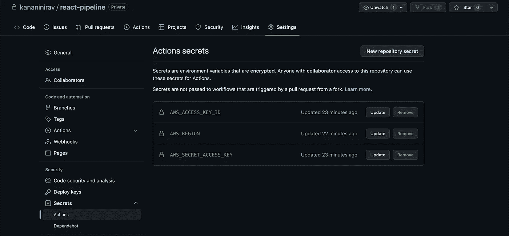

# 设置 Github 操作

现在，我们已经设置了`S3` bucket 并部署了一个 React 应用程序。

在 GitHub 存储库上，点击`Actions`选项卡打开 Github actions 页面。在`Actions`页面上，点击`set up a workflow yourself ->`按钮，这将重定向到一个包含一些代码的 web 编辑器的新页面。

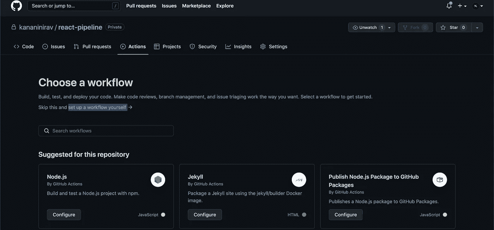

首先，让我们命名工作流文件。您可以将文件名保留为`main.yml`，但最好给它一个描述性的名称。将代码片段复制并粘贴到编辑器中。复制粘贴，一个开发者的超能力。

现在，让我们分解上面的代码片段。

*   `name`:我们定义这个动作的名字。这将用于在您可能拥有的其他操作中识别操作。
*   `on`:我们用`on` : `push`定义触发器，也是分支。这个工作流将在您向`master`分支`push`编码的任何时候运行。
*   `jobs`:工作流运行由一个或多个作业组成，默认情况下它们并行运行。
*   `steps`:作业包含一系列称为步骤的任务。步骤可以在您的存储库中运行命令、运行设置任务或运行操作，并且每个步骤都以`uses:`或`name:`开始。
*   **actions/checkout@v3** :这个操作签出您的存储库，这样您的工作流就可以访问它。
*   **aws-Actions/configure-AWS-credentials @ v1**:配置 AWS 凭证和区域环境变量，供其他 GitHub 操作使用。
*   **Build React App** :这个步骤块安装节点包，运行`package.json`文件中的`build`，在根目录下创建一个`build`文件夹。
*   **将应用构建部署到 S3 存储桶**:这将新创建的构建部署到`S3`存储桶`<bucket-name>`(用您的`S3`存储桶的名称替换`<bucket-name>`)。我的是`react-deploy-ci-cd`)。

要保存，点击`Start Commit`，然后点击`Commit New File`。这份遗嘱，

*   保存动作，创建一个`.github`目录，其中有一个`workflows`目录，包含新文件`main`(您之前使用的文件名)
*   触发动作。

要检查进度，请点击`Actions`选项卡。

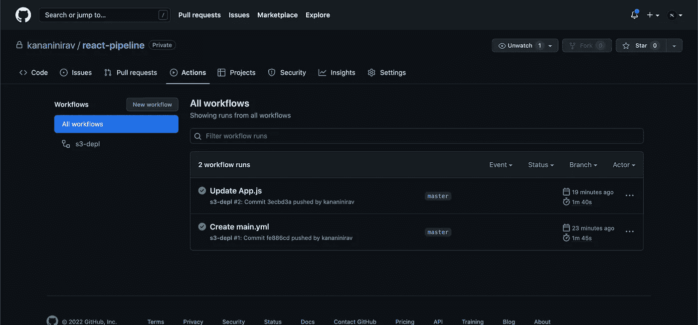

# 设置位桶管道

为您的存储库设置部署变量。

在 Bitbucket 存储库上，打开**存储库设置**页面，单击**部署**，根据您的环境创建变量，我们将在此处为生产环境创建变量。

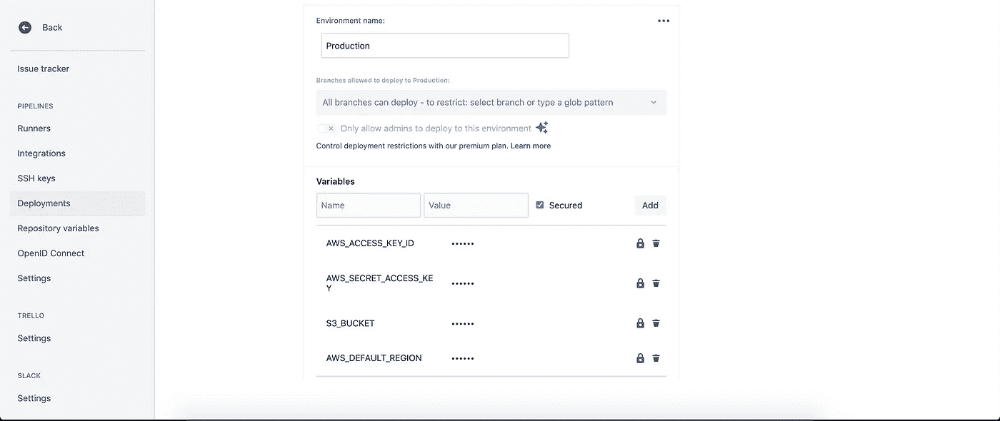

之后，对于 bitbucket 管道，添加名为 bitbucket-pipelines.yml 的新文件，并将代码片段复制并粘贴到文件中。

如果使用 aws-cloudfront，那么取消对 yml 文件中最后一个管道的注释，并**删除 ACL: public-read** 。它将触发分发失效来刷新 CDN 缓存。

最后，两个操作都成功运行。耶！！🎊

您现在可以检查您的`S3` bucket，您会看到构建文件已经上传到其中。

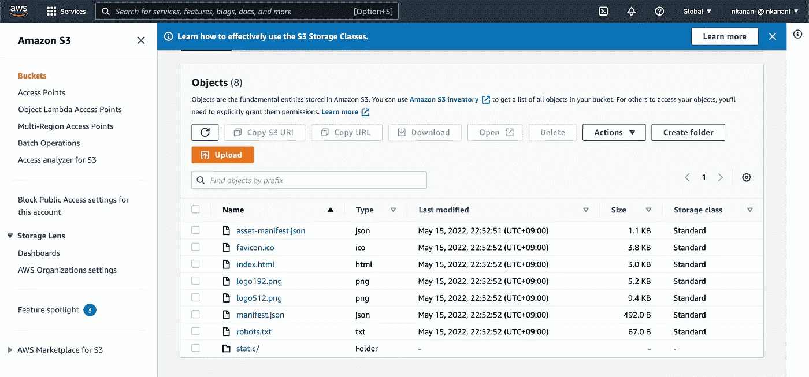

我们的网站现已上线！！！在浏览器上，转到我们在启用`Static Website Hosting`时遇到的`Endpoint` URL `(http://<s3-bucket>.s3-website-<s3-region>.amazonaws.com)`。现在，您对 react 应用程序所做的任何更改都将构建并上传到您的`S3` bucket，它将实时更新。

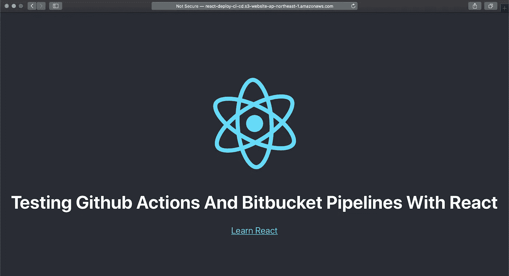

您可以继续使用 Github 或 Bitbucket 操作，方法是在`Pull Request`上触发一个操作，该操作可能会运行一些 CI 测试，并在部署到您的`S3.`之前执行几个步骤

**如果本指南对您和您的团队有所帮助，请与他人分享！**

## 关注我，了解我最新最有趣的文章。