# 将 React Web 应用程序部署到 Firebase &让它像移动应用程序一样工作

> 原文：<https://blog.devgenius.io/deploy-a-react-web-app-to-firebase-make-it-act-like-a-mobile-app-d19783b8a1c2?source=collection_archive---------1----------------------->


前几天，我部署了一个为我妻子制作的 React 应用程序，Funky Cafe。这是一个全栈应用，后端是 Rails，前端是 React。在此之前，我确保它能适应更小的屏幕，并能做出相应的调整。

当我将前端部署到 Firebase 时，我遇到了一些问题，不过没有什么是不能解决的。这就是本文的第一部分，将 React 应用程序部署到 Google Firebase 的步骤。我还将讨论如何让这个 web 应用程序在添加到 iOS 或 Android 主屏幕时看起来和操作起来像一个移动应用程序。

在之前的帖子中，我用 React 构建了一个井字游戏应用程序，我认为这个项目将是一个完美的例子，所以我让它能够响应移动大小的屏幕，以便为部署做准备。在这篇文章中，我将把应用程序部署到 Google Firebase，并替换它的`favicon.ico`和其他标志，使它在浏览器标签、移动主屏幕和打开渐进式网络应用程序时的机器人启动屏幕上看起来更专业。

**本岗位目标:**

1.  在 Firebase 上创建项目，并通过终端连接到我们的项目，以便开始托管。
2.  为应用程序生成新的`favicon.ico`和徽标图像。
3.  更改`manifest.json`和`index.html`文件，在移动主屏幕上显示新图标，作为一个渐进式网络应用程序(Android 或 iOS)。

**我正在着手做的事情:**

# 部署到火力基地

我已经在 [Firebase](https://firebase.google.com/) 上做了说明，但是如果你想继续下去，你需要先这么做。

登录后，转到您的控制台:

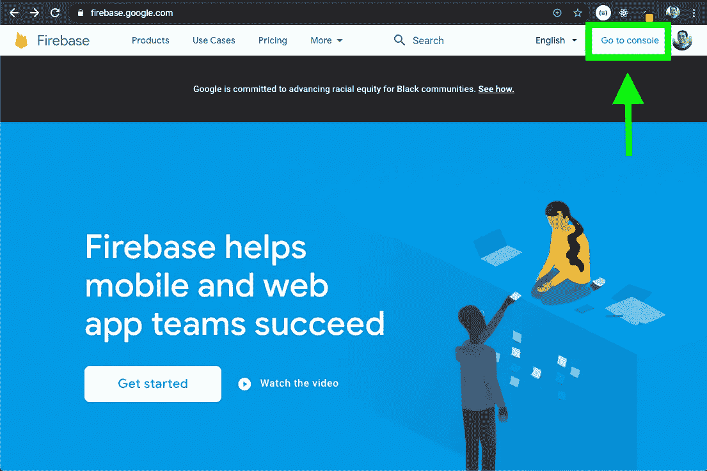

下一个屏幕将显示您之前部署的 Firebase 项目，并提供一个“添加项目”选项，这是我们想要的选项。点击它后，我们应该会看到一个屏幕，要求我们命名我们的项目。您可以通过确保您键入的名称下面的建议匹配(不区分大小写)来判断名称是否未被采用，如下所示:

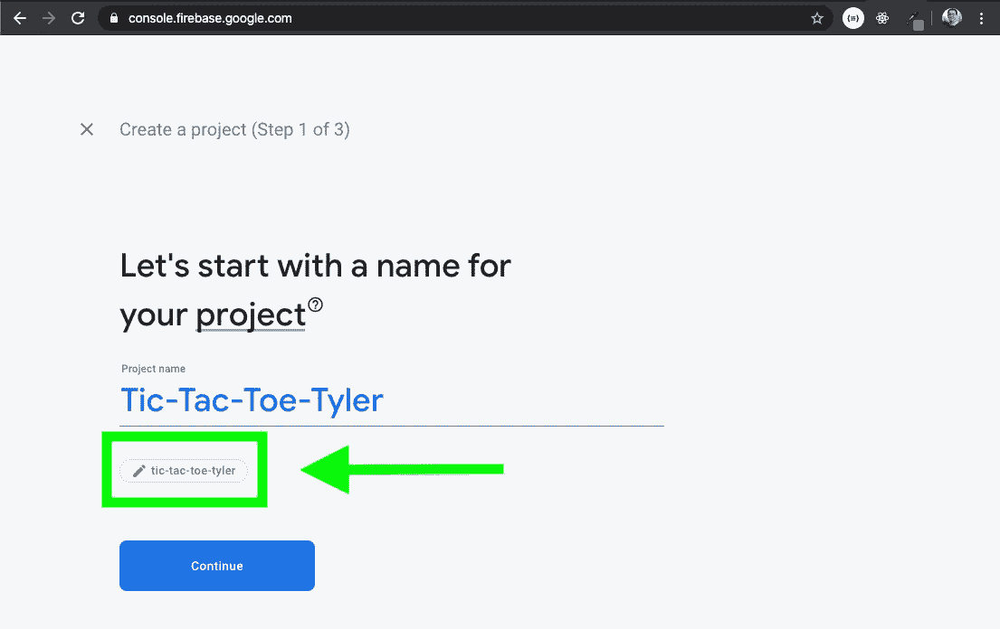

找到正确的应用程序名称并点击继续后，接下来的两步是关于你是否愿意参与谷歌分析。完全取决于开发人员，如果我选择参与(我通常会说为什么不)，我总是选择步骤 3 的默认帐户选项。

在步骤 3 中点击 continue 将开始创建您的 Firebase 项目，当它完成时，您应该会看到如下内容:

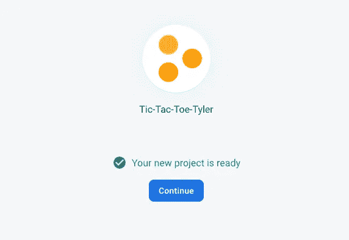

接下来，Firebase 将我们带到项目仪表板，接下来我们将单击左侧菜单中的“Hosting”选项卡:

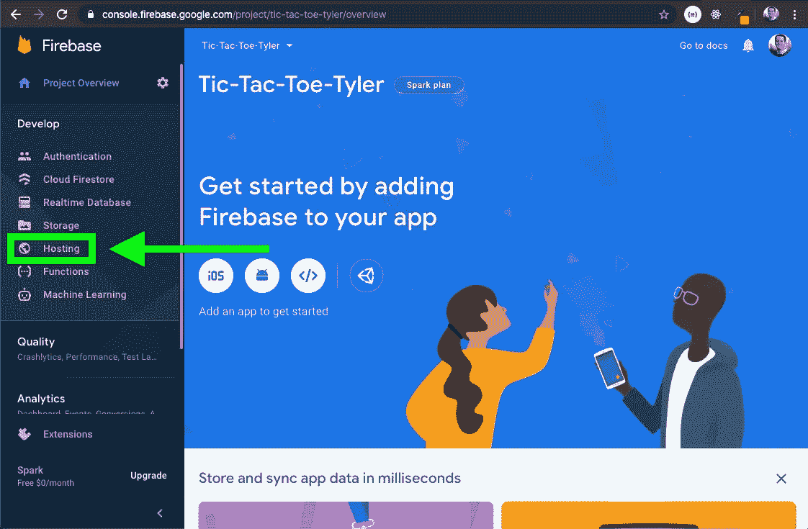

接下来，点击“开始”按钮，这将向我们显示更多的说明，这些说明都是不言自明的。从项目的根目录开始，说明从安装 Firebase CLI 开始:

```
npm install -g firebase-tools
```

下一步是登录 Firebase:

```
firebase login
```

由于我已经登录到 Firebase，它只是说我已经登录，对于没有登录的人，它可能会将您重定向到一个网页，在那里您可以验证您的帐户。

然而，在下一步之前，我认为重要的是要注意:为了在 Firebase 上托管 React 应用程序，有必要拥有应用程序的生产版本。这是我第一次或两次尝试部署项目时偶然发现的，也是我在本文中包含这一部分的部分原因。

在下一步中，我们将指定我们希望从 build 文件夹初始化我们的应用程序，因此为了做到这一点，我们必须确保我们的应用程序有一个 build 文件夹。我用于生产构建的命令是:

```
npm run build
```

下面是构建文件夹完成后我的终端的样子:

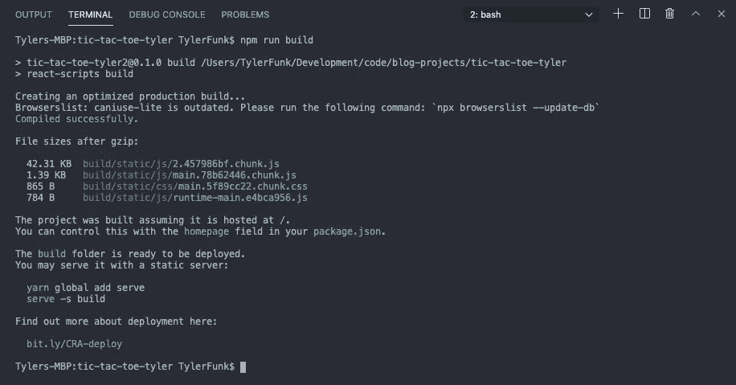

之后，您应该能够在文件树中看到构建文件夹。回到终端，我们可以输入下一个命令:

```
firebase init
```

看一看弹出的菜单:

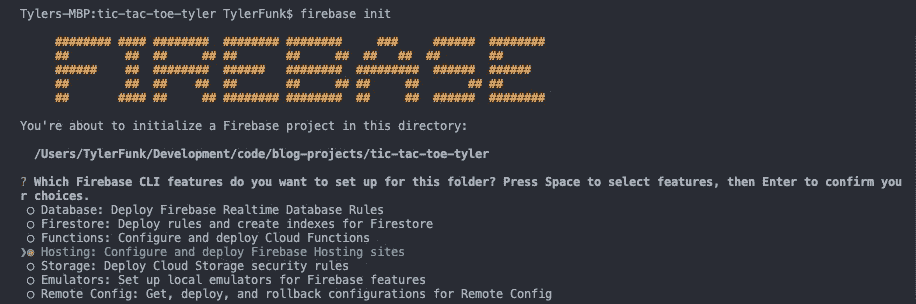

正如你在上面的图片中看到的，我从菜单中选择了“主机”选项，使用箭头键来导航，使用空格键来选择。正如它所说的，然后我按回车键继续，提出下一组问题，每个问题都以“？”开头。符号:

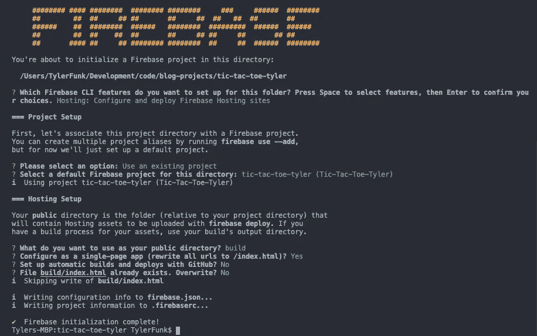

**分解之前的初始化步骤:**

1.  选定的“托管”
2.  选择“使用现有项目”
3.  选择了“井字游戏”火垒项目
4.  为公共目录输入“build”
5.  选择“y”(是)配置为单页面应用程序(React 是单页面框架)
6.  对于使用 Github 自动构建和部署，选择“N”(否)——这个选项肯定有用，但是为了本文的缘故，选择跳过它，考虑为您的应用程序启用这个选项。
7.  当询问我是否要覆盖已经存在的`build/index.html`文件时，选择“N”(否)。

我们现在终于可以输入合适的最终命令了:

```
firebase deploy
```

这给了我们这个结果:

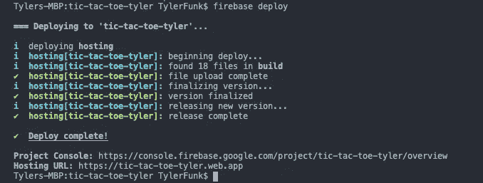

因此，如果我们去它建议的托管[网址](https://tic-tac-toe-tyler.web.app)，我们现在可以看到应用程序的运行:

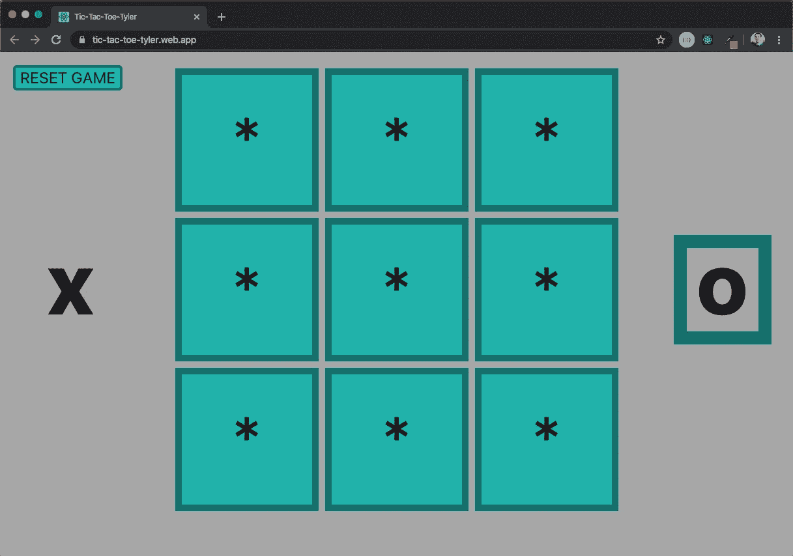

浏览器

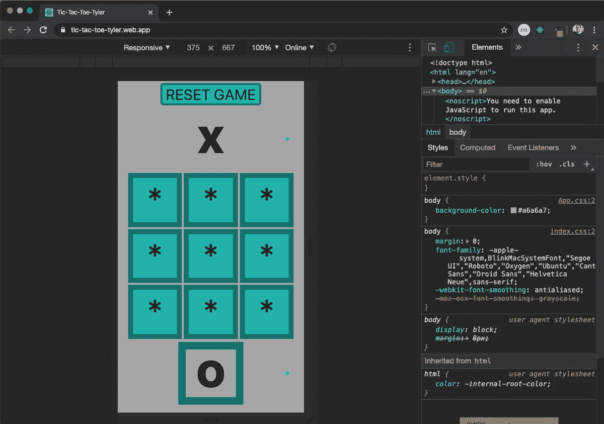

移动浏览器

注意到浏览器选项卡仍然有 React 徽标作为图标吗？那是因为我们还没有改变`favicon.ico`，它是一个浏览器识别为图标格式的图像，并且知道如何相应地处理它。我们将不得不改变的不仅仅是`favicon.ico`，但是我们可以从一个 favicon 生成器中获得所有必要的图像，我喜欢使用[这个](https://realfavicongenerator.net/)，它是由[这个](https://medium.com/@jenniferdobak/the-public-folder-and-favicons-in-create-react-app-8dc2cc1d492b)信息文章推荐给我的，如果你在这里制作了它，你可能已经看过了。

# 生成图标和其他图像

我创建了这个图像并上传到上面提到的生成器:


生成器完成后，看看我下载的包内部:

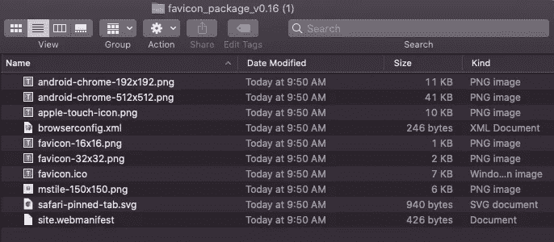

生成器给出了如何将整个包放入项目根目录并使用所有图像的说明，然而，为了这篇文章，我们实际上只需要其中的 3 个图像，我将继续将它们分别放入*井字游戏的“公共”文件夹中。*

我们将使用`*favicon.ico*` 作为浏览器标签，`*apple-touch-icon.png*` 作为 iOS(以及 android 信不信由你)“添加到主屏幕”图标，`android-chrome-512x512.png`将用于 Android 闪屏。

关于`favicon.ico`的伟大之处在于，当你将它放入公共文件夹时，当它提示你已经存在一个`favicon.ico`时，你可以轻松地一次性替换默认的`favicon.ico`。

对于另外两个，我们需要稍微修改一下`index.html`和`manifest.json`文件。这就是我们接下来要讨论的，并完成使这个游戏看起来像一个移动应用程序的最后步骤，也就是所谓的渐进式 web 应用程序！

# 必要的 index.html & manifest . JSON 更改

让我们看看这两个文件，从位于公共文件夹中的`index.html`开始。

## index.html

与原始状态相比，唯一改变的是标题:

第 5 行有一个`<link>`标签，它保存了`href`属性中的`favicon.ico`。这个已经正常工作了，因为图像/图标名称完全相同。

然而，第 12 行上的`<link>`标签将被更改。为了匹配我们添加的新的`apple-touch-icon.png`图像的名称，`href`属性特别需要改变。我们还需要添加一个属性——`sizes`——据我所知，这有助于让这个标签为 Android 而不仅仅是 iOS 设备工作。该标记将如下所示:

```
<link rel="apple-touch-icon" sizes="128x128"
  href="%PUBLIC_URL%/apple-touch-icon.png" />
```

`index.html`文件在一个注释掉的部分中提到了前缀`%PUBLIC%`，同样也描述了`manifest.json`文件。我之前提到的那篇文章(这里再次链接)也很好地潜入了公共文件夹和那些感兴趣的`manifest.json`文件。

## manifest.json

下面来看看`create-react-app`应用自带的默认`manifest.json`文件:

最初，我在让 Android 闪屏显示它应该显示的 512x512 图像时遇到了麻烦。然后我在堆栈溢出的某个地方读到了一个评论，说在他们从`manifest.json` `icons`数组中删除了 192x192 对象之后，512x512 图像最终将被用于闪屏。

考虑到这一点，下面是我在公共文件夹中为*井字游戏*修改的`manifest.json`文件。

唯一的区别是:

—将`short_name`和`name`更改为我想要的样子。
—删除上述 192x192 对象。
—将 512x512 的`src`替换为之前放入公共文件夹的`android-chrome-512x512.png`。
—更改了`background_color`(用于闪屏；`theme_color`改变文本颜色)以匹配应用背景。

那么，为什么我们没有看到任何变化呢？因为我们将我们的应用程序指定为托管在构建文件夹中，而现在构建文件夹中仍然有我们所有的原始代码`npm run build`。这意味着我们的下一步需要重新构建我们的构建文件夹，包含新的更改。

再多一个`npm run build`将允许您看到在构建文件夹中反映的公共文件夹中所做的更改。

这给我们留下了最后一步，重新部署到火力基地。只要我们还在登录(应该是)，我们就可以再次使用`firebase deploy`和**了！**我们可以检查我们努力工作的结果！

首先，要了解在部署之后，所有文件都需要 10 到 30 秒才能到达，有时会更长，所以请稍等片刻！

好了，现在让我们看看图标的用法！

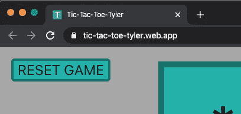

浏览器选项卡

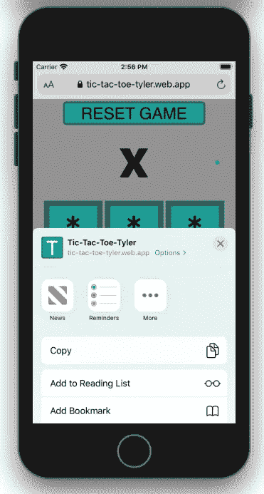

移动浏览器菜单

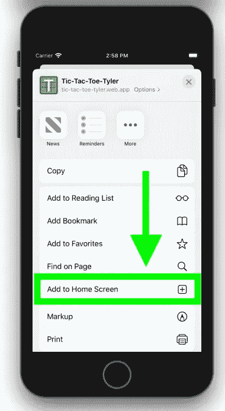

移动浏览器菜单向上滑动

选择“添加到主屏幕”以获得此结果:

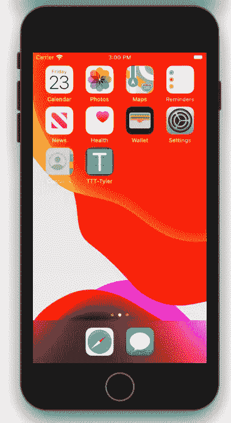

主页图标

下面是从主屏幕图标使用该应用程序时的演示——请注意，它完全没有浏览器栏，只有一个状态栏，可以通过`manifest.json`文件进行定制。我还没有掌握它，但是也有一种方法可以为 iOS 渐进式网络应用添加闪屏，查看这些[文档](https://developer.apple.com/library/archive/documentation/AppleApplications/Reference/SafariWebContent/ConfiguringWebApplications/ConfiguringWebApplications.html)。

现在展示安卓的结果——在我看来不太优雅，但至少我们有一个内置的闪屏；**鉴于我们在** `**manifest.json**` **文件**中满足以下参数(承蒙[本帖](https://codeburst.io/progressive-web-apps-custom-splash-screen-18911e47cc)同意):

*   `name`属性设置为您选择的名称。
*   `background_color`属性被设置为有效的 CSS 颜色值。
*   `icons`数组指定了一个大小为 512x512px 的图标。
*   图标存在，并且是巴布亚新几内亚。

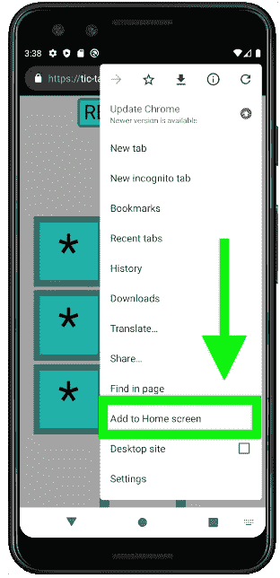

安卓浏览器菜单(三个垂直点)

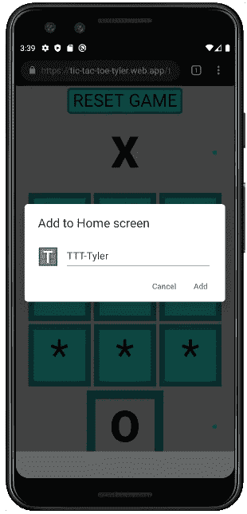

更改名称的选项

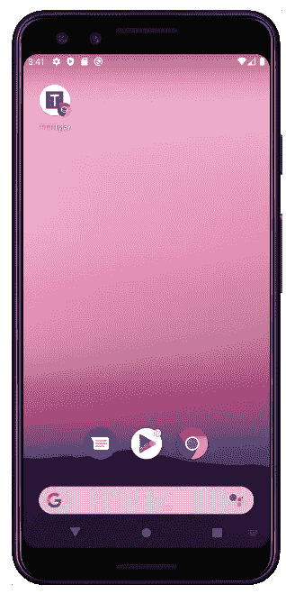

安卓主页图标

最后是**安卓演示**；查看我们通过安卓获得的这个进步的网络应用的免费闪屏:

在我的 Macbook 上，Android 模拟器对我来说非常落后，尽管它运行良好，足以显示我想要的东西

# 结论

希望这能对想部署到 firebase **或**渐进式网络应用程序的人有所帮助。发这个帖子帮助我学会了如何利用`manifest.json`和`index.html`文件定制不同的图标。

只有 3 张图片，我就可以让浏览器标签、iOS 设备和 Android 设备都使用合适的图标来代替默认的反应图标。正如你在最终的 GIF 中所看到的，我们甚至免费获得了 Android 的闪屏。

祝大家黑客愉快，谢谢阅读！

# P.S .

想挑战吗？尝试为你的渐进式网络应用程序创建一个 iOS 闪屏，记住你必须为提供的每一个苹果设备创建一个链接标签，没有什么是真正通用的！祝你好运！