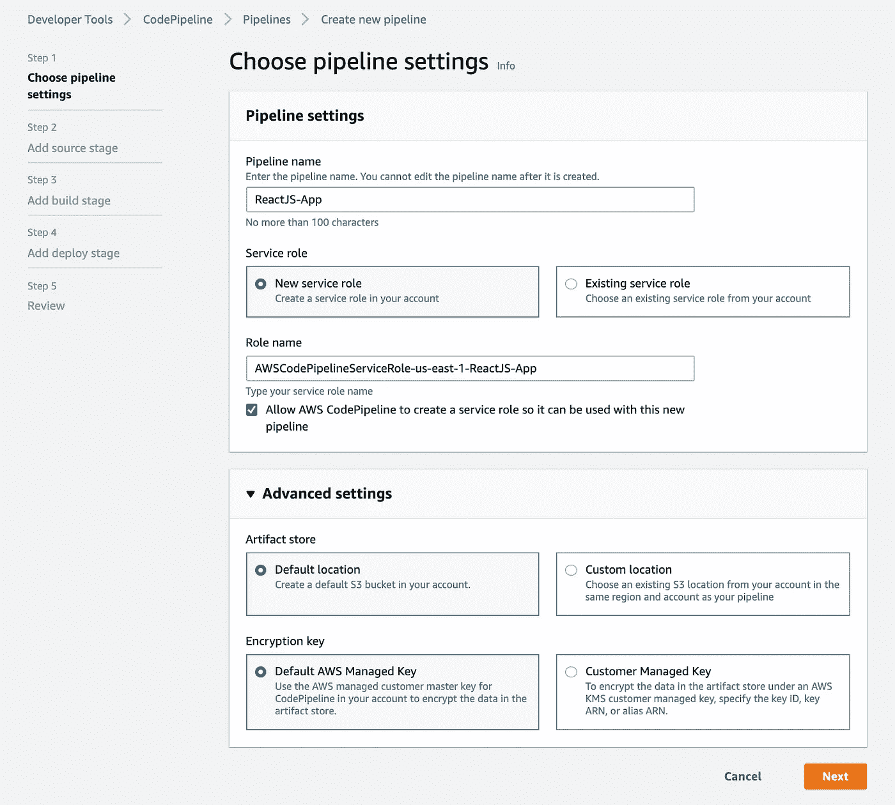
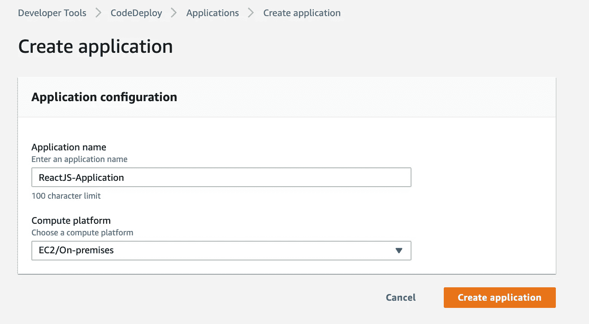

# 使用 AWS 代码管道将 ReactJS 应用程序部署到 AWS EC2 实例

> 原文：<https://blog.devgenius.io/deploy-a-reactjs-application-to-aws-ec2-instance-using-aws-codepipeline-3df5e4157028?source=collection_archive---------0----------------------->

> 为了通过 AWS 代码管道学习持续集成和持续交付(CI/CD ),而不是部署一个“hello world”应用程序，我创建了这个简单的 ReactJS 应用程序,它从一个 [API](https://github.com/mathdroid/covid-19-api) 获取关于新冠肺炎的最新统计数据。我只会监控这个网络应用程序几个星期。

我想我把“如果你没有带着一项新技能或者更多的知识走出隔离区，你从来不缺少时间，你缺少的是纪律”看得很重。在 2020 年 3 月通过 [AWS 认证云从业者考试](https://medium.com/@saba.ambreen16/aws-certified-cloud-practitioner-exam-march-2020-1a6ba2f9102)后，我开始为 2020 年 4 月中旬的 AWS 解决方案架构师考试学习。然而，当我在 Udemy 上学习夏羽[马瑞克的 AWS 解决方案架构师课程时，我意识到我应该花一些时间在个人项目上，同时达到学习/实践的目的。](https://www.udemy.com/course/aws-certified-solutions-architect-associate-saa-c02/)

这篇文章将重点介绍如何设置 AWS 代码管道，以及如何将 ReactJS 应用程序部署到 AWS EC2 实例。我们将假设您已经在 [Github](https://github.com/) 上准备好部署您的 [AWS 帐户](https://aws.amazon.com/premiumsupport/knowledge-center/create-and-activate-aws-account/)、一个 [IAM 用户](https://docs.aws.amazon.com/directoryservice/latest/admin-guide/setting_up_create_iam_user.html)设置和一个 ReactJS 应用程序！

**样本反应堆应用**

如果你愿意跟随，你可以[分叉](https://help.github.com/en/github/getting-started-with-github/fork-a-repo)GitHub**上现有的 [**Covid19 ReactJS 应用程序存储库，我创建的显示由冠状病毒(新冠肺炎)疾病引起的已知、康复和死亡病例的实时 Covid19 数据。或者你可以简单地使用这个**](https://github.com/sambreen27/covid19) **[**YouTube 教程**](https://www.youtube.com/watch?v=pCgDRgmfilE) 或者[**创建 React 应用程序——快速启动**](https://create-react-app.dev/docs/getting-started/) **)** 来创建一个新的 ReactJS 应用程序****

****简介****

**ReactJS 是一个声明式的、高效的、灵活的 JavaScript 库，用于构建用户界面。它是一个开源的、基于组件的前端库，只负责应用程序的视图层。**

**[Node.js](https://nodejs.org/en/) *是基于 Chrome 的 V8 JavaScript 引擎*构建的 JavaScript 运行时。Node.js 使用事件驱动的非阻塞 I/O 模型，这使它变得轻量级和高效。**

**[亚马逊网络服务(AWS)](https://aws.amazon.com/?nc2=h_lg) *是世界上最全面、最广泛采用的云平台，提供来自全球数据中心的超过 175 种全功能服务。数百万客户正在使用 AWS 来降低成本，变得更加敏捷，并更快地创新。*计算、存储、数据库、迁移、网络和内容交付、管理工具、安全性&身份合规性和消息传递是 AWS 提供的一些主要服务。**

# **我们将遵循的步骤:**

1.  **为 EC2 和 AWS 代码部署创建 IAM 角色**
2.  **启动 EC2 实例**
3.  **使用 Github、CodeBuild 和 CodeDeploy 创建代码管道**
4.  **在 EC2 公共 DNS 上访问 ReactJS 应用程序**
5.  **讨论注册域名**
6.  **最后的想法**

# **1.为 EC2 和 AWS 代码部署创建 IAM 角色**

**AWS 服务角色用于向 AWS 服务授予权限，以便它可以访问 AWS 资源。附加到服务角色的策略决定了服务可以访问哪些 AWS 资源以及可以对这些资源做什么。**

**让我们导航到我们的 AWS 管理控制台，搜索 [**IAM**](https://aws.amazon.com/iam/) 服务。现在为 EC2 和 AWS CodeDeploy 创建一个新角色:**

****

**身份和访问管理(IAM) —角色仪表板**

****

**为 EC2 创建一个新角色，并附加 **AmazonS3ReadOnlyAccess** 策略，这将允许我们的 EC2 实例从 [Amazon S3](https://aws.amazon.com/s3/) 桶中访问存储的工件。**

****

**为 CodeDeploy 创建一个新的服务角色，并附加 **AWSCodeDeployRole** 策略，该策略将为我们的服务角色提供权限，以读取我们的 EC2 实例的标记、向 Amazon SNS 主题发布信息以及更多内容**

# **2.启动 EC2 实例**

**现在，让我们启动 EC2 实例！在 AWS 管理控制台下，点击**计算**下的 **EC2** ，将进入**EC2 仪表板**页面。现在点击 ***启动实例:*****

****

****EC2 仪表板****

****

**我们将选择**Amazon Linux AMI 2018 . 03 . 0**作为我们的 **Amazon 机器映像(AMI)** 来启动我们的实例**

****

****选择一个实例类型****

****

**您可以选择**网络旁边的默认 VPC(由 AWS 为您配置)。**此外，选择我们之前为 EC2 创建的 **IAM 角色**，并附加 **AmazonS3ReadOnlyAccess** 策略**

****

**我们的实例将使用上述存储设备设置启动。您可以将其他 EBS 卷和实例存储卷附加到您的实例，或者编辑根卷的设置。**

****

**为了帮助您管理实例、图像和其他 Amazon EC2 资源，您可以选择以 [***标签***](https://docs.aws.amazon.com/AWSEC2/latest/UserGuide/Using_Tags.html) 的形式为每个资源分配您自己的元数据**

****

**在此页面上，您可以添加防火墙规则，以允许特定流量到达您的实例**

****

**现在，您将被提示检查您的实例配置并创建一个密钥对，它允许您[连接到您的 EC2 实例](https://docs.aws.amazon.com/AWSEC2/latest/UserGuide/ec2-instance-connect-methods.html)。使用现有的密钥或创建一个新的密钥对，点击**下载密钥对**即可下载。pem 您电脑的密钥。下载密钥对后，选择 ***启动实例*** ，等待实例启动。现在，您可以点击 ***查看实例*** 返回到您的 EC2 仪表板，您将在几分钟内看到实例启动并运行。**

****

**现在，您已经成功地启动了 EC2 实例**

# **3.使用 Github、CodeBuild 和 CodeDeploy 创建代码管道**

**[AWS CodePipeline](https://aws.amazon.com/codepipeline/) 是一项持续集成和持续交付(CI/CD)的 AWS 服务，允许您自动化应用或服务的发布流程。每次您提交对源代码(GitHub、AWS CodeCommit 等)的代码更改时，CodePipeline 都会根据您在初始化 CodePipeline 时定义的发布流程模型自动构建、测试和部署您的代码。这使您能够快速可靠地交付功能和更新。**

**在以下部分中，我们将经历 CI/CD 管道阶段:**

**步骤 1:代码管道**

**步骤 2:代码源(CodeCommit 或 Github)**

**步骤 3:代码构建和构建规范(buildspec.yaml)文件**

**步骤 4:代码部署和应用程序规范(appspec.yml)文件**

**第五步:回顾**

## ****第一步:代码管道****

**让我们通过 AWS 管理控制台导航到代码管道，并单击**创建管道:****

********

**在此页面上还将为您的新管道创建一个新的服务角色。我们可以让 AWS 创建一个新的 S3 存储桶来存储工件，或者如果您想要在同一地区的现有 S3 存储桶上存储工件，您可以选择“自定义位置”,然后选择您首选的 S3 存储桶**

## **步骤 2:代码源(CodeCommit 或 Github)**

**截至 2020 年 5 月，AWS 提供了五个选项来提供管道的源代码: [AWS CodeCommit](https://aws.amazon.com/codecommit/) 、[亚马逊 ECR](https://aws.amazon.com/ecr/) 、[亚马逊 S3](https://aws.amazon.com/s3/) 、 [Bitbucket Cloud](https://bitbucket.org/product) (beta)和 [Github](https://github.com/) 。AWS CodeCommit 和 GitHub 比较类似；在本帖中，我们将把 AWS CodePipeline 与 GitHub 集成在一起。**

****

**选择 GitHub 作为源提供者后，点击**连接到 GitHub** 按钮。然后会提示您输入您的 GitHub 登录凭证**

****

**一旦授予 AWS CodePipeline 对 GitHub 存储库的访问权限，您就可以为 CodePipeline 选择一个存储库和分支，以便将对该存储库的提交上传到您的管道**

## **步骤 3:代码构建和构建规范(buildspec)文件**

**我们现在将继续定义构建提供者。截至 2020 年 5 月，AWS 为构建提供者提供了两种选择: [AWS CodeBuild](https://aws.amazon.com/codebuild/) 和 [Jenkins](https://www.jenkins.io/) 。 **AWS CodeBuild** 是一个完全托管的持续集成服务，它编译源代码，运行测试，并生成准备部署的软件包。Jenkins 是一个用 Java 编写的开源自动化工具，带有用于持续集成的插件。如果你不确定使用哪一个，看看这篇文章: [AWS 代码管道 vs. Jenkins CI 服务器](https://www.sumologic.com/blog/aws-codepipeline-versus-jenkins-ci-server/)。**

**对于这篇文章，我们将选择 AWS CodeBuild 作为我们的构建提供者，在这里我们将被提示选择一个项目:**

****

**如果您在创建您的管道之前没有创建项目(像我一样)，我们可以通过单击**创建项目**直接从这里创建项目，这会将我们重定向到以下页面:**

********

**将为 AWS CodeBuild 创建 CodeBuild 服务角色，以便 CodeBuild 可以代表您与相关的 AWS 服务进行交互**

**现在，我们将简要讨论什么是 buildspec 文件。 [**Buildspec**](https://docs.aws.amazon.com/codebuild/latest/userguide/build-spec-ref.html) 文件是构建命令和相关设置的集合，采用 YAML 格式，代码构建使用它来运行构建。对于我的项目，我创建了一个 **buildspec.yaml** 文件，并将其添加到我的项目目录的**根目录**中:**

****buildspec.yaml****

****

**如果我们的项目目录中没有 buildspec 文件，我们也可以通过选择**插入构建命令**并添加必要的命令来存储构建命令。完成后，让我们点击**继续代码管道****

****

**一旦我们成功创建了一个构建项目，我们将被重定向回该页面。现在让我们转到步骤 4:通过单击下一步的**添加部署阶段****

## **步骤 4:代码部署和应用程序规范(appspec.yml)文件**

**[AWS CodeDeploy](https://aws.amazon.com/codedeploy/) 是一项完全托管的部署服务，可自动将软件部署到各种计算服务，如 Amazon EC2、AWS Fargate、AWS Lambda 和您的本地服务器。在部署过程中，您可以在很少甚至没有停机的情况下更新您的应用程序。对于这篇文章，我们将使用 AWS CodeDeploy 作为我们的部署提供者。**

****

**在 CodeDeploy 中，*应用程序*只是 CodeDeploy 使用的一个名称或容器，用于确保在部署期间引用正确的修订、部署配置和部署组。因此，让我们创建一个应用程序！如果你看上面的截图，在左栏的**部署下，**右点击**应用**和点击**在新标签页打开链接。**一旦你进入**应用**页面**，**点击**创建应用:****

****

**为代码部署创建应用程序**

****

**在这里，我们需要**为我们的应用程序创建一个部署组**，指定您的应用程序版本部署到哪个实例，以及其他部署选项。**

****

**对于**服务角色**，我们将选择 **CodeDeployRole** 以及我们之前创建的 **AWSCodeDeployRole** 策略**

****

**对于我们的**环境配置，**我们将只选择 **Amazon EC2 实例。**在**键**和**值**字段中，我们将输入之前创建 EC2 实例时用来标记实例的键值对的值**

****

**在 CodeDeploy 部署期间，[负载平衡器](https://docs.aws.amazon.com/codedeploy/latest/userguide/integrations-aws-elastic-load-balancing.html)防止互联网流量被路由到未准备好或当前正在部署的实例。然而，负载平衡器的确切角色取决于它是用于蓝/绿部署还是就地部署。在这篇文章中，我们将不配置负载平衡器，而是继续进行**创建部署组****

****

**现在让我们返回到**添加部署阶段**浏览器选项卡，选择我们刚刚创建的**应用程序名称**和**部署组**，然后单击**下一步**查看我们的管道**

****不要**刷新您的浏览器选项卡如果您单击文本框时没有看到您刚刚创建的应用程序名称和部署组，它将删除您到目前为止为您的管道输入的所有数据。相反，点击**上一个**(这将带您返回到**添加构建阶段**)，然后点击**下一个**并返回到**添加部署阶段**。您现在将能够选择您刚刚创建的**应用程序名称**和**部署组**。**

**在这里，我们将简单地讨论一下应用规范文件是什么。 [**AppSpec**](https://docs.aws.amazon.com/codedeploy/latest/userguide/reference-appspec-file.html) 文件是一种 YAML 格式或 JSON 格式的文件，CodeDeploy 使用它来管理部署，并确定它应该从 Amazon S3 或 GitHub 中的应用程序版本将什么安装到您的实例上，以及哪个生命周期事件[挂钩](https://docs.aws.amazon.com/codedeploy/latest/userguide/reference-appspec-file-structure-hooks.html)来运行以响应部署生命周期事件。有关更多信息，请查看 AWS CodeDeploy [用户指南](https://docs.aws.amazon.com/codedeploy/latest/userguide/reference-appspec-file.html)和 EC2/内部部署 AppSpec [示例](https://docs.aws.amazon.com/codedeploy/latest/userguide/reference-appspec-file-example.html#appspec-file-example-server)。**

**对于我的应用程序， **appspec.yml** 如下所示:**

****appspec.yml****

**上面使用的三个简单的 bash 脚本如下:**

**我们使用一个名为[***PM2***](http://pm2.keymetrics.io/)*的节点生产流程管理器，在关闭我们的终端或断开与远程服务器的连接后，保持我们的应用程序运行***

## ***第五步:回顾***

***让我们回顾一下我们的管道，然后单击**创建管道:*****

************

***我的部署最初失败了！！！❌***

******

***出现此错误有几个原因。对我来说，我的部署失败了，因为我没有在 EC2 实例上安装 **CodeDeploy 代理**。CodeDeploy 代理是一个软件包，当在一个实例上安装和配置时，它使该实例可以在 CodeDeploy 部署中使用。这里有一篇关于[解决 EC2/内部部署问题的更详细的文章](https://docs.aws.amazon.com/codedeploy/latest/userguide/troubleshooting-deployments.html)***

***现在，按照这篇文章的[中的说明连接到您的 EC2 实例，并且](https://docs.aws.amazon.com/AWSEC2/latest/UserGuide/ec2-instance-connect-methods.html)[在您的 EC2](https://docs.aws.amazon.com/codedeploy/latest/userguide/codedeploy-agent-operations-install-linux.html) 实例上安装/重新安装 CodeDeploy 代理: `sudo yum update
sudo yum install ruby
sudo yum install wget
wget https://aws-codedeploy-us-east-1.s3.amazonaws.com/latest/install
chmod +x ./install
sudo ./install auto`***

***如果在部署阶段一切顺利，您将看到所有六个状态为“成功”的事件:***

******

***有几次我的部署失败了，我花了大量的时间在 Google 上搜索错误及其解决方案，并阅读 AWS 文档。然后，最精彩的部分来了:***

******

*****恭喜你！🎉🎉🎉您已经通过 AWS 代码管道**成功地将 ReactJS 应用程序部署到 EC2***

## ***4.在 EC2 公共 DNS 上访问 ReactJS 应用程序***

***您可以在 EC2 管理控制台的描述下访问 EC2 公共 DNS (IPv4)上的 EC2 实例，看起来像这样:**ec2–3–81–44–251.compute-1.amazonaws.com**。将您的公共 DNS (IPv4)复制/粘贴到另一个选项卡上，并在 DNS 地址的末尾附加 port :3000(因为我们的 ReactJS 应用程序默认使用端口 3000)。正如你将看到的，这将无法工作，浏览器上没有任何显示，浏览器连接将超时。***

***这是因为我们没有开放 3000 端口供公众访问。这就是安全组介入的地方。在 EC2 仪表板页面上，转到 ***安全组*** ，选择您的 EC2 实例安全组(启动向导-1 或启动向导-2 或类似的组)并编辑 ***入站*** 规则 ***。******

************

***再次访问 EC2 公共 DNS，【ec2–3–81–44–251.compute-1.amazonaws.com:3000 ，，现在您应该能够看到您的应用程序内容。***

******

***更新【2020 年 7 月】:该网站现在托管在 GitHub 页面:[新冠肺炎数据追踪器](https://sambreen27.github.io/covid19/)***

## ***5.注册域名***

***您可以使用 Amazon Route 53 为您的 EC2 实例注册一个域名并配置 DNS。您也可以从 [No IP](https://www.noip.com/) 获得一个免费的公共 DNS 名称，并参考[在您的 Linux 实例上设置动态 DNS](https://docs.aws.amazon.com/AWSEC2/latest/UserGuide/dynamic-dns.html)获得进一步的说明。***

## ***6.最终想法:***

***再一次，AWS 上的另一个令人愉快的学习经历！有几种方法可以在 AWS 上部署和托管 web 应用程序。我选择 EC2 来了解其基础设施的组件，选择 AWS CodePipeline 来了解持续集成和持续交付(CI/CD)工作流，该工作流允许我们使用 CodeBuild 和 CodeDeploy 来构建和管理构建、测试和部署应用程序到测试/生产环境中的流程。***

****如果你喜欢这篇文章，或者你在以上部分的任何一点上被卡住了，并且有任何问题，请随时在下面提问或在*[*LinkedIn*](https://www.linkedin.com/in/sambreen27/)*上给我发消息。我非常乐意帮助你。****

****感谢您的阅读！如果我在某个地方犯了错误或错过了关键点，请在评论中明确告诉我。****