# 部署和配置 Azure 防火墙和规则以允许/拒绝对某些网站的访问

> 原文：<https://blog.devgenius.io/deploy-and-configure-azure-firewall-and-rules-to-allow-deny-access-to-certain-websites-32c435ad7dd0?source=collection_archive---------4----------------------->

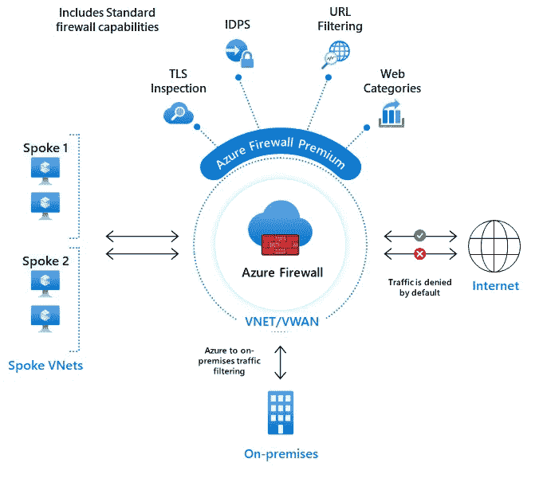

Azure Premium 防火墙示意图|图片来源:Microsoft.com

[Azure 防火墙](https://learn.microsoft.com/en-us/azure/firewall/overview)是一个完全托管的云原生服务，提供网络安全以保护您的 Azure 虚拟网络资源。该服务提供内置的高可用性、无限制的可扩展性、基于威胁情报的过滤、日志记录和监控，以及更多特性和功能。Azure Firewall 提供第 3-7 层连接策略，并以三种[SKU](https://azure.microsoft.com/en-us/pricing/details/azure-firewall/)提供，其吞吐量和启用的功能取决于您部署的 SKU，并受不同定价的影响:[标准](https://learn.microsoft.com/en-us/azure/firewall/features)、[高级](https://learn.microsoft.com/en-us/azure/firewall/premium-features)和[基本](https://learn.microsoft.com/en-us/azure/firewall/overview#azure-firewall-basic-preview)。它可以部署在任何虚拟网络上，但通常部署在中央虚拟网络(VNet)上，例如 Hub-VNet，我们在 Hub-and-Spoke 模型中将其他虚拟网络对等到它。它还可以集成使用第三方安全即服务(SECaaS)提供商。

## **用例**

虽然使用 Azure Firewall 通过控制和监控对我们网络的内部和外部访问来保护免受传入和传出威胁有许多不同的用例，但这里有几个示例:

*   强制将所有互联网流量通过隧道传送到指定的下一跳进行检查，而不是直接传送到互联网
*   限制和监控合作伙伴与 SaaS 平台之间的流量
*   锁定来自应用服务环境的出站流量
*   Azure Kubernetes 服务(AKS)群集和外部网络之间的安全入站和出站流量
*   过滤子网(东西)和应用层(南北)之间的网络流量
*   通过数据包检测进行深层检测和保护
*   根据目标的 FQDN 限制出站 HTTP 和 HTTPS 流量

## 它是如何工作的？

Azure Firewall 允许我们使用传统规则或防火墙策略，通过使用可配置的 [NAT 规则](https://learn.microsoft.com/en-us/azure/firewall/policy-rule-sets#dnat-rules)、[网络规则](https://learn.microsoft.com/en-us/azure/firewall/policy-rule-sets#network-rules)和[应用规则](https://learn.microsoft.com/en-us/azure/firewall/policy-rule-sets#application-rules)来控制和过滤流量。Azure 防火墙默认情况下拒绝所有流量，直到手动配置规则以允许流量。

本演示将利用防火墙策略来配置规则集，默认情况下，规则集将根据下面列出的层次结构来确定规则的优先级并进行处理。

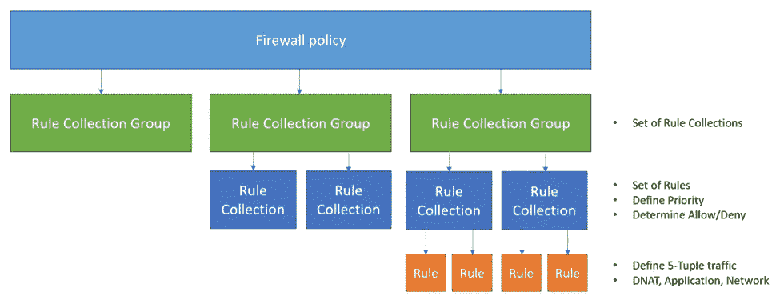

防火墙规则集层次|图片来源:Microsoft.com

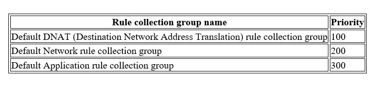

默认规则收集组及其优先级

你可以在这个[微软](https://learn.microsoft.com/en-us/azure/firewall/rule-processing)页面上阅读更多关于防火墙规则处理逻辑的内容。

# 实验室演示

在本次演示中，我将解释在虚拟网络的子网中部署 Azure 防火墙以及通过完成以下任务列表在防火墙策略上创建防火墙规则的步骤:

1.  设置测试网络环境
2.  部署防火墙和防火墙策略
3.  创建默认路由
4.  配置应用程序规则以允许访问[www.google.com](http://www.google.com)
5.  配置网络规则以允许访问外部 DNS 服务器
6.  配置目标网络地址转换(DNAT)规则，以允许远程桌面访问测试服务器
7.  测试防火墙

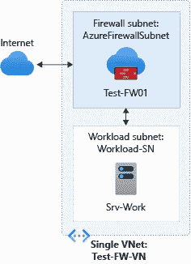

实验室图表

**任务 1:设置测试网络环境**

**a .创建资源组**

在我们的第一个任务中，我们需要创建一个资源组(RG ),它将保存这个部署的相关资源。在顶部搜索栏中，键入 resource group 并从服务列表中选择它，然后单击 **+ Create** 开始创建资源组。在 Basics 选项卡上，我们选择我们的订阅，键入资源组的名称，然后从下拉列表中选择我们的区域。在这里，我将我的资源组命名为 Firewall-RG，并选择 East US 作为我的部署区域。点击**审查+创建**开始 RG 的部署。

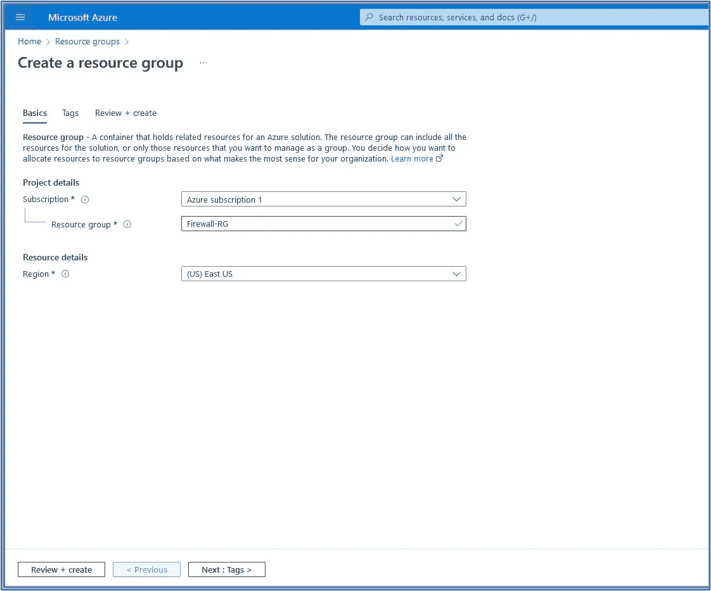

创建资源组

**b .创建虚拟网络和子网**

在下一个任务中，我们需要创建一个虚拟网络(VNet ),其子网范围需要从我们的 VNet 地址空间中获取。在顶部搜索栏中，键入**虚拟网络**，并从服务列表中选择。然后，点击 **+创建**，进入虚拟网络配置页面。

在“基本”选项卡上，我们从下拉列表中选择订阅、资源组和区域。对于实例细节，我们提供了虚拟网络的名称。然后，单击下一步:IP 地址，进入下一个配置选项卡。

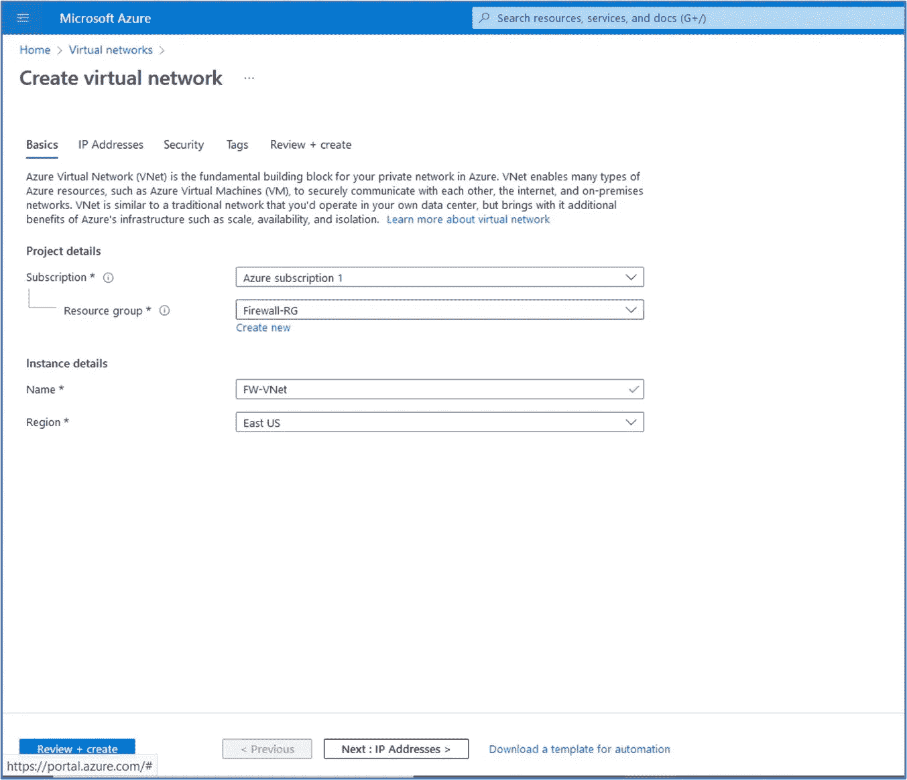

创建虚拟网络—基础知识

在 IP 地址配置选项卡上，我们可以修改虚拟网络的 IPv4 地址空间。我选的是 CIDR 系列的 **10.0.0.0/16** 。接下来，我们需要配置将在这个虚拟网络上使用的子网。单击下面的“默认”子网，在右侧打开一个窗格，允许您编辑这个预先存在的子网。我们将创建的第一个子网是“**azurefilewallsubnet**”。Azure 防火墙(FW)需要一个 CIDR 至少为/26 的**专用子网，以确保防火墙有足够的 IP 地址来适应任何扩展。我提供了 **10.0.1.0/26 的 FW 子网。**点击保存，接受该子网的配置。然后，单击+ Add subnet 创建一个新的子网。**

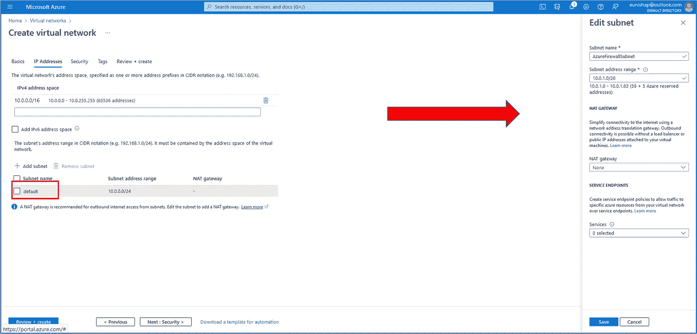

创建虚拟网络—编辑默认子网

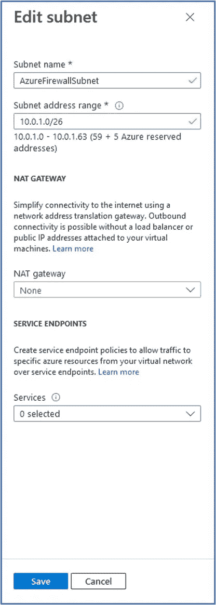

添加“AzureFirewallSubnet”

接下来，我们将为将要部署到该子网中的虚拟机添加一个子网。给子网一个名称和地址范围。在这里，我输入了一个子网地址范围 **10.0.2.0/24** 和一个子网名称 **Workload-SN** 。单击添加将此子网添加到虚拟网络。


添加虚拟机子网— **工作负载—序列号**

接下来，我们可以确认并验证我们希望部署的 IP 地址配置，如果我们不希望向其添加任何其他配置，则单击“Review + create”开始部署此虚拟网络。

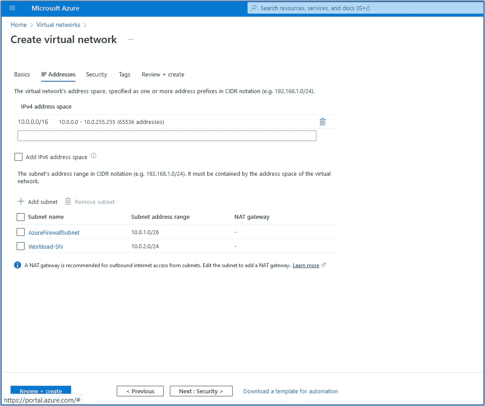

验证已配置的 IP 地址配置

**c .创建虚拟机**

随着虚拟网络的部署和准备就绪，我们现在可以继续部署工作负载虚拟机，它将驻留在刚刚创建的子网上。在这一步中，我使用了一个 ARM 模板，通过将模板和参数文件上传到 Azure 门户上的 CloudShell 存储来加快虚拟机的部署。然后，我通过为$RGName 变量分配我的 RG 的名称 Firewall-RG 来启动部署，然后继续执行 New-azresourcegroupdelotycmdlet。

```
$RGName = "Firewall-RG"

New-AzResourceGroupDeployment -ResourceGroupName $RGName -TemplateFile firewall.json -TemplateParameterFile firewall.parameters.json
```

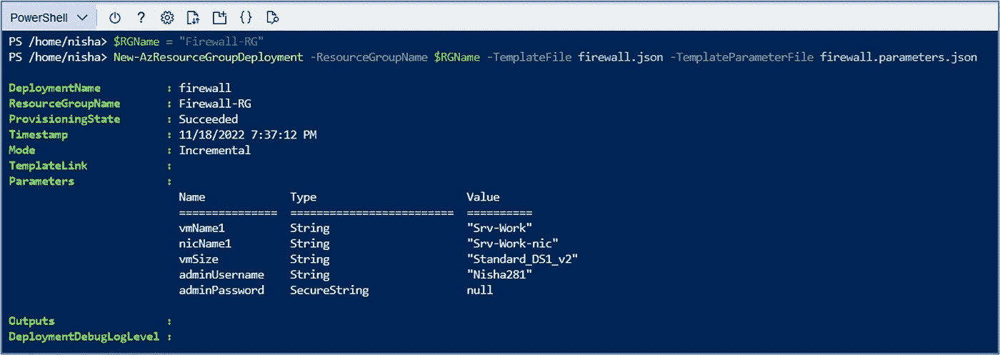

使用 ARM 模板在 CloudShell 上部署虚拟机

在 Cloudshell 上完成虚拟机部署后，我在顶部搜索虚拟机，并点击我的虚拟机 Srv-Work，以验证其分配的 IP 地址 **10.0.2.4** 。


验证虚拟机部署

**任务 2:部署防火墙和防火墙策略**

随着我们的虚拟网络、子网和虚拟机的部署，我们现在准备将 Azure 防火墙部署到配置了防火墙策略的虚拟网络中。在顶部的搜索栏中，输入**防火墙**，并从服务列表中选择。然后，点击 **+创建**。

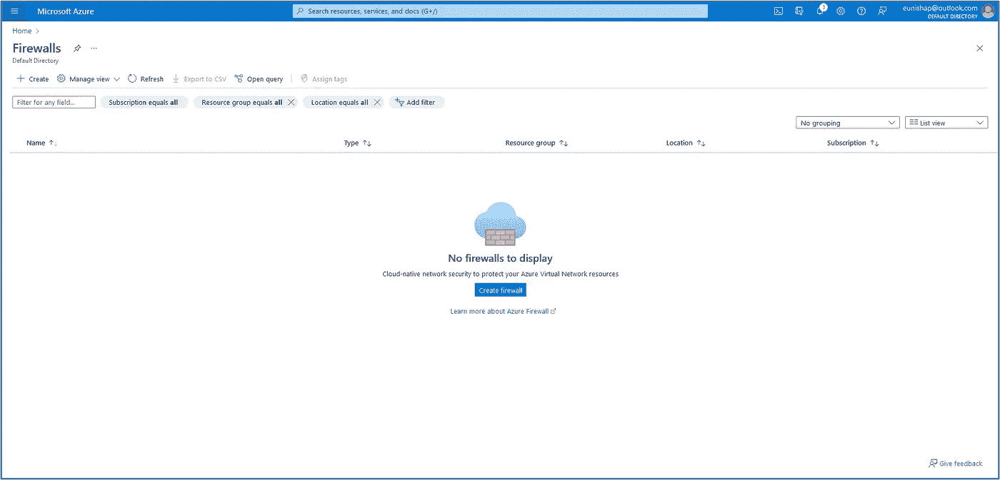

在服务列表中搜索防火墙

在下一步中，我们将提供为该部署创建防火墙所需的信息。首先，我们选择订阅、资源组、区域、可用性区域信息以及防火墙实例的名称。在这里，我已经为这个固件输入了名称 **Firewall-01** ，选择了标准防火墙 SKU，并选择了使用防火墙策略的选项。

接下来，我们需要创建一个新的**防火墙策略**，方法是单击“Add new ”,然后输入防火墙的名称、区域和策略层。在这里，我将策略命名为“ **fw-pol** ”，选择了美国东部地区，因为这是我的资源部署到的地方，并选择了一个**标准策略**层。

最后，我们可以选择为防火墙创建一个新的虚拟网络，或者选择一个现有的虚拟网络来部署它。在这里，我选择了之前部署的 FW-VNet，并为防火墙创建了一个新的公共 IP 地址，将其命名为 **fw-pip** 。强制隧道模式是一个可配置的选项，当我们需要将发往互联网的出站流量强制发送到内部站点进行检查，然后再将其路由到互联网时，防火墙可以使用该选项。虽然此选项将在未来的演示中使用，但在此次部署中并未启用。接下来，单击**审查+创建**开始防火墙部署过程。这个过程可能需要 30 分钟才能完成。

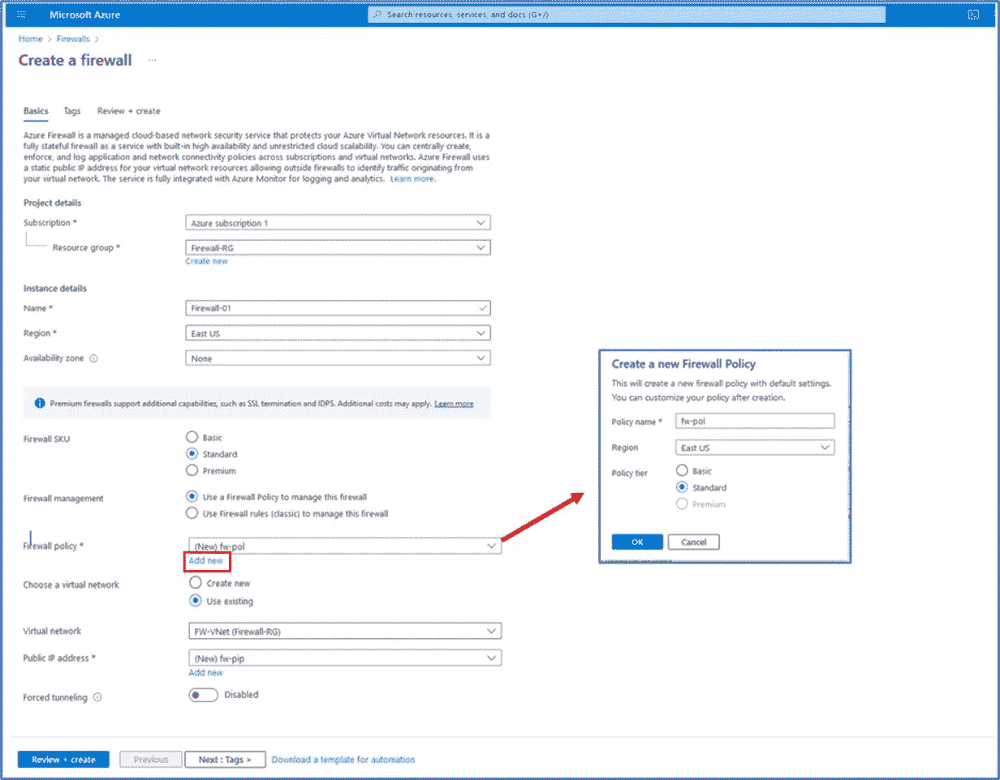

创建防火墙

完成防火墙部署后，我点击“Go to Resource ”,查看下一个任务中配置路由所需的防火墙的一些详细信息。在 Overview 选项卡上，我注意到分配给防火墙的私有 IP 地址是 **10.0.1.4。**

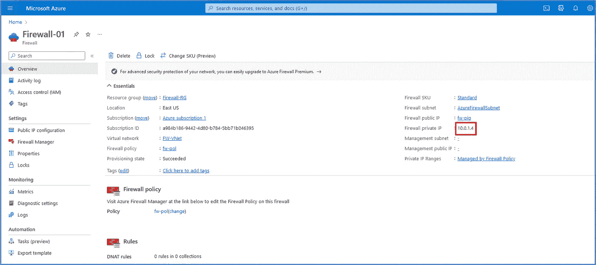

验证防火墙私有 IP 地址

接下来，我点击防火墙公共 IP 的名称来验证分配的公共 IP 地址，它是**20.228.240.135**。在后面的测试过程中，将需要这个公共 IP 地址来启动从我们的 PC 到防火墙的 RDP 连接。

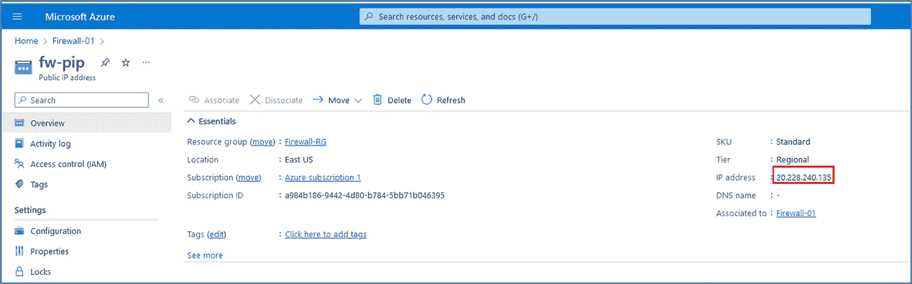

验证防火墙公共 IP 地址

**任务 5:创建默认路线**

我们的下一个任务涉及配置路由表，该路由表将用于存储我们需要为工作负载子网配置的自定义路由(用户定义的路由)。要创建路由表，**在顶部搜索栏中搜索路由表**，从服务列表中选择它，然后点击 **+创建**。在这里，我们选择订阅、资源组、区域，并输入路由表的名称。接下来，我给这个实例命名为**防火墙-路由**。如果您计划将路由表与通过 VPN 网关连接到本地网络的 VNet 中的子网相关联，并且希望将本地路由传播到子网中的网络接口，则应启用网关路由传播选项。在此步骤中，我可以禁用此选项，因为此部署中不包含 VPN 网关，所以不需要这样做。点击**查看+创建**开始路由表的部署。

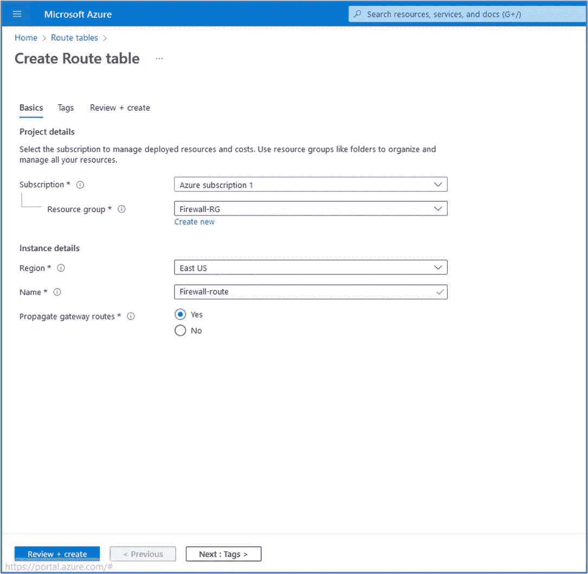

创建路由表

现在，如果不将路由表关联到子网并向其添加自定义路由，单独创建路由表是没有用的。因此，在下一步中，我们将通过在顶部搜索栏中搜索路由表，将新路由表关联到我们的工作负载子网，然后从服务列表中选择路由表，然后单击我们配置的路由表将其打开。

在设置下列出的子网菜单上，点击 **+关联**以显示在右侧打开的配置窗格。在这里，我们将选择我们希望与此路由表相关联的虚拟网络， **FW-VNet** 。然后，选择**工作负荷-序列号**作为子网的下一个字段条目。点击**确定**接受该配置

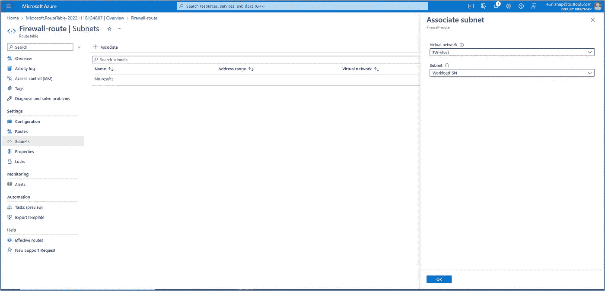

将路由表与工作负载-序列号子网相关联

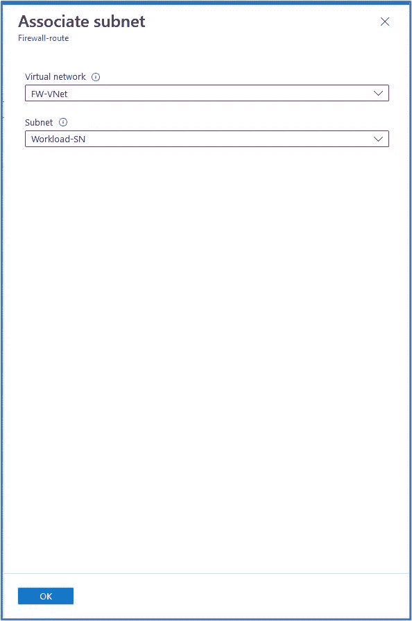

将路由表与工作负载-序列号子网相关联

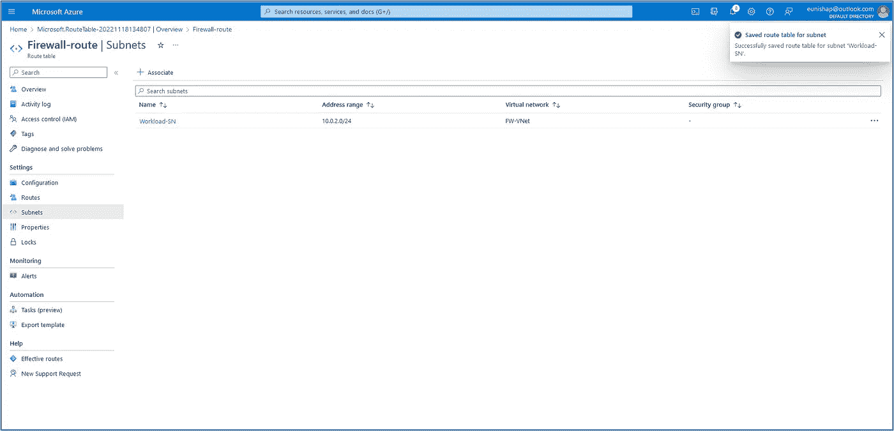

路由表和工作负载-SN 子网关联的验证

**任务 3:创建默认路线**

在与该路由表相关联的 Workload-SN 子网中，我们希望配置默认路由，将出站流量重定向为通过防火墙，而不是允许它直接路由到 Internet。通过这样做，我们可以确保在做出允许或拒绝流量的决定之前，将防火墙策略中配置的防火墙规则应用于流量。我们可以通过导航到菜单设置部分下的“**路线**”来配置该自定义路线，然后点击 **+添加**以打开添加路线配置窗格。

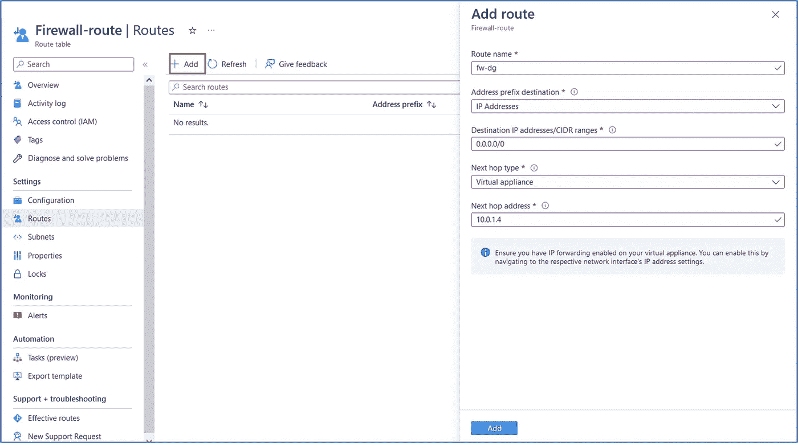

将路由添加到路由表

在 Add route configuration 窗格上，我们需要为路由提供一个名称( **fw-dg** )和一个地址前缀目的地。在这里，我们必须选择 IP 地址或服务标签的地址前缀目标。我们将为此选项选择 **IP 地址**，因为我们有一个特定的目的地 IP 地址，我们希望将其输入到默认路由 **0.0.0.0/0** 的 CIDR 符号中。接下来，从下拉列表中选择下一跳类型，并选择**虚拟设备**，因为我们希望将所有出站互联网流量重定向到防火墙。最后，我们将输入防火墙的私有 IP 地址作为下一跳地址， **10.0.1.4** 。点击**添加**将该条目添加到路由表中。此自定义用户定义路由(UDR)条目的目的是覆盖此地址前缀的系统默认路由，该系统默认路由当前设置为将所有出站流量直接路由到 Internet。

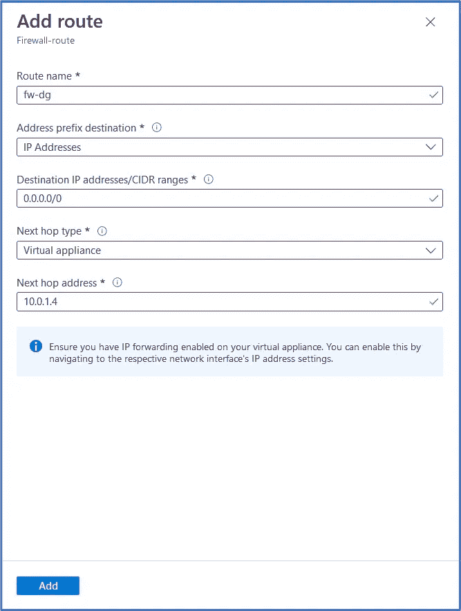

添加路线

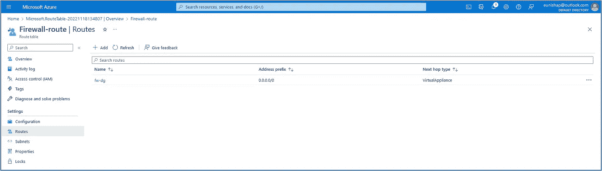

添加到路由表中的默认路由的验证

让我们快速浏览一下工作负载服务器虚拟机的网络接口的有效路由。我们观察到新创建的 UDR 现在已经覆盖了以前将出站流量路由到 Internet 的系统默认路由。默认路由现在显示“无效”状态，UDR 现在是 **0.0.0.0/0** 地址前缀的**活动**路由。这是我们试图实现的预期行为，因此出站流量现在将首先重定向到防火墙，以确定在评估配置的防火墙规则(我们将在下一个任务中创建)后，是允许还是拒绝发往互联网的流量请求。

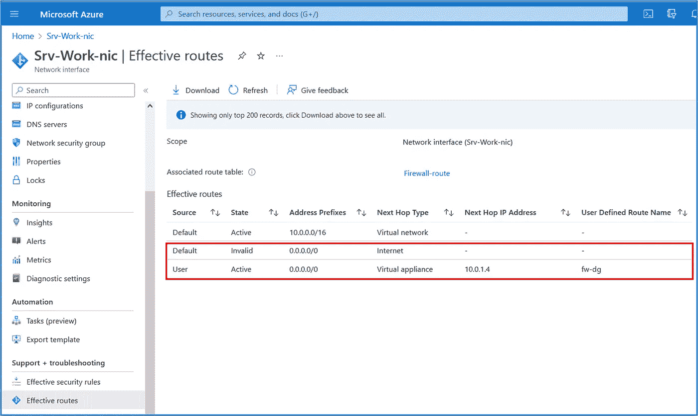

工作负载子网的有效路由

**任务 4:配置应用规则，允许访问**[**www.google.com**](http://www.google.com)

默认出站路由已经就绪，现在是时候将防火墙规则添加到我们的防火墙策略中，以便对防火墙收到的流量执行所需的操作。从主菜单中，我们可以单击**所有资源**并单击 **fw-pol** 打开防火墙策略资源。

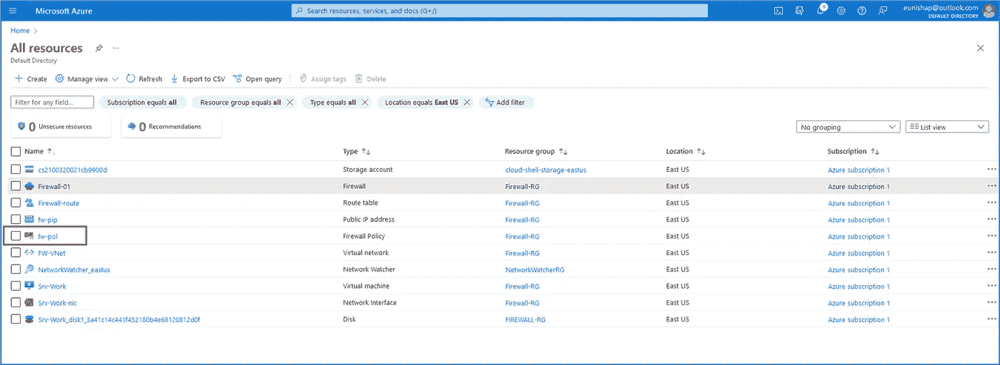

选择防火墙策略资源

我们将添加的第一类规则是应用程序规则。对于此任务，我们将添加一个允许出站访问[www.google.com 的应用程序规则。](http://www.google.com.)在**设置**下，点击**应用规则**。然后点击 **+ Add a rule collection** 开始创建一个新的集合，我们可以在其中输入规则。

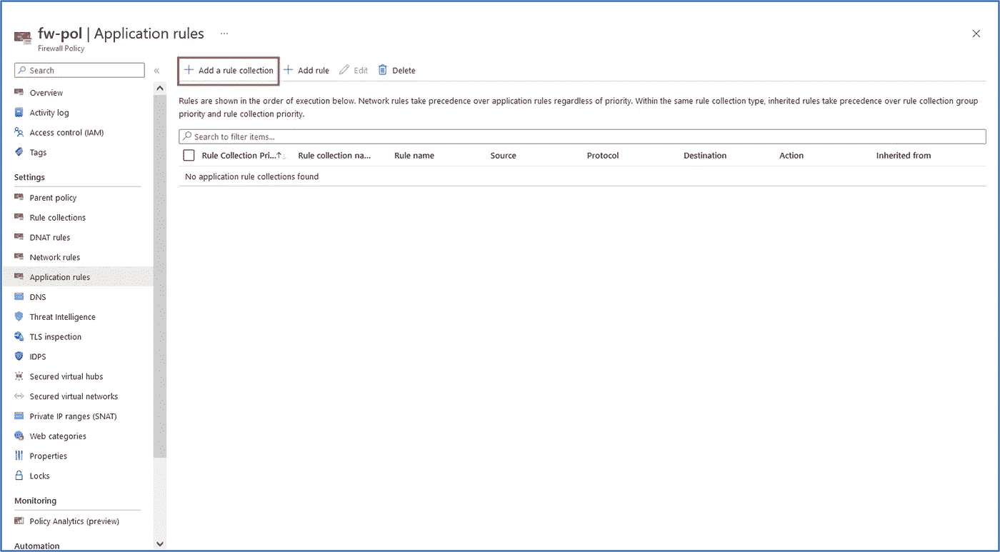

为应用程序规则添加新的规则集合

我们需要为新的规则集合输入一些信息。在这里，我们将输入以下值:

*   **名称:** AppRule-Coll01
*   **规则集合类型:**应用
*   **优先级:** 200
*   **规则采集动作:**允许
*   **规则收集组:**DefaultApplicationRuleCollectionGroupRule

接下来，我们将输入新应用规则的值，如下所示:

*   **名称:**允许-谷歌
*   **来源类型** : IP 地址
*   **协议:** http，https
*   **目的地类型** : FQDN
*   目的地:www.google.com

单击“添加”将这个新的规则集合和规则添加到防火墙策略中

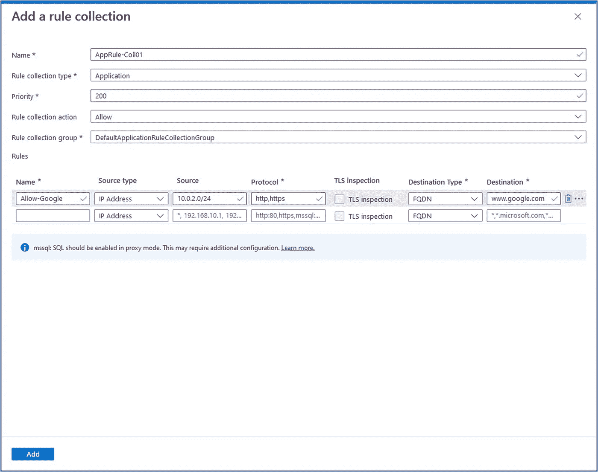

添加规则集合和规则

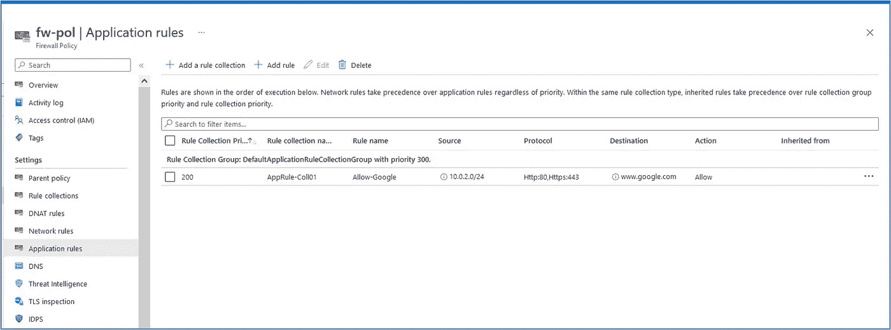

验证添加的规则集合和规则

**任务 5:配置网络规则以允许访问外部 DNS 服务器**

现在，我们将配置一个网络规则，允许我们的子网在端口 53 (DNS)对两个 IP 地址进行出站访问。这是必要的，以便我们的防火墙接收到的来自我们工作负载子网(10.0.2.0/24)的任何流量都可以与两台公共 DNS 服务器(Century Link DNS)进行出站通信，以进行公共 DNS 名称解析。这些 DNS 服务器的 IP 地址是**209.244.0.3 和 209.244.0.4。**

在防火墙策略资源页面上，单击位于菜单上设置下的**网络规则**，然后单击 **+添加新规则集合**。

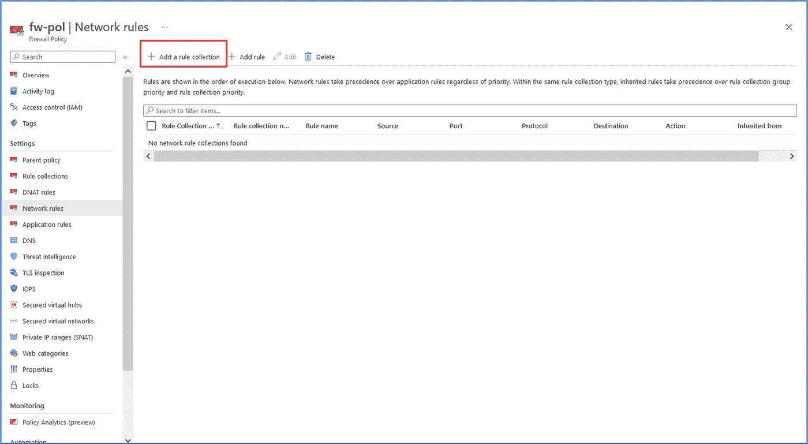

为网络规则添加新的规则集合

在“添加规则集合”窗口中，我们将输入以下值来配置此集合和网络规则:

*   **名称:** NatRule-Coll01
*   **规则集合类型:**网络
*   **优先级:** 200
*   **规则收集动作:**允许
*   **规则收集组:**DefaultNetworkRuleCollectionGroup

接下来，我们将输入新网络规则的值，如下所示:

*   **名称:**允许-DNS
*   **来源类型:** IP 地址
*   **来源:** 10.0.2.0/24
*   **协议:** UDP
*   **目的港:** 53
*   **目的地类型:** IP 地址
*   **目的地:**209.244.0.4 209.244.0.3

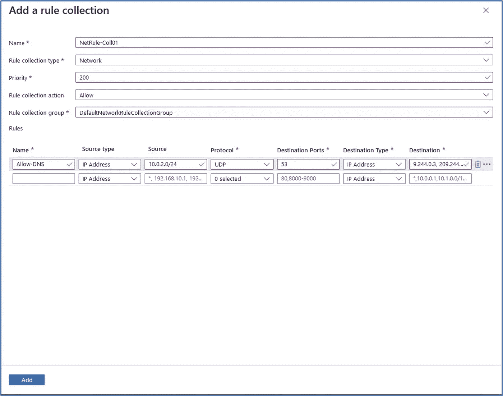

添加规则集合和网络规则

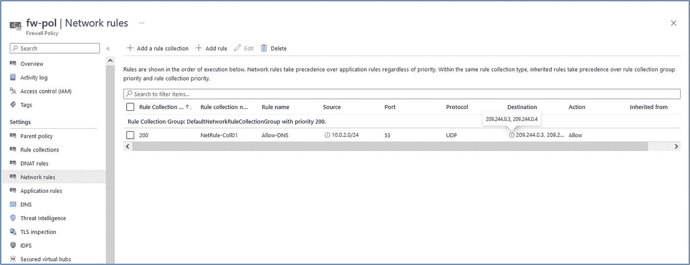

验证已配置的网络规则

**任务 6:配置 NAT 规则以允许远程桌面连接到测试服务器**

在此任务中，我们将添加一条 DNAT 规则，允许我们通过防火墙将远程桌面连接到 **Srv-Work** 虚拟机。我们将首先为我们的 DNAT 规则创建一个新的规则集合。在我们的防火墙策略资源页面上，单击位于设置部分下的 **DNAT 规则**，然后单击 **+添加规则集合**。

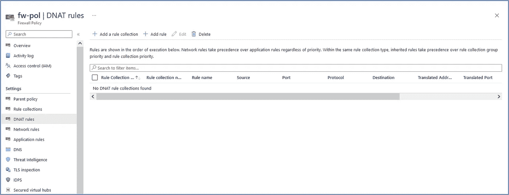

为 DNAT 规则添加规则集合

接下来，我们将为 DNAT 的规则集合输入如下值:

*   **名称:** rdp
*   **规则集合类型:** DNAT
*   **优先级:** 200
*   **规则集合组:**DefaultDnatRuleCollectionGroup

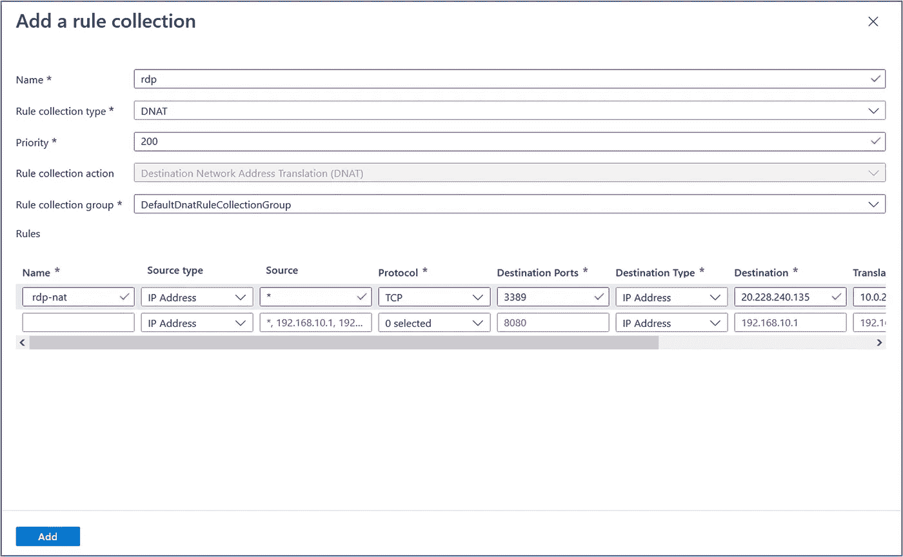

为目标网络地址转换(DNAT)添加规则集合和规则

在**规则**部分，我们需要输入允许从任何源 IP 地址通过防火墙到工作负载服务器的入站远程桌面连接的值。

我们将为目标网络地址转换(DNAT)规则输入下列值，以便从任何源 IP 地址到防火墙公共 IP 地址(到端口 3389)的任何 RDP 连接将转换为工作负载服务器虚拟机的私有 IP 地址。没错！我们希望将目标 IP 地址转换为工作负载服务器虚拟机的 IP 地址，以便我们可以通过远程桌面连接从另一台设备连接到它。

*   **名称:** rdp-nat
*   **来源类型:** IP 地址
*   **来源:** *
*   **协议:** TCP
*   **目的港:** 3389
*   **目的地类型:** IP 地址
*   **目的地:**20.228.240.135(这是防火墙的公共 IP 地址)
*   **转换后的地址:** 10.0.2.4(这是工作负载服务器 VM 的内部/私有 IP 地址)
*   **已翻译端口:** 3389


单击添加将此规则集合和 DNAT 规则添加到防火墙资源的策略中。它将类似于以下内容:

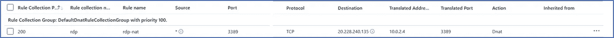

验证已配置的目标网络地址转换规则(DNAT)

我们可以通过单击防火墙策略资源的设置部分下的规则集合来查看每个已配置的规则集合。

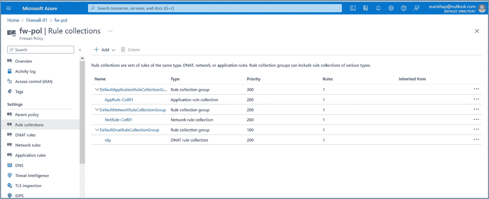

验证防火墙策略上已配置的规则集合

**更改服务器网络接口的主要和辅助 DNS 地址**

在本练习中，出于测试目的，我们将使用自定义地址配置 Srv-Work 服务器的主要和辅助 DNS 地址。我们可以通过导航到 **Srv-Work** 虚拟机的网络接口来做到这一点。在**设置**下，选择 **DNS 服务器**。在 **DNS 服务器**下，选择**自定义**。在**添加 DNS 服务器**文本框中输入**209.244.0.3**，在下一个文本框中输入**209.244.0.4**。单击“保存”接受新设置。

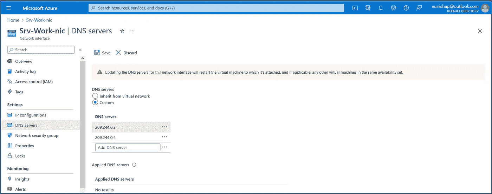

为 Srv-Work 虚拟机配置自定义 DNS 服务器

单击返回“已配置的 DNS 服务器”页面，我们会在该屏幕的底部看到这些设置已应用于 Srv-Work 虚拟机的 NIC。

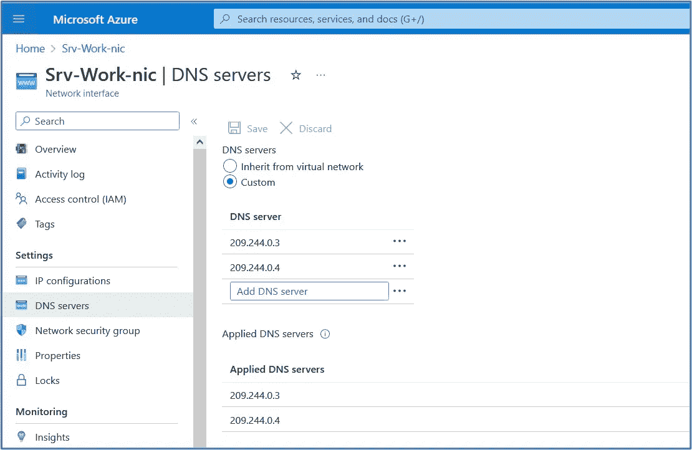

自定义 DNS 服务器的验证

**任务 7:测试防火墙**

最后，是时候测试我们为这个部署配置的防火墙规则了。我们将从从我们的 PC 启动**远程桌面连接**工具开始。我们将进入防火墙的公共 IP 地址，在我的例子中是**20.228.240.135。**在提示符下，输入您在部署 workload server VM 时配置的管理员帐户凭据，然后单击 OK。

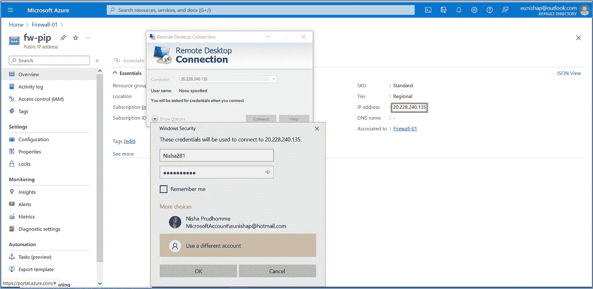

启动到防火墙公共 IP 地址的 RDP 连接

接下来，将提示您关于工作负载服务器虚拟机 Srv-Work 的证书。单击“是”继续。成功连接到工作负载虚拟机证明我们配置的 DNAT 规则正在按预期工作，并且正在将我们防火墙的公共 IP 地址转换为 Svr-Work 虚拟机的内部/私有 IP 地址。

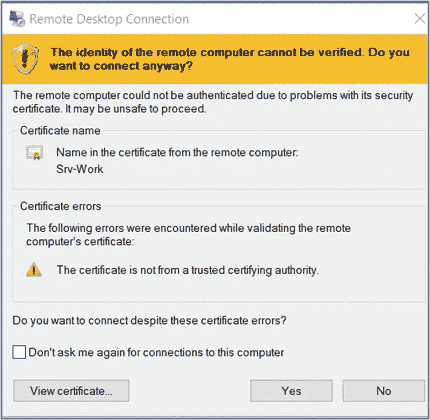

确认对 Srv-Work 虚拟机的连接请求

一旦我们登录到 Srv-Work 虚拟机，我们需要启动网络浏览器，这样我们就可以测试我们是否被允许访问[www.google.com](http://www.google.com)站点。在这里，我们可以看到防火墙规则按照预期工作，允许这种通信。请记住，在使用防火墙时，任何未被规则明确允许的内容都将被默认拒绝。我们为 Allow-Google 配置的应用程序规则允许此出站流量流向 Google。

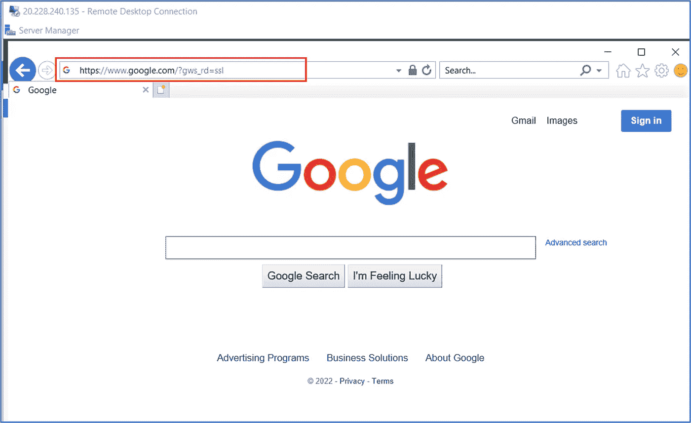

测试 Allow-Google 的防火墙应用程序规则

在接下来的测试中，我试图在网络浏览器中导航到[www.microsoft.com](http://www.microsoft.com)，出现了以下反馈。此连接被防火墙拒绝，因为我们没有配置明确的规则来允许来自我们子网的连接与此 FQDN 通信。

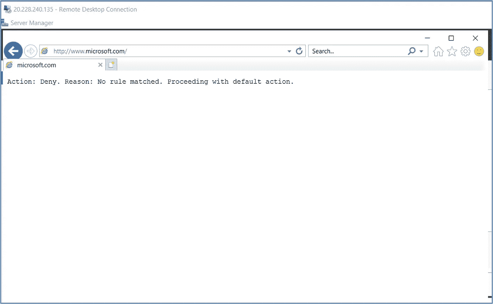

测试连接到 Microsoft.com 的防火墙应用程序规则

这就结束了关于如何部署带有允许或拒绝来自 Azure 的出站流量的规则的防火墙策略的演示。请继续关注，因为在我接下来的几篇文章中会有更多的防火墙实验！

感谢您的阅读！

你可以通过 LinkedIn 联系我:[https://www.linkedin.com/in/nishaprudhomme/](https://www.linkedin.com/in/nishaprudhomme/)

[](https://learn.microsoft.com/en-us/azure/firewall/overview) [## 什么是 Azure 防火墙？

### Azure 防火墙是一种云原生的智能网络防火墙安全服务，提供同类最佳的…

learn.microsoft.com](https://learn.microsoft.com/en-us/azure/firewall/overview) [](https://learn.microsoft.com/en-us/azure/architecture/framework/services/networking/azure-firewall?toc=%2Fazure%2Ffirewall%2Ftoc.json&bc=%2Fazure%2Ffirewall%2Fbreadcrumb%2Ftoc.json) [## Azure 架构良好的框架评论- Azure 防火墙-微软 Azure 架构良好…

### 本文提供了 Azure 防火墙的架构最佳实践。该指南基于…的五大支柱

learn.microsoft.com](https://learn.microsoft.com/en-us/azure/architecture/framework/services/networking/azure-firewall?toc=%2Fazure%2Ffirewall%2Ftoc.json&bc=%2Fazure%2Ffirewall%2Fbreadcrumb%2Ftoc.json) [](https://learn.microsoft.com/en-us/azure/firewall/firewall-faq) [## Azure 防火墙常见问题

### Azure 防火墙是一种受管的、基于云的网络安全服务，可以保护您的 Azure 虚拟网络资源…

learn.microsoft.com](https://learn.microsoft.com/en-us/azure/firewall/firewall-faq) [](https://learn.microsoft.com/en-us/azure/firewall/rule-processing) [## Azure 防火墙规则处理逻辑

### 您可以使用经典规则或…在 Azure 防火墙上配置 NAT 规则、网络规则和应用程序规则

learn.microsoft.com](https://learn.microsoft.com/en-us/azure/firewall/rule-processing) [](https://learn.microsoft.com/en-us/azure/firewall/policy-rule-sets) [## Azure 防火墙策略规则集

### 防火墙策略是包含 Azure 防火墙的安全和操作设置的顶级资源。你可以用…

learn.microsoft.com](https://learn.microsoft.com/en-us/azure/firewall/policy-rule-sets)