# 将 Angular + NodeJS 应用程序部署到 AWS Elastic Beanstalk

> 原文：<https://blog.devgenius.io/deploy-angular-nodejs-application-to-aws-elastic-beanstalk-9ab13076a736?source=collection_archive---------1----------------------->

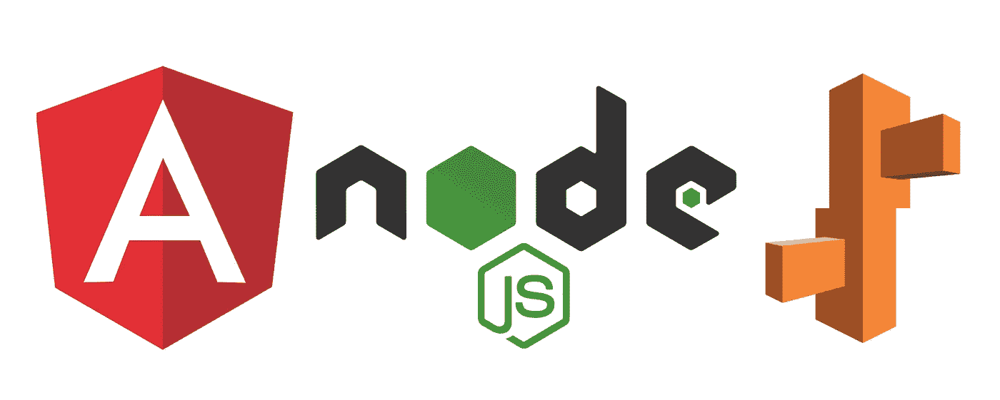

Angular 是一个流行的 JavaScript 框架，用于构建单页面应用程序(SPA)。NodeJS 是一个广泛用于构建后端应用程序的平台。通过将这两者结合起来，我们可以创建一个功能完整的端到端 web 应用程序，但是我们如何才能使它在 web 上可供任何人使用呢？这正是我们在这里要寻找的。我们将使用 AWS Elastic Beanstalk 来部署应用程序。Elastic Beanstalk 是 AWS 提供的一项服务，用于部署和扩展 Java、Python、NodeJS、Ruby、Go、。网等。您不需要担心自己管理服务器的问题。理论够了，开始吧。

# **先决条件**

1.  机器上安装的 Angular CLI 和 NodeJS
2.  AWS 帐户

# **样本应用**

这是一个使用 Angular 和 NodeJS 生成随机名称的简单应用程序。名称在后端生成，并通过 REST API 调用发送到前端。

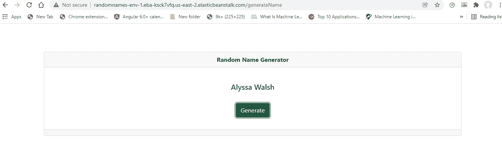

# **创建 NodeJS 后端**

1.  创建一个空文件夹，并在那里打开命令行。
2.  键入 **npm init** 来初始化项目。它会询问你一些信息，比如 git 库、作者等等。但是您可以忽略它们，或者在必要时提供它们。现在您将能够看到 package.json 和 package-lock.json 文件已经在您的文件夹中创建。
3.  我们在这里使用 express、cors 和 nodemon npm 包。要将它们添加到项目中，请在**命令行中键入 **npm i express cors nodemon** 。**
4.  在后端文件夹中创建 app.js 文件。
5.  创建一个文件夹作为视图(你可以给任何你想要的名字)。我们稍后会用到它。
6.  转到 package.json 文件，在 scripts 下添加“start”:“node mon app . js”。

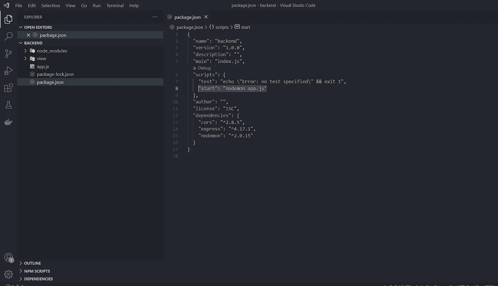

7.将以下代码添加到 app.js 中。

8.在命令行中键入 **npm start** 。它会显示“服务器正在端口 3000 上运行”。

9.在你的浏览器中输入 [http://localhost:3000](http://localhost:3000/#/) 。现在你可以看到“你好，来自 NodeJS！”。

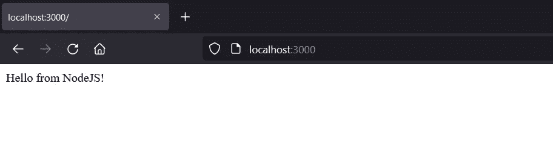

10.现在是时候添加我们需要的实际代码了。将以下代码粘贴到 app.js 中。

11.在浏览器中键入[http://localhost:3000/API/getName](http://localhost:3000/api/getName)。它会显示一个随机生成的名称。

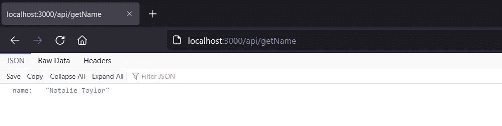

12.现在，我们所要做的就是从前端调用这个 API！

# 创建角度前端

1.  打开新的命令终端，键入 **ng new < app name >** 。你给的应用程序名称将是 angular 项目名称。
2.  它会问你“你想增加角度路由吗？”选择“是”。
3.  您可以将 SCSS 作为样式表格式。并按下回车键，它将创建角度项目。
4.  键入 **cd < app name >** 进入前端文件夹，键入 **ng serve** 运行项目。
5.  键入 [http://localhost:](http://localhost:3000/api/getName) 4200。您将能够看到类似于下图的角度起始页。

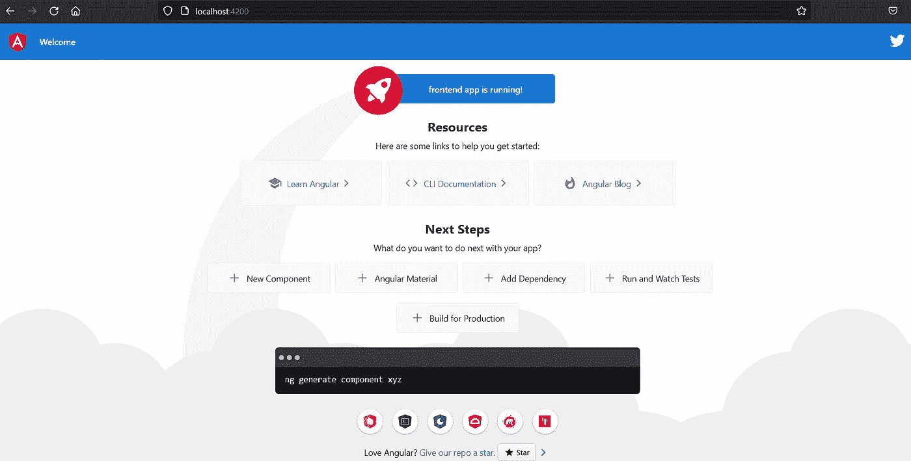

6.为了让项目看起来更好，让我们添加 bootstrap。从前端文件夹打开一个新命令，通过键入 **npm i bootstrap** 安装 bootstrap。并将下面一行添加到 styles.scss 文件中。

```
@import "~bootstrap/dist/css/bootstrap.css"
```

7.让我们制造我们需要的组件和服务。在前端项目中键入以下命令。

```
ng g c generate-name
ng g s services/name
```

这将在 src/app 中创建 generate-name 组件和服务文件夹。

8.移除 app.component.html 上除了<router-outlet>和</router-outlet>以外的所有东西

9.通过构造函数将 angular Router 注入 app.component.ts。

```
constructor(private router: Router) { }
```

10.将以下内容添加到 app.component.html 的顶部并保存。

```
<h5 *ngIf="router.url == '/'">Hello from Angular!</h5>
```

11.现在，您将能够看到以下内容。

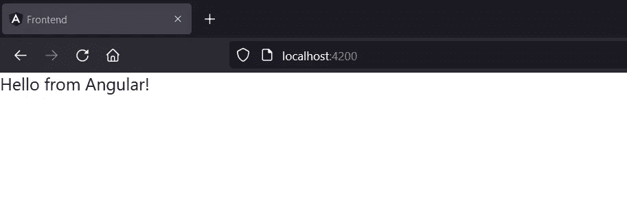

12.让我们在项目中添加路由。转到 app-routing.module.ts，将以下内容添加到 routes 数组中。

```
{ path: 'generateName', component: GenerateNameComponent }
```

13.尝试在浏览器中键入[http://localhost:4200/generate name](http://localhost:4200/#/generateName)。它将向您显示以下内容。

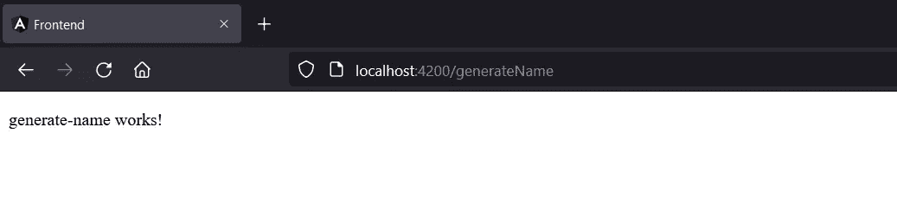

14.将以下代码添加到 service/name.service.ts 中

请确保已将 HttpClientModule 添加到 app.module.ts 文件中的 imports 数组中。

```
imports: [
   BrowserModule,
   AppRoutingModule,
   HttpClientModule
],
```

15.以下是 generate-name.component.html、generate-name.component.scss 和 generate-name.component.ts 文件的代码。

16.现在[http://localhost:4200/generate name](http://localhost:4200/#/generateName)会显示这个。点击生成按钮将显示你随机生成的名字。就是这样！

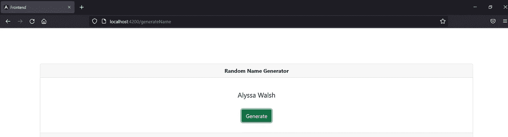

现在你几乎完成了前端和后端。但是为了将应用程序部署到 Elastic Beanstalk，我们还需要做一些事情。

1.  在资产文件夹下创建文件夹环境。将 env.js 文件添加到环境文件夹中。

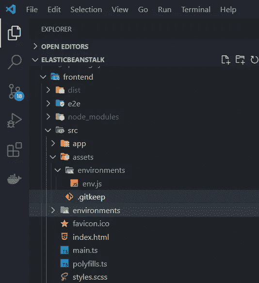

2.在那里添加以下代码。

```
(function (window) {
   window.__env = window.__env || {};
   window.__env.SERVER_URL = 'http://localhost:3000';
}(this));
```

3.将 **<脚本 src = "/assets/env . js "></script>**脚本添加到 index.html 文件中。

4.将以下内容添加到 environment.ts 文件和 environment.prod.ts 文件中。

```
server_URL: window['__env']['SERVER_URL']
```

5.将 name.service.ts 文件更改为使用 environment.ts 文件中的 server_URL。

为什么我们需要做上面的事情？一会儿让我们看看。

现在我们需要创建一个单独的构建包来部署到 beanstalk。

# **创建构建包**

1.  转到 angular.json 文件，将 outputPath 改为“dist”。

```
"architect": {
  "build": {
  "builder": "@angular-devkit/build-angular:browser",
  "options": {
    "outputPath": "dist",
    "index": "src/index.html",
```

2.从前端文件夹打开命令行，键入 ng build。这将在你的角度根文件夹中创建角度构建文件夹。

3.复制 dist 文件夹。转到后端文件夹，并将其粘贴到视图文件夹中。

4.将以下内容添加到 app.js 文件中。

```
app.use(express.static(__dirname.replace(/\\/g, "/") + '/view/dist'))
```

5.在浏览器上试试 [http://localhost:3000/](http://localhost:3000/) 。它将在下面显示。

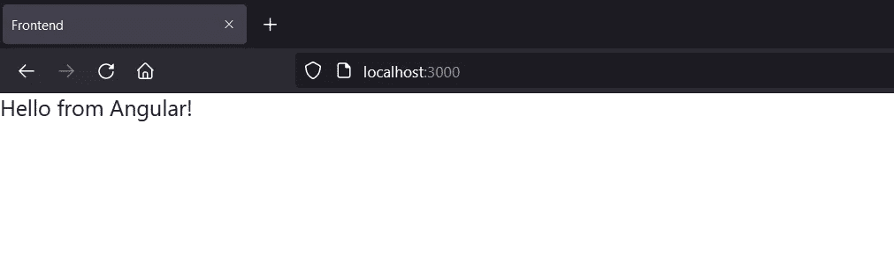

所以现在，整个项目运行在端口 3000 上。但是[http://localhost:3000/](http://localhost:3000/)generate name 呢？一旦你尝试了，它会给你以下。

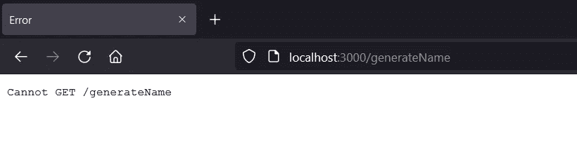

为了解决这个问题，我们有两种方法。

*   将 useHash 添加到 app-routing-module.ts
*   创建一个为 index.html 服务的中间件。

**添加使用哈希**

将{useHash: true}添加到 RouterModule.forRoot

```
RouterModule.forRoot(routes, { useHash: true })
```

再次创建 angular build 文件夹，并将其添加到后端/视图文件夹。重新启动服务器。

这将向基本 URL 追加一个哈希。现在输入[http://localhost:4200/#/generate name](http://localhost:4200/#/generateName)，应该会显示如下内容。

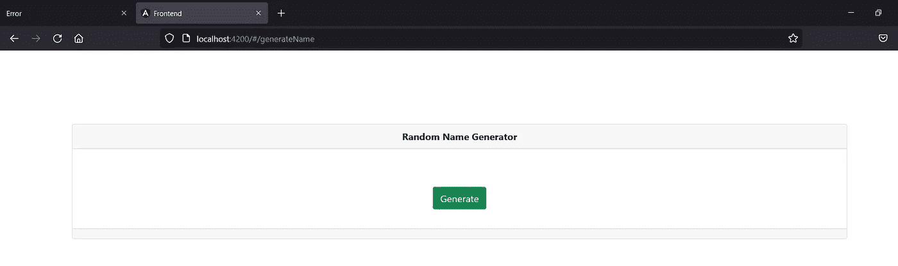

并且[http://localhost:3000/#/generate name](http://localhost:4200/#/generateName)现在将运行。

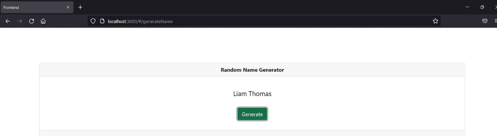

**创建中间件**

将以下内容添加到 app.js 中。

```
app.use(sendSpaFileIfUnmatched);function sendSpaFileIfUnmatched(req, res){
   res.sendFile("/view/dist/index.html", { root: '.' });
}
```

app.js 应该是这样的。

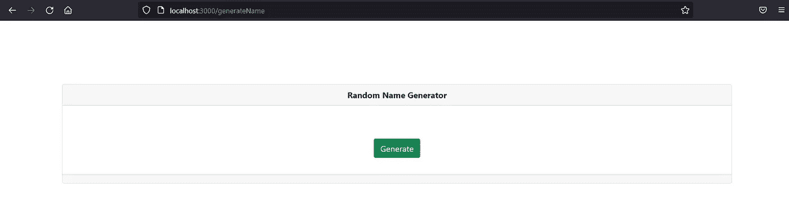

现在一切似乎都很好。但是我需要你注意一些事情。

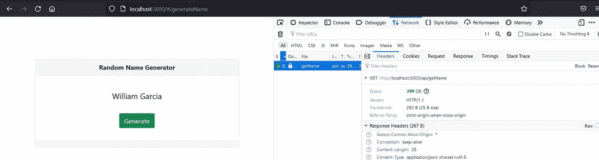

看一下 API。[http://localhost:3000/API/getName](http://localhost:3000/api/getName)是网址。这将在本地环境中完美地运行，但是在远程环境中呢？当然，API 是不一样的。因此，在远程环境中，我们必须将其设置为适当地接受 API URL。这就是我们在前端项目中包含 env.js 的原因。在 beanstalk 环境中，它将相应地更改 env.js 文件。为此，请将以下 writeENV()函数代码片段添加到 app.js 文件中。这是 app.js 的最终代码。

我们已经完成了前端和后端所需的所有配置！最后，我们可以开始部署了。

在此之前，请确保在 package.json 的脚本内**将启动命令更改为“node app . js”**

```
"scripts": {
  "test": "echo \"Error: no test specified\" && exit 1",
  "start": "node app.js"
}
```

# **展开至弹性豆茎**

1.  制作后端的 zip 文件。请记住，这包含我们的建立前端 dist 文件夹内的意见。不需要在 zip 中添加 node_modules 文件夹。
2.  转到 Elastic Beanstalk 控制台并单击 Create Application。

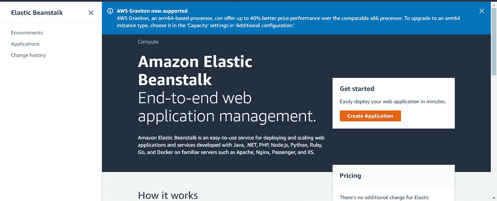

3.将应用程序名称和平台命名为 NodeJS。

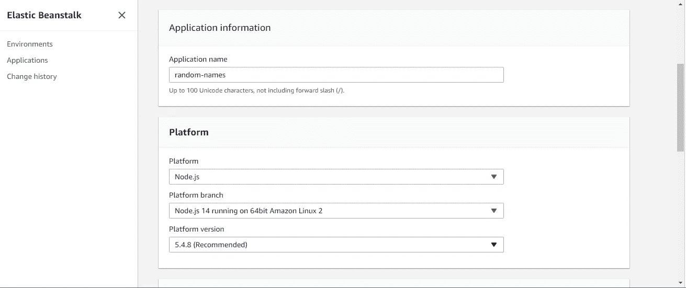

4.上传 zip 文件并部署。

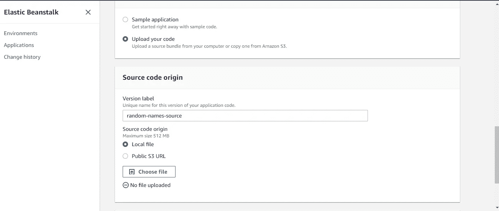

5.现在，您将能够看到以下页面。正如我们所看到的，beanstalk 提供了访问我们的应用程序的 URL。

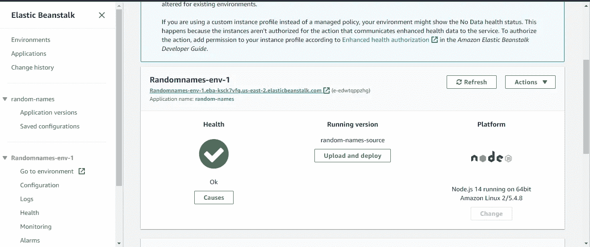

6.我们必须提供 NODE_ENV 和 SERVER_URL 环境变量，以便对 beanstalk 中的正确 URL 进行 API 调用。为此，请转到“配置”,然后单击“软件类别”下的“编辑”按钮。

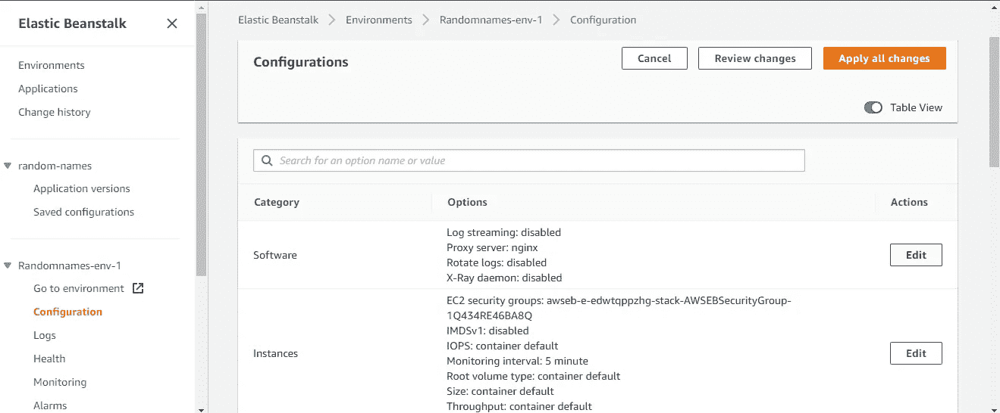

7.按如下方式提供上述环境变量。SERVER_URL 是 beanstalk 给出的 URL。也提供 NODE_ENV 值。

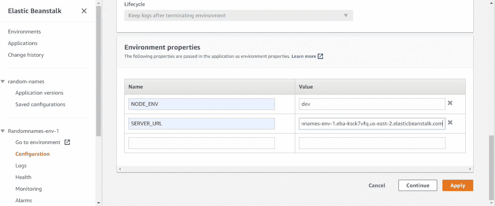

8.就是这样！。现在，您已经完成了将应用程序部署到 Elastic Beanstalk 的工作。打开豆茎给的网址，尽情享受吧！


你可以从这里下载完整的应用程序。

[https://github . com/kanchana 46/node-angular-elastic beanstalk . git](https://github.com/Kanchana46/node-angular-elasticbeanstalk.git)

编码快乐！