# 在 Azure Kubernetes 服务上部署应用程序

> 原文：<https://blog.devgenius.io/deploy-application-on-azure-kubernetes-service-fb51070f4f51?source=collection_archive---------5----------------------->

在本文中，我们将演示如何在 AKS (Azure Kubernetes 服务)中部署 web 应用程序。

**Azure Kubernetes 服务**

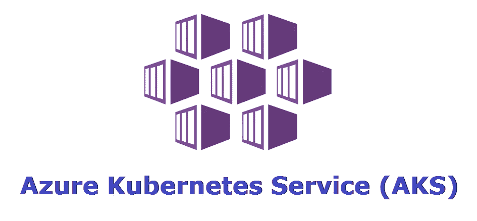

Azure Kubernetes 服务是一种基于开源 Kubernetes 系统的托管容器编排服务，可在微软 Azure 公共云上获得。组织可以使用 AKS 来处理关键功能，例如部署、扩展和管理 Docker 容器和基于容器的应用程序。

**蔚蓝集装箱注册处**


Azure 容器注册表

Azure Container Registry 是一个私有的注册服务，用于构建、存储和管理容器图像和相关工件。在这个快速入门中，您将使用 Azure 门户创建一个 Azure 容器注册实例。

现在，我们将把我们的图像放入容器注册表:

```
docker push myprivaterepo.azurecr.io/client
docker push myprivaterepo.azurecr.io/server
```

现在，我们可以看到我们的映像被成功地推送到远程注册表:

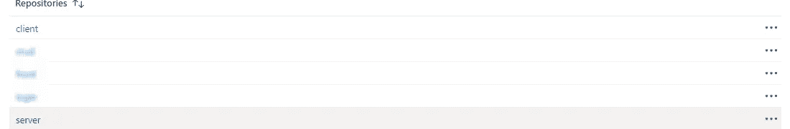

**创建我们的 Kubernetes 集群**

我们现在要创建我们的集群，我们连接到 azure 门户，然后我们搜索 kubernetes 服务。

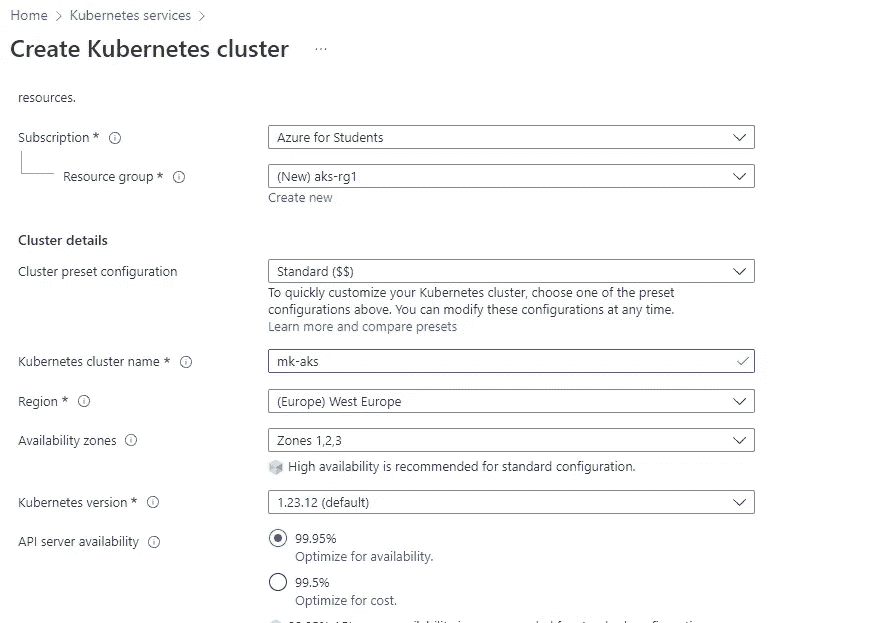

对于主页面，我们设置资源组和集群名称。对于节点代理，我们将其设置为 Standard_B2s，这是可用的最便宜的代理:

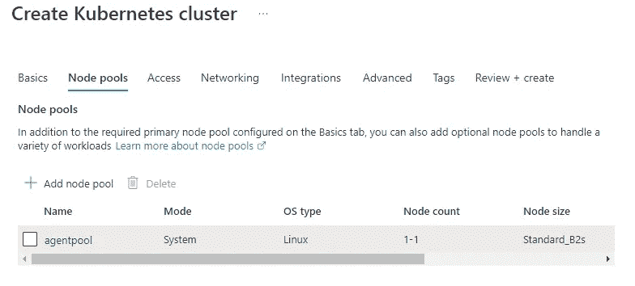

对于集群内部的联网，我们使用默认的 Kubenete 网络配置和 Calico 来实现 pod 和服务之间的连接:

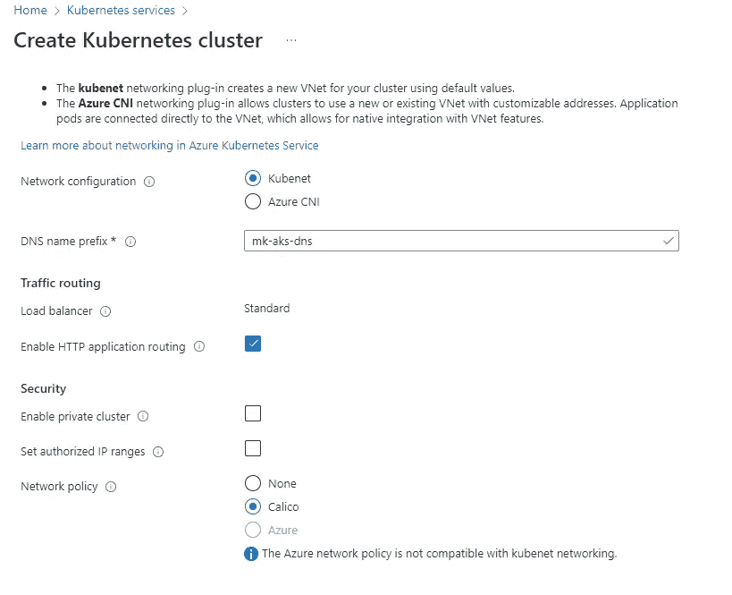

最后，我们将 docker 注册表连接到集群，以便我们可以提取图像:

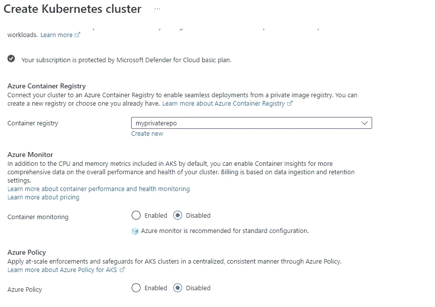

然后我们点击创建。

**部署应用**

现在，我们需要连接到集群

```
az account set --subscription ####################
az aks get-credentials --resource-group aks-rg1 --name mk-aks
```

我们使用以下方式部署我们的部署和服务:

```
 kubectl apply -f .\client-deploy.yaml
 kubectl apply -f .\server-deploy.yaml
 kubectl apply -f .\client-svc.yaml
 kubectl apply -f .\server-svc.yaml
```

> 注意:我们将使用公共云负载均衡器来实现我们的前端服务于互联网。

## Nginx 反向代理:


nginx

为了将 API 请求转发到我们的 ClusterIP 后端，我们将使用一个 nginx 服务器作为反向代理。

**反向代理**是位于后端应用程序前面的应用程序，它将客户端(例如浏览器)请求转发给这些应用程序。反向代理有助于提高可扩展性、性能、弹性和安全性。返回给客户端的资源看起来好像是来自 web 服务器本身。

我的 nginx.conf:

```
server {
    listen 80;

    location /api {
        proxy_http_version 1.1;
        proxy_set_header Upgrade $http_upgrade;
        proxy_set_header Connection "upgrade";
        proxy_set_header Host $host;
        proxy_cache_bypass $http_upgrade;
        proxy_pass http://${API}:${PORT}/api; 
    }

    location / {
        root /usr/share/nginx/html;
        index index.html index.htm;
        try_files $uri $uri/ /index.html;
    }

    error_page 500 502 503 504 /50x.html;

    location = 50x.html {
        root /usr/share/nginx/html;
    }
}
```

在这个配置中，每个对“/api”的请求都会被转发到“[http://$ { API }:$ { PORT }/API](http://${API}:${PORT}/api)”。例如，请求 a /api/user 将被转发到[http://$ { API }:$ { PORT }/API](http://${API}:${PORT}/api)/user。

## 测试事物:

因此，我们的服务现在可用，我们可以看到为我们的前端应用程序提供服务的负载平衡器的公共 IP:

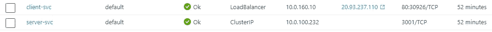

我们访问它，我们的应用程序成功运行:

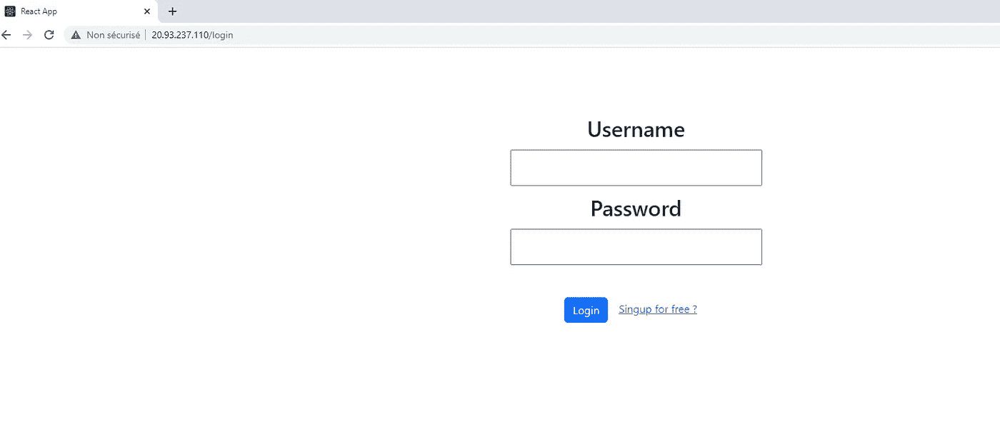

我们尝试创建帐户并登录:

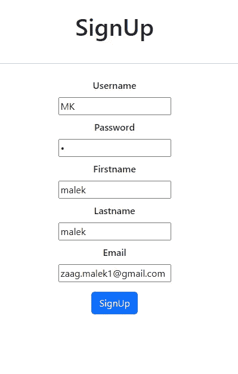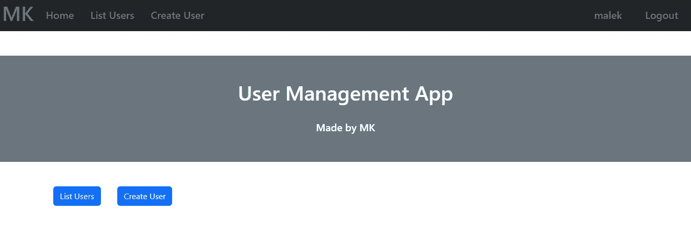

现在我们创建一个新用户来测试我们的 API:

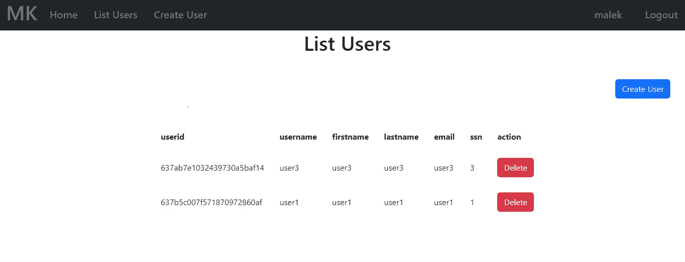

我们的应用编程接口成功地:

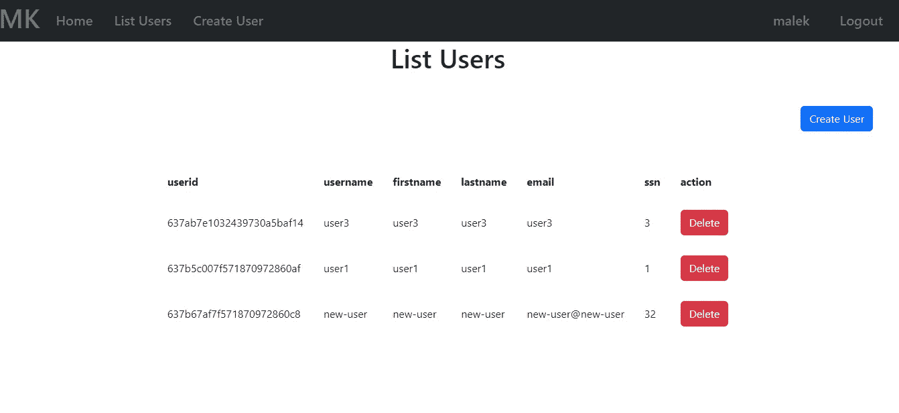

我希望您喜欢阅读这篇文章，并且您已经学习了如何使用 Azure Kubernetes 服务部署完整的堆栈 web 应用程序。