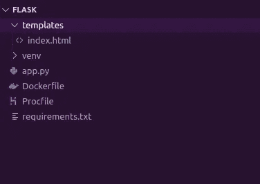
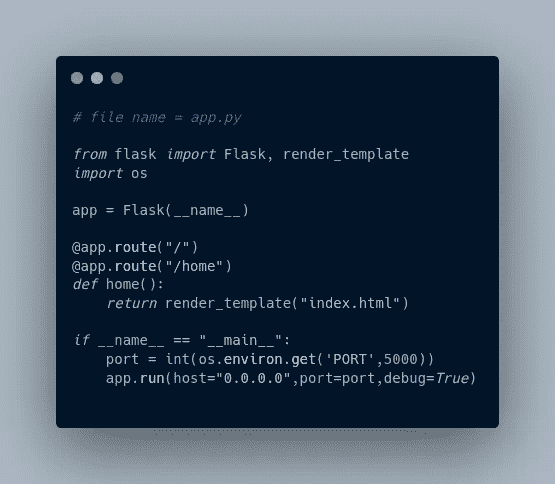

# 将集装箱式烧瓶应用程序部署到 Heroku

> 原文：<https://blog.devgenius.io/deploy-containerized-flask-app-to-heroku-aaccffd0a12d?source=collection_archive---------3----------------------->

将容器应用程序部署到 Heroku 的 3 个简单步骤

烧瓶应用程序到 Heroku

# 介绍

在这篇博客中，我专注于将一个 flask 应用程序容器化，并将其托管在 Heroku 云平台上。

# 1.构建烧瓶应用程序

## >创建虚拟环境

> # mkdir 烧瓶；cd 烧瓶
> 
> #虚拟的虚拟
> 
> #源 venv/bin/激活

## >安装烧瓶和 gunicorn

> # pip3 安装烧瓶 gunicorn
> 
> # pip3 冻结> requirements.txt

## >编写基本的 flask 应用程序

项目结构:

项目结构

创建“ **app.py** ”来构建 flask app。这是一个基本的 flask 应用程序，它将容器的端口 5000 绑定到主机的端口(部署到 Heroku 时的重要部分)

app.py

为 heroku 部署创建“ **Procfile** ”，这里 gunicorn 是一个生产服务器 app:app 的意思，我们指的是“ **app.py 的 app 实例**

Procfile

创建一个名为“ **templates** 的目录，并在这个目录下创建 HTML 文件。

模板/索引. html

## >本地运行 flask 应用程序

> # curl 本地主机:5000

# 2.将应用容器化

## >创建 Dockerfile 文件

这是一个基本的 Dockerfile，使用 python:3 基镜像，在那个基镜像中设置工作目录为/app，将“requirements.txt”复制到基镜像中，然后在基镜像中安装 requirements.txt 中的所有包，最后启动 app。

Dockerfile 文件

## >构建图像

> # docker build -t flaskapp。

## >运行容器并在本地测试它

> # docker 图像
> 
> # docker 运行名称 flask1 -dit -p 5000:5000 flaskapp
> 
> # docker ps
> 
> # curl 本地主机:5000

下面是上述命令输出的屏幕截图。

# 3.部署到 Heroku

这是应用上线的最后也是最重要的一步。

## >在 Heroku 上创建一个帐户

注册 Heroku 平台[https://signup.heroku.com/](https://signup.heroku.com/)

## >安装 Heroku CLI

查看此官方链接，在您的操作系统上安装 heroku CLI[https://dev center . heroku . com/articles/heroku-CLI #下载并安装](https://devcenter.heroku.com/articles/heroku-cli#download-and-install)

> 安装 Heroku CLI 后，使用命令行
> # heroku login 登录 Heroku
> 
> 登录 heroku 容器注册表
> # heroku 容器:登录
> 
> 创建一个 heroku 应用程序，如果没有提供参数，heroku 会为该应用程序分配一个随机名称
> # heroku create
> 
> 这是最重要的一步。**导航到“Dockerfile”所在的路径**，这将构建图像并将图像推送到 heroku 注册表。
> # heroku 容器:推送 we B- a<heroku app 的名称>
> 
> 在 heroku 主机上创建容器并公开托管
> # heroku container:release we B- a<heroku app 名称>
> 
> 在默认浏览器中打开应用程序
> # heroku open-a<heroku 应用程序的名称>
> 
> 你可以查看那个特定 heroku app 的日志
> # heroku logs-tail-a<heroku app 的名称>

上述命令的屏幕截图。

heroku 登录

推送至 heroku 容器注册表

部署到 heroku

WebApp heroku 链接:[https://radiant-coast-87631.herokuapp.com/](https://radiant-coast-87631.herokuapp.com/)
代号 Github 链接:[https://github.com/Prajwalmithun/hostingflask](https://github.com/Prajwalmithun/hostingflask)

# 结论

在这篇博客中，我试图演示将容器部署到 Heroku。这只是为了展示将我们的容器部署到云是多么容易。具有复杂 web 应用程序的大型容器可以用同样的方式部署。我还会写一篇关于添加自定义域和子域到托管 web 应用的独立文章。