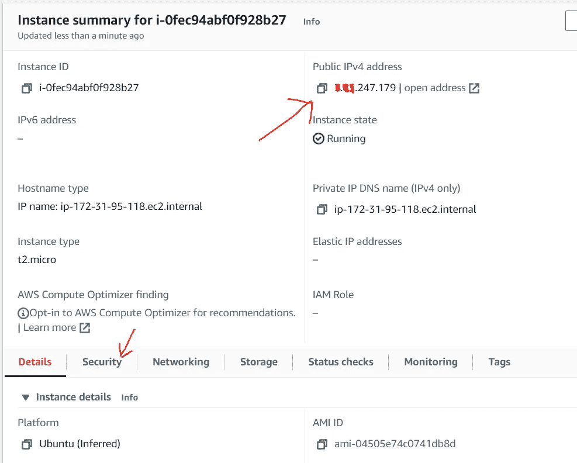

# 将 Flask 服务器部署到 EC2 实例

> 原文：<https://blog.devgenius.io/deploy-flask-server-to-an-ec2-instance-13e1a26bc7c9?source=collection_archive---------0----------------------->

据报道，超过数十万家公司在他们的技术堆栈中使用 Flask。优步、Airbnb、网飞、优步、Lyft 和 Reddit 就是这些公司之一。据报道，Pinterest 使用 Flask 应用程序来使用整个后端 API 框架。

Flask 是一个微框架，这意味着它是非常轻量级的，因为默认情况下它不包括各种授权、加密、速率限制等模块。好的一面是，你可以在你的应用程序中手动设置这些模块，这听起来可能有点麻烦，但事实是它们非常容易设置，给应用程序开发带来了很大的灵活性。

使用 EC2 云服务是部署 Flask 应用程序的方法之一。使用 EC2 服务可以让您在管理和打包应用程序时有很大的灵活性。

如果您是 EC2 服务的新手，您应该阅读我关于启动 EC2 实例的另一个故事，然后您可以回到这个故事来完成剩余的过程。

链接:[https://Neel ratan-93840 . medium . com/setup-an-ec2-instance-with-Ubuntu-20-04-server-552 c 6530 bb7c](https://neelratan-93840.medium.com/setup-an-ec2-instance-with-ubuntu-20-04-server-552c6530bb7c)

如果你有一个 EC2 实例运行在 Ubuntu Server 18.04/20.04 操作系统上，那么我们可以马上开始。

首先，让我们更新 Linux 包。

```
$ sudo apt-get update
$ sudo apt-get upgrade -y
```

安装 python3

```
$ sudo apt-get install python3 python3-pip -y
```

安装虚拟

```
$ pip3 install virtualenv
```

安装 Apache web 服务器

```
$ sudo apt-get install apache2 libapache2-mod-wsgi-py3 -y
```

创建我们的烧瓶项目的文件夹

```
$ mkdir ~/flaskapp
$ sudo ln -sT ~/flaskapp /var/www/html/flaskapp
$ cd ~/flaskapp
```

您可以验证 Apache 服务器的安装是否正确。



您可以在浏览器的地址栏中复制并粘贴公共 IP 地址。您应该会看到下面这样的页面。如果没有，可能是不允许对 HTTP 的入站访问。要修复此问题，请单击如上图所示的“安全”选项卡。


然后单击 select EC2 实例中的安全组名称。


然后点击*编辑入库规则*按钮。


在这里点击*添加规则*来添加两个新的 HTTP 规则，源选择为 *Anywhere-IPv4* 和 *Anywhere-IPv6。*点击*保存规则*。


请重试查看 apache 默认测试网页。

制作一个 Python3 虚拟环境

```
$ python3 -m virtualenv venv
```

激活虚拟环境

```
$ source venv/bin/activate
```

安装烧瓶

```
$ pip3 install flask
```

现在，我们需要创建两个文件。一个是 **app.py** 另一个是 **app.wsgi** 。您可以根据自己的选择使用 nano 或 vim 编辑器。

将以下代码粘贴到每个文件中。

**app.py**

```
from flask import Flask
app = Flask(__name__)@app.route('/')
def hello_world():
    return 'Hello, World!'if __name__ == "__main__":
    app.run()
```

**app.wsgi**

```
activate_this = '/home/ubuntu/flaskapp/venv/bin/activate_this.py'with open(activate_this) as f:
    exec(f.read(), dict(__file__=activate_this))import sys
import logging
logging.basicConfig(stream=sys.stderr) sys.path.insert(0,"/var/www/html/flaskapp/")from app import app as application
```

*注意:仔细注意你添加的激活 _ 这个变量的路径。它可能与您创建的文件夹不同。*

编辑 Apache 配置文件

```
$ sudo nano /etc/apache2/sites-enabled/000-default.conf
```

将以下几行粘贴到*document root/var/www/html*下面

```
WSGIDaemonProcess flaskapp threads=5
WSGIScriptAlias / /var/www/html/flaskapp/app.wsgi <Directory flaskapp> 
    WSGIProcessGroup flaskapp 
    WSGIApplicationGroup %{GLOBAL}
    Order deny,allow 
    Allow from all
</Directory>
```

然后保存该文件，并在终端中运行以下命令来重启 Apache 服务器。

```
$ sudo service apache2 restart
```

就是这样。在浏览器中粘贴公共 IPv4 地址应该会显示 Flask 应用程序的输出。


如果您在使用 Apache web 服务器时遇到问题。您可以使用以下命令来调试应用程序。它将显示 Apache 和 Flask 应用程序的输出。

```
$ sudo tail -100 /var/log/apache2/error.log
```

*感谢阅读。*