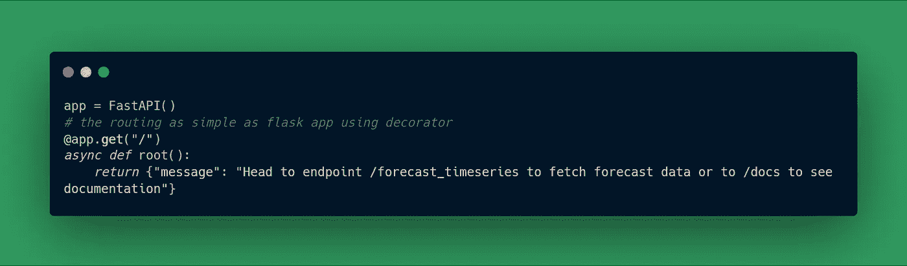
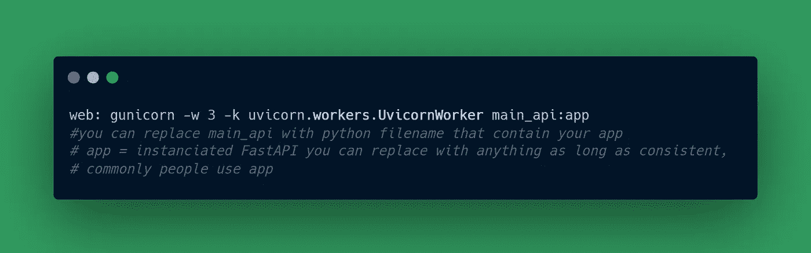

# 使用 Fast API 和 Heroku 将预测模型部署为 API(时间序列端到端项目第 3 部分)

> 原文：<https://blog.devgenius.io/deploy-forecasting-model-as-api-with-fast-api-and-heroku-timeseries-end-to-end-project-part-3-34692d980c3?source=collection_archive---------4----------------------->


泰勒·维克在 [Unsplash](https://unsplash.com?utm_source=medium&utm_medium=referral) 上的照片

随着越来越多的公司使用 API 作为微服务，以及不断增长的开源包和库(如 Fast API ),创建 API 变得更加方便和容易。

这个简短的教程将给出如何使用快速 API 从零开始用 python 创建一个简单的 API 并将其部署到一个 PAAS(平台即服务)的例子，在这种情况下，我们将使用 heroku。

**指数**

1.  要求
2.  项目结构
3.  API 构建
4.  部署到 Heroku
5.  测试 API

**要求**

为了构建这个 API，我们将根据 requirements.txt 文件安装下面的一些包，或者您可以在 [my github repo](https://github.com/fakhrirobi/airtraffic_passenger_forecast_api/blob/main/requirements.txt) 上找到它:

```
pandas==1.1.5
statsmodels==0.12.1
uvicorn==0.13.4
pydantic==1.8.2
gunicorn==20.1.0
fastapi==0.70.0
python_dateutil==2.8.2
uvloop==0.16.0
httptoolspython version == 3.8.5
```

**项目结构**


项目结构

解释:

a.api_test.py ->部署后测试 api 结果

b.Dockerfile ->将项目容器化，以便在任何地方都可以轻松设置

c.main _ API . py-> API 输出的逻辑过程

d.moving _ avg _ diff _ passenger _ overtime _ model . pkl-->我们要服务的模型

e.passenger _ total . CSV-->我们将使用的训练数据示例

f.Procfile ->将应用程序部署到 heroku 所需的文件

g.requirements.txt ->部署还需要项目的依赖关系。

h.runtime . txt-->将应用程序部署到 heroku 所需的文件包含应用程序的 python 版本

**API 构建**

1.  需要导入包/库


2.实例化快速 API



3.为“timeseries_forecasting”端点创建请求正文


4.创建端点“时间序列 _ 预测”


由于预测结果在转换后是修改后的数字(带差异的移动平均)，我们需要通过创建一个函数来反向转换预测结果。


5.最后，我们必须运行服务器


6 .让我们把它包装在 main_api.py 文件中:


最后，我们可以通过以下方式从终端运行服务器:

```
python main_api.py
```


我们将通过创建一个名为 api_test.py 的文件来测试 API:


现在我们可以通过以下方式运行它:

```
python api_test.py
```


很好！。我们的第一个 API 被创建。然后我们需要在 heroku 上部署它，首先我们需要创建几个文件。

a.Procfile:创建一个名为 Procfile 的文件(记住不要添加任何扩展名，只添加 Procfile)

创建 procfile 的目的是让 heroku 命令应该运行什么。



有关 Procfile 的更多信息，您可以浏览 https://dev center . heroku . com/articles/getting-started-with-python # define-a-Procfile

b.runtime.txt

接下来，我们需要创建一个名为 runtime.txt 的文件。目的是 heroku 需要被告知你运行的是哪个版本的 python。我的是 python-3.8.5。如果你不确定你正在使用的 python 版本，你可以查看这个[链接](https://blog.finxter.com/how-to-check-your-python-version/)。

```
python-3.8.5
```

c.requirements.txt

在最后一个文件中，您需要创建 requirements.txt 文件，以便命令 heroku 安装您的应用程序的所有依赖项。你可以点击这里如何创建 requirements.txt 文件[这里](https://stackoverflow.com/questions/31684375/automatically-create-requirements-txt)。我使用 pipreqs 作为我的解决方案。pipreqs


```
*pandas*==1.1.5*statsmodels*==0.12.1*uvicorn*==0.13.4*pydantic*==1.8.2*gunicorn*==20.1.0*fastapi*==0.70.0*python_dateutil*==2.8.2*uvloop*==0.16.0*httptools*
```

**部署到 Heroku**

有两种方式部署到 heroku，第一种是通过连接 github repo，最后一种是通过 Heroku CLI。在这种情况下，我们将做第一个。所以你需要先在你的 github 里面创建 repo。

循序渐进:

1.  登录 heroku 帐户，或者如果您还没有创建任何帐户，请在此注册。
2.  点击新建，在 heroku dashboard 中创建新应用。


3.填写应用名称并选择地区，然后点击创建应用。


4.点击连接到 GitHub，然后填写你的回购协议的名称，点击搜索，在你的回购协议名称出现后点击连接


5.单击“启用自动部署”(如果您希望在对存储库进行任何更改后直接部署),然后单击“部署分支”


6.成功部署后，通知/日志将输出如下


7.通过单击打开应用程序菜单来检查最终的应用程序


8.为了验证我们的结果，我们将通过创建名为 new_url_test.py 的 python 文件，用新的 url 替换旧的 url，从而再次获取 api


最终 api 测试


瞧。我们最终从零开始构建自己的 API。如果你想要我的完整代码文档，只需点击我的 github。

**我的 Fullstack Timeseries 项目:**

**第一部分:** [**时间序列预测:航空客运(时间序列端到端项目第一部分)**](/time-series-forecasting-passenger-air-traffic-time-series-project-part-1-da51d4e8520a)

**第二部分:** [**使用 Dash 创建时间序列仪表板(时间序列端到端项目第二部分)**](https://medium.com/@fakhrirobi.fra/create-timeseries-dashboard-using-dash-timeseries-end-to-end-project-part-2-38f0319e952?source=your_stories_page----------------------------------------)

**第 3 部分:** [**使用 Fast API 和 Heroku 将预测模型部署为 API(时间序列端到端项目第 3 部分)**](/deploy-forecasting-model-as-api-with-fast-api-and-heroku-timeseries-end-to-end-project-part-3-34692d980c3?source=your_stories_page----------------------------------------)

感谢您的关注。

感谢您的关注。您可以通过我的 [LinkedIn](https://www.linkedin.com/in/fakhrirobi/) 联系我，或者您可以在此星/叉/关注我的 github 账户[。](https://github.com/fakhrirobi)