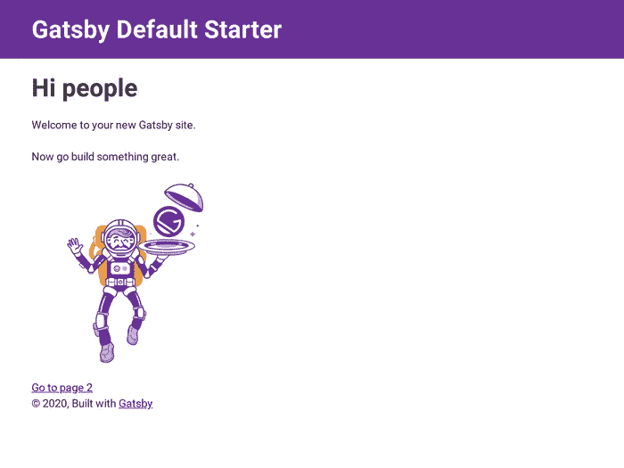
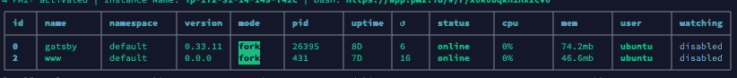
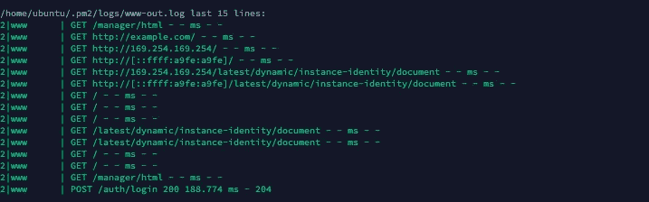
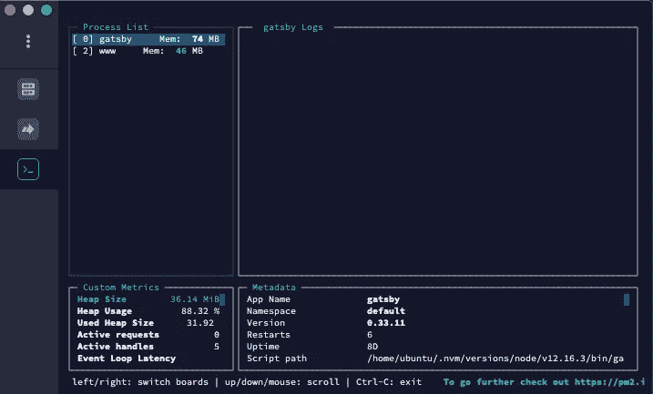
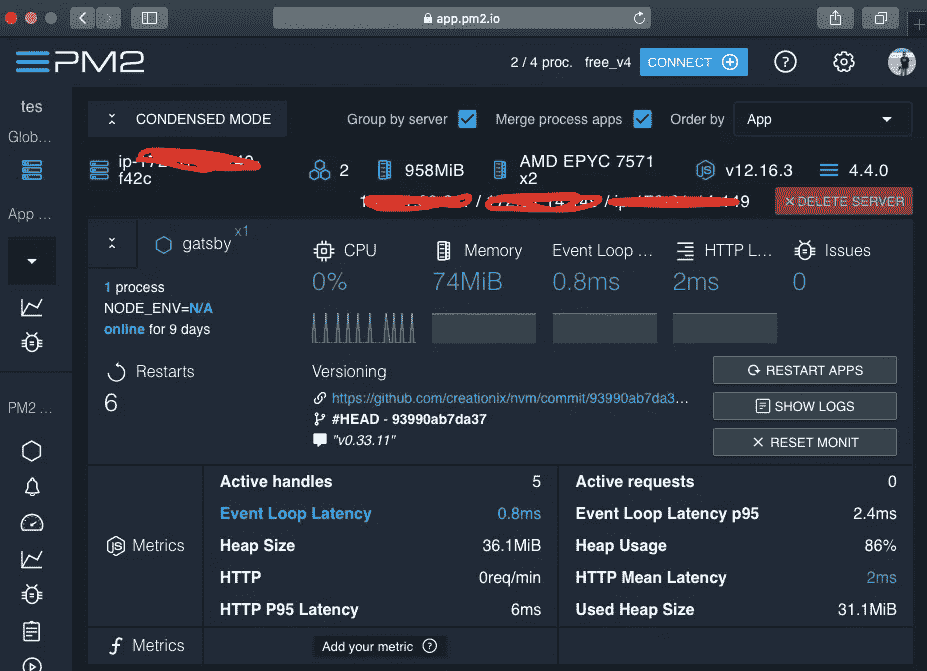

# 与 PM2 一起在生产中部署盖茨比

> 原文：<https://blog.devgenius.io/deploy-gatsbyjs-on-production-with-pm2-ed7bbc05ec78?source=collection_archive---------9----------------------->


也许我们很多人都知道，gatbyjs 是一个基于 react 的前端免费开源框架，由 graphql、Progressif Web Apps (PWA)和 static site generator 提供支持。Gatsbyjs 将把你的网站建成“静态”文件，并使你的应用程序速度惊人，搜索引擎友好，更加安全。

盖茨比建立在 react 的基础上，当你熟悉 React 的时候你会喜欢的。Gatsbyjs 有许多插件，如配置简单搜索引擎优化(SEO)和 Progressif Web Apps (PWA)。Gatsbyjs 可以使用 markdown 文件在您的站点中创建静态页面。但是我会在另一篇文章中写得更详细。

现在，我只想分享我的经验，如何部署我的应用到生产与先进的生产过程管理器名称 PM2。 **PM2** 是一个守护进程管理器，它将帮助你管理并保持你的应用程序在线。默认情况下，Gatsbyjs 有一个命令用于生产，那么为什么要使用 PM2 来部署生产模式呢？

PM2 有许多丰富的功能来帮助你管理和监控你的应用程序的进程。

1.  轻松管理程序的每个节点。
2.  可以检查流程状态。
3.  可以显示您的日志。
4.  支持集群节点进程。
5.  监测和诊断网络界面调用 PM2 加，但一些功能需要升级帐户。
6.  还有更多，你可以在官方文件上查看[这里](https://pm2.keymetrics.io/docs/usage/pm2-doc-single-page/)

## 我们开始吧

首先，在您的机器上全局安装 gatsby CLI

```
npm install -g gatsby-cli
```

使用如下命令创建您的新应用程序

```
gatsby new myapps
```

转到生成的文件夹 myapps 内部

```
cd myapps
```

测试您的应用程序是否正常工作

```
gatsby develop -p 8080
```

然后在你的浏览器上检查你的应用程序是否正常工作，转到网址“http://your_host:8080”。



现在假设我们已经设置好了盖茨比并开始工作了

在您的计算机上全局安装 PM2 CLI

```
npm install pm2 -g
```

现在，使用 PM2 部署您的应用

```
pm2 start gatsby --name <your_name> -- serve -p <your port>
```

使用以下命令检查您的应用程序并显示列表节点

```
pm2 list
```



为了显示你的应用程序日志，我通常会检查我们的代码是否有错误，即使已经在生产中。

```
pm2 logs
```



使用此命令监控基于终端的日志、自定义指标和应用程序信息。

```
pm2 monit
```



只需在 web 上添加 key metrix[http://app . PM2 . io](http://app.pm2.io)即可监控您的应用



# 结论

PM2 是守护进程是我最推荐的部署你的 gatsbyjs 和更多基于 nodejs 的应用程序，因为 PM2 有这么多的功能，可以帮助你使你的应用程序跟上，更具生产力，易于设置和监控。

希望这篇教程能对你有用，感谢你的阅读。鼓掌支持我们；-).再见。