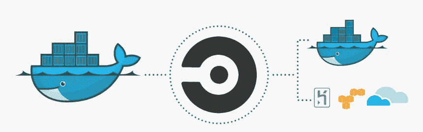

# 使用 CircleCI 将映像部署到 DockerHub

> 原文：<https://blog.devgenius.io/deploy-images-to-dockerhub-with-circleci-3f5b716cfe1e?source=collection_archive---------4----------------------->



容器、图像、云、docker、Kubernetes 等。都是我们从 DevOps 工程师和高级后端工程师或云架构师那里听到的常用术语。构建应用或服务器非常好，但更重要的是托管、部署、维护和扩展它们。

[CirclCI](https://circleci.com/docs/2.0/about-circleci/) 使工程团队能够自动化您的软件构建、测试和部署。

Docker 是一个轻量级的操作系统级虚拟化工具，它使我们能够在称为容器的包中交付软件。

在您的操作系统上本地构建您的容器可能需要一点时间，这取决于您的系统有多复杂，有时可能无法运行 docker。此外，手动构建容器化的应用并将其推送到 [docker-hub](http://hub.docker.com) 可能会有压力，或者不是最佳实践。
你可以使用 GitHub 和 CircleCi 来自动化这个过程。

对于这个项目，我将开发一个简单的 express 服务器，并为它构建一个 docker 映像，然后使用 circleci 将其推送到 docker hub。

在您进一步阅读之前，请确保您拥有 github、circleci 和 docker hub 的帐户。

## 项目设置

打开你的 github 并创建一个公共 repo，姑且称之为*my-first-dockerhub*，你现在可以在你喜欢的编辑器上克隆这个项目了。

在根目录下创建以下文件——index . js docker file。dockerignore。gitignore

> 触摸 index.js Dockerfile。dockerignore。gitignore

在 index.js 文件中添加以下代码

```
 require(“dotenv”);
const express = require(“express”);const app = express();const { log } = console;app.get(“/user”, (req, res) => {
 res.send({
 result: [
 {
 name: “armstrong”,
 status: “developer”,
 },
 ],
 });
});const port = process.env.PORT || 5000;app.listen(port, () => log(`Server running on port ${port} 🔥`));
```

## Docker 的设置

让你的应用成为 docker 镜像的魔法实际上是在你刚刚创建的*Dockerfile*里面完成的。

在 docker 文件中添加以下代码:

```
 FROM node:14WORKDIR /projectCOPY package*.json ./RUN npm ciCOPY . .EXPOSE 8081CMD [“node”, “index.js”]
```

*FROM node:14*谈到我们希望在其上运行应用程序的环境，当然是 node 应用程序，因此我们选择 node 版本 14

你可以在官方[文档](https://nodejs.org/en/docs/guides/nodejs-docker-webapp/)上阅读更多关于其他声明的含义

这样，我们的应用程序依赖项将通过 RUN 命令安装，并在 docker 容器的 8081 端口上运行

## Circleci 的设置

这是这篇文章对我来说最有趣的部分。上一步之后的下一步是构建 docker 映像，使用命令-

docker build

现在，我们将使用 circleci 丰富的基础设施，而不是使用本地操作系统。

## 将 Git Repo 连接到 Circleci

打开你的 circleci 仪表盘，找到你的 github repo，点击*设置项目*按钮，这可能会要求你提供*。circleci*目录，暂时可以忽略。

## 圆形构型

在根目录下创建一个新目录— *。circleci*，在目录中创建一个文件*config.yml*

```
 touch .circleci/config.yml 
```

在 config.yml 中，添加以下代码

```
 orbs:
 docker: circleci/docker@1.5.0
version: 2.1
executors:
 docker-publisher: 
 environment:
 IMAGE_NAME: ndukwearm19docker/docker-node-app
 docker: # Each job requires specifying an executor
 # (either docker, macos, or machine), see
 — image: circleci/node:latest
 auth:
 username: $DOCKERHUB_USERNAME
 password: $DOCKERHUB_PASSWORDjobs:
 publishLatestToHub: 
 executor: docker-publisher

 steps: 
 — checkout
 — setup_remote_docker
 — run: 
 name: Publish Docker Image to Docker Hub
 command: |
 echo “$DOCKERHUB_PASSWORD” | docker login -u “$DOCKERHUB_USERNAME” — password-stdin
 docker build -t $IMAGE_NAME .
 docker push $IMAGE_NAME:latest
workflows:
 version: 2
 build-master:
 jobs:
 — publishLatestToHub

The config.yml is the magic that tells circleci what to do with our app, for this demo we want it to build a docker image.
In circleci *workflows* are simply orchestrators, they order how things should be done, *executors* defines or groups up task, *jobs* define the basic steps and commands to run.
```

因此，我有一个名为*build-master*的工作流，它通过运行一个名为*docker-publisher*的执行器开始工作，该执行器设置一个名为 IMAGE_NAME 的环境变量，并运行一个 docker 环境，该环境应该运行最新版本的 node。

接下来的几行代码是

*   checkout —这要求 circleci 查看我们的存储库或考虑我们在回购上拥有的整个目录和文件，
*   setup_remote_docker —这告诉 docker 在一个隔离的 docker 环境中构建映像，在这里阅读更多，
*   run——run 命令就像您的常规 cmd 或 shell，所以在这里键入 docker 命令来构建您的映像并推送到 docker hub。

```
 echo “$DOCKERHUB_PASSWORD” | docker login -u “$DOCKERHUB_USERNAME” — password-stdin
 docker build -t $IMAGE_NAME .
 docker push $IMAGE_NAME:latest
```

DOCKERHUB_PASSWORD 和 DOCKERHUB_USERNAME 应该在你的 circleci 仪表板中设置为一个环境变量

## 终于！

你现在可以提交和推送 github，回到你的 circleci 仪表盘，看你的图片被推送到 docker hub。

感谢您花时间通读，关注我的更多文章，您可以在 [Twitter](https://twitter.com/AI_Lift) 上关注我，在 [LinkedIn](https://www.linkedin.com/in/ndukwearmstrong/) 上邀请我参与您的下一个项目。

记得继续编码，阅读，正确的生活。

[链接至回购](https://github.com/armstrong99/circleci-docker-CICD-pipeline-NodeJS)