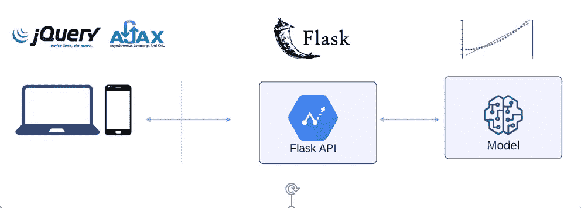

# 部署机器学习模型并将其集成到 Web 应用程序中

> 原文：<https://blog.devgenius.io/deploy-machine-learning-model-as-a-rest-api-in-a-web-application-e802b9785db6?source=collection_archive---------2----------------------->

**使用 Flask，Flask Restful，Web，jQuery Ajax**

ML 模型集成

你已经做了很好的工作，让你的尖端机器学习模型准备发布。你已经投入了时间、精力和大量脑力来训练和测试你引以为豪的机器学习模型。你制作了一个非常精确的质量模型。现在您的模型终于可以离开实验室了，您会希望以一种易于使用的形式提供它。你有什么选择？

实现这一点的一种方法是构建一个 REST API。通过为模型构建一个 REST API，您可以在不同的平台上使用它，比如 web 或 mobile。我们将使用 [Flask RESTful](https://flask-restful.readthedocs.io/en/latest/) 将简单的线性回归模型部署为 REST API。

完整代码可在 [GitHub](https://github.com/hnawaz007/pythondataanalysis/tree/main/Deploy%20Model%20as%20API) 上获得。视频教程可以在 YouTube 上找到。

**型号**

我们推荐你看简单线性回归[教程](https://www.youtube.com/watch?v=TR6vn4lZ3Mo)。这是对线性回归模型的简短介绍。该模型在 [GitHub](https://github.com/hnawaz007/pythondataanalysis/tree/main/Flask) repo 上以 pickle 文件的形式提供。我们将把它复制到项目的基本目录中，这样我们就可以在 API 中引用它。现在我们有了模型文件，让我们将它部署为 REST API。

**项目**

让我们在 Pycharm 或您最喜欢的 IDE 中创建新项目。Pycharm 自动为我们建立了一个虚拟环境。我们可以通过发出以下命令，使用 pip 安装必要的库:

*   pip 安装烧瓶
*   pip 安装烧瓶-restful
*   pip 安装熊猫
*   pip 安装-U 型烧瓶-cors

要获得模型预测，让我们定义一个预测类。这需要资源——资源是 Flask RESTful APIs 的主要构件。每个类都可以有对应于 HTTP 方法的方法，比如:GET、POST。`GET`将是主要方法，因为我们的目标是服务于模型预测。我们从网络上接收预算值。让我们出于测试目的打印预算金额，并将其转换为整数类型。现在我们在 pickle 库的帮助下加载模型。确保模型文件与 python 脚本位于同一目录中。我们将利用 predict 函数进行销售预测并返回。

让我们用来自 API 的 add resource 函数将这个预测类映射到一个端点。

> api.add_resource(prediction，'/prediction/ <budget>')</budget>

这将为传入的 GET 请求提供模型预测。默认情况下，Flask 在端口 5000 上运行。因此，一旦我们启动了这个 API，我们就可以通过以下 URL 访问它:

> [http://127 . 0 . 0 . 1:5000/prediction/](http://127.0.0.1:5000/prediction/)？

**网络整合**

我们将把 REST API 集成到一个普通的 html 网站中。在 web 应用程序中，我们有一个预算值的输入，单击一个按钮，我们调用 API 的端点。我们借助 jQuery Ajax 将 API 集成到这个 web 应用程序中。我们调用 API 端点，并将预算金额附加到它上面。如果调用成功，那么我们访问返回值并将其设置为一个带有 *sectionPrediction* id 的 HTML 标签。

这就是我们如何将 ML 模型集成到我们的 web 应用程序中。一旦部署了这个 API，它就可以被 web、桌面或移动应用程序使用。通过对这个 API 的一个 API 请求，现在团队中的任何人都可以将销售预测模型集成到他们的应用程序中，而不必用 Python 编码或经历模型构建的麻烦。

**结论**

这是一个为简单的线性回归模型部署 Flask REST API 的简单示例。当其他机器学习模型准备好进行部署时，您可以对它们使用这一过程。

除了将模型部署为 REST API 之外，我们还使用 jQuery Ajax 将它集成到一个 web 应用程序中。

完整的代码可以在[这里](https://github.com/hnawaz007/pythondataanalysis/tree/main/Deploy%20Model%20as%20API)找到。